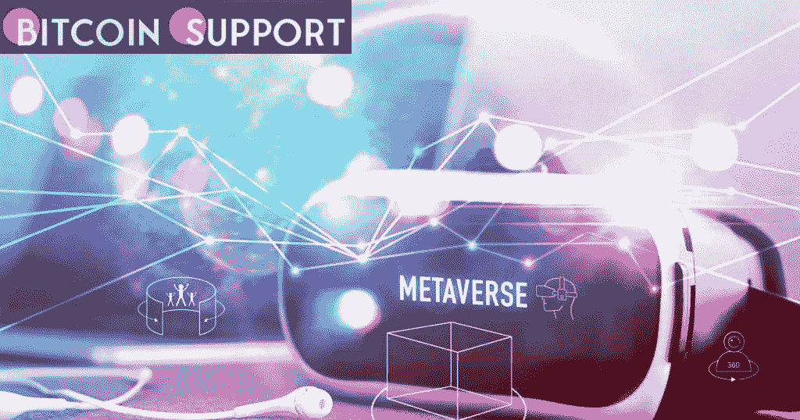

# 游戏公会和道重新定义了加密货币

> 原文：<https://medium.com/coinmonks/gaming-guild-and-metaverse-dao-redefined-cryptocurrency-dd0c46ae305b?source=collection_archive---------59----------------------->

**Visit our website:-** [**https://bitcoinsupports.com/**](https://bitcoinsupports.com/)

当虚拟现实中的玩家拥有一个结构化的家时，元宇宙就不仅仅是一个科幻概念了。许多人仍然认为元宇宙是科幻小说中的一个概念。然而，许多人正在影响这个在线世界的演变，却从未意识到这一点，这要归功于他们参与了像《堡垒之夜》这样的沉浸式电子游戏。

在更大的范围内，在过去的两年里，世界已经看到全新的社区转向在线互动，包括就业、社交和混合体验中的锻炼。这些早期的在线行动最终遭到了游戏玩家和区块链领导者组成的战略联盟的反击。目标是让世界见证一个无缝的现实，而不是完全不同的线上和线下遭遇。

终极前沿正在推动加密货币计划的新标准。该计划旨在通过现有的区块链协议创造机会，在虚拟经济中增加 FRNT 代币资产的使用，并作为分散自治组织(DAO)、专业游戏公会和电子竞技游戏的领导者为成员、投资者和合作伙伴分配奖励。从那以后，公会声明了他们对星际地图游戏 MUD 派系的承诺，以及对联合元宇宙组织(UMO)成员的承诺，这是一个致力于在星际地图中相互支持、合作和保护的组织。

由于这些标准能够确保玩家相互尊重并吸引正确的群体，因此被视为区块链博彩 AAA 级组织的重要组成部分。最终前线相信建立这些积极的标准，充满了熟练的规则和法律，以激进的方式规范成员。然而，为了促进社区参与，领导结构是非独裁的。该团队与 Krypto Playboy、Macrochain Capital、NuHollywood Inc、HT Ventures、NEXTZ Ventures、星际联盟、FABRIC、Equinox Starfleet、Kretos Ventures、Atlessio Family 和 Soliens DAO 等建立了关系，以推进这一努力。

**支持元宇宙背后的人**

最后的边疆是拥抱世界四大货币，为元宇宙参与者构建这个结构化的家园。时间、知识、关系和金钱都是这些货币的例子。所有货币都被用来承认前三种货币的和谐是更大的金融自由和成功所必需的。这次探险的努力在 Twitter Spaces 活动中达到高潮，Star Atlas 的参与者和其他元宇宙玩家直接从指挥官 Ardo 那里听到了项目的进展。通过他的声明，观众感受到了他对妇女赋权和变革的同情，以及他将这些努力变为现实的承诺。励志之后是“创造变化”礼物形式的战术，其中社区看到了另一个响应 Ardo 信条的命令，“自我之前的服务，我们所做的一切都是卓越的，没有什么任务是太大而无法完成的！”

终边疆也非常重视教育。该组织已经出版了两份电子期刊，这两份期刊都被认为是元宇宙同类期刊中的第一份。最初的杂志被称为 Metazine，由每月数字出版物组成，包括对著名元宇宙人物的采访，最新趋势的信息，以及专门的星图更新。

第二本杂志是《Metapower 》,这是一份旨在赋予女性权力的期刊，来自世界各地的女性汇聚一堂，分享她们的故事、艺术作品和新想法。这些努力表明了该组织对实现变革的承诺以及在 Star Atlas 中部署的巨大力量。

**创造变革**

由于他们的努力，最终边疆吸引了 500 名成员，使他们成为联合元宇宙组织(UMO)的共同创始人。该项目启动仅五个月，就获得了 60，000 多名追随者的支持。

展望未来，团队已经计划了他们的 NFT 的首次亮相、领导力培养之旅、国际足联电子竞技活动、使命召唤比赛、UMO 的扩展以及 Star Atlas 战略规划。机构群体还可以期待一个赌注计划的开始，该计划预计将于今年年底投入运营。

**访问我们的网站:-**[**【https://bitcoinsupports.com/】**](https://bitcoinsupports.com/)

**免责声明:这些是作者的观点，不应被视为投资建议。读者应该自己做研究。**

> 加入 Coinmonks [电报频道](https://t.me/coincodecap)和 [Youtube 频道](https://www.youtube.com/c/coinmonks/videos)了解加密交易和投资

# 另外，阅读

*   [OKEx vs KuCoin](https://coincodecap.com/okex-kucoin) | [摄氏替代品](https://coincodecap.com/celsius-alternatives) | [如何购买 VeChain](https://coincodecap.com/buy-vechain)
*   [ProfitFarmers 点评](https://coincodecap.com/profitfarmers-review) | [如何使用 Cornix 交易机器人](https://coincodecap.com/cornix-trading-bot)
*   [如何匿名购买比特币](https://coincodecap.com/buy-bitcoin-anonymously) | [比特币现金钱包](https://coincodecap.com/bitcoin-cash-wallets)
*   [瓦济里克斯 NFT 评论](https://coincodecap.com/wazirx-nft-review)|[Bitsgap vs Pionex](https://coincodecap.com/bitsgap-vs-pionex)|[坦吉姆评论](https://coincodecap.com/tangem-wallet-review)
*   [如何使用 Solidity 在以太坊上创建 DApp？](https://coincodecap.com/create-a-dapp-on-ethereum-using-solidity)
*   [币安 vs FTX](https://coincodecap.com/binance-vs-ftx) | [最佳(索尔)索拉纳钱包](https://coincodecap.com/solana-wallets)
*   [如何在 Uniswap 上交换加密？](https://coincodecap.com/swap-crypto-on-uniswap) | [A-Ads 评论](https://coincodecap.com/a-ads-review)
*   [加密货币储蓄账户](/coinmonks/cryptocurrency-savings-accounts-be3bc0feffbf) | [YoBit 评论](/coinmonks/yobit-review-175464162c62)
*   [Botsfolio vs nap bots vs Mudrex](/coinmonks/botsfolio-vs-napbots-vs-mudrex-c81344970c02)|[gate . io 交流回顾](/coinmonks/gate-io-exchange-review-61bf87b7078f)