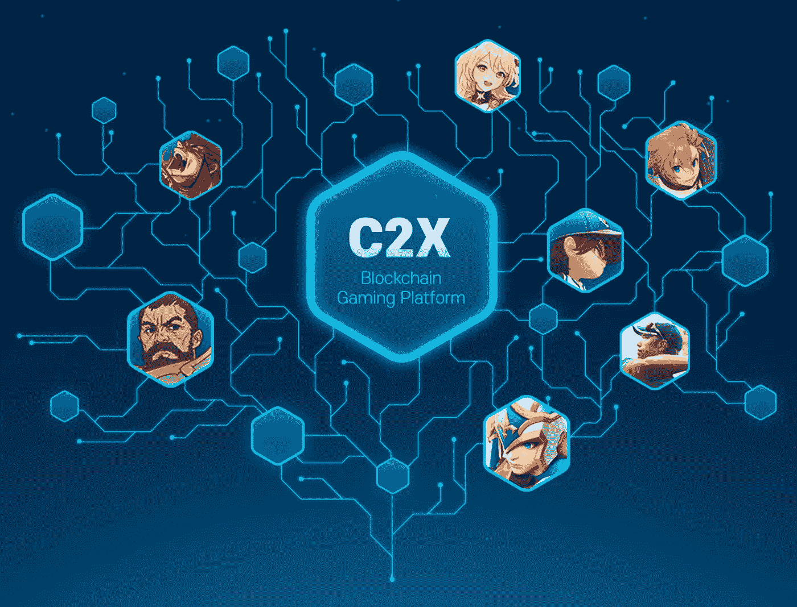
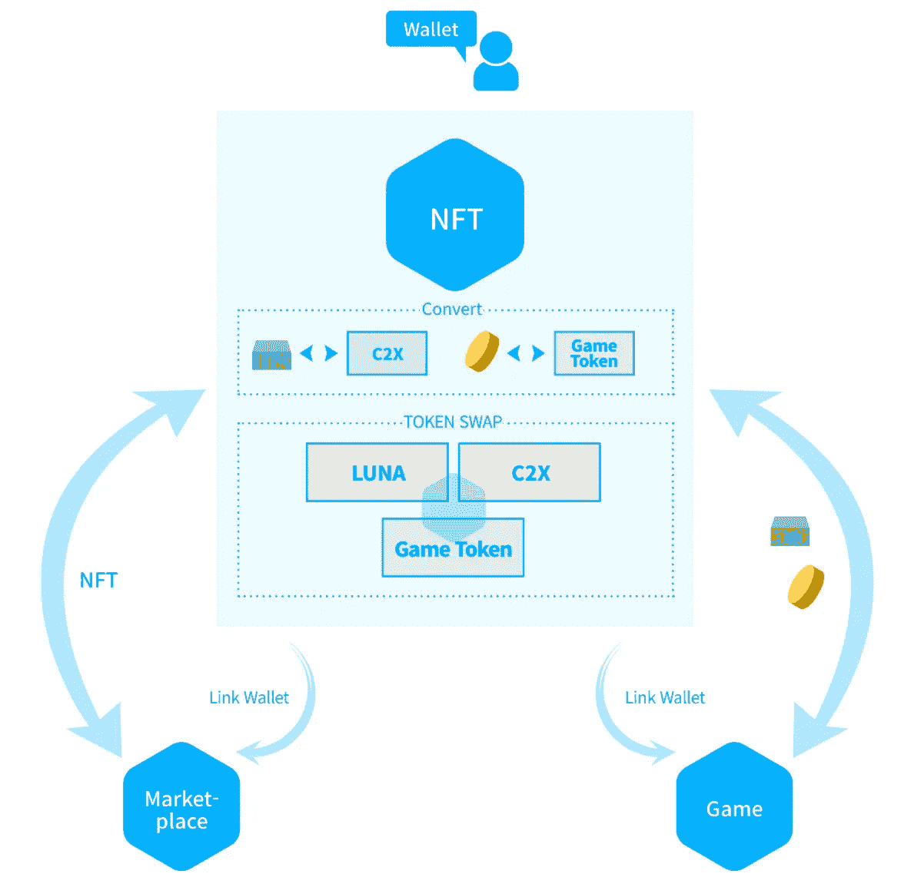

# 在陆地上的游戏:C2X

> 原文：<https://medium.com/coinmonks/gaming-on-terra-c2x-246747eb1809?source=collection_archive---------24----------------------->

有什么比 NFT 游戏或 P2E 游戏更好的方式让用户使用 crypto？一边赚钱一边找乐子？听起来像我偶尔在电报上得到的那些粗略的工作之一。然而，有一个大问题。在 Speicherx 所说的基础上进一步发展，大多数 P2E 游戏都是围绕象征性经济的游戏。我觉得这是错误的方法，并导致这些游戏最终成为动画产量农场。无论骗子们如何试图欺骗自己，许多 P2E 游戏质量低下，乏味且重复。只有在 crypto 中，你才能看到人们称赞那些看起来像是由一个刚刚参加了 Unity 速成班的学生创造的游戏。对我们这些疯子来说幸运的是，韩国游戏独角兽 Com2uS 正与 C2X 合作，在 Terra 上创建一个一体化的区块链游戏平台。

[https://c2x.world/](https://c2x.world/)

C2X 的目标是制作 NFT 游戏，包括大家熟悉的游戏如《召唤师战争》，并且在他们的[白皮书](https://c2x.world/C2X_Whitepaper_v1.0.0_2.pdf)中避免使用术语 P2E。由于 Com2uS 是一家 AAA 级游戏公司，所以重点是围绕游戏建立象征性经济，这是主要重点。他们计划通过向希望在 C2X 平台上开发游戏的游戏开发者提供开源软件开发工具包(SDK)来实现这一目标。从本质上讲，游戏开发者将能够专注于构建有趣的游戏，并通过 SDK 轻松地使它们成为 P2E，从而更容易被采用。这将[包括](https://twitter.com/zsparta/status/1504815348679385104?s=20&t=tnNnjRNEam_Oxx8lTCLITg)访问 C2X 站(一个加密钱包)、C2X 的 NFT 市场以及无代码智能合约。

目前，C2X 的游戏是免费的，这大大降低了 NFT 游戏的准入门槛。如果你们中的任何人尝试过玩 NFT 游戏，很有可能你不得不花费数十，如果不是数百美元来购买 NFT，这将使你完全进入游戏。大多数游戏玩家讨厌 NFT 游戏，或者更确切地说是 P2E 游戏，因为它们不仅游戏性糟糕，而且价格昂贵。有了 C2X 的一体化平台，游戏玩家不仅不用花钱就能享受完整的游戏，还能通过内置的钱包和 NFT 市场了解更多关于密码空间的知识。

[Credit](https://c2x.world/C2X_Whitepaper_v1.0.0_2.pdf)

C2X 的游戏将各自具有其独特的代币，并且这些代币可以与 C2X 站中的其他游戏的代币交换，使得这些游戏可以互换进行。不仅如此，玩家还可以将他们的代币换成露娜或 UST。在我看来，这对 Terra 非常有利，因为玩家最终可能需要将他们的代币兑换成价值更稳定的 UST，以兑现他们的钱。这可以间接推动更多人采用 UST。

C2X 也认识到当游戏本身开始衰退时，游戏道具价值下降的问题。为了防止这种情况，在特定游戏中获得的 NFT 物品可以被转换成除了原始游戏之外的 C2X 生态系统中的任何其他游戏。这可以保护非金融资产的价值，防止它们变得缺乏流动性和毫无价值。作为过去的受害者，我真的很欣赏这个功能。

总而言之，C2X 的区块链游戏平台极大地降低了加密游戏的门槛，让游戏开发者和玩家都非常容易加入进来。随着所有这些在 Terra 上发生，游戏可能成为将大众转化为疯子的门户。我觉得这对 Terra 来说是惊人的，大规模采用突然看起来更有可能了。

关注我在 Twitter 上的所有加密和更新！

如果你喜欢这篇文章，请给它鼓掌，并评论你可能有的任何建议/想法。

如果你对这些类型的文章感兴趣，请关注我，因为我会发布更多令人兴奋的内容！

如果你读到这里，非常感谢你的支持！

> 加入 Coinmonks [电报频道](https://t.me/coincodecap)和 [Youtube 频道](https://www.youtube.com/c/coinmonks/videos)了解加密交易和投资

# 另外，阅读

*   [3 商业评论](/coinmonks/3commas-review-an-excellent-crypto-trading-bot-2020-1313a58bec92) | [Pionex 评论](https://coincodecap.com/pionex-review-exchange-with-crypto-trading-bot) | [Coinrule 评论](/coinmonks/coinrule-review-2021-a-beginner-friendly-crypto-trading-bot-daf0504848ba)
*   [莱杰 vs n rave](/coinmonks/ledger-vs-ngrave-zero-7e40f0c1d694)|[莱杰 nano s vs x](/coinmonks/ledger-nano-s-vs-x-battery-hardware-price-storage-59a6663fe3b0) | [币安评论](/coinmonks/binance-review-ee10d3bf3b6e)
*   [Bybit 交易所评论](/coinmonks/bybit-exchange-review-dbd570019b71) | [Bityard 评论](https://coincodecap.com/bityard-reivew) | [Jet-Bot 评论](https://coincodecap.com/jet-bot-review)
*   [3 commas vs crypto hopper](/coinmonks/3commas-vs-pionex-vs-cryptohopper-best-crypto-bot-6a98d2baa203)|[赚取加密利息](/coinmonks/earn-crypto-interest-b10b810fdda3)
*   最好的比特币[硬件钱包](/coinmonks/hardware-wallets-dfa1211730c6) | [BitBox02 回顾](/coinmonks/bitbox02-review-your-swiss-bitcoin-hardware-wallet-c36c88fff29)