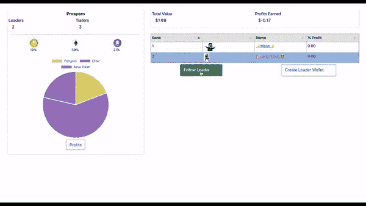
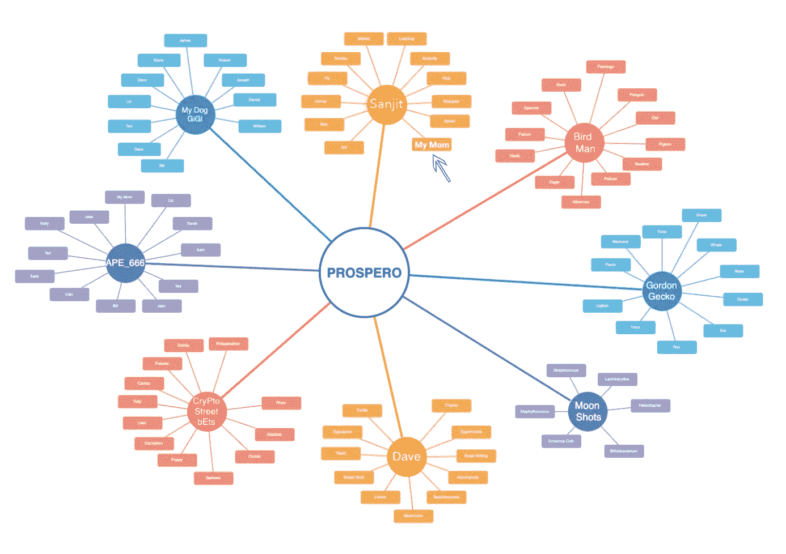
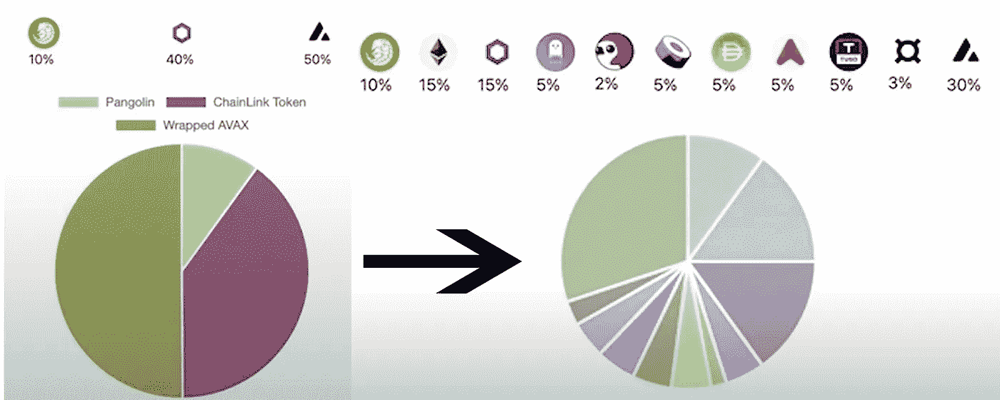
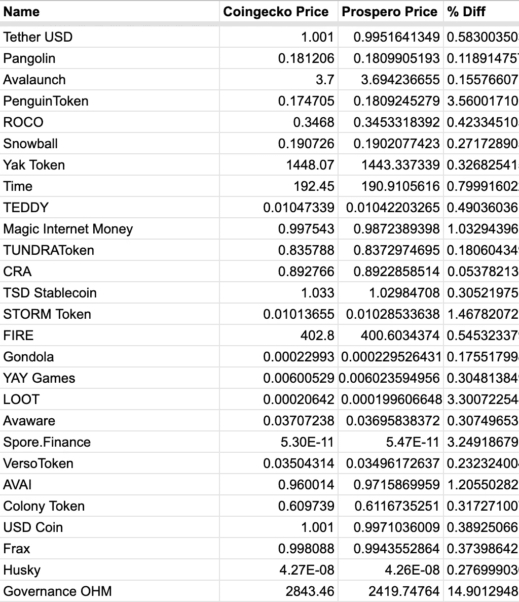
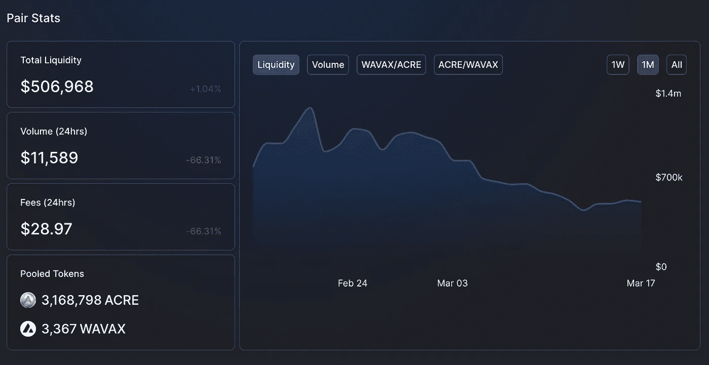
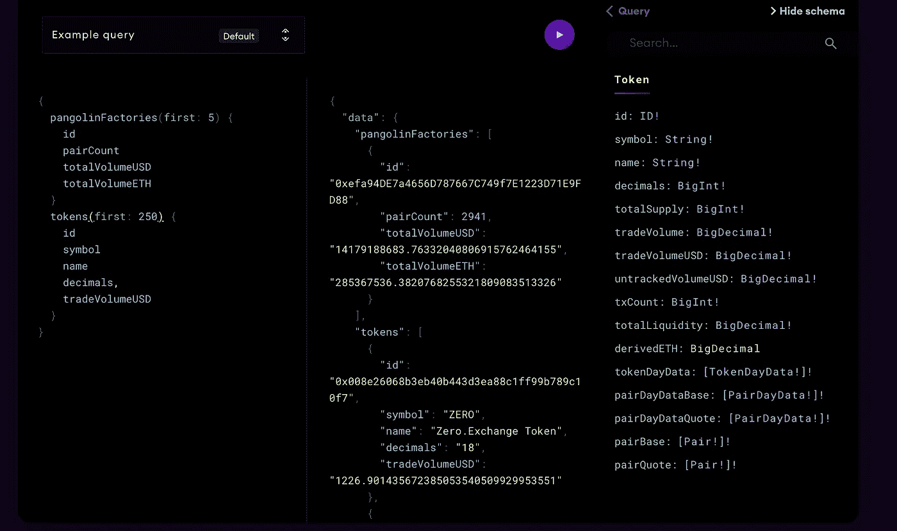
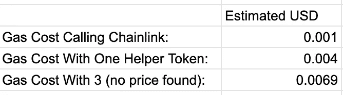

# 气体是死的，或者为什么雪崩可以几乎免费得到任何东西的价格

> 原文：<https://medium.com/coinmonks/gas-is-dead-or-why-you-can-get-the-price-of-anything-for-almost-nothing-on-avalanche-442e7bc4aa5d?source=collection_archive---------37----------------------->

你好，好久不见。忙着准备普洛斯彼罗在巴塞罗那太阳下的一天(…呃，下雨)，在即将到来的[雪崩峰会](https://www.avalanchesummit.com)。

那是什么？为什么是的，我们正在提高我们的预种子，它填充得很快。你想看看我们的甲板，嘶嘶声视频，和演示？没问题！请给我的联合创始人 brendan@prospero.fund 发电子邮件。谢谢你的提问！

现在，如果你需要一个快速复习，Prospero 是一个即将在 Avalanche 上推出的 dApp，它使任何人都能使用 Web 3 启动投资组合或加入表现最佳的投资组合。

通过我们方便的 dandy portfolio rebalancer 界面，经理们可以选择他们想要的代币，然后将一个或多个代币多次转换到他们想要的投资组合分配中(下面的界面只是我们的内部测试界面，我们全新的直观 UI 即将推出)。

A Gif Of Our v1 Prototype. v2 coming soon…

实际上，这意味着什么？在 Prospero 上，来自孟买的毕业生代表 Sanjit 可以管理投资组合，在我们的区块链排行榜上作为精英交易员脱颖而出，并吸引来自世界各地的投资者…

……包括数百万像我母亲一样住在格伦代尔的人，他们“想投资比特币链，但不知道从哪里开始。”

此外，我妈妈(和所有其他投资者)可以加入多个投资组合，通过不同的策略分散他们的头寸。她只为自己的利润支付费用，从不为交易支付汽油费(那是投资组合经理的责任)，而且只有她能在自己的账户上存钱或取钱。

我不得不承认，编写所有这些代码无疑是我跑过的最艰难的超级马拉松(我已经记录了一些严重的公路里程)。尤其是因为我没有编写 Solidity 的代码，并且直到大约一年前才开始从事 Avalanche 的工作(关于我的开发人员进入 Avalanche 的旅程的小帖子，请点击[这里](https://louis-prospero.medium.com/building-prospero-on-avalanche-the-hype-is-real-a781ab07304b))。

在建立普洛斯彼罗的后端时，我面对了无数艰难的战斗。我如何创建投资组合，经理可以重新平衡，但只有他们的投资者可以提取或存入资金？*没有 LP 代币的 Uniswap 等集合池。*

当普洛斯彼罗为投资组合再平衡一次调用 60 个互换时，我如何保持低汽油？*在链上建立一个多 AMM 路线优化器，连续几周熬夜优化我们的合同。*

然后是我的固执的联合创始人强加给我的一个:在 Prospero 上，投资组合经理需要尽可能多的可交易代币，以便最大化那个甜蜜的未被发现的 alpha，…这意味着为了建立我们的投资组合再平衡工具，我们需要以一种气体有效的方式访问所有这些代币的价格。

这意味着我必须避免使用昂贵的 SSTORE 或 SLOAD 操作来进行任何类型的价格缓存(但是我们确实在内存数组的其他代码中缓存了很多价格)。解开这个谜题是一个艰难的过程……所以我写了这篇博文来分享我的过程和我的 github(T2 ),以帮助雪崩 DeFi 社区不要经历它。

为了说明我们为什么需要这样做，假设一位经理想要将 Eth、Btc 和 Wavax 的投资组合重新平衡为 11 个令牌的组合:

为了让我们的 multiswap 工具将资产分配到经理期望的投资组合百分比余额中，我们的第一步是获得所有这些代币的美元价格。

起初，我认为这在 chain 上是不可能的，并告诉了我的联合创始人。特别是，我听说过 Chainlink，但我认为一次性索要整桶代币的价格会因汽油成本过高而无法接受。

然而，我的联合创始人恳求我继续建设，并断言市场激励将迫使必要的创新压低价格。用他的话来说:“否则 Web 3 已经是 DOA 了，有太多的超级大脑在这个领域工作，特别是在艾娃实验室，情况不是这样的。”

他说得对的时候很烦人。

杏子在 Avalanche 上削减了费用，EIP-1559 在以太坊上降价，Chainlink 发布了基本免费的[价格源](https://docs.chain.link/docs/avalanche-price-feeds/)。我的联合创始人有点幸灾乐祸，但我向他解释说，虽然这是一种进步，但我们仍然需要 C 链上几乎所有令牌的价格，而不仅仅是 Chainlink 发布的价格。他告诉我他完全有信心我会弄明白的。

我说过他说对的时候很烦人吗？

我的出发点:我知道很多代币的价格是穿山甲的池子里固有的，尤其是那些流动性高的。为什么？这些代币不断被机器人相对于其他交易所的价格进行套利。

通过结合来自穿山甲池的定价信息，并将它们与普通令牌的 Chainlink 价格馈送相乘，我构建了一个解决方案(在 [Github](https://github.com/prosperoapp/prosperoprices) 上可用)来获取和确认 C 链上几乎任何令牌(除了反射令牌，它们吸羊角)的价格，精度在 Coingecko 价格的 1%以内(当它们的 API 工作时)。

Some Of Our Results

我们的合同是这样运作的:

1.  首先，检查令牌是否有一个流动性池，其中包含穿山甲上最受欢迎的令牌，如 WAVAX、以太坊和 USDC，它们都有 Chainlink feeds。
2.  如果是这样，确保这些资金池中的流动性充足。
3.  然后，你可以使用资金池中固有的定价信息(也就是 x 的这一部分= y 的这一部分)来估算价格，方法是乘以 Wavax、以太坊或 USDC 的已知链价格与这些资金池中的流动性之比。

我在[prosper prices](https://github.com/kipchogi/prosperoprices/blob/main/contracts/ProsperoPrices.sol)契约 [getPrice](https://github.com/kipchogi/prosperoprices/blob/main/contracts/ProsperoPrices.sol#L85) 中命名了这个函数。

但现在当我回过头来看我刚刚写的东西时，我意识到我的描述可能比 Kanye 的上一张专辑更混乱抽象，所以让我们来看看一个具体的例子:

早些时候，我选择用一个[鲜为人知的令牌](https://info.pangolin.exchange/#/token/0x00ee200df31b869a321b10400da10b561f3ee60d)进行测试，这个令牌叫做 Arable Protocol，它没有 Chainlink price feed，但是有一个关于穿山甲和 WAVAX 的 [pool](https://info.pangolin.exchange/#/pair/0x64694fc8dfca286bf1a15b0903fac98217dc3ad7) 。

因为我们知道 1 瓦克斯值 902 英亩穿山甲(在我开始写这篇文章的时候)，我们知道瓦克斯的价格是 71.5589546157 美元(当时是这样，但现在不是了。[加油红币，加油！我们知道耕地的价格是 71.5589546157 美元除以 902 = 0.03365257 美元。相当简单，对吧？](https://www.coingecko.com/en/coins/avalanche)

现在让我们再用它来举一个不同的例子，流动性低的情况下，看看会发生什么。这次我们将使用[铸币令牌](https://snowtrace.io/address/0x7bf4ca9aec25adaaf7278eedbe959d81893e314f)。让我们看看 getPrice 是如何工作的——

在上面的代码中，我们反复搜索以查看是否存在与 AVAX、USDC 或 ETH 配对的 Mint 令牌的流动性池。恰好它与 [WAVAX](https://info.pangolin.exchange/#/pair/0x791e4152b9306032c36950b140a5dae3f90f0d93) (包装的 AVAX，因此基本上与 AVAX 价格相同):

WAVAX 的价格由 Chainlink 价格 oracle 确定为 7035747962。链环使用 8 位小数的规模，7035747962/10⁸=$70.(旁注:我们必须做所有这些复杂的数学运算，因为实性在表示小数方面不太好。我有没有说过我一个月都熬夜到 3 点？我有孩子？我的妻子是一个活着的圣人)。普洛斯彼罗然后在穿山甲调用 [getReserves](https://docs.uniswap.org/protocol/V2/reference/smart-contracts/pair#getreserves) 中获得当前流动性，这将返回池中两个代币的数量，现在是:1355194027467537473967 Mint 和 2877608273236697193 WAVAX。

对于非编码人员来说，不，这个池在 AVAX 中不值一万亿美元。请记住，这些代币都用 18 位小数表示，所以除以 10 ⁸，您会得到 1335 薄荷和 2.8 瓦克斯。在考虑了这些更合理的数字后，我们不禁要问，我们真的想用这个池子作为价格的参考点吗？

说实话，大概不会。流动性太低——如果我们试图与流动性低的资金池进行互换，如果你的互换规模大于资金池，那么互换将不会成功。此外，低流动性池往往没有足够的套利机会来给出准确的价格。

正因为如此，我给 Prospero 设计了一个功能，可以阻止单个的代币交易，这些交易会触发滑点破坏，足以通过我们的 multiswap 工具级联到与经理想要的不同的不平衡投资组合中…但显然这变得复杂了，我们将把这篇引发偏头痛的文章留到以后再说。

但是让我们假设你是一个无止境的好奇的雪崩开发者(像我一样),只想利用 ProsperoPrices 合同兜一圈，而不关心必要的流动性。您可以通过更改合同中的 MINIMUM_LIQUIDITY_REQUIRED 金额来更改您认为合适的流动性金额。想要获得更多价格？只需在 getHelper 函数中添加更多的助手标记，如戴或。

现在，所有这些仅仅是理论上的，如果我们最终得到的价格不准确的话，一点实际用处也没有。所以我们根据 Coingeecko 的 API 检查了价格。我们使用的样本是按美元总量排名前 150 位的代币，这些代币是我们使用[图](https://thegraph.com/hosted-service/subgraph/dasconnor/pangolin-dex?selected=playground)获取的，图是一个漂亮的工具，可以查询关于穿山甲的分析，如下所示:

针对 [Coingecko 的 API](https://www.coingecko.com/en/api/documentation) 运行这前 150 个令牌，我们能够获得相当准确的结果，这些结果可以在[这里](https://docs.google.com/spreadsheets/d/1anrp9zklCXL5a-cV46b4611TrOjwtR1grhey0O5LWTA/edit?usp=sharing)找到。同样，我们没有直接使用 Chainlink 来得出这些数字:提供的所有数字都反映了穿山甲的 ProsperoPrices 方法，即(所需的令牌:AVAX/USDC/ETH)x AVAX/USDC/ETH 的 Chainlink 价格。

最后一步，我们还测量了天然气成本，因为，我不是一个证明理论的教授，我是一个开发人员，我想建造一个 dApp，让整个星球和未来的马斯克火星殖民者使用。多亏了杏(和我无数小时的气体优化)，我们发现我们的 ProsperoPrices 方法的气体成本非常接近于你在 chain 上使用 Chainlink price feeds 所支付的费用。

因此，你有它:代码的冰山一角，我们有引擎盖下在普洛斯彼罗。在我的地下车库里疫情键盘敲击了一年之后，我渴望在未来的几周里出现在阳光下并与社区分享很多。

如果你参加雪崩峰会，并想了解更多关于 Prospero 的 Web 3 驱动投资的公平开放市场(泡沫)，找到我的联合创始人 Brendan，让他给你买一杯桑格利亚汽酒。

如果你是一个雪崩开发者，并且想在这个空间里谈论任何与代码相关的东西，请给我发一条线到 louis@prospero.fund。我们的定价合同在 Avalanche mainnet 上[直播](https://snowtrace.io/address/0x45f0154cfB256e662C457Aaf3E073254F41A0994),你可以在网上[演示](https://prospero-307218.uc.r.appspot.com/testprices/)——告诉我你想如何使用它或者可以让它变得更好。

最后但同样重要的是，如果你是一个 DeFi 超级明星*请*伸出手来——是我们一起建设的时候了。

> *加入 Coinmonks* [*电报频道*](https://t.me/coincodecap) *和* [*Youtube 频道*](https://www.youtube.com/c/coinmonks/videos) *了解加密交易和投资*

# 另外，阅读

*   [3 商业评论](/coinmonks/3commas-review-an-excellent-crypto-trading-bot-2020-1313a58bec92) | [Pionex 评论](https://coincodecap.com/pionex-review-exchange-with-crypto-trading-bot) | [Coinrule 评论](/coinmonks/coinrule-review-2021-a-beginner-friendly-crypto-trading-bot-daf0504848ba)
*   [莱杰 vs n rave](/coinmonks/ledger-vs-ngrave-zero-7e40f0c1d694)|[莱杰 nano s vs x](/coinmonks/ledger-nano-s-vs-x-battery-hardware-price-storage-59a6663fe3b0) | [币安评论](/coinmonks/binance-review-ee10d3bf3b6e)
*   [Bybit Exchange 审查](/coinmonks/bybit-exchange-review-dbd570019b71) | [Bityard 审查](https://coincodecap.com/bityard-reivew) | [Jet-Bot 审查](https://coincodecap.com/jet-bot-review)
*   [3 commas vs crypto hopper](/coinmonks/3commas-vs-pionex-vs-cryptohopper-best-crypto-bot-6a98d2baa203)|[赚取加密利息](/coinmonks/earn-crypto-interest-b10b810fdda3)
*   最好的比特币[硬件钱包](/coinmonks/hardware-wallets-dfa1211730c6) | [BitBox02 回顾](/coinmonks/bitbox02-review-your-swiss-bitcoin-hardware-wallet-c36c88fff29)