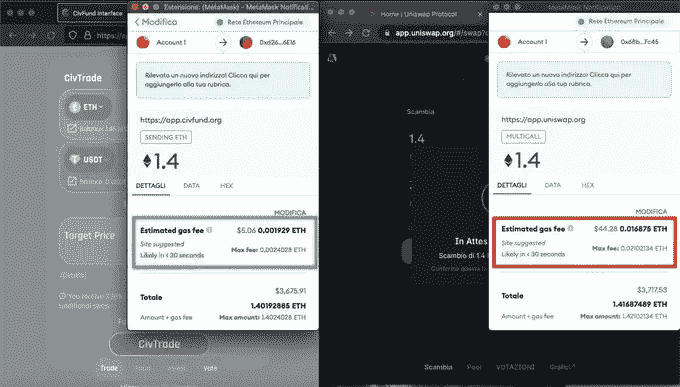

# 煤气用完了。文明贸易挑战

> 原文：<https://medium.com/coinmonks/gas-is-dead-the-civtrade-challenge-fc1f75ffc972?source=collection_archive---------44----------------------->

## $文明$硬币僧侣

## 100，000 美元的奖金、高达 100 万美元的 CIV 代币+免费汽油

Welcome to CivTrade Gas Challenge

> 节约汽油还是民用贸易？赢得 10，000 CIV +免费气体退款。你不需要实际提交或支付任何东西来参加这个挑战，它是免费的！

# 天然气挑战

[CivTrade 唯冠](https://news.civfund.org/launching-civtrade-proview-d43675a04b71)推出首个 **DeFi 订单书**； [CivTrade](https://app.civfund.org) 已经把一件革命性的武器交到了你的#DeFi 手里。现在汽油也更便宜了，所以这是一个有趣的挑战，通过不同系统的比较来验证这一说法:

> 你能在以太坊主网或多边形区块链网络上找到比 CivTrade 更便宜的天然气吗？

> 还有比 CivTrade 更便宜的 DEX 吗？
> 
> 让我们挑战这个挑战吧！

要参加挑战并有资格获得最终大奖，只需**提供合格对比的图形证据即可(详情如下)。**这保证了参加抽奖。

**您所有的合格对比交易都有资格参加抽奖。**

请全部提交！每次提交一个条目:因此，您提交的越多，您获胜的机会就越大。

此外，如果您能找到一个**节省汽油的机会**，那么您可以在实际完成两笔交易后申领**保证奖**—保存浏览器链接，以确认和验证您的申请。

> 奖品:10，000 CIV +免费汽油。分发高达 10 万美元。

所以让我们来详细看看:这个挑战是如何进行的？

# 比较交易

选择一个或两个要比较的 CivTrade 类型:

*   **更快** CivTrade = compare to *在 Uniswap v3 上增加流动性*
*   **便宜** CivTrade =比较*任何指数的互换*

对于每种 CivTrade 类型，您需要进行两次等价的交易，这两次交易共同构成有资格参加抽奖的资格比较。

1.  您可以选择将一个*更快的* CivTrade 与在 Uniswap v3 上添加流动性的*进行比较，只是针对**相同的令牌对**和相同的价格。*
2.  或者，您可以选择比较*更便宜的* CivTrade 和*任何 dex 上的交换，同样*只用于相同的令牌对(在这种情况下，不考虑价格)。

你可以尝试任意多的交易，一种或两种都可以；记住，每次比较总是需要两个交易:一个文明交易和另一个交易选择。

# 抽奖加保证奖品

**保存两个例子你钱包气价的截图**(对于一个*更便宜的* CivTrade，这个是签约交易后显示的)；这保证了参加抽奖。

> 您不需要实际提交或支付任何东西来参加抽奖。
> 
> 挑战期结束时抽取 1 名幸运赢家！

你会发现**比 CivTrade 便宜的汽油**吗？在这种情况下，执行两个交易，保存您的区块链浏览器链接的地址(Etherscan 或 Polygonscan ),并领取您的奖品。这是一个**保证奖！**

> 保证 10，000 CIV +免费汽油，相对于民用贸易的任何明显节约

# 挑战的 6 条规则

1.  仅限以太坊主网或多边形区块链网络。几乎同时进行的两项交易
2.  分散式交易所(没有 KYC 的 DEX)。DEX 不能要求押金:不是你的钥匙，也不是你的资金！
3.  使用本地令牌 ETH(以太坊)或 Matic(多边形)直接支付汽油费用，而不使用 LINK 等其他令牌
4.  每个截图必须包含网站标志，每个交易的可见网址(全屏截图通常是可以的)
5.  在 twitter 上发布你的对比截图，并标记 3 个朋友
6.  **挑战赛将于 EOD 时间 2022 年 3 月 16 日结束，如果已经发放了 100，000 美元的奖金，挑战赛将提前结束。**每个电子邮件和钱包地址最多分配一份奖品。

# 服从

填写下表(或使用链接[https://link.civfund.org/gas](https://link.civfund.org/gas))领取您的奖品！

所有获奖者通过表格中提供的电子邮件联系。

> 一个幸运的赢家被随机选中，加上所有便宜的交易保证 10，000 CIV +免费汽油奖！

**奖励:10，000 CIV 加全额汽油退款，用于您的合格交易。**

> “如果你不节省汽油，而是更多地使用民用贸易，我们会给你钱”

请务必提交您所有的比较交易！每次提交一份参赛作品，提交的作品越多，获胜的机会越大。每个截图都很重要。如果你发现它更便宜，执行它，并得到你的保证奖。

> 你能在别处买到更便宜的汽油吗？

随时欢迎讨论。分享就是关怀:#WeAreCIV

获胜者将在主 [$CIV 推特账户](https://twitter.com/civfund)上宣布。

# 愿挑战与你同在！

PS:要了解更多关于文明的知识，请阅读我们的 [vision 博文](https://news.civfund.com/civilization-civ-decentralized-investing-for-everyone-99a8b38cb485):

 [## 文明$CIV:为每个人分散投资

### 全球首只 Dex 基金

news.civfund.org](https://news.civfund.org/civilization-civ-decentralized-investing-for-everyone-99a8b38cb485) 

注意:您的钱包气体确认显示允许的*最大气体消耗*，根据定义，它总是高于实际使用的气体(相对成本的一个相对较好的指标，但*不是*最终证明)。您必须提交交易以获得保证奖金。

# 关于文明

[文明](http://civfund.org/)是世界上第一个分散投资基金:由自己的投资者直接拥有和管理。令牌$CIV:社区投资工具。

它的 [CivTrade](https://app.civfund.org/) 在第一个月就达到了 500 万美元的交易量，每笔交易额外获得 1718 美元，同时比 Uniswap 节省了 25.3%的汽油。唯冠[升级版实现了与币安的功能等同，但完全 DeX / DeFi。](https://app.civfund.org/pro-trade/0x37fe0f067fa808ffbdd12891c0858532cfe7361d)

也被称为[金融燃烧人](https://news.civfund.com/the-burning-man-of-finance-fead2d86dffb)，文明现在计划 CivFarm 和 CivFund，让每个人都能享受分散金融的好处。有什么问题吗？请加入全球[电报](https://t.me/civsettlers)组。

[文明](http://civfund.org/) | [媒介](https://blog.civfund.com/)|[|](https://www.reddit.com/r/Chainlink/)[不和](https://discord.gg/Ja2nwAHEQd) | [电报](https://t.me/civsettlers) | [推特](https://twitter.com/civfund) | [道](http://dao.civfund.org/)|[Github](https://github.com/CivilizationCIV)|[Reddit](https://www.reddit.com/r/civfund/)