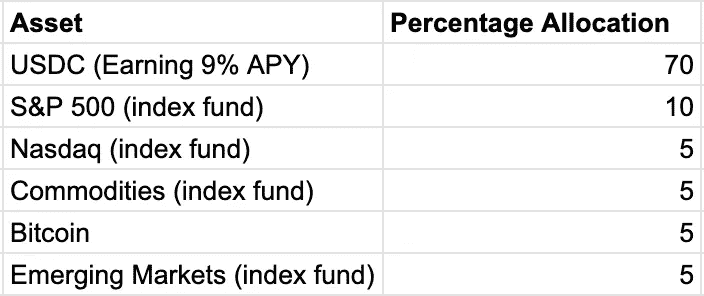
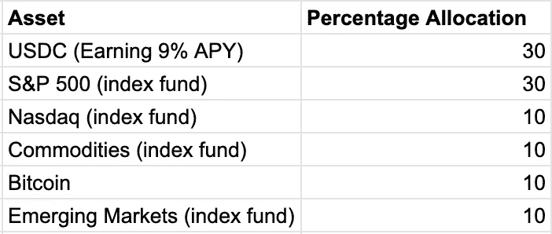

# X 一代——财务困境

> 原文：<https://medium.com/coinmonks/gen-x-a-financial-predicament-51bd28b17ed1?source=collection_archive---------47----------------------->

## 这是我们 4 部分系列的第 3 部分，重点是人口统计和加密的采用。#GenX

[https://smartasset.com/investing/what-is-an-investment-portfolio](https://smartasset.com/investing/what-is-an-investment-portfolio) — Photo Link

# Gen-X、60/40 投资组合和目标日期基金

夹在婴儿潮一代和千禧一代之间，X 一代通常是美国社会中最被忽视的人群。出生于 1965 年至 1976 年的 x 世代现在正进入他们最后的工作年。正是在这个暮年阶段，他们最大的收入潜力得以实现，为退休储蓄是首要任务。

根据彭博的数据，自从疫情开始以来，X 一代的财富已经增长了 50%,现在大约占全国总财富的 30%。

大量的 x 世代拥有自己的房子，每月向退休账户缴款，并且很可能从社会保障和医疗保险中受益。然而，根据 [Investopedia](https://www.investopedia.com/generation-x-all-eyes-on-retirement-5224396) 进行的调查，只有略多于 50%的 x 一代人希望能够退休。为什么会这样？这种缺乏信心提供了什么信号？X 一代在投资方面面临哪些挑战？

几十年来，投资者一直选择传统的 60/40 投资组合(60%股票，40%债券)。自 20 世纪 70 年代以来，60/40 结构的价值增加了 7000%以上。此外，与仅投资股票的投资组合相比，它提供了更大的下行保护。

20 世纪 90 年代中期，60/40 投资组合出现了一种有趣的变化。这种变化被称为“目标日期基金”，根据雇员的年龄和退休日期前的年数，调整分配给股票、债券和其他资产的资产百分比。

例如，28 岁的人更有可能承担更大的风险。90%的股票和 10%的债券的分配被认为是明智的，因为他或她在达到退休年龄之前还有 30 多年的工作时间。(更高的风险/更高的回报潜力)

然而，随着年龄的增长，一个人的风险偏好往往会降低。例如，一个 55 岁、离退休还有 5 年的人更有可能选择 30%股票、70%债券的投资组合。(低风险/低回报潜力)

# 债券和 60/40 的结束。

过去，债券被认为是资本的“无风险回报”。然而，今天许多人将债券归类为“无回报风险”。

那么债券是什么，它们在一个人的资产组合中传统上扮演着什么角色？简单来说，债券是投资者向借款者(如公司或政府)提供的贷款。借款人用这笔钱为其运营提供资金，投资者获得投资利息，并在特定日期收回本金。这就是债券通常被称为“固定收益”的原因。

过去，当经济状况恶化时，对债券的需求和价值都会增加，从而成为对冲股票下跌的一种负相关对冲手段。

此外，由于所支付的利息，债券也成为抵御通货膨胀的一种手段。例如，当通货膨胀率为 3%时，你每年会损失 3%的购买力。然而，如果你持有的债券的回报率为 3.25%，那么实际上你可以“跑赢”通胀 0.25%。

不幸的是，今天的债券没有超过通货膨胀。实际收益率为负。通货膨胀率接近 8%,美国国债收益率只有 2 %- 3%。通过持有债券，你的资金回报率为-5%。

我不知道你怎么想，但如果我的 401K 债券分配保证每年损失 5%，我会调查替代投资策略。

# 现代投资组合理论和债券选择。

在这一部分，我将依靠来自 [Harry Markowitz](https://www.investopedia.com/terms/h/harrymarkowitz.asp) 的[现代投资组合理论](https://www.investopedia.com/terms/m/modernportfoliotheory.asp#:~:text=The%20modern%20portfolio%20theory%20(MPT)%20is%20a%20practical%20method%20for,an%20acceptable%20level%20of%20risk.&text=A%20key%20component%20of%20the,low%20risk%20and%20low%20return.)的概念，并强调 X 一代在投资组合构建方面的一些选择。(注意:本部分不是财务建议)

简而言之，现代投资组合理论依赖于投资组合多样化。它试图将高风险/高回报的资产与低风险/低回报的资产结合起来。投资者投资组合中每种资产的数量取决于投资者的风险承受能力。(*下面的例子*)

首先，X 一代投资者正在寻找负收益债券的替代品。记住，通常债券在历史上被认为是安全的投资。我所发现的唯一一个风险与债券相似，同时表现优于通胀的解决方案是稳定债券。

例如，航海家号上的稳定收益为 9-10.5%的 APY。某些 DeFi(分散融资)协议提供高达 21%的收益率。

stablecoin 市值从 2018 年的 1B 资产价值增长到今天的 1500 多亿美元，这一采用速度没有放缓的迹象。

那么什么是稳定币呢？

稳定币是一种数字货币，与美元等“稳定”储备资产挂钩。Stablecoins 旨在降低相对于比特币等非挂钩加密货币的波动性。在稳定币空间中，存在四种不同的变体。1.菲亚特抵押债券 2。商品支持的稳定债券 3。密码支持的 stablecoins & 4。算法稳定。

每种稳定的硬币都有自己的风险特征，类似于每种债券都有自己的风险特征。(AAA 级债券——垃圾债券)最受欢迎、也可能是风险最小的稳定硬币形式是法定抵押硬币。在撰写本文时，两个最流行的是(USDC 和系绳)。

对于寻求重建其目标日期基金的一代人来说，稳定的硬币提供了与债券类似的风险，同时提供了更高的收益率，因此有充分的理由将投资组合中的传统债券部分换成稳定的硬币。

接下来，谈论股票很重要。股票很可能会成为 X 一代投资组合的最大组成部分。自 1980 年以来，美国股市经通胀调整后的平均年回报率为 8.7%。此外，自 2009 年全球央行资产负债表开始前所未有的扩张以来，美国股市经通胀调整后的平均年回报率超过 13%。

在如此高的全球债务水平下，任何形式的反通胀紧缩都有导致全球金融体系崩溃的风险。我认为中央计划者不会允许全球性的放松发生。这让我相信，货币创造的速度不会很快放缓……在这种环境下，股票很可能会继续表现良好，因此，将相当大一部分 Gen-X 目标日期基金配置到股票似乎是一个明智的举动。

如果你相信我们正在进入一个著名地缘政治作家彼得·泽汗所预言的去全球化时代，并且相信我们正处于一个新的全球货币秩序(布雷顿森林体系 III)的早期，正如瑞士瑞信银行的 Zoltan·波扎尔所断言的，那么就有充分的理由将一部分 Gen-X 投资组合分配给商品指数基金或交易所交易基金。

如果像 Zoltan 预测的那样，我们将看到欧洲美元体系的瓦解，以及商品支持的货币在东方的出现，那么也有充分的理由将一部分 X 一代投资组合配置给比特币等非主权资产。

自诞生以来，比特币一直是一种非相关资产，通过将比特币纳入你的投资组合，你将提高[夏普比率](https://www.investopedia.com/terms/s/sharperatio.asp)、[索提诺比率](https://www.investopedia.com/terms/s/sortinoratio.asp)和[标准差](https://www.investopedia.com/terms/s/standarddeviation.asp)。所有这些都是风险管理者想要的结果。

最后但并非最不重要的一点是，我认为有理由将一小部分 X 一代投资组合配置到新兴市场股票。尽管新兴市场存在一些风险，但更年轻的发展中国家为投资者提供了大量增长机会。在人口停滞或减少的发达国家，这些增长机会是不存在的。

# **样本投资组合—X 代**

下面我构建了两个样本目标日期基金。(非财务建议)

**57 岁——厌恶风险者**

**42 岁——高风险承受能力**

# (随意停读！航海家号是个骗局。这是我成为比特币理性主义者之前写的。)

我大力支持 Voyager Digital 的一个主要原因是，它正朝着成为新一代金融一站式商店的方向发展。他们不仅在 USDC 上提供 9-10.5%的 APY，按月计算复利，而且还在比特币和数十种其他数字资产上支付极具竞争力的 APY。(比特币的利率为 3.05%至 4.55%)

很快，该平台将允许通过其与 Market Rebellion 的合作关系进行股票交易，并允许其用户选择以平台上的资产为抵押进行贷款。

现在，他们正在推出借记卡支票账户，提供 1-3%的 Voyager Token 现金返还。

在我看来，借记卡最引人注目的使用案例是使用借记卡支付账单的“双底”效应。举个例子，假设你在自己喜欢的信用卡上消费，可以获得 3–5%的返现。现在想象一下，当你用你的 Voyager 借记卡账户支付所述信用卡时，收到额外的 1-3%的返现。终极财富黑客。

我对航海家号的前进势头印象深刻。他们组建了一个顶尖的高管团队，正在构建市场上最具包容性的数字金融应用。#CryptoForAll

感谢阅读！

下次我们来看看#Zoomer 一代！

> 加入 Coinmonks [电报频道](https://t.me/coincodecap)和 [Youtube 频道](https://www.youtube.com/c/coinmonks/videos)了解加密交易和投资

# 另外，阅读

*   [Bookmap 点评](https://coincodecap.com/bookmap-review-2021-best-trading-software) | [美国 5 大最佳加密交易所](https://coincodecap.com/crypto-exchange-usa)
*   最佳加密[硬件钱包](/coinmonks/hardware-wallets-dfa1211730c6) | [Bitbns 评论](/coinmonks/bitbns-review-38256a07e161)
*   [新加坡十大最佳加密交易所](https://coincodecap.com/crypto-exchange-in-singapore) | [购买 AXS](https://coincodecap.com/buy-axs-token)
*   [红狗赌场评论](https://coincodecap.com/red-dog-casino-review) | [Swyftx 评论](https://coincodecap.com/swyftx-review) | [CoinGate 评论](https://coincodecap.com/coingate-review)
*   [投资印度的最佳密码](https://coincodecap.com/best-crypto-to-invest-in-india-in-2021)|[WazirX P2P](https://coincodecap.com/wazirx-p2p)|[Hi Dollar Review](https://coincodecap.com/hi-dollar-review)