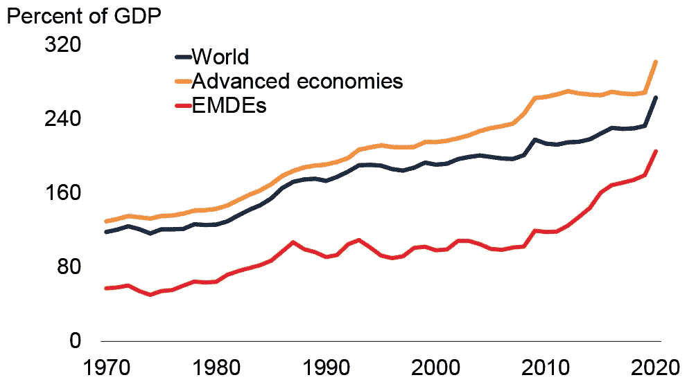

# Gen-Z —数字原生代

> 原文：<https://medium.com/coinmonks/gen-z-digital-natives-837f6ea0f065?source=collection_archive---------23----------------------->

## 这是我们的 4 部分系列的第 4 部分，重点是人口统计和加密采用#GenZ

**指数时代，全球主权债务危机及其对 z 世代的意义**

债务。我们整个全球货币体系建立在不断增加的债务之上。从家庭到民族国家，当前的全球债务水平是不可持续的。过去，是战争重置了债务。在核武器时代，战争不是一个可行的选择。

[Photo from the World Bank Blog.](https://blogs.worldbank.org/developmenttalk/5-lessons-past-episodes-debt-relief)

根据雷伊·达里奥的说法，当债务水平达到不可持续的水平时(如今全球债务超过全球 GDP 的 350%)，最简单的前进道路是民族国家通过货币贬值消灭债务。这种货币贬值过程对于政府债券持有人(债务所有者)来说，无疑将是一个极其痛苦的过程。

此外，达利奥预测，在未来几年，许多民族国家将完全失去其货币特权。(参见:[阿根延](https://www.tradingview.com/chart/kcKf7f0n/?symbol=FX_IDC%3ALKRUSD)，[斯里兰卡](https://www.tradingview.com/chart/kcKf7f0n/?symbol=FX_IDC%3ALKRUSD)，[土耳其](https://www.tradingview.com/chart/kcKf7f0n/?symbol=FX_IDC%3ALKRUSD)，[黎](http://country.eiu.com/article.aspx?Country=Lebanon&articleid=861569669&subsubtopic=Economic+grow_4)等。)

对美国人来说幸运的是，作为拥有世界储备货币的民族国家，我们很可能是最后一个失败的法定货币。从近期来看，适度的通货膨胀会让我们的生活更加不舒服。我们将减少休假，消费更少的非必需品，并放弃购买期权。但在所有条件相同的情况下，我们将比发展中国家的公民经历更少的痛苦。

不幸的是，这种储备货币地位也意味着我们将是最后一个意识到当前货币体系即将终结的人。我们就像谚语中所说的锅里的青蛙，永远不会意识到水正在慢慢变暖。而我们在阿根廷、斯里兰卡、土耳其和黎巴嫩的同行很久很久以前就已经退出了。

正如作家兼科技投资者杰夫·布斯所说，比特币是通往一个完全不同的经济体系的桥梁。受菲亚特-庞氏骗局影响最大的国家将最先离开。他们将选择一个不是建立在无休止的债务创造和财富贬值基础上的体系。

在他的书《明天的价格:为什么通货紧缩是繁荣未来的关键》中，布斯雄辩地举例说明了技术进步是一种有益于人类的通货紧缩力量。

根据布斯的说法，技术的通缩力量和货币操纵的通胀力量之间存在一场拔河比赛。他预测，最终，技术将占上风，在未来几十年，全球货币债务泡沫将缩小为一种可证实的稀缺资产——比特币。

那么这对 Z 世代意味着什么呢？作为最精通技术的一代，很可能当他们成年时，他们的 X 一代父母会住在地下室，而不是相反。

今年早些时候，我的一名 12 年级学生开始铸造 NTF 艺术品。他花了大约 100 个小时创作了 3 件作品，每件售价 1 英镑。当时，每个 Eth 大约为 2200 美元。此外，在 Youtube 上学习了一个月的技术分析和交易策略后，他决定用币安的杠杆多头试试运气。长话短说(双关语)经过 5 天的交易，他把 3Eth 变成了 20。实质上，他将 125 个小时的工作变成了超过 4 万美元的收入，以及对他的未来很有帮助的大量数字/金融知识。

假设在不久的将来，以太坊会成为最好的第一层智能合约平台，以太坊的价格会上涨到每以太坊 20，000 美元。这名学生现在可以通过在像 [Rocketpool](https://rocketpool.net/) 这样的 Defi 应用程序上押上他的 20 个 Eth，每年赚取价值超过 25，000 美元的 Eth。

作为一个每天花 7 个小时在这一代人身边谋生的人，我亲眼目睹了他们是如何驾驭数字资产的。从元宇宙的游戏到创建 NFT，以及介于两者之间的一切……这些孩子正站在这个金融新世界的最前沿……伙计。作为他们的老师，我是多么荣幸啊。

# (随意停读！航海家号是个骗局。这是我成为比特币理性主义者之前写的。)

**航海家，GenZ 银行，以及与 Avalance 的合作**

观看我的 GenZ 学生与数字金融的互动增加了我对航海家数字的乐观程度。这一代人中很少有人会选择传统的银行账户。相反，他们会选择提供强大客户服务和流畅用户界面的平台。他们想要一个一站式的金融平台(密码、股票、利息、信用、借贷等)。)他们将在航海家号上找到这一切。

目前，Voyager 提供 100 多种加密资产的交易。它为客户抵押代币，并支付高达 12%的年息。它在加密借记卡领域处于领先地位，并且正在与 [Avalance](https://www.prnewswire.com/news-releases/voyager-digital-to-integrate-avalanche-staking-nfts-and-defi-applications-301415290.html) 区块链整合，以便提供更多的 Defi 应用和 NFT。你会说 GenZ 梦想 app 吗？

下次见！

> 加入 Coinmonks [电报频道](https://t.me/coincodecap)和 [Youtube 频道](https://www.youtube.com/c/coinmonks/videos)了解加密交易和投资

# 另外，阅读

*   [3 商业评论](/coinmonks/3commas-review-an-excellent-crypto-trading-bot-2020-1313a58bec92) | [Pionex 评论](https://coincodecap.com/pionex-review-exchange-with-crypto-trading-bot) | [Coinrule 评论](/coinmonks/coinrule-review-2021-a-beginner-friendly-crypto-trading-bot-daf0504848ba)
*   [莱杰 vs n rave](/coinmonks/ledger-vs-ngrave-zero-7e40f0c1d694)|[莱杰 nano s vs x](/coinmonks/ledger-nano-s-vs-x-battery-hardware-price-storage-59a6663fe3b0) | [币安评论](/coinmonks/binance-review-ee10d3bf3b6e)
*   [Bybit Exchange 审查](/coinmonks/bybit-exchange-review-dbd570019b71) | [Bityard 审查](https://coincodecap.com/bityard-reivew) | [Jet-Bot 审查](https://coincodecap.com/jet-bot-review)
*   [3 commas vs crypto hopper](/coinmonks/3commas-vs-pionex-vs-cryptohopper-best-crypto-bot-6a98d2baa203)|[赚取秘密利息](/coinmonks/earn-crypto-interest-b10b810fdda3)
*   最好的比特币[硬件钱包](/coinmonks/hardware-wallets-dfa1211730c6) | [BitBox02 回顾](/coinmonks/bitbox02-review-your-swiss-bitcoin-hardware-wallet-c36c88fff29)