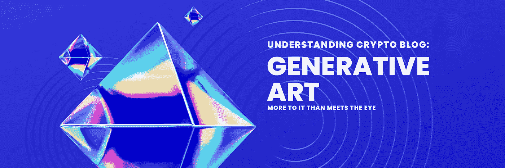
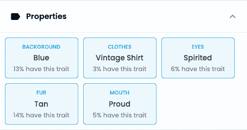

# 生成艺术；比看上去的要复杂

> 原文：<https://medium.com/coinmonks/generative-art-more-to-it-than-meets-the-eye-e3254917dc60?source=collection_archive---------43----------------------->

为什么有人会花大价钱买一幅猿或狮子的画呢？在这篇博客中，我希望能帮助你理解生成艺术的世界。这是写给你的，如果你已经听到了关于非生成艺术的所有噪音，我们将深入探讨为什么有这么多关于它们的炒作，以及它们如何成为一个可行的商业决策。

**两个主要市场** 现在有几类不同的人在购买非功能性食物。较小的*“真实世界”*市场是属于一个社区的人——他们可能认为自己是成员、粉丝、利益相关者等。并且**他们为附属于数字“资产”的实用程序**购买 NFT。

更广泛的市场由购买 NFT 的人组成，因为 NFT 是与项目相关的艺术。真的有一大群人会投资*，纯粹是因为这是一个新的生成艺术项目*。这可能被视为一种购买非功能性交易的投机方式；很多时候，这种“投资”方式只是基于在像 OpenSea 这样的平台上找到一个项目，押注其价值将会增加，并希望从资产转售中获利。顺便说一下，转售(或二级市场)现在非常活跃，所以你可以理解为什么这么多人在投机！

对于我们参与的即将到来的 NFT 项目，我们最初计划将整个价值体系完全基于效用，*根本没有真正关注图像方面。*

事实上，*从某些方面来说，在一开始*，我们可能打算主动避免二级艺术市场的炒作和兴奋。但当你更深入地研究这些事情时，你会意识到，如果不承认这一点，你将错过这个行业的很大一部分。

那么，是什么赋予了生成艺术的价值呢？顺便说一下，这些项目有很大的价值，其中一些项目在很短的时间内筹集了数亿美元。

在 NFT 世界，价值是基于所谓的“稀有性”，而这种稀有性是由“层次”和“特征”来定义的。通常，一个标准的主图像是由专业的数字艺术家或平面设计师创建的，这可能类似于一个角色——通常使用动物，这就是为什么你可能听到你的 web 3.0 热情的朋友谈论无聊的猿、懒惰的狮子、月鸟或移情的大象——然后在这些角色周围、后面或上面构建不同的元素层。它可以是不同背景颜色的层，旁边是肤色、衣服、帽子、眼镜和其他配饰等特征，这些特征将建立在顶部并随机覆盖在角色和背景上。

现在，*这里是聪明的部分*，根据用于收集的分配系统，智能合同自动生成基于个人层次和特征的艺术。

到此为止，好的*——我们将继续！*

因此，智能合同在后端与 NFT 生成软件对话，并创建一个随机的艺术作品。**生成的艺术作品的价值可以根据图像的各种属性计算出来**。

那些建立自己项目的人需要知道什么叫做**稀有度表**；这本质上是一种基于要创建多少 NFT(或数字艺术作品)的计算，它使人们能够确定需要多少层和特征才能产生理想的收藏规模。

你创造的层次和特征越多，每个 NFT 就越稀有。并且，*由于这是出现在区块链/ digital ledger* 上的每一笔交易的世界，每个 NFT 都附有元数据，因此潜在的买家可以查看稀有度得分(这是通过幕后的智能合同生成的元数据在 OpenSea 或 Rarible.com 等平台上突出显示的)。

以下是 NFT 的“财产”在 OpenSea 上的展示方式。“具有这种特征”的比例越低，NFT 就越稀有。

由于 Web3.0 允许的完全透明性，**稀有性是可追踪和可交易的，因为它被记录在区块链上**。由于收藏中的藏品数量有限，有一整群人只是根据元数据信息交易 NFT，*然后像使用老学校的收藏卡一样使用它。*

**真实世界用例** 因此，在我们正在查看的 NFT 案例中，我们正在为特定的受众构建一个具有特定效用的项目，*正如在之前的博客中提到的——以及之前几集的* [*了解加密播客*](https://tinyurl.com/creatorcoins) —我们正在为现有社区 *创建项目**，而不是试图通过项目*****构建一个社区——差别很大！**

**虽然实用性是我们即将推出的产品的价值所在，但我们的战略已经发生了转变，目的是让艺术变得有趣和美丽，以吸引那些构成目前市场绝大多数的*“数字艺术玩家】*。**

**此外，制作精美图片和数字艺术的另一个额外好处是，当人们购买并展示 NFT 作为他们的个人资料图片时，这给了购买者进一步的所有权感。它增加了社区的感觉和社区氛围，使得*在秘密世界中如此繁荣。***

**除了归属感的增强，成千上万自豪的 NFT 车主在他们的社交媒体平台上展示他们的图片也是一种惊人的营销。看看 Twitter 为整合 NFTs 和 Twitter Blue 所做的工作——*任何无聊的 Ape 持有者现在做的第一件事就是立即进行 PFP 交换！***

**一个 NFT 人能做的就是团结一个社区。NFT 持有者都有一个共同的利益和共同的事业，团结在这个特殊的项目周围。如果人们通过持有数字资产得到回报，他们就会希望留在社区中，与社区一起成长——无论是通过智能合同背后的基础设施，还是相信“资产”会升值。**

**对那些有兴趣进入这一领域的人来说，关键是“知道你投资的原因”。您是否希望在加密资产上“做多”，并且乐于度过高峰和低谷*(这将会发生！未来 10 年，你是打算早期投资一些东西，然后迅速退出，从快速增长的二级市场中获益？***

**现在有一些非常令人兴奋的 NFT 项目正在做非常酷的事情；看看 [VeeFriends](https://veefriends.com/) 和 [Moonbirds](https://www.moonbirds.xyz/) 是一个很好的起点。仅供参考— *请不要认为这是财务建议，你是一个成年人，对这些项目做你自己的尽职调查，*我只是认为他们在做有趣和非常新颖的事情。**

**并且，保持你的眼睛为一个超级聪明的 NFT 项目去皮很快，结合 NFT，赌注和采矿…在未来的博客更多。**

**更多关于生成艺术的内容，请看我们最新一期的十大投资播客[“理解加密”](https://tinyurl.com/generativeartpodcast)**