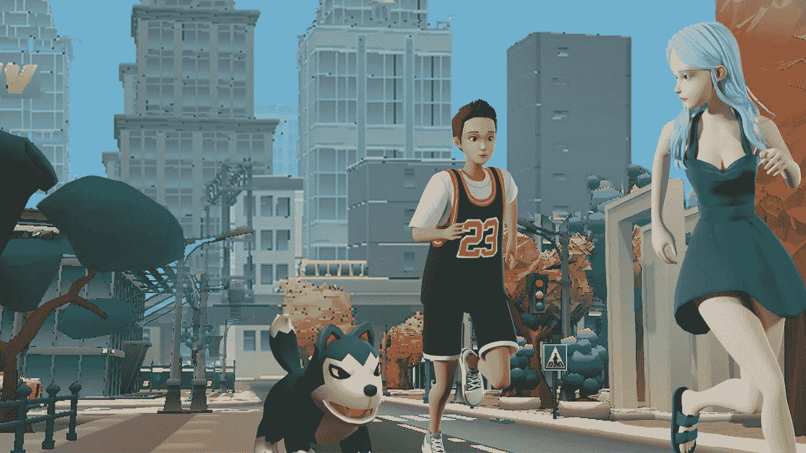
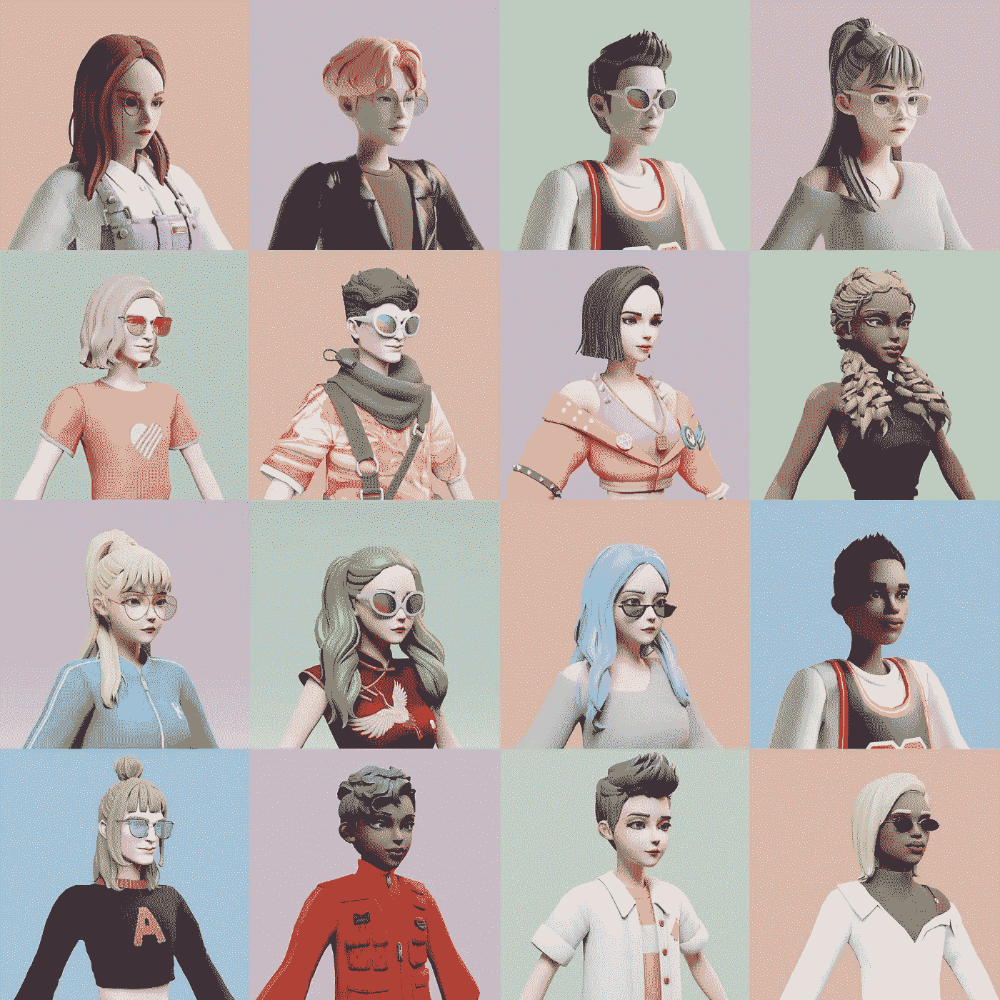
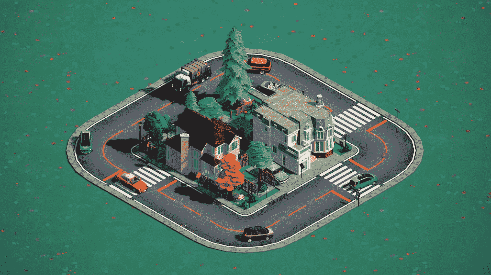
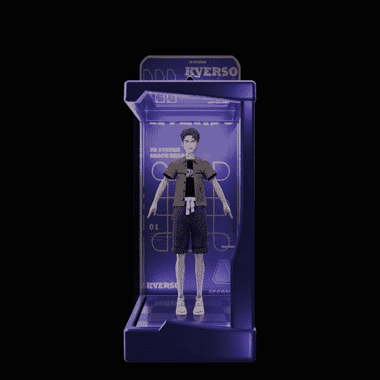
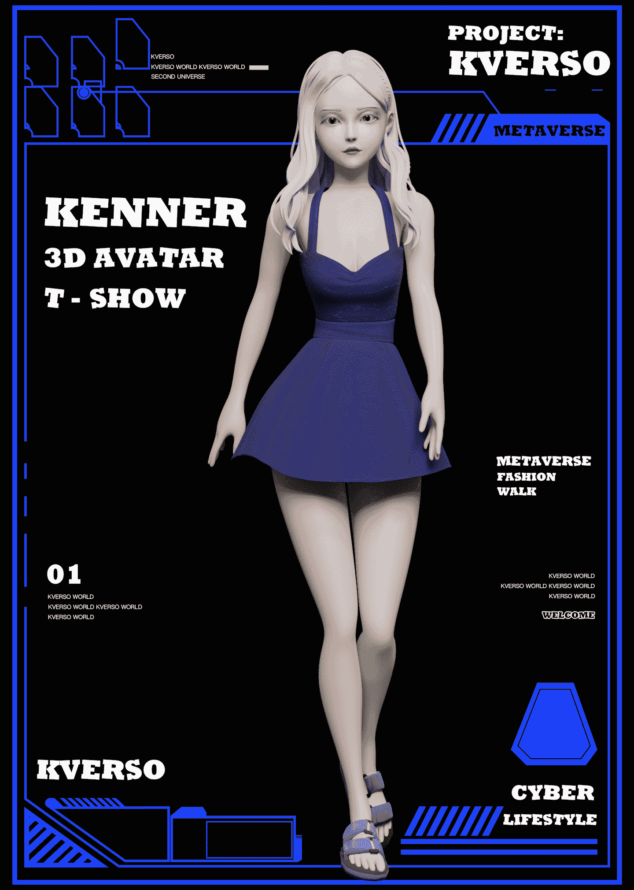

# 创世纪:卡比

> 原文：<https://medium.com/coinmonks/genesis-kabi-ab6b3b51d0e8?source=collection_archive---------7----------------------->

平民在地球上 3222 年被各国政府压迫，在平行宇宙中。世界各国领导人为了日益稀缺的资源相互发动攻击。和平时代已经结束。

在网络空间躲避残酷现实的幸存人类将自己转化为网络意识，在网络基础设施构建的二元世界中开辟了一个天堂。这些坚持去中心化的幸存者被称为用户。最虔诚的用户，他们抛弃了自己的肉体，将自己的人格完全上传到了二进制世界，他们将自己命名为开拓者。

K-Universe Preview

不断的非人道战争逐渐摧毁了网络空间的现实载体，数据容量和带宽都大幅下降。所有开拓者都必须压缩/删除他们的数据。最后只剩下“欲望”。

在两个世界崩溃的那一刻，赛博生物的欲望融合，K 宇宙形成了。

在平行宇宙中聚合人类最后愿望的 k 宇宙，与我们的宇宙发生碰撞。开拓者，在 K-Universe 中，浓缩成一万个不可替代的代币名为 KABI，漂浮在我们的网络空间，等待被发现。

开拓者寻求在新的 K 宇宙中从头开始重建一个社区，并在没有定义的情况下重写他们的起源。

K-Universe Preview

什么是 KVERSO 项目？

KVERSO 项目包括两个重要部分:KABI 和 K 宇宙社区。

KVERSO 包括 NFT 肖像(KABI)，可定制的头像，数字画廊和个人频道，玩家可以通过头像体验 3D K-Universe 的下一代社交和多玩家功能。数字画廊是一种显示玩家获得的数字资产的方法，并通过交易功能突出个性。玩家可以在他们的频道上展示视觉信息，揭示 Web3.0 中的网络生活方式，增强他们的虚拟身份。

K-Universe 是一个去中心化的宇宙，包括基于区块链、NFT、3D 引擎、虚拟现实和私有化交通概念的社交、游戏和创造功能。我们将为玩家提供 Web3.0 级别的社交互动体验。在 KABI 购买可获得体验 K-Universe 先锋玩家福利和特权的资格。

卡比的艺术价值

基于 3D 高表面建模和光线跟踪技术，KVERSO 创作出具有独特美学风格的肖像，为信奉去中心化的艺术鉴赏家和投资者提供了差异化的选择。它突出了 NFT 社区成员的集体身份和业主的独特性。这是与网络社区中的人联系的一种极好的方式。

我们希望 KABI 能够体现网络时代的最新审美取向。KVERSO 团队的设计师花了半年时间研究世界时尚产业的价值观，根据时尚趋势，将数百种服装、配饰、发型和角色模型组合成 40 多万个角色。我们挑选了 10000 张独家肖像供选择。每一幅图像都是我们充满激情的设计师的得意之作。

PFP NFT (KABI)

卡比，每个人的 NFT

KVERSO 团队希望有一个没有差异歧视的和平世界。卡比是一张通向不受性别、宗教、种族或生活方式束缚的宇宙的门票。

基于世界种族百分比，我们有 10，000 个 PFP 角色的公平分布。

根据人类学的统计，大约 50%的人是浅色皮肤，40%是中色皮肤，10%是深色皮肤。因此，第一个 5000 KABI PFP 的皮肤颜色分配如下:

光:2500 块

中号:2000 件

深色:500 件

总共 98%的人物，男女特征平分秋色

K-Universe 支持多样性和少数群体。我们设计了全世界 2%的具有多样化特征的角色。

元宇宙社区，不止亲民党

在注重审美取向的同时，KVERSO 还追求社交和互动体验。在我们的愿景中，成员聚会不应该局限于不和或 Twitter 群组。K-universe 社交是一种全方位的多维度的、轰动性的体验。玩家可以体验图形创作、资产交易、休闲游戏和其他社交功能，参与网络空间的开发。

卡比 NFT 是 K 宇宙中初始成员的身份凭证。KABI 所有者可以完全访问 K-Universe 社交群组和游戏内功能。

Metaverse Land Preview

K 宇宙蓝图:

2022Q2 —赛博空间 K-Universe Beta 测试，实现多人游戏、自定义虚拟角色和具有服装上传功能的 UGC 着装、手机 APP，实现一对一/群组文字聊天、语音聊天和社交休闲游戏功能

2022 年第 3 季度—推出定制建筑(Dream Builder) Alpha 测试、真实结构、建筑材料定制/上传功能。

2022 Q4——推出游戏编辑器 Alpha 测试，游戏难度等级调整/设计功能。

虚拟现实聊天，UCG 和 PCG 社区，以及正式比赛活动也在进行中。

KABI 将如何发布？

最初的 5,000 KABI 将在国际比较方案上为铸币厂发放。

我们还在 KVERSO 网站上为空投和盲箱提取保留了少量 PFP。

如何获得亲民党亲民党造币资格？

在公开销售之前，我们将在我们的网站上发布 Mint 访问代码。粉丝可以凭进入码参与公开发售。

我们还在 KVERSO Discord 频道上为早期支持者预留了预购代码。不和谐 OG 成员可以铸造 1-4 个卡比(盲盒)，不和谐 WL 成员可以铸造 1-2 个卡比(盲盒)。

Blind Box Preview

初始发布的购买包括什么？

KABI 成员是 KVERSO 元宇宙的初始成员，被官方授权为第一批体验 K-Universe 的玩家。

我们将优先开发 K-Universe 3D 多人游戏和虚拟 3D 化身(KENNER)定制功能。

当 KVERSO BETA 1.0 正式发布时，K-Universe 将包括即时社交网络、休闲游戏、语音通信系统以及其他功能。

相比常规球员，开拓者有什么好处？

1.荣誉称号:

最初的 KABI 持有人将被认证为 K-Universe 的创始会员，“BLAZER”将显示在他们的昵称和主页上。

2.免费数字服装:

一套创作者的服装将在第一次入场时空投，有几种时尚风格可供选择。创作者的服装是 NFT 的财产，允许在网上自由交易。

3.体验肯纳头像定制:

很快，服装上传和换装功能将对开拓者成员开放。以及建筑材料和模型定制。开拓者成员将有最大的创造性的访问能力，货币化和交易他们的数字服装和建筑纹理。

4.土地购买:

开拓者成员在 K-Universe 土地分配上有优先权。

5.个人频道:

成员可以通过博客展示 K-Universe 的生活方式，发现有相似兴趣的成员。收集喜欢、关注和评论！

3D AVATAR (KENNER)

K-Universe 中除了 NFT PFP(KABI)/3D 虚拟人物(KENNER)之外还有哪些初始数字资产？

我们优先考虑 K 宇宙中的数字服装和虚拟领域。

所有开拓者成员将收到他们的第一个免费的数字服装 NFT，更多的 UCG&PCG 服装 NFT 将加入 K-宇宙在未来。玩家还可以设计、上传和数字化他们的服装。

1X1，2X2 和 4x4 土地拍卖只对开拓者成员开放。其他玩家将有机会在元宇宙官方游戏比赛中赢得一部分土地作为奖励。8×8 插槽将由 KVERSO Business Partners 拍卖，公共基础设施将建立在 16×16 插槽上。

为什么是卡比？

KABI 展示了 KVERSO 对包容性、多样性和鼓励不同美学风格的态度；

K-Universe 中的组件在 KVERSO 开发团队的技术支持下不断更新。

KVERSO 社区源源不断地生产高质量的数字资产。

就艺术收藏、社交、游戏和商店价值而言，开拓者作为先行者，在克维尔索项目的增长红利中占有最大份额。

事实上，人类社会正在遭受流行病、经济衰退和共识崩溃的侵蚀。没落的雅尔塔等级制度逐渐旋转到历史的对立面，威胁着我们的未来。区块链技术正在成为未来人类社会可能的先锋。分散概念的支持者正在用信息技术深刻地改变世界，敦促他们建立一个实现真正自由和平等的乌托邦。未来人类的生存空间将慢慢从现实转向虚拟，这是前所未有的历史机遇。因此，KVERSO 团队推出了 KABI，以吸引与我们志同道合的人，共同建设一个共享的宜居元宇宙。

请订阅/关注 KVERSO 官方网站、Discord Channel、Medium 和 Twitter，了解关于我们项目的更多详情。

> 加入 Coinmonks [电报频道](https://t.me/coincodecap)和 [Youtube 频道](https://www.youtube.com/c/coinmonks/videos)了解加密交易和投资

# 另外，阅读

*   [Bookmap 点评](https://coincodecap.com/bookmap-review-2021-best-trading-software) | [美国 5 大最佳加密交易所](https://coincodecap.com/crypto-exchange-usa)
*   最佳加密[硬件钱包](/coinmonks/hardware-wallets-dfa1211730c6) | [Bitbns 评论](/coinmonks/bitbns-review-38256a07e161)
*   [新加坡十大最佳加密交易所](https://coincodecap.com/crypto-exchange-in-singapore) | [购买 AXS](https://coincodecap.com/buy-axs-token)
*   [红狗赌场评论](https://coincodecap.com/red-dog-casino-review) | [Swyftx 评论](https://coincodecap.com/swyftx-review) | [CoinGate 评论](https://coincodecap.com/coingate-review)
*   [投资印度的最佳密码](https://coincodecap.com/best-crypto-to-invest-in-india-in-2021)|[WazirX P2P](https://coincodecap.com/wazirx-p2p)|[Hi Dollar Review](https://coincodecap.com/hi-dollar-review)