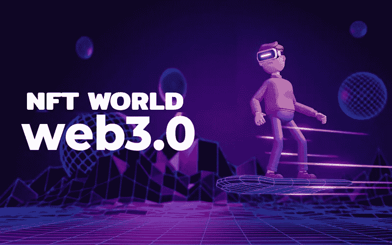

# 借助白标 NFT 市场开发，快速参与 Web3 革命！

> 原文：<https://medium.com/coinmonks/get-on-the-web3-revolution-quickly-with-white-label-nft-marketplace-development-dde2a52cae5?source=collection_archive---------21----------------------->

正如我们所知，Web3 世界由各种新兴技术组成，区块链是基础，其他技术将在其上铺设分支。自 2008 年至 2009 年作为加密货币比特币的数字账户首次出现以来，区块链本身就出现了指数级增长。现在，有许多基于该技术的不同用途的个人应用，并且正在发现更多的应用。特别值得一提的是不可替换令牌(NFT ),这是去年以来的热门话题。这篇博客讨论了 NFTs 的一个具体的商业应用，即[白标 NFT 市场](https://bit.ly/3NSzeG0)。

## 什么是白标 NFT 市场？

白标 NFT 市场是一个现成的、可定制的平台，可以在很短的时间内启动。该平台基本上实现了 NFT 市场的所有功能，并包含了 NFT 市场平台的所有基本特征。这种平台可以作为针对个别开发公司的独特解决方案或类似于现有 NFT 市场(如 OpenSea)的解决方案来创建。

 [## 白标 NFT 市场开发|推出您自己的白标 NFT 加密收藏品…

### NFT 市场是加密领域的一个有利可图的商业机会。它惊人的增长和…

bit.ly](https://bit.ly/3NSzeG0) 

## 白标 NFT 市场发展的优势

*   白标 NFT 市场平台的开发成本低廉，因为它已经预先构建并经过广泛测试。
*   您可以根据自己的需求，在白标 NFT 市场解决方案中添加所需的所有用户端功能。
*   启动 NFT 市场进行公开交易所需的时间是最少的，因为只需要在前端进行一点点开发。
*   如果您担心黑客攻击，您甚至可以在白标解决方案中添加额外的后端安全功能。

## 白标 NFT 市场发展背后的过程

*   该项目最初从规划开始，讨论并决定与 NFT 市场相关的一切。既然您已经决定我们将使用白标解决方案，那么您必须决定目标市场、竞争对手、市场分析、平台特性等。
*   既然您已经选择了白标解决方案，您可以继续定制平台中的前端功能，并添加您需要的功能。
*   如果你希望你需要额外的安全，你也可以做到这一点，与额外的模块，可以帮助提高你的 NFT 市场的安全性。
*   现在，对平台进行最后的测试，看看是否一切功能都符合预期，如果不符合，处理故障并解决它们。
*   现在，是时候从白标解决方案推出您的 NFT 市场平台供公众使用了。维护和升级平台，跟上技术进步的步伐。

> 加入 Coinmonks [电报频道](https://t.me/coincodecap)和 [Youtube 频道](https://www.youtube.com/c/coinmonks/videos)了解加密交易和投资

## 我如何从一个白色标签的 NFT 市场解决方案开始开发？

如果您正在为您的下一个业务寻找一个易于启动的解决方案，您可以联系一家经验丰富的白标 NFT 市场发展公司。这样的公司通常有许多 NFT 市场的解决方案供他们使用，所以你可以在选择基础平台时有很多选择。此外，由于这些公司主要关注客户的需求，您的需求将在您的资金和时间限制内得到满足。所以，现在就联系一家这样的公司来 [***开始你梦想中的基于 Web3 的业务***](https://bit.ly/3NSzeG0) 。