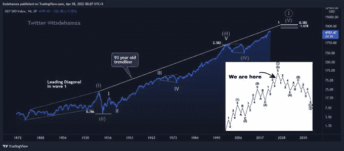
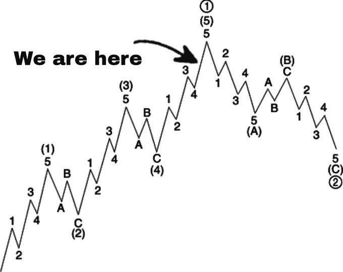

# 为金融末日做好准备

> 原文：<https://medium.com/coinmonks/get-prepared-for-financial-armageddon-fccf8bf7960b?source=collection_archive---------26----------------------->

S&P500 150 年海图的 EW 分析。第二波是由(大萧条)引起的剧烈调整，第四波是包括两者(2001 年互联网泡沫和 2008 年房地产泡沫)的平缓调整。

不对称和波浪比例在这一点上达到了完美的平衡。这就是为什么我更喜欢这个想法。很明显，SPX 在超循环度的 W5 将完成大超循环度的第一波。这是千年尺度上最有可能也是最可怕的情景。

因此，在一个完整的波动周期结束后，可能会出现大规模的混乱和动荡。因为这将是一个大周期，我们可以期待一个大的调整，可能比“大萧条”更大

**收益率曲线反转作为衰退信号:**
从历史上看，我们 4 次都见证了衰退发生在收益率反转几个月后(易)。平均而言，收益率反转后的时间周期为 373 天。距离现在的易已经 28 天了。因此，从新一轮周期和历史数据来看，我们可以得出结论，未来几周/几个月将出现大规模调整。

**推特
@itsdehamza**

> 加入 Coinmonks [电报频道](https://t.me/coincodecap)和 [Youtube 频道](https://www.youtube.com/c/coinmonks/videos)了解加密交易和投资

# 另外，阅读

*   [如何在 FTX 交易所交易期货](https://coincodecap.com/ftx-futures-trading) | [OKEx vs 币安](https://coincodecap.com/okex-vs-binance)
*   [CoinLoan 审查](https://coincodecap.com/coinloan-review) | [YouHodler 审查](/coinmonks/youhodler-4-easy-ways-to-make-money-98969b9689f2) | [BlockFi 审查](https://coincodecap.com/blockfi-review)
*   [XT.COM 评论](https://coincodecap.com/profittradingapp-for-binance)币安评论 |
*   [SmithBot 评论](https://coincodecap.com/smithbot-review) | [4 款最佳免费开源交易机器人](https://coincodecap.com/free-open-source-trading-bots)
*   [比特币基地僵尸程序](/coinmonks/coinbase-bots-ac6359e897f3) | [AscendEX 审查](/coinmonks/ascendex-review-53e829cf75fa) | [OKEx 交易僵尸程序](/coinmonks/okex-trading-bots-234920f61e60)