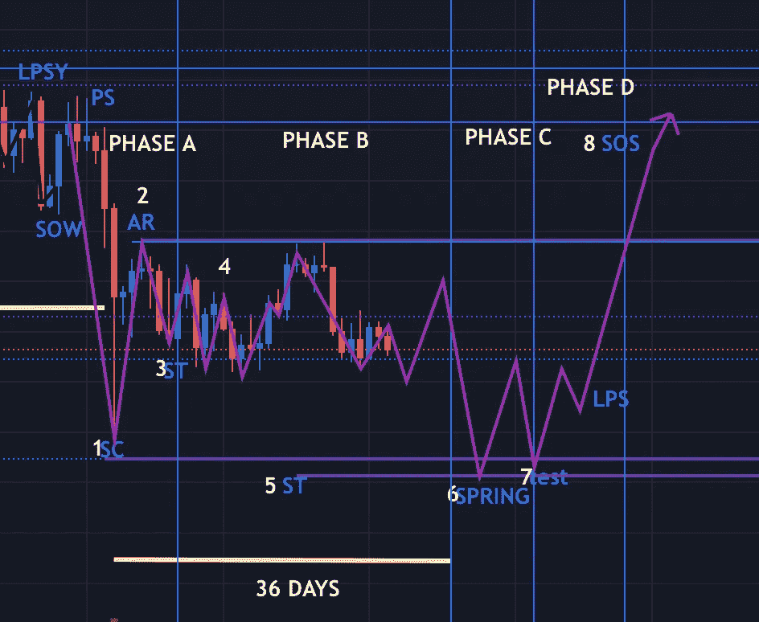
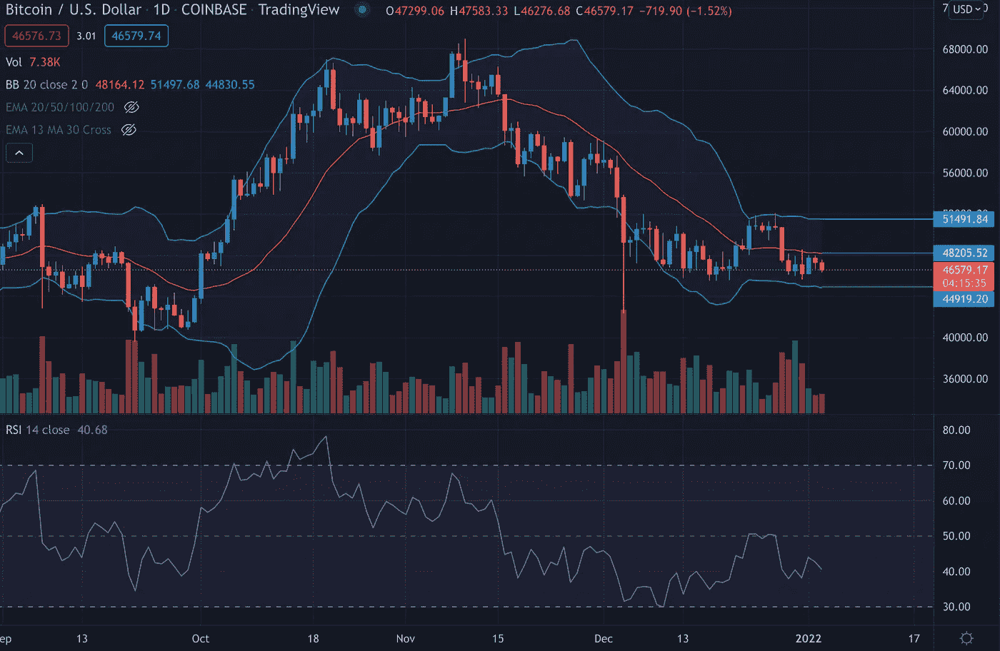
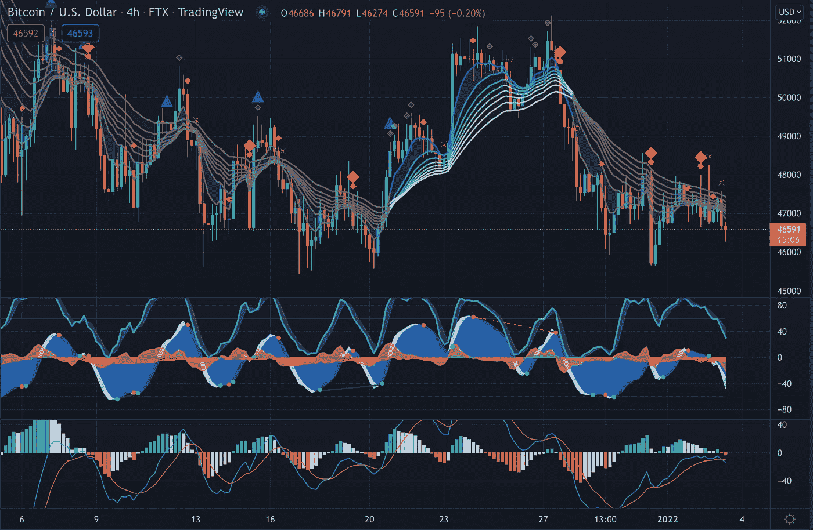

# 准备好迎接另一个 BTC 垃圾场

> 原文：<https://medium.com/coinmonks/get-ready-for-another-btc-dump-12b83acec1d1?source=collection_archive---------11----------------------->

十二月对 BTC·霍德勒来说是一个艰难的月份。BTC 价格持续下跌，在过去的几周里，它一直在 51000 美元和 41000 美元之间震荡。我很抱歉把它分解给你，但 BTC 价格可能会继续倾销…

威科夫累积图仍然在起作用，在价格再次恢复之前还有一些阶段。原因如下…

WYCKOFF 累积示意图

Wyckoff Accumulation Schematic. Retrieved from Trading View

威科夫积累模式正在如预期的那样展开。卖出高潮(SC)，自动反弹(AR)发生了，意味着阶段 A 完成了。现在正进入 B 阶段。这是我们在此期间可以预期的:在 B 阶段，机构和大型利益集团正在积累相对低价的库存，以期待下一次涨价。机构积累的过程可能需要很长时间，包括以较低的价格购买 BTC，并通过卖空来抑制价格上涨。在 B 阶段通常有多次 STs，在交易区间的上端也有上升式的动作。总体而言，随着交易范围的扩大，大型利益集团是 BTC 的净买家，目标是尽可能多地获得剩余的浮动供应量。机构买卖赋予交易区间特有的上下价格行为。

在 B 阶段的早期，价格波动往往很大，并伴随着高交易量。然而，当“复合人”吸收供应时，交易区间内下跌时的成交量往往会减少。当供应似乎已经耗尽时，资产就准备进入 c 阶段。

到目前为止，“合成人”还没能把价格降到 4.5 万美元以下。在这个价位，由于交易所的流动性池，阻力很大。然而，价格很有可能会回升。

布林线

Bollinger Bands. Retrieved from Trading View

布林线表明 BTC 是熊市。BTC 正在经历一个收缩期。上面的波段表明价格上升到 51K，20 天的均线和 20 日均线表明阻力位在 48k 左右。目前，BTC 的价格为 46K，接近波段的下限(44k)。另外 RSI 在 40。RSI 在 30 表明 BTC 正在超卖。

市场密码

Market Cipher. Retrieved from Trading View

市场行情也表明价格将会下跌。有多个红色菱形表示继续看跌，有一个红色十字表示做空。此外，资金流为负(红色波浪),市场动量波也为负。这些都是短期的看跌条件。然而，这是预料之中的，因为我们处于威科夫聚集示意图中。

基于威科夫分析、布林线和市场密码图，我对未来几周价格走势的预测如下:

-从现在(1 月 3 日)到 1 月中旬，威科夫累积 B 阶段仍将继续。与此同时，根据布林线，价格将在 51-44k 美元之间波动。然而，根据威科夫理论，它仍然可以低于 41k。

短期来看，我们可以预计价格将继续下跌和横盘整理。然而，现在是一个很好的买入机会。

> 加入 Coinmonks [电报频道](https://t.me/coincodecap)和 [Youtube 频道](https://www.youtube.com/c/coinmonks/videos)了解加密交易和投资

## 也阅读

 [## 杠杆代币[多头代币]终极指南

### 杠杆化令牌是具有杠杆化风险敞口的 ERC20 令牌，不考虑保证金、要求、管理…

medium.com](/coinmonks/leveraged-token-3f5257808b22)  [## 最佳加密交易所| 2021 年十大加密货币交易所

### 编辑描述

blog.coincodecap.com](https://blog.coincodecap.com/crypto-exchange)  [## 2021 年最佳加密交换平台| CoinCodeCap

### 如果我们看看今天的场景，许多加密货币交换平台提供了广泛的功能和深度…

blog.coincodecap.com](https://blog.coincodecap.com/best-swap-platforms)  [## 10 大最佳网上赌场[2021] |赢取免费 BTC | CoinCodeCap

### 编辑描述

blog.coincodecap.com](https://blog.coincodecap.com/best-online-casinos)  [## 2021 年最佳加密借贷平台| 6 大比特币借贷平台

### 获得比特币和其他加密货币的最佳贷款利率

medium.com](/coinmonks/top-5-crypto-lending-platforms-in-2020-that-you-need-to-know-a1b675cec3fa)  [## 2021 年 6 大最佳硬件钱包|顶级加密硬件钱包[更新]

### 最好的加密货币硬件钱包是绝对必要的。我们将在 NGRAVE、Ledger Nano X 和…

medium.com](/coinmonks/the-best-cryptocurrency-hardware-wallets-of-2020-e28b1c124069)  [## 2021 年最佳免费加密交易机器人

### 2021 年币安、比特币基地、库币和其他密码交易所的最佳密码交易机器人。四进制，位间隙…

medium.com](/coinmonks/crypto-trading-bot-c2ffce8acb2a)  [## 最佳 4 个加密交易信号电报通道

### 这是乏味的找到正确的加密交易信号提供商。因此，在本文中，我们将讨论最好的…

medium.com](/coinmonks/best-crypto-signals-telegram-5785cdbc4b2b)  [## 获取信号、交易机器人和套利

### 编辑描述

blog.coincodecap.com](https://blog.coincodecap.com/bitsgap-review)