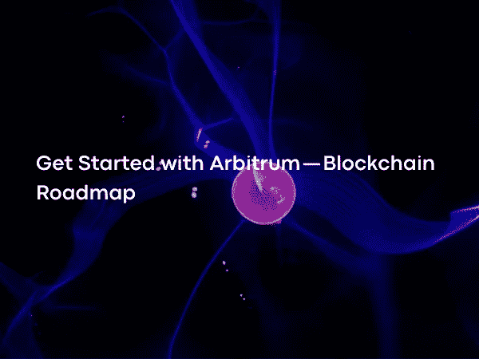

# 开始使用 Arbitrum —区块链路线图

> 原文：<https://medium.com/coinmonks/get-started-with-arbitrum-blockchain-roadmap-ef496c2e0cde?source=collection_archive---------9----------------------->

Photo by [Fractal Hassan](https://unsplash.com/@tetromino)on [Unsplash](https://unsplash.com/?utm_source=medium&utm_medium=referral)

为了最大限度地发挥区块链技术的优势并改善用户体验，开发团队提出了各种建议来扩展网络，以应对缓慢的交易和高昂的佣金费用。如果检查 Arbitrum，它使用乐观汇总方法，这是这些建议之一；

 [## 阿尔比特姆桥

### L1/L2 令牌桥

bridge . arbitum . io](https://bridge.arbitrum.io/) 

区块链伸缩问题是指网络在短时间内处理大量交易的能力有限。一个系统所能提供的最高性能受到组成它的最慢或最低效的基本组件的限制，即瓶颈。区块链的扩展能力与它如何解决阻碍扩展的瓶颈有关。

解决瓶颈问题的建议方法之一是:就是把一个或多个这样的问题从网络转移到 L2。在许多系统中，运行智能合约的成本是最大的可伸缩性瓶颈，解决执行瓶颈的推荐方法是组成网络的节点不运行智能合约。为了执行智能合同，该协议寻求 mainnet 之外的参与者的帮助，这或者促进经济或者建立各种控制机制。

 [## 第 2 层|币安学院

### 社区提交—作者:Antoni Paszke 第 2 层是指构建在顶层的二级框架或协议…

academy.binance.com](https://academy.binance.com/en/glossary/layer-2) 

L2 设计用链上激励和证据控制方法来迫使行政人员高效工作，这种方法被称为上卷。

乐观汇总中在 L2 被称为 sequencer 的 sequencer 收集和排序事务，并在以太坊网络上发布它们。由定序器发布的事务被认为直接在 mainnet 上有效，并从那里命名为乐观。所以乐观的 Rollups 在某种意义上是乐观的，他们可以在以太坊上发布交易而无需证明。

 [## L2 序列器健康标志| Chainlink 文档

### 乐观 Rollup (OR)类型协议背后的思想是将所有执行移出链外，并保留所有事务…

doc . chain . link](https://docs.chain.link/docs/l2-sequencer-flag/) 

向 mainnet 广播的事务有一定时间的等待期，以防止定序器的错误事务。在此期间，提供商可以对公布的交易和欺诈证据提出异议，使相关交易无效，并处罚公布错误交易的定序器。

 [## 防欺诈| CoinMarketCap

### 欺诈证明是一种技术方法，在一个分散的环境中起着纽带的作用

coinmarketcap.com](https://coinmarketcap.com/alexandria/glossary/fraud-proof) 

Arbitrum One 是一个 L2 解决方案，是由链外实验室开发的乐观汇总。Arbitrum 运行在以太坊上，继承了以太坊的安全性。以太坊的顶部是一个以太坊-Arbitrum 桥，它基本上是一个智能契约。这个桥梁允许人们向链发送事务消息，并观察和使用这些事务的输出。用户 L1 以太坊合同和 Arbitrum 节点与这些桥合同交互，以与 Arbitrum 链交互。

Arbitrum 的虚拟机(AVM)也与以太坊虚拟机(EVM)兼容。换句话说，为以太坊开发的智能合约也可以在 L2 运行。

2021 年，Off-chain Labs 已经从主要投资者那里筹集了 1.2 亿美元以上，用于利用 Arbitrum 等产品开发扩展解决方案。

 [## Arbitrum 开发人员快速入门离线实验室开发中心

### Arbitrum 是一套以太坊扩展解决方案，支持高吞吐量、低成本的智能合约，同时…

developer.offchainlabs.com](https://developer.offchainlabs.com/docs/developer_quickstart) 

尽管目前还没有任何令牌可以在 Arbitrum 网络上作为奖励，但基于 Arbitrum 生态系统构建的高质量和高使用率的 dApps 数量是巨大的。

 [## 达普拉达

### Arbitrum 是一套以太坊扩展解决方案，支持高吞吐量、低成本的智能合约，同时…

dappradar.com](https://dappradar.com/ethereum/other/arbitrum?source=dappradar-dashboard&medium=portfolio&campaign=clickout) 

在拥有最多 TVL(锁定总值)的前 10 个应用中，有 8 个交换、2 个桥接、2 个租借和 1 个 stablecoin 协议同时提供不同的服务。这些应用中有 DeFi 最重要的项目。股票和桥牌应用积累了最多的 TVL，SushiSwap 似乎是 TVL 最高的应用，达到 6.4 亿美元以上。

 [## 锁定的总价值(TVL) | CoinMarketCap

### т总锁定值表示当前在特定协议中锁定的资产数量。如果你有…

coinmarketcap.com](https://coinmarketcap.com/alexandria/glossary/total-value-locked-tvl)  [## 寿司

### 寿司

Sushiwww.sushi.com](https://www.sushi.com/)  [## SushiSwap

### 此时您不能执行该操作。您已使用另一个标签页或窗口登录。您已在另一个选项卡中注销，或者…

github.com](https://github.com/sushiswap) 

随着星门协议开始在阿尔比特鲁姆生效，TVL 的数量增加了。

 [## 星际之门

### Stargate 是一个完全可组合的流动性传输协议，它位于 Omnichain DeFi 和 Stargate 的中心…

stargate.finance](https://stargate.finance/) 

虽然 2022 年 Arbitrum 的最低日交易数为 18K+，但就最高交易数而言，似乎已达到 138K+。2022 年初以来的平均交易笔数为 60K，是年初 30K 交易笔数的两倍。

TVL 最多的桥是以太坊-雪崩桥，而以太坊-阿尔比特鲁姆桥排在第三位。此外，当我们将 Arbitrum 与乐观主义(即乐观主义汇总)进行比较时，可以看到 Arbitrum 的 TVL 是乐观主义的 5 倍。

 [## 乐观

### 乐观是一个第 2 层乐观汇总网络，旨在利用以太坊强大的安全保证，同时…

www .乐观主义](https://www.optimism.io/) 

Arbitrum 有安全桥，但是用户体验不好。Arbitrum Bridge 支持转移的资产类型有限。目前，支持 ETH 和 ERC20 格式的资产，但不支持其他 L1 链(如 BSC 和 Avalanche)上的资产转移。此外，资产进入 Arbitrum 很容易，但退出很难，如果用户希望将资产从 Arbitrum mainnet 提取到以太坊，需要等待一段时间。

拥有 Arbitrum 的 EVM 兼容性和可靠性支持，意味着任何为 EVM 设计的桥接应用程序也可以在 Arbitrum 之上运行，这不仅解决了从 L1 到 L2 的资产转移和效率问题，也为桥接任何链铺平了道路。

用户更喜欢使用这些桥应用程序，因为它们更快。Arbitrum 似乎在这些桥梁上做得很好，无论是在 TVL 还是在数量上。协议上的分散交易的流动性将给出关于该协议上的 DeFi 生态系统的想法，因为交易对 DeFi 是重要的。因此，Arbitrum，乐观汇总，可以得出结论，作为最主要的以太坊 L2 网络方面的 TVL 和发展活动的今天。

AnyTrust 是 OffChain Labs 开发的另一项技术，它是作为一种替代解决方案开发的，因为乐观汇总中的令牌撤销过程很长。适用于去中心化不重要，但要求交易费用低的领域，比如博彩业。

AnyTrust 由一个由节点组成的委员会运作，并对有多少委员会成员是诚实的有一个最小的假设。委员会还致力于持续提供和使用数据。假设有 20 个委员会成员，其中至少有两个是诚实的。如果 20 个委员会成员中有 19 个签名表示数据可用，则可以理解至少有一个诚实的成员已经签名表示数据可用，并且数据被认为是正确的。但是，如果委员会的全部或部分成员不表示数据可用，该怎么办？在这种情况下，AnyTrust 像 Rollup 一样工作，直到委员会再次诚实为止，使用回退到 Rollup 特性。对于虚构的 AnyTrust 链，标准 BFT(拜占庭容错)链中 20 个成员中 14 个成员需要诚实的要求已经减少到 20 个成员中 2 个。

 [## 基于链的 PBFT 和基于 BFT 的股权证明

### 区块链共识百科信息图

tokens-economy.gitbook.io](https://tokens-economy.gitbook.io/consensus/chain-based-pbft-and-bft-based-proof-of-stake)  [## 引入 AnyTrust 链:更便宜、更快速的 L2 链，具有最小的信任假设

### TL；dr:今天我们宣布 AnyTrust chains，这是一种超低价交易的仲裁模式，具有很强的安全性…

medium.com](/offchainlabs/introducing-anytrust-chains-cheaper-faster-l2-chains-with-minimal-trust-assumptions-31def59eb8d7) 

离线实验室团队宣布，它将推出 Arbitrum Nitro，这是 Arbitrum One 的下一个阶段，用一个 WASM 取代定制设计的 AVM (Arbitrum 虚拟机)，该将负责防欺诈。

 [## web 程序集

### WebAssembly(缩写为 Wasm)是基于堆栈的虚拟机的二进制指令格式。Wasm 被设计为…

webassembly.org](https://webassembly.org/)  [## 硝化甘油:预览版

### TL；博士:今天我们将推出 Arbitrum Nitro，它是 Arbitrum 的下一代产品，我们已经为此工作了几个月…

medium.com](/offchainlabs/arbitrum-nitro-sneak-preview-44550d9054f5) 

Arbitrum Nitro 成为一种解决方案，可降低与 L1 的通信数据成本，并降低在 L2 的执行成本。因为它是建立在像 WASM 和 Geth 这样的标准技术之上的，更多的 EVM 将是兼容的，并且运行得更有效率。据说这也大大降低了气体供给效率成本。

 [## 下载|去以太坊

### 如果你正在寻找一个特定的版本，操作系统或架构，下面你会发现:所有稳定和发展…

geth.ethereum.org](https://geth.ethereum.org/downloads/) 

Rollup 是一项新技术，所以它不时会出现问题。Arbitrum One 在 2021 年 9 月 14 日无法满足高需求，并经历了大约 45 分钟由 bug 引起的停机。同样，乐观主义在 2021 年 11 月 9 日遭遇了临时停电，无法运行超过一个小时。

尽管 Arbitrum 有如此显著的增长，但应该注意的是，该协议是集中式的，存在用户应该意识到的风险，并且这些风险中的许多来自当前网络的集中式。
随着 rollup 技术中 zk-rollup 等替代品的到来，出现了竞争越来越激烈的环境。得益于对以太坊网络的信任和 Arbitrum L2 网络的轻松部署，价值数十亿的 tvl 已经实现。尤其重要的是，它有一个蓬勃发展的生态系统和价值数十亿美元的 TVL，而没有任何象征性的激励，Arbitrum 取得这一成功的原因之一是团队相信它将解决当前的问题。

 [## 零知识总结| ethereum.org

### 零知识汇总简介

ethereum.org](https://ethereum.org/en/developers/docs/scaling/zk-rollups/) 

最后，有一个重要的信念，即 L2 协议将在未来发布令牌以促进网络安全，因此通过 Hop 或 Stargate 等桥进入 Arbitrum 网络将增加潜在空投好处的可能性。

下一篇文章再见…

> 加入 Coinmonks [电报频道](https://t.me/coincodecap)和 [Youtube 频道](https://www.youtube.com/c/coinmonks/videos)了解加密交易和投资

# 另外，阅读

*   [最佳期货交易信号](https://coincodecap.com/futures-trading-signals) | [流动性交易回顾](https://coincodecap.com/liquid-exchange-review)
*   【Huobi 的加密交易信号 | [Swapzone 审查](/coinmonks/swapzone-review-crypto-exchange-data-aggregator-e0ad78e55ed7)
*   最佳[密码交易机器人](https://coincodecap.com/best-crypto-trading-bots) | [购买索拉纳](https://coincodecap.com/buy-solana) | [矩阵导出审查](https://coincodecap.com/matrixport-review)
*   [Coldcard 评论](https://coincodecap.com/coldcard-review) | [BOXtradEX 评论](https://coincodecap.com/boxtradex-review)|[uni swap 指南](https://coincodecap.com/uniswap)
*   [比特币基地评论](/coinmonks/coinbase-review-6ef4e0f56064) | [德里比特评论](/coinmonks/deribit-review-options-fees-apis-and-testnet-2ca16c4bbdb2) | [FTX 评论](/coinmonks/ftx-crypto-exchange-review-53664ac1198f)