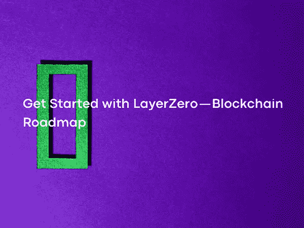

# LayerZero 入门——区块链路线图

> 原文：<https://medium.com/coinmonks/get-started-with-layerzero-blockchain-roadmap-9f8f3ec88e27?source=collection_archive---------6----------------------->

Photo by [Miguel Á. Padriñán](https://www.pexels.com/@padrinan/) on [Pexels](https://www.pexels.com/)

到 2022 年，可以说除了众筹之外，区块链和加密货币已经实现了真正的产品市场契合。从以太坊开始的 DeFi 趋势在 2021 年开始以多链结构发展，随着不同 L1 项目生态系统的发展，以及以太坊之外的其他层面出现新的 DeFi 项目。除了 Uniswap、MakerDAO 和 Compound 等只在以太坊上进行的项目之外，像 Sushiswap 有 11 种不同的 L1 和 L2 协议，Curve 有 9 种不同的 L1 和 L2 协议等多链结构的项目已经开始出现。

 [## 主页| Uniswap 协议

### 交换，赚取，并建立在领先的分散加密交易协议。在最大的……

uniswap.org](https://uniswap.org/)  [## 一个公正的全球金融体系

### 马克道创造了世界上第一种无偏货币——代币，也是领先的分散稳定货币。

makerdao.com](https://makerdao.com/en/)  [## 复合的

### 复合是一个算法，自主利率协议，为开发人员建立，以解锁宇宙的开放…

复合.金融](https://compound.finance/)  [## 寿司

### 寿司

Sushiwww.sushi.com](https://www.sushi.com/)  [## 曲线. fi

### Curve 是以太坊上的一个交易所流动性池，旨在:极其高效稳定的货币交易，低风险…

曲线. fi](https://curve.fi/) 

随着多链项目的出现，L1 项目开始实施激励计划。每个协议都推出了数亿美元的流动性计划来吸引用户。因此，真正的猿类从一个链条到另一个链条，从一层到另一层，试图从每个激励计划中获得最大利润。类人猿不得不用桥来穿越这些地方，而且大多数桥都在中央。分散式网桥的使用范围非常有限。在 2022 年的桥梁黑客攻击中，虫洞、Ronin 和量子位金融等三个不同的桥梁损失了数亿美元。

 [## 虫孔

### 区块链的精华。将信息和价值移动到任何地方。

wormholenetwork.com](https://wormholenetwork.com/)  [## 维护正在进行

### 维护正在进行

维护 Underwaybridge.roninchain.com](https://bridge.roninchain.com/)  [## 桥

### 编辑描述

docs.qbt.fi](https://docs.qbt.fi/protocol/bridge) 

除了解决这一中心桥梁问题，LayerZero 还可以在多链世界中的互换、借贷、国家共享和治理问题上提供基础设施。可以将 LayerZero 的当前位置与互联网早期的 TCP/IP 层进行比较。阿帕网的建立和 TCP/IP 的适应是互联网接入全球的开端。

 [## 什么是 TCP/IP？大商业

### 了解 BigCommerce 如何利用企业电子商务的所有功能来推动您的业务，而无需成本或…

www.bigcommerce.com](https://www.bigcommerce.com/ecommerce-answers/what-is-tcp-ip/#:~:text=How%20it%20works,into%20the%20message%27s%20original%20form) 

区块链桥的工作原理类似于物理桥。区块链桥连接两个不同的生态系统，就像物理桥连接两个不同的域一样。桥允许在 L1 协议或 L2 协议之间传输信息和加密货币，从而实现多链世界。

网桥基本上提供以下四种通信:

它们可以提供加密货币和信息的跨链转换。

他们可以为 DeFi 项目提供支持，以利用各种区块链的功能。

他们可以让用户接触到新的项目，并享受多个链的好处。

他们可以支持不同区块链生态系统中的开发者开发新项目。

有些人把网桥分为不可信网桥和可信网桥，而有些人把网桥分为链外网桥和链上网桥。互操作性三难研究协议中只允许以下三个特征中的两个。

 [## 互操作性三难困境

### 又名为什么桥接以太坊域如此困难

blog.connext.network](https://blog.connext.network/the-interoperability-trilemma-657c2cf69f17) 

不信任:不必信任第三方的能力。

可扩展性:能够在任何层工作。

可归纳性:处理任何跨领域数据的能力。

没有简单的方法可以同时提供这三个属性。像 Scalability Trilemma 这样的桥接提供者也在尝试用其中的两个特性进行交易。还应该注意的是，当你使用不安全的集中式网桥时，L1 或 L2 有多安全就不再重要了。

 [## 你所知道的关于可伸缩性三元悖论的一切可能都是错误的

### 这篇文章从定量和定性两个方面深入探讨了三元悖论的优点。

medium.com](/logos-network/everything-you-know-about-the-scalability-trilemma-is-probably-wrong-bc4f4b7a7ef) 

首先，本地验证的协议是这样的协议，其中所有链拥有验证器来完全验证链之间传递的数据。通常，这是通过在另一个链的虚拟机中运行一个链的 light 节点来完成的，反之亦然。这方面的例子是宇宙 IBC，彩虹附近和一些 L2 土著桥梁。虽然这是实现互操作性和将消息完全传输到另一个链的最佳方法之一，但它需要对每个新链进行完全的调整。

 [## IBC 概览| Cosmos SDK

### 了解什么是 IBC，它的组件和使用案例。区块链间通信协议(IBC)允许区块链…

doc . cosmos . network](https://docs.cosmos.network/master/ibc/overview.html)  [## ↔理工大学彩虹桥附近

### DeFi 和 NFTs 的创新增加了以太坊网络的需求，并使费用飙升。附近的 ETH

near.org](https://near.org/bridge/) 

外部验证协议是使用一组外部验证器在链之间传输数据的协议。例子包括 Thorchain、Anyswap 和 Celer Network。虽然它可以很容易地安装在基于本地验证协议的另一层，但用户和流动性提供商被迫依赖第三方应用程序。

 [## THORChain.org |分散自治的跨链流动性网络

### 如果超过 80%的流通符文被锁定在 THORChain 流动性池，根据经济设计符文的市值应该…

thorchain.org](https://thorchain.org/)  [## AnySwap —跨链协议

### 编辑描述

任意交换](https://anyswap.exchange/#/router)  [## Celer 网络

### 每一个 dApp、每一项资产、每一个用户 Celer 都是一个区块链互操作性协议，支持用户一键操作…

www.celer.network](https://www.celer.network/) 

本地验证协议是这样的协议，其中各方仅通过某一层上的验证者的交互来验证彼此的事务。本地验证协议将复杂的多方验证问题转化为一组更简单的双边交互，其中每一方只验证其对方。例子是连接和跳跃协议桥。原生验证协议的最大问题是不能在链之间传输通用数据，该协议被设计成容易扩展到任何期望的链，而不依赖于任何第三方应用。

 [## 连接网络:让区块链变得可组合

### 跨越 11 个以上的链桥接令牌和数据。赢得并建立最安全的互操作性网络。

www.connext.network](https://www.connext.network/)  [## 啤酒花交换

### 通过以太坊扩展解决方案发送您的代币

hop.exchange](https://hop.exchange/) 

在这种情况下，当评估 LayerZero 互操作性 trilemma 方法时，虽然普遍接受 tri lemma 的三个原则中的两个原则占主导地位的方法，但 LayerZero 声称他们的解决方案是无信任全链互操作性协议，即无信任、可扩展和可推广的解决方案。

既然已经表达了 LayerZero 提出的解决方案，那么就需要考察它的架构。基本上，与 LayerZero 桥协议不同，它提出的系统是通过将协议与两个层一起运行而成为可能的，这两个层相互提供连续的一致性，从而创建一个可以更快地提供对许多合同或链的访问的结构。为了与 LayerZero 中心中的其他智能合约或区块链执行消息传递，并且基本上执行桥功能，中间链隔离一个区块链，间接信任相关区块链的桥解决方案，并且在桥上保持交易记录，同时提供共识。一般来说，人们在这里会遇到的问题是，中间链仍然非常集中，可以预见，它会产生信任问题，从而带来严重的流动性风险，尽管在潜在的网络中断中，很少几个区块会出现问题。

为了验证链上的事务块，需要两条信息，即块的标题和所执行事务的证明。两层超轻节点用来控制这里需要的两条信息。第一种是使用 oracle 解决方案(如 Chainlink、Band、python，他们称之为 Oracle 层)验证与块头相关的数据，即通过向智能合约或虚拟机提供外部信息，以及通过将它们与外界连接的协议。另一层，中继层，提供所采取的行动的证据的传输。在 Omnichain 协议中，LayerZero 声称两个层一起工作可以提供许多解决方案，如气体缩放和安全可能性。

 [## Relayer 网络|什么是 0x Relayer？

### 为什么这很重要为什么这很重要 1。它是 dApp 不可知的，像 0x 这样的开放交易协议意味着任何人…

继电器.网络](https://relayer.network/)  [## 面向混合智能合约的区块链 Oracle | chain link

### Chainlink 是应用最广泛的 oracle 网络，用于支持混合智能合约，使任何区块链能够…

链节](https://chain.link/)  [## 波段协议—跨链数据 Oracle

### Band 协议是一个跨链数据 oracle 平台，它将真实世界的数据和 API 聚合并连接到智能…

bandprotocol.com](https://bandprotocol.com/)  [## 主页

### 了解数据背后的发布者今天就开始使用 Pyth 数据，让您的智能合同更加准确。获得…

python . network](https://pyth.network/) 

根据 LayerZero sharing 的说法，LayerZero 这个名称是首选的，因为它是一个在 L1(即区块链，如比特币、以太坊、雪崩和 L2)之间提供每个智能合约之间的通信的层，这些智能合约试图对它们进行扩展，并使交易在物理上更加可能。在文档中共享的网络，用于桥接两个不同区块链网络中的应用程序，并且其协定地址给定为由智能协定调用和使用以进行通信；以太坊，币安智能链，雪崩，多边形，Arbitrum，乐观，幻影。testnet 网络是 Rinkeby、币安智能链、富士、孟买、Arbitrum、乐观和 Fantom。

 [## 首页| ethereum.org

### 以太坊是数字货币、全球支付和应用的发源地。社区建立了一个…

ethereum.org](https://ethereum.org/en/)  [## BNB 智能链，币安德克斯，BNB 链

### BNB 智能链是一个快如闪电的低成本基础设施，适用于 DeFi、NFT、GameFi、元宇宙和互联网

www.bnbchain.world](https://www.bnbchain.world/en/smartChain)  [## Avalanche:速度惊人、成本低廉且环保| Dapps 平台

### 以最少的硬件投入扩展到数百万个验证器，或锁定您的 AVAX，以帮助处理交易和…

www.avax.network](https://www.avax.network/)  [## 将世界带入以太坊|多边形

### Polygon 解决了区块链常见的痛点，在不牺牲安全性的情况下提供了低油费和高速度。结束…

多边形技术](https://polygon.technology/)  [## 阿尔比特姆桥

### L1/L2 令牌桥

bridge . arbitum . io](https://bridge.arbitrum.io/)  [## 乐观

### 乐观是一个第 2 层乐观汇总网络，旨在利用以太坊强大的安全保证，同时…

www .乐观主义](https://www.optimism.io/)  [## Rinkeby:网络仪表板

### 从 go-ethereum 的 1.5 版本开始，我们已经从只提供成熟的以太坊客户端过渡到…

www.rinkeby.io](https://www.rinkeby.io/#stats) 

用户应用程序(UA)使系统能够由用户开发，可以被定义为智能合同，它将使 LayerZero 的使用和开发成为可能。用户应用程序与 LayerZero 端点连接，layer zero 端点由一系列智能合同组成，与一个轻型客户端程序通信，该程序将提供对区块链系统的访问，从而创建允许跨链交易的合同系统。Endpoint，LayerZero 是它自己提供的一个节点解决方案，它的结构决定了用户想要开发的桥接解决方案中使用的链的限制。总之，在哪些网络之间可以使用 LayerZero 以及在这方面预测其潜力的因素，至少对于 LayerZero 已经建立在当前期望的区块链上的端点是可能的。但是，随着端点安装过程引入其他用户的参与，LayerZero 解决方案将迁移到许多新的区块链网络。

桥提供了一个中继器，每个人都可以参与验证所执行的事务，而控制 Oracle 层的用户应用程序可以被认为是更安全的，因为它可以验证两层都需要什么，以及来自源链的事务确认的数量，而不会出错。UA 在目标系统操作中的角色还可以是决策者，决定中继层和 Oracle 层提供何种级别的共识，以及是否提供块批准。在这种情况下，Relayer 层(声称每个人都可以参与)和 Oracle 层(保留了验证的某个部分)的准确组合，在通过提供两层的一致意见采取行动时是必需的。考虑到提供的流动性将随着时间的推移而增加，LayerZero 提出的超轻节点及其周围开发的技术将更受欢迎，因为流动性提供者对安全性的偏好完全是由第三方服务或围绕可被视为中心的中间链形成的。

桥通常旨在创建允许传输加密资产的结构。然而，LayerZero 本质上是作为两个不同链之间的消息协议出现的。在 LayerZero 中，通过提供两个独立元素的一致性来尝试验证事务的有效性，layer zero 为异步发生的事务提供了两层验证，这些事务将由 Oracle 和 Relayer bases 进行验证，并通过相关区块链网络和智能合同之间的各种消息进行澄清。

在应用程序的使用中，当人们被包含在某个协议中时需要考虑的一个因素是，无信任是对信任的理解的独立性。LayerZero 的目标是让用户不依赖任何组件就能进步。事实上，大多数旨在变得日益复杂的轻型客户端由 LayerZero 控制，这是在分散化方面应该考虑的因素之一。此外，另一个重要的问题是 Relayer 层是如何去中心化的，即使它是每个人都可以参与的。综上所述，虽然很难说中继方存在不可信方，但可以使其不可信。

在无信任上要评估的重要问题是，第三方应用程序(如 Chainlink 或 Band)的客户端节点服务不能在 Oracle 上分散分布，Oracle 在验证所执行的事务时控制块头。此外，分散的中继层不会使它们变得不可信。在服务提供商可能的恶意攻击中，用于确认要传输的交易或消息的机制将停止工作，或者通过操纵它导致不可信的损害，这是链间桥的安全的严重问题。

LayerZero 将使 LayerZero 能够用于创建新的解决方案，以便它可以集成到许多具有智能合同设计的系统中，这可以被认为是复杂的。它提供了一个可以用 LayerZero 开发的潜在分析，下面的项目是在检查它们自己的文档时开发的。

跨链分散交换:通过 LayerZero 开发可能性，它可以将许多区块链聚集在一起，并使各种加密资产转移能够发生。它可以更灵活地使用区块链的本地令牌，并支持在 L2 解决方案(如侧链)中使用本地令牌。

多链收入优化(收益聚合器):流动性挖掘策略，该策略受各种奖励机制的约束，以换取 DeFi 中提供的流动性结果，导致复杂的交易，目的是增加投资、不同链之间的持续跟进和总流动性的划分。LayerZero 表示，将创建一个平台，在这个平台上可以更容易地选择提供最高回报的策略，并为连锁店之间的交易提供便利。

多链借贷协议:LayerZero 可以通过将锁定在一个区块链网络中的令牌的奖励桥接到另一个网络，建立交叉链，并在两个不同的解决方案之间保持人们的权利，来防止为将在其间发生的交易支付汽油费。LayerZero 声称，可以创造的潜在流动性可以很容易地在链之间转移。

当互操作性 Trilemma 返回时，在检查技术细节时可以相对清楚地理解的主题是，它不是 LayerZero 团队建议的提供互操作性的协议。即使有一个跨链协议可以通过引入新的公式更容易地集成，无信任原则也是由 LayerZero 互操作性三元悖论决定的。

如果所有的加密资产都在单个链上，LayerZero 就不会存在。但很明显，未来是在一个多链宇宙中。因此，特别是因为桥接基础设施还不能覆盖互操作性三难困境的所有特征，LayerZero 似乎通过在 EVM 兼容链之间提供桥接服务，在短期内用 Stargate 解决了一个非常大的问题。

 [## 星际之门

### Stargate 是一个完全可组合的流动性传输协议，它位于 Omnichain DeFi 和 Stargate 的中心…

stargate.finance](https://stargate.finance/) 

在刚刚公布的 A 轮；除了红杉资本(Sequoia Capital)、a16z、比特币基地风险投资公司等加密和资本领域最重要的投资者之外，Tetranode、Santiago Santos 和 Justin Sun 等加密领域的知名人士也在投资者之列。此外，红杉资本已经对苹果、AirBnB、Stripe 和许多其他独角兽公司进行了早期投资。在加密方面有很强联系的名字和机构的存在，如 Tetranode 和 Santiago，以及 a16z 和比特币基地风险投资，显示了该项目的潜力。

 [## 首页—红杉

### 我们帮助有胆识的人建立传奇公司，从创意到首次公开募股等等。

www.sequoiacap.com](https://www.sequoiacap.com/)  [## 安德森·霍洛维茨|软件正在吞噬世界

### 在第三届最大消费市场初创企业年度名单上，看看谁在崛起，趋势在塑造未来…

a16z.com](https://a16z.com/)  [## 比特币基地风险投资组合| CoinMarketCap

### Coinbase Ventures 投资组合 kri PTO portf yünücoin market cap i̇zleme listesi zelliini kullanarak olu turdu。奈勒里…

coinmarketcap.com](https://coinmarketcap.com/tr/watchlist/6008078ffa492c6d451ee863/) 

如果考察 Cosmos 的区块链间通信协议 Inter-block chain Communication(IBC)；Cosmos 包括一个建立在 Tendermint BFT 上的 IBC 协议，以促进 Cosmos Hub 嵌入式链之间的消息传递。根据 Cosmos LayerZero 的说法，主要有两个不同之处；
IBC 运行一个完整的链上光节点。

IBC 只能在具有快速终结性的链之间进行通信。
IBC 的这些限制，加上使用中间链来促进共识，使其类似于来自 LayerZero 等通用通信层的 Anyswap、THORChain 或 Polkadot。与宇宙和 IBC 不同，LayerZero 提供可靠的全链消息传递，可以扩展到任何链上运行，包括以太坊和比特币等概率终结性网络。

同时，桥接三难困境据说是通过星际之门解决的，这是 LayerZero 上的第一个项目。据称，星际之门即时担保终结，单一流动性池和本地资产持有的特点都在同一时间。当 Stargate 首次呈现给用户时，它可以被定义为一座桥梁，它以 8.5 亿+美元的锁定加密资产开始其生命，并立即拥有超过 40 亿+美元的资产。

为什么这么多的资产在短时间内来到星际之门的最大原因是以太坊，仲裁，乐观主义，雪崩等等。原因是它为最常用的 EVM 兼容链提供服务。虽然绝大多数网桥，特别是 Hop 协议，要求你在层的两侧放置相同数量的加密货币，但 Stargate 提供了通过仅添加单边流动性来赚取回报的机会，这是非常重要的优势。

LayerZero 将是一个在互联网早期提供 TCP/IP 层的生态系统，目前只有一个桥作为活跃的产品，未来将有更多的项目在其上进行。考虑到未来是一个多链条的世界，LayerZero 将带来的去中心化的交易所、去中心化的借贷和借贷项目以及治理机制将占据非常重要的位置。

同时，可以说，LayerZero 之后的一些层和链可以很容易地添加到 LayerZero 基础设施中，因此 LayerZero 可以在快速发展的生态系统中通过其自己的开放适应基础设施非常快速地实现。

LayerZero，此刻刚刚从星际之门桥开始，以及它的分散交换和分散贷款项目，很明显，它将创造一个非常令人兴奋的未来。但是，控制块头的 oracles 和第三方应用程序的客户端节点服务在验证由不可信方执行的事务时没有分散，这也是一个重要问题，LayerZero 到目前为止在理论上已经解决了这个问题。此外，考虑到中继层也没有被分散，不可信会引起怀疑。

下一篇文章再见…

> 加入 Coinmonks [电报频道](https://t.me/coincodecap)和 [Youtube 频道](https://www.youtube.com/c/coinmonks/videos)了解加密交易和投资

# 另外，阅读

*   [MoonXBT vs Bybit vs 币安](https://coincodecap.com/bybit-binance-moonxbt) | [硬件钱包](/coinmonks/hardware-wallets-dfa1211730c6)
*   [火币交易机器人](https://coincodecap.com/huobi-trading-bot) | [如何购买 ADA](https://coincodecap.com/buy-ada-cardano) | [Geco。一次复习](https://coincodecap.com/geco-one-review)
*   [币安 vs 比特邮票](https://coincodecap.com/binance-vs-bitstamp) | [比特熊猫 vs 比特币基地 vs Coinsbit](https://coincodecap.com/bitpanda-coinbase-coinsbit)
*   [如何购买 Ripple (XRP)](https://coincodecap.com/buy-ripple-india) | [非洲最好的加密交易所](https://coincodecap.com/crypto-exchange-africa)
*   [非洲最佳加密交易所](https://coincodecap.com/crypto-exchange-africa) | [胡交易所评论](https://coincodecap.com/hoo-exchange-review)