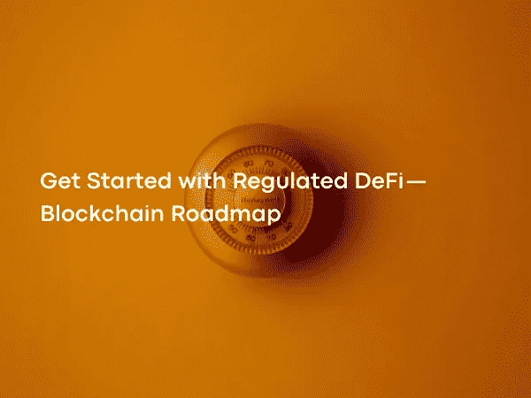

# 开始使用受监管的 DeFi —区块链路线图

> 原文：<https://medium.com/coinmonks/get-started-with-regulated-defi-blockchain-roadmap-d24ed51570fe?source=collection_archive---------24----------------------->

Photo by [Moja Msanii](https://unsplash.com/@mojamsanii) on [Unsplash](https://unsplash.com/?utm_source=medium&utm_medium=referral)

DeFi 现象最早始于以太坊网络，它在财务和去中心化管理领域引起的创新，这些产品通过的压力测试和炒作在 2020 年留下了印记。DeFi 的增长速度令人难以置信，但从广泛的角度来看，与衍生品和外汇市场相比，DeFi 的收集量并不多。

 [## DeFi nedir？

### 您必须遵守《全国人大常委会关于维护互联网安全的决定》及中华人民共和国其他有关法律法规。

www.coinbase.com](https://www.coinbase.com/tr/learn/crypto-basics/what-is-defi) 

这里要问的真正问题是，流入传统金融的价值如何才能流入区块链？发生这种情况以及企业求助于区块链科技的最大障碍是在 KYC 开展金融活动(了解您的客户)和 AML(反洗钱)时必须遵守所在地区的法规和法律。

 [## 反洗钱与 KYC

### 反洗钱(AML)法规由世界各地的国家和国际机构强制执行…

complyadvantage.com](https://complyadvantage.com/insights/kyc-aml-know-your-customer-vs-anti-money-laundering/) 

区块链业内人士大多禁用 P2P 技术的信任因素，转移交易的匿名性，其本质是自由主义金融。最困难的是满足分散化环境中的监管需求，并为监管市场之外的创新创造环境。这些事实被认为是矛盾的，但想出一个解决方案却相当简单。它将通过确保遵守分布式管理结构来消除这一障碍，并将通过将金融工程与在安全、分散的区块链上运行的智能合同相结合来开发新的分布式金融产品。

实现这一愿景的起点是一个强大、安全和分散的区块链网络。理论上，已经有区块链来提供它们了，对吗？

考虑到现有的区块链协议，它们不能提供上述过程，因为在利益证明(PoS)网络中，大的利益被聚集在某些验证者上，并且由于它们的性质，它们在授权证明(PoA)中被聚集在一个小的验证者组中。

 [## 利害关系证明| ethereum.org

### 利益相关证明共识协议的解释及其在以太坊中的作用。

ethereum.org](https://ethereum.org/en/developers/docs/consensus-mechanisms/pos/)  [## 授权证明(PoA) | CoinMarketCap

### 一种区块链共识机制，使用身份作为赌注交付相对快速的交易…

coinmarketcap.com](https://coinmarketcap.com/alexandria/glossary/proof-of-authority-poa) 

在制定参与证明(PoE)协议时，采用了参与奖励的概念来鼓励在区块链周围形成的社区。通过在系统中的股份数量和参与报酬之间建立平衡，可以确保主动且有贡献但股份很少的验证者在系统中具有与被动且具有大量股份的验证者相近的投票权和影响力。

为了保证这种激励的持续性，敬业度报酬乘数会有一个减半的时间，即过一段时间后，不活跃的验证者和行动者的敬业度报酬乘数减半，从而激励玩家为系统开发和管理做出贡献。

PoE 机制旨在通过促进符合社区利益的合作来提高项目的安全性和成功性。通过结合敬业度奖励和股份动态来实现去中心化，并使用 sigmoid 曲线的数学来分配奖励，使大股东无法购买权力。

世界上每个国家都有自己的规则。期望区块链遵守所有这些不同的法规并长期保持合规性是不现实的。将监督法规变化的责任放在区块链的中心社区是一种违背分权哲学的策略。

这个问题的答案在于自主调节管理结构。这个自动系统的轮子:

地方政府管辖范围内的机构通过在它们之间达成协议和协定而形成一个集团。该组中的参与者批准组中的其他成员，并检查他们是否拥有必要的许可证。这个控制者可以是这个团体的领导者。

在自主董事会成立后，它可以创建自己的规则，如哪个行为者可以与哪些金融工具进行交易。
与供应链管理部门和监管机构协调合作将解决供应链监管问题。

自主管理模型是可扩展的。在同一个区块链上可以创建无限的自治董事会，这些董事会可以与它们独立运营的地区的监管机构协调一致。

自主董事会将通过为真正的金融工程创造环境来创造新的机会。始于以太网的 DeFi 创新表明，传统的基于金融的工具可以很容易地适应分布式环境。

风险和定价在传统金融中已经研究了多年，有许多产品的行为是已知的，等待被采用。这些金融工具给了我们广泛传播 DeFi 创新的基础。基于信用违约互换(CDS)的思想，可以在验证者的削减概率上创建一个赌注削减互换金融产品。Staking Slashing 互换验证程序可以通过准备足够好的基础设施并将其出售给想要购买 Slashing 风险的买家来赚取溢价，而不是建立最安全和完美的基础设施。

 [## 什么是信用违约互换(CDS)？

### 信用违约互换(CDS)一词指的是一种金融衍生品，允许投资者互换或抵消他们的…

www.investopedia.com](https://www.investopedia.com/terms/c/creditdefaultswap.asp) 

这样一来，P2P 网络运营所需的大量费用可以通过消除中介来减少，也可以揭示金融机构之间可以交易的新价值。

第一步将是看到一个安全的 DeFi 为重点的区块链生产块。稍后，将使用金融工程来创建受监管机构的管理结构的构件。我们将看到这些建筑材料转化为创新的金融产品。

 [## 主页-升级|构建现代金融工具

### 答案是 Tgrade！我们建立了一个自我主权的框架，确保了权力下放的原则。机构…

tgrade .金融](https://tgrade.finance/) 

下一篇文章再见…

> 加入 Coinmonks [电报频道](https://t.me/coincodecap)和 [Youtube 频道](https://www.youtube.com/c/coinmonks/videos)了解加密交易和投资

# 另外，阅读

*   [5 款最佳加密交易终端](https://coincodecap.com/crypto-trading-terminals) | [最佳 DeFi 应用](https://coincodecap.com/best-defi-apps)
*   [最佳网上赌场](https://coincodecap.com/best-online-casinos) | [币安评论](/coinmonks/binance-review-ee10d3bf3b6e) | [BitMEX 评论](https://coincodecap.com/bitmex-review)
*   [麻雀交换评论](https://coincodecap.com/sparrow-exchange-review) | [纳什交换评论](https://coincodecap.com/nash-exchange-review)
*   [美国最佳加密交易机器人](https://coincodecap.com/crypto-trading-bots-in-the-us) | [经常性回顾](https://coincodecap.com/changelly-review)
*   [在印度利用加密套利赚取被动收入](https://coincodecap.com/crypto-arbitrage-in-india)
*   [Godex.io 审核](/coinmonks/godex-io-review-7366086519fb) | [邀请审核](/coinmonks/invity-review-70f3030c0502) | [BitForex 审核](https://coincodecap.com/bitforex-review)