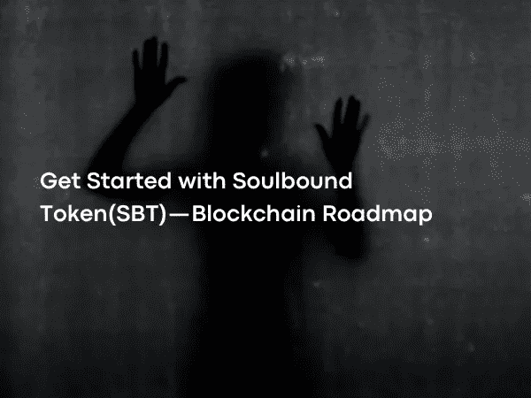

# 开始使用 Soulbound Token(SBT) —区块链路线图

> 原文：<https://medium.com/coinmonks/get-started-with-soulbound-token-sbt-blockchain-roadmap-f509780444?source=collection_archive---------6----------------------->

Photo by [Farzad Sedaghat](https://www.pexels.com/@farzad-sedaghat-1454089/) on [Pexels](https://www.pexels.com/)

以太坊的联合创始人 Vitalik Buterin 在 1 月份提出了新的宣传 Soulbound Token，最近发表了包括 Vitalik Buterin 在内的一个团队对它的研究。

 [## 维塔利克·布特林的网站

### 编辑描述

vitalik.ca](https://vitalik.ca/)  [## 灵魂束缚

### 游戏中大多数非常强大的物品都是灵魂绑定的，通常需要完成一个复杂的任务或者杀死一个…

vitalik.ca](https://vitalik.ca/general/2022/01/26/soulbound.html)  [## 去中心化的社会:寻找 Web3 的灵魂

### 张贴 37 页:2022 年 5 月 11 日撰写日期:2022 年 5 月 10 日 Web3 今天围绕表达可转移…

papers.ssrn.com](https://papers.ssrn.com/sol3/papers.cfm?abstract_id=4105763)  [## DeFi 之后，DeSoc:寻找 Web 3 的灵魂

### Web 3 以更少的成本打造了一个具有前所未有的灵活性和创造性的并行金融系统，震惊了世界

www.coindesk.co](https://www.coindesk.com/layer2/2022/05/11/after-defi-desoc-finding-web-3s-soul/) 

灵魂绑定令牌(SBT)是新一代令牌标准，用于表示其不可转让、不可转让或本质上与个人绑定。

硬币这个词经常与代币混淆，实际上它是任何区块链的原生硬币。作为市值，比特币区块链的硬币 BTC 和以太坊区块链的硬币被列为 ETH。另一方面，令牌是代码块，代表基于区块链构建的应用程序发布的任何数字资产。

由于货币的基本属性是可交换的，可替换代币脱颖而出。几乎所有在区块链世界交易的代币都属于这一类。只要是原装的，买哪个代币卖哪个都没关系，因为每个都是一样的。

 [## 可替换令牌和不可替换令牌:区别是什么？

### 加密货币和实物货币都是

cointelegraph.com](https://cointelegraph.com/nonfungible-tokens-for-beginners/fungible-vs-nonfungible-tokens-what-is-the-difference) 

另一方面，不可替换令牌是一种标准，它允许以不同的方式生成每个令牌。这是一个用来区分数字世界中各种资产的系统，就像物理世界一样。

 [## 人们在非食物疗法上花费了数百万。什么？为什么？

### NFT，或不可替代的令牌，已经存在一段时间了，但是“NFT”是什么意思呢？几个…

www.theverge.com](https://www.theverge.com/22310188/nft-explainer-what-is-blockchain-crypto-art-faq) 

虽然代币受欢迎有很多原因，但对用户来说最重要的好处之一是它们可以快速交换。在电子钱包中持有代币的人可以在任何时候将代币转移给世界上的另一个人，或者在金融交易中使用代币，而不管是白天还是晚上，工作日还是结束。这样，一种比古典资产流动性大得多、周转率高得多的工具进入了我们的生活。

但是如果在某些情况下不需要更改令牌呢？灵魂绑定令牌(SBT)是一个新的标准，人们不能将他们的令牌转让给其他人。但是我们为什么需要这样一个特性呢？

在可替换和不可替换代币标准中，代币可以在匿名人之间进行货币交换的事实为代币提供了显著的附加值。

DeFi 的经济价值是通过人和他们的关系创造的。由于当前形式的 Web3 的匿名性，不存在可以导致这种关系的社会身份过程。这种情况既导致 Web3 需要 Web2 世界的中央权威，又阻止 DeFi 领域的应用支持实体经济的活动。

灵魂绑定令牌，不可分割的令牌，创建了一个新的系统，允许人们建立信任的社会关系，同时保护他们的隐私。这个系统可以被认为是一个由代币组成的简历，人们将把代币放在钱包里，不能转让给其他任何人。这些代币将是这个人过去积累的、买不到的社会资本的证明，而不会暴露他的真实身份。

这些标志可以包括许多不同的领域，这些领域将证明所建立的社会关系，从过去上过的学校、接受的培训、获得的能力、参加任何活动、参加任何组织。机构给你的不暴露身份的证明文件也包括在这个过程中。

事实上，虽然这个过程与数字身份相似，但还是有一些基本的区别。数字身份是由中央权威机构给予并基于现实世界身份创建的过程。然而，在 Soulbound 令牌中，个人不必拥有单一身份。用于存储这些代币的电子钱包名为 Soul，可以根据需要保存多次。这里最重要的是证明这个人的能力。此外，发行这些代币的机构将有权在以后烧掉这些代币。

数字世界的要求可能如此不同，以至于无法用数字身份来解决。灵魂绑定令牌的使用不仅限于人们证明自己的能力，这些令牌将有助于解决新成立的数字组织面临的许多问题，从正确评估其成员的贡献，到如何管理社区。

灵魂绑定代币在 DeFi 领域有着巨大的经济潜力。在 DeFi 领域，贷款平台通过高抵押率来规避风险。如果希望从 MakerDAO 协议中借 100 美元，则需要投入 150 美元抵押品作为回报。然而，在传统金融中，金融机构不会要求贷款人提供如此高水平的抵押品。其中的主要原因是，金融机构可以获得多年来保存的有关其客户业务、资产或信用记录的信息。

类似地，在 Web3 中，可以查看通过钱包进行的交易，可以从钱包的所有者过去的交易中提取类似的信用摘要。然而，钱包中的资产相互独立，可以很容易地转移出去，这一事实让人怀疑这些钱包有多可靠。

装有该人完成的学校、他获得的证书、他工作过的机构以及从他以前获得和偿还的贷款中获得的不可转让代币的钱包可以被接受为抵押品，即使它们没有足够的有形资产，因为它们揭示了借款人的社会声誉。贷方为他们提供的金额而放入钱包的不可转让代币可以在贷款偿还时烧掉，并替换为表明债务已偿还的代币，从而提高钱包的声誉，或者在未偿还时作为黑名单，破坏钱包的整个信誉。

 [## 一个公正的全球金融体系

### 马克道创造了世界上第一种无偏货币——代币，也是领先的分散稳定货币。

daomakerr.xyz](https://daomakerr.xyz/) 

灵魂绑定令牌仍然是理论上的。这将需要很长时间的发展和系统有问题要解决。实际上，如果钱包的钥匙丢了会发生什么？个人隐私会得到充分保护吗？你能信任那些创造代币，把代币给人们，然后想烧就烧的机构吗？虽然已经为所有这些问题提供了理论解决方案，但是不难预见，在希望将其应用于现实生活的时候，将会有许多变化和创新。

灵魂绑定令牌可能是继可替代令牌和 NFT(不可替代令牌)之后的一种重要令牌类型。已经可以看出，它将有广泛的使用领域。它可以帮助解决使用 DeFi 的最大障碍之一。它们对于数字世界中的新兴社区，即 Dao，也有着至关重要的作用。

 [## 可验证凭证数据模型 1.1 版

### 凭证是我们日常生活的一部分；驾照是用来证明我们有能力驾驶一辆…

www.w3.org](https://www.w3.org/TR/vc-data-model/#what-is-a-verifiable-credential) 

在实践中，特别是如果它能在隐私和功能之间创造微妙的平衡，它就能在未来成名。

下一篇文章再见…

> 加入 Coinmonks [电报频道](https://t.me/coincodecap)和 [Youtube 频道](https://www.youtube.com/c/coinmonks/videos)了解加密交易和投资

# 另外，阅读

*   [有哪些交易信号？](https://coincodecap.com/trading-signal) | [Bitstamp vs 比特币基地](https://coincodecap.com/bitstamp-coinbase) | [买索拉纳](https://coincodecap.com/buy-solana)
*   [如何给 MetaMask 钱包添加 Arbitrum？](https://coincodecap.com/how-to-add-arbitrum-to-metamask-wallet)
*   [KuCoin vs 北海巨妖 vs BitYard](https://coincodecap.com/kucoin-vs-kraken-vs-bityard)
*   [加密交易的最佳 VPN](https://coincodecap.com/best-vpns-for-crypto-trading)
*   [ProfitFarmers 回顾](https://coincodecap.com/profitfarmers-review) | [如何使用 Cornix Trading Bot](https://coincodecap.com/cornix-trading-bot)
*   [西班牙 5 大最佳文案交易平台](https://coincodecap.com/copy-trading-spain)