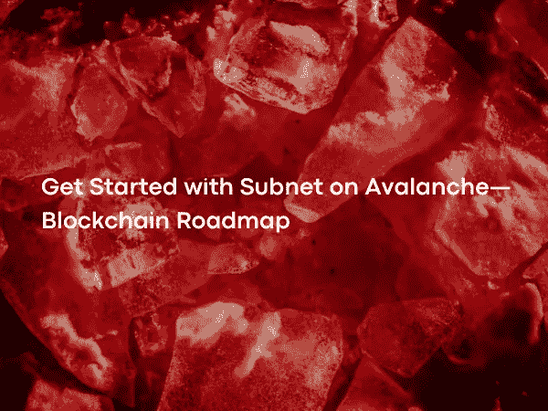

# 从 Avalanche 上的子网开始—区块链路线图

> 原文：<https://medium.com/coinmonks/get-started-with-subnet-on-avalanche-blockchain-roadmap-86b772d680e1?source=collection_archive---------6----------------------->

雪崩白皮书在发布后引起了广泛讨论。Avalanche 拥有一个雄心勃勃的开发团队，致力于寻找区块链问题的解决方案，并提出一种新的共识算法。

Photo by [Ivan Babydov](https://www.pexels.com/@babydov/) on [Pexels](https://www.pexels.com/)

 [## 子网常见问题

### 子网是一组动态的验证器，它们一起工作，对一组…

support . avax . net](https://support.avax.network/en/articles/6158840-subnet-faq)  [## 白皮书

### 编辑描述

www.avalabs.org](https://www.avalabs.org/whitepapers)  [## 雪崩区块链共识|雪崩文档

### 共识的任务是让一组计算机就一项决策达成一致。电脑可以到达一个…

docs.avax.network](https://docs.avax.network/overview/getting-started/avalanche-consensus/)  [## 创建子网|雪崩文档

### 请使用 subnet-cli 快速创建子网。欢迎您阅读本文档，了解如何…

docs.avax.network](https://docs.avax.network/subnets/create-a-subnet/) 

建立一个全球信任机器伴随着它的挑战。最重要的是，当您想要创建一个智能合同平台时，带宽、处理能力和存储需要增加，事情变得更加困难。Avalanche dev 团队提出了子网解决方案来应对 mainnet 上的这些挑战。Avalanche mainnet 由主网络下的三个主要区块链组成，所有验证者都必须参与其中；
X-Chain(交换链)能够生成和转移各种数字资产。

C-Chain(契约链)是一个运行 EVM(以太坊虚拟机)的智能契约网络。

P 链(平台链)是协调验证器、跟踪活动子网和创建新子网的网络。

 [## 在 X 链和 C 链之间转移 Chain | Avalanche Docs

### AVAX 令牌存在于 X 链上，在 X 链上可以进行交易，在 P 链上，当…

docs.avax.network](https://docs.avax.network/quickstart/transfer-avax-between-x-chain-and-c-chain/)  [## 什么是平台链(P 链)？

### 平台链是 Avalanche 上的元数据区块链和坐标验证器，跟踪活动子网…

support . avax . net](https://support.avax.network/en/articles/4058243-what-is-the-platform-chain-p-chain) 

根据区块链的术语，虚拟机是设计用于在分布式系统中运行的软件，它在指令集和机器之间创建了一个层。在 EVM 中确定了操作码。这些包括简单的算术运算以及更复杂的椭圆曲线加密代码。这些操作码在智能合约上传到区块链之前进行编译。EVM 告诉机器根据这些操作码做什么操作。

Avalanche 为用户提供了创建自己的虚拟机和轻松创建区块链的机会，这为 Avalanche 提供了模块化结构。Avalanche 将支持目前运行在 X-Chain 上的 AVM 和 EVM 作为默认虚拟机。有 AvaLabs 或者社区开发的虚拟机。AvaLabs 开发的示例虚拟机；

 [## 什么是雪崩虚拟机(AVM)？

### 雪崩虚拟机是雪崩网络的内置虚拟机之一。它定义了一个应用程序…

support . avax . net](https://support.avax.network/en/articles/4587304-what-is-the-avalanche-virtual-machine-avm) 

空间虚拟机:它是一个分层的键值存储。每个钱包可以有多个用户名。为每个用户名定义了一个特殊的空格。在这些空间中，只要大小不太大，数据可以保持公开，并在需要时删除。

 [## 在雪崩区块链号上占据您的空间

### 空间是您的数字家庭。存储和共享链接、图像和文件的地方。与其住在私人…

幽会空间. xyz](https://tryspaces.xyz/) 

BlobVM:它是一个面向内容的可寻址键值存储。它的工作方式类似于 SpacesVM，但是用户不能删除上传的数据。它可以用于 NFT 元数据。

子网虚拟机:这是一个为子网定制的 EVM 分叉。使用 SubnetEVM，可以设置佣金和煤气费用。它可以通过预编译合同为 EVM 带来新的功能。可以确定谁可以在网络上安装智能合同，或者谁可以转移硬币或令牌。r-subnetvm 包括一个预编译的 RANDAO-VRF 智能合同。C-Chain 中的 ARC-20 标准也是预编译的。在 X 链中创建的令牌可以包装在 C 链中进行传输。

网络中的每个验证器都可以启动自己的子网，并使用它根据自己的意愿专门开发的虚拟机创建区块链。子网的灵活性允许根据既定规则创建网络。

子网是区块链或区块链集，由主验证器池的一个子集验证，并在 P 链上寻址。
混淆在区块链生态系统中较为常见。对于概念来说，失去它们的意义并在以后获得不同的意义已经变得非常普遍。

侧链的概念是 2014 年为比特币提出的，目前尚未明确定义。一般来说，BTC 被冻结在主链上，另一个侧链又被创造出来。有一段时间，L2 被接受了，也有人说，每一条由桥连接的链都是彼此的侧链。
问题是如何为主链到侧链的转移阶段提供控制。有所谓的侧链，如液体和根茎(RSK)。fluid 由自己信任的验证器管理。另一方面，根茎公司邀请已经在用一种叫做合并开采的方法开采比特币的矿商在 RSK 挖掘区块。他们唯一的共同点是侧链没有自己的硬币。

 [## 流动性网络:面向交易员和交易所的比特币侧链

### 流动会员流动由分布在全球的会员联盟运营，包括交易所、金融…

liquid.net](https://liquid.net/)  [## RSK——家

### RSK 最安全的智能合同区块链由比特币网络保护

www.rsk.co](https://www.rsk.co/)  [## 合并矿业|币安学院

### 合并开采是指在不牺牲整体经济效益的情况下，同时开采两种或两种以上隐货币的行为。

academy.binance.com](https://academy.binance.com/en/glossary/merged-mining) 

L2 概念被用作从 mainnet 中分离影响性能的瓶颈的方法。它通常被视为智能合同执行的有效解决方案。在 L2，这种想法是在低安全性但快速的网络中，交易在较高安全性的上游链上被周期性地重新终止，这被称为共享安全性。这也造成了安全延迟，等待高安全性需要等待上游链中的终止，这是周期性的。

它可以是区块链与 L1 在子网下有自己的安全参数，一个侧链使用 AVAX 硬币，或者它可以配置为 L2 继承安全与主链。没有一个单一的解决方案适合所有场景。子网的设计应该考虑到要完成的工作。子网架构可以比作 DNS 结构。

 [## 域名系统—维基百科

### DNS(i̇ngilizce:，图尔克:艾伦·阿德西斯泰米)，互联网

tr.wikipedia.org](https://tr.wikipedia.org/wiki/DNS) 

每个验证器只需要验证根域。验证者可以选择验证其他子网(顶级域)。因此，理论上可以有无限数量的子网。子网中的区块链对应于二级域。

mainnet 上的 P 链是区块链，在这里验证器知道子网。当子网被寻址到 P 链时，它还会共享大量关于自身的数据。谁创建了子网、当前验证程序列表、有多少区块链以及这些区块链使用的虚拟机信息等。所有的信息都在这里做了索引。对于网络的互操作性来说，每个验证器都知道这些信息是很重要的。这种情况对于子网间通信非常关键。尽管 Avalanche mainnet 中的链之间允许原子交换，但它目前不支持子网间通信

 [## 节点和子网区块链|互联网计算机开发者门户

### 互联网计算机区块链子网区块链提供物理硬件和资源-如 CPU 和内存-为…

smartcontracts.org](https://smartcontracts.org/docs/current/concepts/nodes-subnets/) 

假设每个新的子网可能想要从主网络中获取验证器，子网开发者将不得不对验证器给予不同的激励。子网中的区块链可以使验证者获得佣金收入的一部分。作为一项创新，ISO(初始子网提供)等新方法也将向子网中有验证者空投。

 [## 筹集资金的新方法:初始子网方案(ISOs)

### 分散经济中筹集资金的新方法。

collincusce.medium.com](https://collincusce.medium.com/new-ways-to-raise-initial-subnet-offerings-isos-b2ae0c516570) 

要做雪崩网络中的验证器，需要有 2000 AVAX。随着子网数量的增加，对验证器的需求也会增加，因此验证器可能会变成有限的资产，反之亦然。

可用子网的数量也将取决于将要建立的激励机制。验证器将验证子网，因为它们发现有利可图的子网。这将对子网的最大数量产生自然的限制。换句话说，网络的规模取决于子网的使用和子网创造的经济模型。

Avalanche 计划为任何用例提供一个高度可定制的平台。项目更喜欢子网而不是创建自己独立的区块链或汇总的主要原因是 Avalanche 上的其他项目，即生态系统。众所周知，重要的项目，如地球露娜和 AAVE 已经开始子网。DeFi 王国游戏已经开始积极使用自己的子网，并已超过 600 万笔交易，同样，需求量很大的 Crabada 游戏也将推出自己的子网。

 [## terra——推动货币创新

### Terra 是互联网的可编程货币，更容易消费，持有起来也更有吸引力。适用于所有…

www.terra .金钱](https://www.terra.money/)  [## aave——开源流动性协议

### Aave 是一个开源协议，旨在创建非托管流动性市场，以赚取供应和借贷的利息…

aave.com](https://aave.com/)  [## DeFi 王国

### 安全、快速且交易费用极低，您将立即获得回报！

defikingdoms.com](https://defikingdoms.com/)  [## 克拉巴达——一个完全分散的即玩即赚的闲置游戏

### 重新发现曾经由克拉巴达国王克拉达科统治的繁荣古老的克拉巴达王国。我的。抢劫。品种…

www.crabada.com](https://www.crabada.com/) 

此外，从设计和代码行复杂的 GameFi 项目到 Rollup bridges，都是由多签名钱包管理的可更新代码的集中式项目。对于需要高速度或低佣金来开放自己的子网或在现有 GameFi 子网中拥有区块链的集中管理的 GameFi 项目来说，这是有意义的。在 GameFi 子网中将在区块链中心创建的令牌 MEV (Miner Extractable Value)转移到受保护的 DeFi 子网，在那里交换并再次玩游戏，这将是一个很好的用户体验。

 [## 矿工可提取价值|货币市场资本

### 矿工可提取价值(MEV)是一个衡量矿工通过他们的能力可以任意包括…

coinmarketcap.com](https://coinmarketcap.com/alexandria/glossary/miner-extractable-value-mev)  [## 多重签名

### 多重签名(multisig)是指需要多个密钥来授权比特币交易，而不是单个…

en .比特币. it](https://en.bitcoin.it/wiki/Multi-signature) 

虽然 Avalanche 目前还没有 Cosmos SDK 这样的基础设施，但是可以说发展非常快。虽然在主网络上(X-P-C 链之间)有原子交换功能，但目前子网没有这样的基础设施。此外，并行开发的团队数量也很可观。

 [## 宇宙网络——区块链的互联网

### 可互操作、可扩展的区块链网络。专为开发者打造。

v1 .宇宙网](https://v1.cosmos.network/sdk) 

Avalanche 希望成为覆盖许多区块链的统一力量，依靠共识算法的力量，即使有成千上万的验证器，也能保持网络延迟最小。Avalanche 的快速准确性、支持大量验证器的能力以及通过子网结合汇总的水平可伸缩性可以提供一个很好的平台。

下一篇文章再见…

> 加入 Coinmonks [电报频道](https://t.me/coincodecap)和 [Youtube 频道](https://www.youtube.com/c/coinmonks/videos)了解加密交易和投资

# 另外，阅读

*   [3 商业评论](/coinmonks/3commas-review-an-excellent-crypto-trading-bot-2020-1313a58bec92) | [Pionex 评论](https://coincodecap.com/pionex-review-exchange-with-crypto-trading-bot) | [Coinrule 评论](/coinmonks/coinrule-review-2021-a-beginner-friendly-crypto-trading-bot-daf0504848ba)
*   [莱杰 vs n rave](/coinmonks/ledger-vs-ngrave-zero-7e40f0c1d694)|[莱杰 nano s vs x](/coinmonks/ledger-nano-s-vs-x-battery-hardware-price-storage-59a6663fe3b0) | [币安评论](/coinmonks/binance-review-ee10d3bf3b6e)
*   [Bybit Exchange 审查](/coinmonks/bybit-exchange-review-dbd570019b71) | [Bityard 审查](https://coincodecap.com/bityard-reivew) | [Jet-Bot 审查](https://coincodecap.com/jet-bot-review)
*   [3 commas vs crypto hopper](/coinmonks/3commas-vs-pionex-vs-cryptohopper-best-crypto-bot-6a98d2baa203)|[赚取加密利息](/coinmonks/earn-crypto-interest-b10b810fdda3)
*   最好的比特币[硬件钱包](/coinmonks/hardware-wallets-dfa1211730c6) | [BitBox02 回顾](/coinmonks/bitbox02-review-your-swiss-bitcoin-hardware-wallet-c36c88fff29)
*   [BlockFi vs 摄氏度](/coinmonks/blockfi-vs-celsius-vs-hodlnaut-8a1cc8c26630) | [Hodlnaut 审核](/coinmonks/hodlnaut-review-best-way-to-hodl-is-to-earn-interest-on-your-bitcoin-6658a8c19edf) | [KuCoin 审核](https://coincodecap.com/kucoin-review)