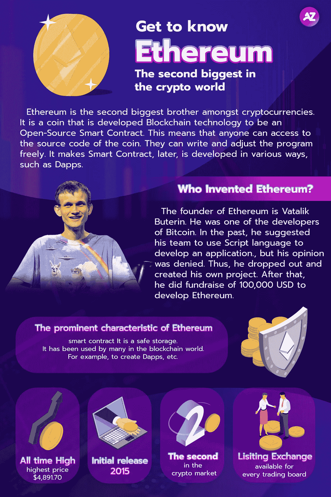

# 了解以太坊:世界上第二大密码

> 原文：<https://medium.com/coinmonks/get-to-know-ethereum-the-second-biggest-crypto-in-the-world-410744824e1?source=collection_archive---------37----------------------->

## 以太坊是市值仅次于比特币的第二大加密货币。

**Get to Know Ethereum: The Second Biggest Crypto in the World**

# 以太坊是一种区块链技术，发展成为一种开源智能合约。这意味着任何人都可以访问以太坊的源代码。

开发者可以使用以太坊源代码编写程序。以太坊的智能合约有多种开发方式，比如 Dapps。

以太坊的创始人是瓦塔利克·布特林。他是比特币的开发者之一。过去，他提议他的团队使用脚本语言开发应用程序，但没有人同意他的提议。之后，他离开了团队，创建了自己的项目。他开始筹集 10 万美元的资金来开发以太坊，并于 2015 年启动了以太坊项目。

以太坊的突出特点是智能合约。以太坊的智能合约是一种安全的数据维护方式。你可以放心，没有人能黑掉智能合约。例如，如果你租房子，你必须每月支付 10，000 泰铢的租金。如果你不付租赁费，出租人可以切断你的电源。如果租赁协议是在智能合同上启动的，出租人和承租人将被迫自动遵守该协议。智能合同确保每一方都遵守双方同意的条件。智能合同不能更改或调整。交易对手必须遵守智能合同中规定的条件，不得拒绝。

过去几年，以太坊开发者一直在将以太坊区块链发展到以太坊 2.0。此次升级的关键是将工作证明算法改为利益证明算法，以提高以太坊的吞吐量，降低其燃气费。如果你正在关注以太坊的新闻更新，你可能很清楚以太坊区块链的主要痛点是其交易费用。它的煤气费很贵。于是，以太坊 2.0 的开发就是为了解决这个痛点。以太坊 2.0 将于 2022 年底推出。

## 以太坊的开发者和团队正在不断更新项目。因此，毫无疑问，以太坊区块链可能会用于各种行业。最近，有这么多的加密和区块链项目开发自己的智能合同，但仍然没有人能打败以太坊。

*请注意，投资数字资产有风险，交易者应在投资前自我教育。

如果您对分散资产管理感兴趣，请随时联系我们。

请确保您不会错过任何更新的新闻，请关注我们的社交媒体如下:
推特:[https://twitter.com/azirafinance](https://twitter.com/azirafinance)
媒体:[https://medium.com/@azirafinance](/@azirafinance)
脸书:[https://www.facebook.com/azirafinance](https://www.facebook.com/azirafinance)
Reddit:[https://www.reddit.com/user/azirafinance](https://www.reddit.com/user/azirafinance)
白皮书:[https://azira-finance.gitbook.io/product-docs/](https://azira-finance.gitbook.io/product-docs/)

> 加入 Coinmonks [电报频道](https://t.me/coincodecap)和 [Youtube 频道](https://www.youtube.com/c/coinmonks/videos)了解加密交易和投资

# 另外，阅读

*   [最佳加密分析或链上数据](https://coincodecap.com/blockchain-analytics) | [Bexplus 评论](https://coincodecap.com/bexplus-review)
*   [NFT 十大市场造币集锦](https://coincodecap.com/nft-marketplaces)
*   [AscendEx Staking](https://coincodecap.com/ascendex-staking)|[Bot Ocean Review](https://coincodecap.com/bot-ocean-review)|[最佳比特币钱包](https://coincodecap.com/bitcoin-wallets-india)
*   [Bitget 回顾](https://coincodecap.com/bitget-review)|[Gemini vs block fi](https://coincodecap.com/gemini-vs-blockfi)|[OKEx 期货交易](https://coincodecap.com/okex-futures-trading)
*   [美国最佳加密交易机器人](https://coincodecap.com/crypto-trading-bots-in-the-us) | [经常性评论](https://coincodecap.com/changelly-review)
*   [在印度利用加密套利赚取被动收入](https://coincodecap.com/crypto-arbitrage-in-india)