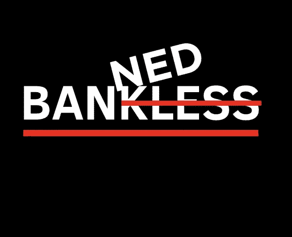
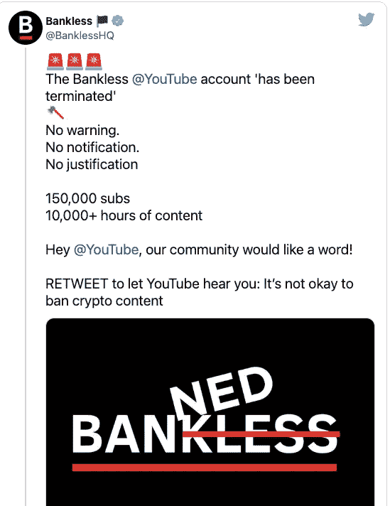
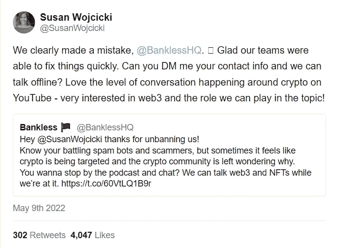

# 被 Youtube 封杀是有史以来最好的事情。

> 原文：<https://medium.com/coinmonks/getting-banned-from-youtube-is-the-best-thing-ever-7ddf797433ac?source=collection_archive---------62----------------------->

Bankless was banned by Youtube for absolutely no reason.

DeSo 是未来吗？

很确定你错过了这场惨败，所以听好了。

Bankless 是一个广受欢迎的加密媒体频道，在 Youtube 上拥有 16.5 万订户。

大约一个月前，Youtube 突然禁止了无银行服务。

莫名其妙。

直接被审查并从 Youtube 上删除。

这是一个令人震惊的秘密社区，因为无银行是一个受欢迎的和非常合法的媒体，教育和讨论的门外汉加密新闻。

如果你关注无银行，他们的内容很有教育意义，旨在传播不断增长的 web3 世界的知识。

“无银行 YouTube 账户‘已被终止’。没有警告。没有通知。没有正当理由。十五万艘潜艇。一万小时的内容。”

Imagine you were a smaller player, what can you do?

"幸运的是，在班克利斯的一系列推文之后，YouTube 在几个小时后恢复了该频道."

几个小时很棒，其他人可能没那么幸运。

这可能是一个错误，来自算法或机器人或人为错误。

怎么会犯这样的错误？

自动抓取和自动禁止非法内容而不经过人工审查的机器人，会不会是糟糕的编程？

会不会是有人举报了无银行，Youtube 马上采取了行动？

那肯定会很奇怪。

我不知道，根据我的调查，也许就连 youtube 的首席执行官苏珊·沃西基也不知道。

在班克利斯发了关于突然禁令的推特后，苏珊亲自回复并承认这是一个错误。

Must have been a serious mistake.

然而，我想指出的是，班克利斯在 Youtube 上有 16.5 万名粉丝，在 Twitter 上有 20 万名粉丝。

他们有自己的声音和庞大的社区，这意味着他们的声音可以被听到。

那些小球员呢？

当社交媒体巨头欺负他们并决定关闭他们时会发生什么？

你知道建立自己的品牌、培育你的社区、浇灌你的树，却眼睁睁地看着它被砍伐是什么感觉吗？

班克利斯说，“对于 YouTube 上绝大多数处于任意禁止阴影下的独立视频创作者来说，这是他们没有的奢侈。”

对于无足轻重的创作者来说，通过官方渠道进行上诉可能会持续几周或几个月，甚至可能没有解决方案！

这是为什么我们需要抵制审查的社交媒体平台的经典例子。

面向 web3 用户和创作者的 web3 社交媒体。

我确实看到了双方的优点。

像 Youtube 和脸书这样的集中式社交媒体确实提供了合法性、信任和熟悉度，但这是以某些自由和把所有鸡蛋都放在大型科技的篮子里为代价的。

去中心化的社交媒体(DeSo)可能提供无限的自由和零审查，但随着时间的推移，这也可能阻碍它的采用和发展，并可能在瞬间变成贪婪的狂野西部。

无银行被 Youtube 封禁可能是有史以来最好的事情。

这清楚地表明了对 DeSo 的需求。

我确信现在有许多 web3 的建设者正在努力工作，所以让我们看看它会走向何方。

-

你相信去中心化的社交媒体吗？

-

#创业#商业#创业#成长#成功#社交媒体#大科技#创业#网络 3 #无银行#自由#审查# youtube #谷歌#推特

> 加入 Coinmonks [电报频道](https://t.me/coincodecap)和 [Youtube 频道](https://www.youtube.com/c/coinmonks/videos)了解加密交易和投资

# 另外，阅读

*   [BigONE 交易所点评](/coinmonks/bigone-exchange-review-64705d85a1d4) | [电网交易 Bot](https://coincodecap.com/grid-trading)
*   [氹欞侊贸易评论](https://coincodecap.com/anny-trade-review) | [CoinSpot 评论](https://coincodecap.com/coinspot-review)
*   [新加坡十大最佳加密交易所](https://coincodecap.com/crypto-exchange-in-singapore) | [购买 AXS](https://coincodecap.com/buy-axs-token)
*   [投资印度的最佳加密软件](https://coincodecap.com/best-crypto-to-invest-in-india-in-2021) | [WazirX P2P](https://coincodecap.com/wazirx-p2p)
*   [西班牙 5 大最佳文案交易平台](https://coincodecap.com/copy-trading-spain)
*   [Pionex 双重投资](https://coincodecap.com/pionex-dual-investment) | [AdvCash 审查](https://coincodecap.com/advcash-review) | [支持审查](https://coincodecap.com/uphold-review)