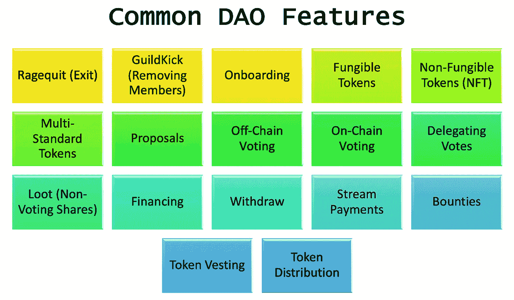
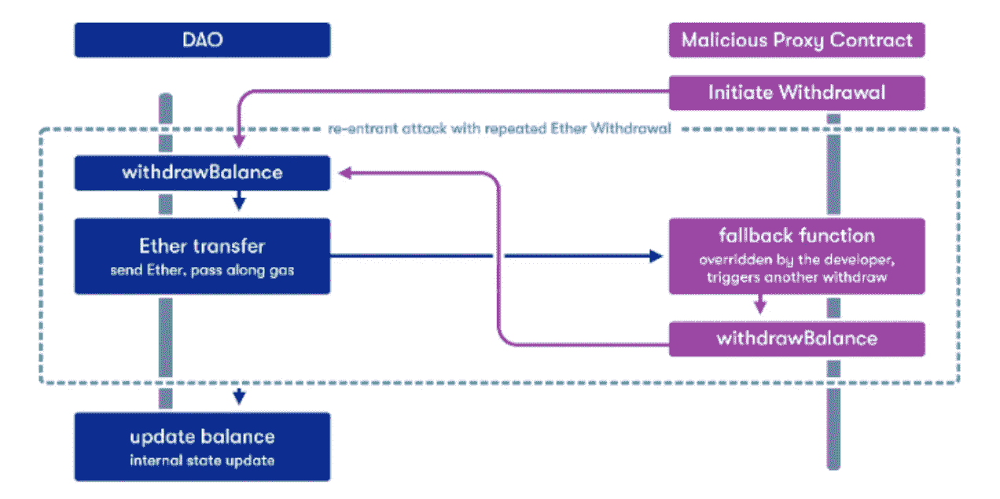

# 和道斯在一起

> 原文：<https://medium.com/coinmonks/getting-daown-with-daos-71c0b9a7d6d6?source=collection_archive---------11----------------------->


在《魔戒》的开头，所有这些人都来自这些不同的群体(霍比特人、精灵、矮人等。)彼此并不信任，但他们都有一个统一的使命，要把魔戒带到山上。像 DAOs 一样，他们是一群不同的陌生人，需要相互信任才能达到共同的目标。在《指环王》中，尽管佛罗多是主角，但每个人都一起做决定。

魔戒不完全像道斯，因为每个人都来回传递魔戒。在 DAOs 中，资金存放在一个金库中，只有在多个参与者签字同意的情况下才能使用，稍后会详细介绍。

# 这篇文章的内容

*   [什么是 DAO(去中心化自治组织)？](#a18c)
*   [流行刀项目](#1e17)
*   [Dao 和法律实体](#b135)
*   [常用刀特征](#4ac9)
*   [没有开发 DAO 的代码工具](#8484)
*   [什么跟‘刀’攻击一起下去了？](#6c91)
*   [最佳实践清单](#ba7b)
*   [附加资源](#748c)

# 什么是 DAO(去中心化自治组织)？

> Dao 是允许不受信任的各方协同工作的组织。规则和指导方针都被区块链网络上的智能合约锁定，使得一方很难欺骗另一方。

Dao 是一种组织基金会、组织或企业的新方式。**分权**是这里的关键词，意思是 ***作为一个群体*管理大部分业务的组织。**

Dao 不是复杂的技术。这是一个允许人们对决策进行投票的论坛，资金像 Kickstarter 一样筹集，还有一个事件机制，它可以听取投票，并可以通过编程释放资金和采取具体行动，这是一个很大的讽刺 YEH :|

## **道是被低估了还是被过度炒作了？**

在一个人们遵守规则，公平竞争的世界里，刀将是一项毫无意义的技术。不幸的是，这个世界是不公平的，人们总是被骗走本应属于他们的东西，因为这些规则并不适用于所有人。


Image from Succession Season 2 Episode 6 — To get the relevance of this image, go watch the show!

Dao 使组织更具包容性，因为它们依靠社区支持生存，使我们更接近一个更加多样化、包容和公平的社会。


这不是一个完美的解决方案；投票取决于你拥有多少代币，许多 DAO 并不像用户友好，需要一定水平的技术专业知识，并且在 DAO 中工作需要时间，这是目前大多数人都负担不起的。

Dao 目前的状态可能被夸大了，但是它们的潜力却被低估了。要让他们成为更平易近人、更公平的组织，还有很多工作要做。如果我们继续改进 Dao，我可以看到许多公司和部门将自己组织成 Dao。

## 为什么会有人想要刀？

我不能代表所有人，但我会用一把刀来解决一个具体的问题，但我有一定的限制，如时间、朋友和金钱。

*   **时间**⏰ **→** 我有一份全职工作，需要与陌生人合作
*   **好友**👸🏻 **→** 我没有太多业内朋友，所以很多人不信任我，我也不信任他们
*   **钱**💰我不能在经济上补偿任何人来抵消他们对我的不信任，但是我可以给他们这个项目的一部分来换取他们的工作

对于 DAOs 来说，做一个做所有决定、获得大部分资金、获得所有名声的 CEO 的概念已经过时了；这是一个团队的努力。当你想要的只是用有限的资源创造最佳的解决方案时，放弃依赖于中央集权组织的名声和控制是值得的。例如，Uniswap 以少于 33 倍的人员处理了比特币基地 77.6%的日均交易量。这就是 DAO 的强大之处，它使社区能够做出决策，有安全的方法来处理联合基金，并允许工作轻松地分配给世界各地的专家。


Image credit: the Tokenist, data sources: uniswap.org, [nomics.com](http://nomics.com/), craft.co

## 管理

治理在 Dao 中是一个沉重的词，因为这是他们的目的。并不是所有的区块链项目都使用 Dao，尽管它们都在谈论治理。

> 在缺乏中央权威的情况下，分散的网络和平台依赖日益创新的治理结构来确保其项目的长期和整体现实使用。
> 
> 区块链治理通常采用各种机制来决定项目方向和持续更新，并确保底层协议和生态系统平稳高效地运行。

治理分为链外治理和链上治理。**链外治理**是决策从社会层面开始，由开发人员实施。比特币和以太坊依赖于链外治理，bip 和 EIP 通过邮件列表或 Github repo 共享，然后由开发者批准。链上治理是在区块链网络上使用智能合同报告和执行决策的地方。

[](/@poolofstake/revisiting-the-on-chain-governance-vs-off-chain-governance-discussion-f68d8c5c606) [## 重温链上治理与链外治理的讨论

### 在本文中，我们向您介绍了区块链治理的历史以及在协议发展上的分歧。我们…

medium.com](/@poolofstake/revisiting-the-on-chain-governance-vs-off-chain-governance-discussion-f68d8c5c606) 

# 流行的 DAO 项目


一些最大的区块链项目是 DAO，如 MakerDAO、Augur、BitDAO、分散的土地、FriendsWithBenefits (FWB)、Uniswap、Compound、Rarible、Gitcoin、Audius 和著名的 Constitution Dao。“道宪法”是一个试图购买美国宪法和分裂所有权的筹款活动。有很多古怪的 Dao，但也有一些严肃的 Dao 已经从风险资本家(a16z，Polychain Capital)、天使投资人(Peter Theil)和其他所有人那里筹集了大量资金。一些 Dao 筹集了数百万美元，如寿司筹集了 3390 万美元，复合筹集了大约 2.9877 亿美元


Compound’s DAO Voting Dashboard


Compound’s Boardroom.io Treasury Dashboard

# Dao 和法律实体

由于其中一些直接投资机构产生并持有大量资金，它们绝对必须向政府注册。如果你在美国发行代币，即使周围没有明确的法律，它们也可能被视为证券，需要遵守特定于证券的法律。最近，怀俄明州通过了一项法律，于 2021 年 7 月承认 Dao 为有限责任公司。在这项法律生效之前，DAO 已经注册为正规公司，现在仍然可以，所以问问你的律师朋友，这会对 DAO 的注册过程产生什么影响。

OpenLaw 创造了这个称为 Lao 的术语，Lao 是包装为合法合规实体的 Dao，如 LLC 或 C-corp。Lao 可以签订法律合同、托管、链外资产(即 SAFTs)和分配股息。老挝的投资者必须经过认证，但以老挝股票获得报酬的服务提供商可以获得他们在老挝投资组合中的股份。

# 常见的刀特征

每个人都有一把刀；一些 Dao 专注于慈善事业，另一些专注于资金，还有一些专注于奖金。根据我们处理的刀的类型，我们会考虑不同的特性。



其中一些功能术语是新的，因此下面是一些需要理解的定义和概念:

## Ragequit

Ragequit 让会员可以自由选择退出道的最佳时机，提取资金，没有任何附加条件。

## GuildKick

公会踢提议允许成员强行移除另一个成员(他们的资产全额退还)。

## 代币

Dao 可以有可替换的(ERC20)、不可替换的令牌(ERC721)和多标准令牌(ERC1155)。可替换的令牌可以用于成员资格和使用 DAO 进行不同的活动，如投票或收集共享收益等。NFT 经常被用来注册成员，就像无聊的猿猴一样，任何拥有 BoredApe 的人都是 DAO 的一部分。

## 链上投票

在连锁投票中，所有的投票都记录在区块链上，这意味着它们需要花费汽油，并且通常需要以代币的形式对投票做出承诺。不同的 DAO 投票方案决定了一次投票需要多少令牌。几种不同的投票方案是二次投票、全息投票、基于令牌的法定人数投票和信念投票。


Screenshot of Uniswap’s On-Chain Voting

## 离线投票

离链投票通常被称为“温度检查”离线投票通常是免费的，因为它不属于任何区块链网络，也不需要承诺。通常，这些投票发生在电子邮件链、不和谐频道、论坛和快照([https://snapshot.org/#/](https://snapshot.org/#/))。


Screenshot of Uniswap’s Temperature Check Forum

## 抢劫

无投票权股份的财务分配

## 分享

股票授予与核心资金所有权成比例的投票权。股份是道专用的，不能转让或交易。

## 资金流

资金流是允许长期持续支付的工作流。想象一下，你不必每两周等一次薪水，而是每工作一秒钟就能得到报酬，做个大梦吧，我的朋友，看看萨布利埃和超流体吧。

[](https://sablier.finance/) [## 萨布利耶

### 以太坊区块链上的实时金融协议

sablier.finance](https://sablier.finance/) [](https://docs.superfluid.finance/superfluid/) [## 超流体

### 一个新的 DeFi 原语，用于自动执行经常性交易并使 Web3 盈利

文档.超流体.金融](https://docs.superfluid.finance/superfluid/) 

## 慷慨

奖金就像 DAO 发布到社区的演出，如果有人承担了这项工作，他们就可以以批准的 DAO 令牌的形式获得报酬。通常，奖金会发布在 Gitcoin、Github、Discord 或 Snapshot 上，在那里有一个增强请求和 DAO 愿意为这项工作支付的价格。

下面是一个需要在 ENS 基金会刀上投票的赏金的例子。


Screenshot from an ENS Bounty Snapshot Proposal [https://snapshot.org/#/ens.eth/proposal/0x8c05add423e7ab5900113b203326286763d402f88300ebbe65c278ed2488b8d1](https://snapshot.org/#/ens.eth/proposal/0x8c05add423e7ab5900113b203326286763d402f88300ebbe65c278ed2488b8d1)

并不是所有的奖金都需要大量的技术知识，下面是阿尔格兰德基金会为一名韩国翻译提供的奖金的一个例子。


# 没有开发 DAO 的代码工具

考虑到 DAO 拥有的资金量和创建 DAO 的风险，使用经过验证和测试的 DAO 生成器更容易也更安全。一些流行的 DAO 生成器有 Aragon、JuiceBox、Colony 和 Mirror。

**阿拉贡**是领先的 DAO 生成器解决方案之一，他们有两个选项阿拉贡客户端和阿拉贡治理。一旦您部署了您的 DAO，其他人就可以在 Aragon 上与它进行交互。


Snapshot of an Aragon generated DAO

[](https://aragon.org/) [## 一起更好地治理。现在就造你的刀。

### 无摩擦的道创造和治理。改变世界从这里开始。

aragon.org](https://aragon.org/) 

**JuiceBox** (资助道生成器)是资助道生成器，由带给我们构造道的同一批人所创建。界面相对简单，DAO 创建者所要做的就是在 DAO generator 上填写一些表格。


Snapshot of a JuiceBox generated DAO

[](https://juicebox.money/#/) [## 果汁盒

### 以太坊上的人和项目的社区资助。

果汁盒子. money](https://juicebox.money/#/) 

镜像 XYZ 是一个专注于写作的 DAO 生成器，它允许你基于不同的写作项目创建 DAO。它是一个类似 Medium 的博客网站，但是你可以在你的出版物中持有你的令牌和治理。


Snapshot of a Mirror generated DAO

[https://mirror.xyz](https://mirror.xyz/dashboard)

即使这些平台为您处理技术上的繁重工作，也要时刻注意这些平台的风险和顾虑。在 Discord、Reddit 和博客上跟踪开发社区。

# “刀”攻击发生了什么？

道斯的开始很艰难。回到 2016 年 6 月 17 日，一名黑客利用名为“The DAO”的 DAO 窃取了 360 万 eth，相当于当时的 7000 万美元。

攻击者能够在智能合约更新其余额之前多次请求返回，这被称为重入攻击。这就好像你去一家银行，你的出纳员是电影《海底总动员》中的多莉，她总是忘记更新你的余额，这样你就可以一遍又一遍地向她索要相同的取款金额。



Image is taken from [https://quantstamp.com/blog/what-is-a-re-entrancy-attack](https://quantstamp.com/blog/what-is-a-re-entrancy-attack)

幸运的是，被盗资金所在的账户被冻结了 28 天，这给了以太坊社区一个通过分叉链来补救这种情况的机会。分叉链允许以太坊社区有机会将代币退还给社区。

今天原来的是以太坊经典，新叉的是以太坊(主流)。

[](/swlh/the-story-of-the-dao-its-history-and-consequences-71e6a8a551ee) [## 道的故事——它的历史和后果

### 通过区块链技术成功实现的最不可思议的概念之一是道，一种…

medium.com](/swlh/the-story-of-the-dao-its-history-and-consequences-71e6a8a551ee) 

> **疑似黑客:** Linda Shin 近日报道，2016 年的 DAO 黑客是 TenX 的 CEO。她是在撰写新书《 [*《加密人:理想主义、贪婪、谎言，以及第一次大规模加密货币热潮*](https://bookshop.org/books/the-cryptopians-idealism-greed-lies-and-the-making-of-the-first-big-cryptocurrency-craze/9781541763012) *》时有了这个发现。*
> 
> 琳达·申(Linda Shin)写了一篇关于她如何得出结论的惊人文章，这基本上是一部加密语言电影:[https://www . Forbes . com/sites/laurashin/2022/02/22/exclusive-Austrian-programmer-and-ex-crypto-CEO-likely-steed-110 亿-of-ether/？sh=f47894f7f589](https://www.forbes.com/sites/laurashin/2022/02/22/exclusive-austrian-programmer-and-ex-crypto-ceo-likely-stole-11-billion-of-ether/?sh=f47894f7f589)


## 在 6 月 12 日，也就是攻击前 5 天，发现了递归错误

在 6 月 17 日实际攻击的前几天，“DAO”发现了一个“争空错误”，这是一个递归调用漏洞。6 月 12 日，社区庆祝👏用 Eththrowa 捕捉这个 bug 并解决它。与此同时，第二次袭击正在策划中…👺


## 6 月 17 日袭击的那天

**提取资金**很困难，需要创建一个子 DAO 来提取资金。要创建这些子 Dao，您需要提交一份分割提案，该提案需要 7 天时间来成熟并获得参与者。如果这些参与者投了赞成票，他们可以调用 splitDAO 并撤回他们的资金。

但是 SplitDao 函数的实现方式允许攻击者能够递归地从 Dao 中分离，并在余额更新之前无限期地提取资金。SplitDAO 函数被 [27996](http://etherscan.io/txsInternal?a=0x304a554a310C7e546dfe434669C62820b7D83490) 内部事务调用了 29 次，其中 [13996](http://etherscan.io/txsinternal?zero=true&a=0x304a554a310C7e546dfe434669C62820b7D83490&valid=all) 为非零事务。由于余额从未更新，相同金额的提款被多次调用，ETH 余额为 258.06 ETHs，大约为 3，611，759.68 ETH。


Screenshot from Internal Transactions [https://etherscan.io/txsInternal?a=0x304a554a310C7e546dfe434669C62820b7D83490&p=2](https://etherscan.io/txsInternal?a=0x304a554a310C7e546dfe434669C62820b7D83490&p=2)

下面是‘the darkdao’(地址:[0x 304 a 554 a 310 c 7 e 546 dfe 434669 c 62820 b 7d 83490](https://etherscan.io/address/0x304a554a310C7e546dfe434669C62820b7D83490))从下面的交易开始的第一次攻击(交易哈希:[0x 0 EC 3 f 2488 a 93839524 add 10 ea 229 e 773 f 6 BC 891 B4 EB 4794 c 3337d 495263790 b](https://etherscan.io/tx/0x0ec3f2488a93839524add10ea229e773f6bc891b4eb4794c3337d4495263790b))。


Screenshot from Etherscan Transaction [0x0ec3f2488a93839524add10ea229e773f6bc891b4eb4794c3337d4495263790b](https://etherscan.io/tx/0x0ec3f2488a93839524add10ea229e773f6bc891b4eb4794c3337d4495263790b)

可以在 Etherscan 上找到被黑的臭名昭著的合同，合同是[0x bb 9 BC 244d 798123 FDE 783 fc C1 c 72d 3 bb 8 c 189413](https://etherscan.io/address/0xbb9bc244d798123fde783fcc1c72d3bb8c189413#code)。([https://ethers can . io/address/0x bb 9 BC 244d 798123 FDE 783 FCC 1 c 72d 3 bb 8 c 189413 #代码](https://etherscan.io/address/0xbb9bc244d798123fde783fcc1c72d3bb8c189413#code))

下面是具体导致漏洞的函数。当您扫描它时，请注意以下观察结果:

*   第 69 行的取款发生在第 71 行的余额更新之前
*   第 28 行创建了新的 DAO，即子 DAO
*   第 45 行是为子 DAO 创建新标记的代码

```
*// Move ether and assign new Tokens*uint fundsToBeMoved =**(balances[msg.sender] * p.splitData[0].splitBalance) /****p.splitData[0].totalSupply;**if (p.splitData[0].newDAO.createTokenProxy.**value**(fundsToBeMoved)(msg.sender) == false)throw;
```

查看[容器概述了解更多详情:](https://medium.com/u/1f66ec22d7ef?source=post_page-----71c0b9a7d6d6--------------------------------)

[](https://vessenes.com/deconstructing-thedao-attack-a-brief-code-tour/) [## 解构 DAO 攻击:简短的代码之旅

### 道今天被攻击了，攻击者似乎带着 3.5 毫米的乙醚逃走了(在我写这篇文章的时候已经超过了…

vessenes.com](https://vessenes.com/deconstructing-thedao-attack-a-brief-code-tour/) 

以下是黑客攻击的详细代码分析:

 [## 浅析“道”的利用

### 所以我相信每个人都已经听说了关于刀被黑客以 1 . 5 亿美元的价格收购的新闻…

hackingdistributed.com](https://hackingdistributed.com/2016/06/18/analysis-of-the-dao-exploit/) 

# 最佳实践清单

我希望“TheDao”黑客没有吓到你，那是 5 年前的事了。自那次残酷的警钟敲响以来，区块链社区在提高 DApp 实施的安全性方面取得了重大进展。

下面是在将您的 DAO 部署到 mainnet 以用于主流消费之前需要查看的清单:


## 财政部

国库是 Dao 特有的清单项目之一。DAO 的金库通常位于多签名钱包中，用于需要多个成员签署交易的合同。财政部通常以 ERC 20s 创造的可替换代币形式拥有资金，只能用于已投票表决的拟议项目。这是 DAOs 的最大卖点之一，它使盗用变得困难。如果一组从未见过面的人彼此信任，他们仍然可以一起工作，因为 DAO 以编程方式保护资金。


# 如果你喜欢这个帖子，那么你可以请我喝咖啡，先谢谢你了！

[](https://www.buymeacoffee.com/mindegg)

# 如果你现在着迷了，就去挖掘这些资源吧

## 道大师

 [## 资源

### 由道大师团队策划的密码社区相关内容和资源列表:)

www.daomasters.xyz](https://www.daomasters.xyz/resources) 

## 刀厉害了

[](https://github.com/windranger-io/awesome-dao) [## GitHub—wind ranger-io/awesome-dao:关于 DAO 的最佳工具、库和材料的精选列表

### 关于 DAO 的最佳工具、库和材料的精选列表

github.com](https://github.com/windranger-io/awesome-dao) 

## 道德经教程

[](https://moralis.io/dao-smart-contract-example-dao-guide/) [## DAO 智能合约示例— DAO 指南“Moralis —终极 Web3 开发平台

### 感谢以太坊，第一个可编程区块链和众多智能合同的来源，程序员现在想要…

道德标准](https://moralis.io/dao-smart-contract-example-dao-guide/) 

## 2021 年 9 月 Gitcoin 和 Bankless 的一项调查

> 加入 Coinmonks [电报频道](https://t.me/coincodecap)和 [Youtube 频道](https://www.youtube.com/c/coinmonks/videos)了解加密交易和投资

# 另外，阅读

*   [瓦济里克斯 NFT 评论](https://coincodecap.com/wazirx-nft-review)|[Bitsgap vs Pionex](https://coincodecap.com/bitsgap-vs-pionex)|[Tangem 评论](https://coincodecap.com/tangem-wallet-review)
*   [如何使用 Solidity 在以太坊上创建 DApp？](https://coincodecap.com/create-a-dapp-on-ethereum-using-solidity)
*   [加密交易机器人](/coinmonks/crypto-trading-bot-c2ffce8acb2a) | [OKEx vs 币安](https://coincodecap.com/okex-vs-binance)
*   [币安 vs FTX](https://coincodecap.com/binance-vs-ftx) | [最佳(SOL)索拉纳钱包](https://coincodecap.com/solana-wallets)
*   [如何在 Uniswap 上交换密码？](https://coincodecap.com/swap-crypto-on-uniswap) | [A-Ads 综述](https://coincodecap.com/a-ads-review)