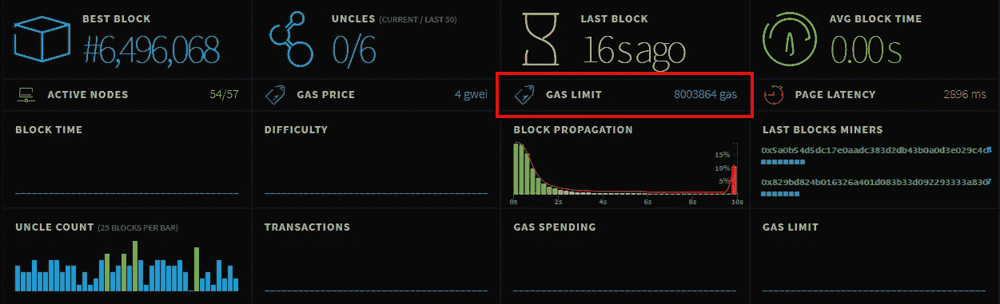

# 变得神经兮兮的

> 原文：<https://medium.com/coinmonks/getting-loopy-with-solidity-df29f0052a67?source=collection_archive---------7----------------------->

## 如何避免稳健智能合同中的无限“For”循环

**让我们从几个问题开始:**

*   循环的无界*是什么？*
*   为什么是反模式？
*   如何避免它？


Image credit: [Tine Ivanič](https://unsplash.com/@tine999?utm_source=medium&utm_medium=referral)

循环的无界*是对迭代次数没有限制的任何循环。换句话说，没有明显限制的情况。*

例如:

*   *“对于每一个用户，当没有明显的用户数量限制时，做点什么…”*。
*   *当没有明显的项目数量限制时，“对每一个项目，做某事…”*。
*   *为(I = 0；i <？；i++) { //前方危险}*

它看起来很熟悉，而且致命。在 Solidity 中，我们需要避免这种情况，因为它不会扩展。假设它上面写着*“因为我等于 0，代表灾难。”*

我们中没有人打算去开发一种软件，当太多人使用它时，它会锁定并失败。至少不是故意的，因为我们是好人。

# 为什么它不会扩展？

因*气体*和*气体限制*。

**【气体】**是计算工作的记账单位，用于将每次交易的成本传递给用户。**工作越多，消耗的汽油越多，执行起来就越费钱。**想象一下，您的中央处理器为每一次操作给你发了一张账单。不要再想象了！

**这就是以太网虚拟机的现实。**总有人付钱。你不需要记住整个价目表，但是新来者应该内在化这样的想法，即所有发生的事情都有完整的账目，没有什么是免费的。参见 [OPCODE Gas Costs](https://ethereum.stackexchange.com/questions/119/what-opcodes-are-available-for-the-ethereum-evm) (未完全更新，但有一个指向黄皮书的便捷链接)。

**“block . gas limit”**是由矿工投票决定的网络财产。作为开发者，我们不能控制气体的极限，但我们知道它的存在。**你可以把它想象成油箱的大小。**如果交易没有汽油了，交易会恢复。我们(目前)不能运行超过 *block.gas 限额*的交易。



The block.gasLimit is an evolving property of the Ethereum network. (Image credit: ethstats.net)

想象你和你的用户在一架飞机上。你想走得越远，你会燃烧越多的气体。你能携带的燃料有一个最大限度，因此你能飞的距离也最大。如果你的目标太远，在你到达目的地之前，你会用完汽油，然后坏事会发生…

*气体限制*会随着时间的推移而调整(矿工投票赞成)，所以你永远不能确定多少是太多，但你可以确定当你达到那个点时会有一个艰难的停止。您需要规划您的旅程，以便在此之前完成每一步。

> 你可以安全地做尽可能多的短途飞行，在每一站加油。考虑多次、小规模、安全的跳跃，而不是依赖高风险的大动作，难道不是有意义的吗？

所以，如果你在为每一个客户考虑*或任何*流程，为每一个项目考虑或*流程，你可能忽略了你的机器的局限性。你很可能在思考问题的错误解决方案。这种事情不是特定代码行中的错误。这是一种被误导的方法。*

# TL；速度三角形定位法(dead reckoning)

每一步都要花钱。有些过程比金钱能买到的更昂贵。这就需要重新关注**效率**。

*在以太坊，无限工作不是选项。*这意味着一些你最喜欢的“去做”模式和许多日常任务的显而易见的解决方案恰恰是我们必须*而不是*去做的。

要避免的例子:

1.  在无限大小的列表中搜索感兴趣的记录。
2.  在无限大小的有序列表中搜索插入点
3.  在无限大小的列表中读取或写入太多项目。
4.  以大的方式重新组织列表项，如排序、卷起或拼接。
5.  递归调用无限深度的契约函数。

# 我们怎样才能避免变得糊涂呢？

有很多理由让*希望*迭代某事物的 *n* 个实例。找到解决这种倾向的方法需要新的思维方式。

我们来看几个例子。

# 避免排序

```
for(i=0; I < records.length-1; i++) { for(j=i+1; j < records.length; j++) {  // compare record[i] and record[j]  // swap records if needed }}
```

如果你有无限的计算资源或者一个非常小的列表，经典的冒泡排序算法就能完成任务。但是我们没有无限的资源，我们不能用这种方式解决问题。不使用循环，我们究竟怎样才能完成这样的事情呢？

这似乎很难接受，但是要做的第一件事就是寻找避免分类的方法。这就是为什么你很少看到专业制作的合同。

# 依靠一步查找

我们喜欢对数据进行排序的原因之一是为了高效地找到东西，对吗？如果我们可以在一次操作中找到任何记录，并枚举存储的所有内容的完整列表，会怎么样？对数据进行排序是否仍然至关重要？

看看这里有一个流行的模式，它对无序列表做所有的事情: [Solidity CRUD](/@robhitchens/solidity-crud-part-1-824ffa69509a) 。

# 有序列表使情况变得更糟

很难打败 1 步查找法。有序列表的工作量要大得多，而且经常是不必要的，这就是为什么我们要寻找避免它们的方法。

在那种*罕见的情况下*契约逻辑*依赖于*有序列表，那么**你必须格外小心以确保*总是有*方法来控制成本**，这样你就可以*保证*成本将是规模不变的。据作者所知，没有已知的算法可以索引或排序无序数据列表，而不增加一些规模因素的成本。比如 O(log n)。

这个问题的解决方案是将任务分解成合同*可以*以固定成本完成的更小的步骤。这可能会涉及到外部化一些问题，也就是说，比看起来更依赖外部的帮助。

# 使用提示

例如，客户端可以向契约函数发送*提示*。

在链接实验模式中，契约维护了一个有序列表，其中包含了所有要处理的事情。客户告诉合同他们想要插入什么，并给合同一个关于放在哪里的提示。契约检查请求的可接受性，因为契约保证系统完整性 *:* [链接列表(带提示)](https://bitbucket.org/rhitchens2/soliditystoragepatterns/src/master/LinkedList.sol)

没那么快。

请考虑以下情况:

即使客户努力搜索并给出完美的提示，在挖掘出交易之前，情况可能会发生变化，这意味着提示可能不再完美。如果契约不同意关于在哪里放置某物的提示，而不是直接拒绝请求，那么契约会从提示开始进行*区域*搜索以找到正确的位置。如果在气体耗尽之前能够找到正确的点，那么插入就成功了。

总是可以使用合同，并且总是以固定的成本使用。一个靶心(完全准确的暗示)在任何规模上都是相同的成本。缺失 1、缺失 2 等也有类似的可预测成本。，这就是我们想要的。这个提示到底有没有用并不重要，但是懒惰的软件客户错过的越多，客户的成本就越高。

如果作者的推理是正确的，最糟糕的情况是大量数据涌入合同，谨慎的客户仍然会错过很多，因为在挖掘交易之前，合同状态会发生重大变化。客户成本大约是*开销+ O(错过)*，所以吝啬的客户会放慢速度，直到竞争减少。在任何情况下，契约都不会失效，生活在任何规模下都会继续。这是重中之重。

以上当然不是唯一的方法。除了完全放弃有序列表的考虑(如果可以的话，我们应该这样做)，这个例子的重点是找到一个不意味着增加成本或规模限制的解决方案的至关重要性。

# 查询和过滤列表

查询经常被引用作为迭代过程的理由。开发人员可能会说“我需要返回一个列表，其中包含所有的…”。

冒着看起来迂腐的风险，“我需要”似乎让这场讨论开了一个错误的头。开发人员通常不是系统架构的参与者，那么非参与者怎么会有需求呢？这不是对实际需求的良好描述。也许*有人*有需求，但不是开发者。谁啊。为什么？让我们仔细考虑一下。

有一个用户界面，可能有一台或多台服务器，还有一个合同系统。假设系统中的某个组件会生成一个列表，因为客户端以某种方式需要它。很公平，但是这不一定是合同的工作，我们也不应该假设它是。在可能的情况下，应该避免为此目的使用合同，这几乎总是可能的。

# 返回数组呢？

作者对 ABI 中增加字符串、动态数组和结构支持的趋势有着复杂的感觉。无可否认，先驱们学会了使用固定大小的接口，所以现在我们知道了要遵循的模式。对于习惯于面向对象语言的新手来说，这使得动态的东西看起来远没有那么重要。

这种不适不仅仅是因为执着于长期以来行之有效的惯用模式。作者犹豫的真正原因是，它似乎鼓励而不是阻止不可伸缩的模式，并且它似乎在我们应该努力追求简单的环境中鼓励复杂性。

如果我们确信最大可能的数组*和组装它的过程*和发送它的过程*将总是*以低于 *block.gasLimit* 的成本完成，那么它在技术上是可行的。挑战在于确定。假定(很可能)无法修改合同，那么在列表式功能变得过于昂贵而不可行或完全停止工作的情况下，B 计划是什么？

# 工作的分期偿还

为该问题提供最大确定性的解决方案是一个更细粒度的函数，它一次返回一个项目或解决方案的一部分。

考虑一下这个:

软件客户*不受*他们对合同进行多少次单独调用的约束，但是*每个合同事务和调用受到最大允许计算复杂度的严格约束*。因此，我们应该研究将消费从稀缺资源转移到丰富资源的模式。太抽象？最好是让一个软件客户端进行 1000 次微小的契约函数调用来完成 1000 个步骤，而不是一个契约函数重复一个步骤 1000 次。

尼克·约翰逊称之为“[工作摊销](/@weka/dividend-bearing-tokens-on-ethereum-42d01c710657)”。

# 等等。比赛条件呢？

很好！现在我们正在考虑实现细节。我们不能把半生不熟的合同状态留在那里。每个原子操作都必须使契约处于可接受的状态。这不一定容易，但这是需要解决的难题。

总的来说，采取*任何*过程，这些过程加起来是可变的工作量，并且可能是合同内的*批次*的工作量，并且把它变成由客户端指导的*批次的小的固定成本操作*。当你这样做的时候，你经常会发现不再需要最初设想的大列表操作。一些读者可能认识到，这似乎很像反相控制的概念。

# 工作分期付款是一种非常有用的模式

*   **想从一个数组中获取所有的行？**一次向客户提供一行。客户端将一次请求一个项目，而不是请求列表。
*   **想给所有用户发红利？**等待客户单独认领。只要需要余额信息，就可以在 O(1)中从简单的值(股票和总股息)中即时计算他们的权利。当气体可用时，执行内务处理。这有一个额外的好处，就是将发行的成本外部化。
*   **想要对数组进行排序或过滤？**把这个交给“软件客户端”,它可能是一个缓存服务器，就像 etherscan.io 这样的交换和探索者一样。你不会认为它们会为每个 web 请求检查区块链吧？当然不是。他们更清楚。块到达，事情已经发生，离线高性能数据库被更新*因为这些事情被设计来处理排序、过滤、连接等等。*这也是为什么当您浏览原始块数据时，您可以在块浏览器上看到根本*不存在*的东西。

正如尼克·约翰逊所说:

> 任何类似上面代码片段中的循环都应该让你感到兴奋，你首先应该寻找一种方法来分摊正在完成的工作。

这就是这篇文章的内容。

很难接受(甚至更难适应)分期工作的需要。这样做会影响您想象架构和控制流的方式、功能以及构建存储的方式。

另外，你也可以在我的[媒体简介](https://web3coder.medium.com/)上查看我的其他文章。

```
**Want to Connect?** Follow me on [Twitter](https://twitter.com/LakshayMaini_).
```

> 加入 Coinmonks [电报频道](https://t.me/coincodecap)和 [Youtube 频道](https://www.youtube.com/c/coinmonks/videos)了解加密交易和投资

# 另外，阅读

*   [投资印度的最佳加密软件](https://coincodecap.com/best-crypto-to-invest-in-india-in-2021) | [WazirX P2P](https://coincodecap.com/wazirx-p2p)
*   [7 个最佳零费用加密交易平台](https://coincodecap.com/zero-fee-crypto-exchanges)
*   [最佳网上赌场](https://coincodecap.com/best-online-casinos) | [期货交易机器人](/coinmonks/futures-trading-bots-5a282ccee3f5)
*   [分散交易所](https://coincodecap.com/what-are-decentralized-exchanges) | [比特 FIP](https://coincodecap.com/bitbns-fip) | [宾邦评论](https://coincodecap.com/bingbon-review)
*   [用信用卡购买密码的 10 个最佳地点](https://coincodecap.com/buy-crypto-with-credit-card)
*   [加拿大最佳加密交易机器人](https://coincodecap.com/5-best-crypto-trading-bots-in-canada) | [Bybit vs 币安](https://coincodecap.com/bybit-binance-moonxbt)
*   [阿联酋 5 大最佳加密交易所](https://coincodecap.com/best-crypto-exchanges-in-uae) | [SimpleSwap 评论](https://coincodecap.com/simpleswap-review)
*   [购买 Dogecoin 的 7 种最佳方式](https://coincodecap.com/ways-to-buy-dogecoin) | [ZebPay 评论](https://coincodecap.com/zebpay-review)