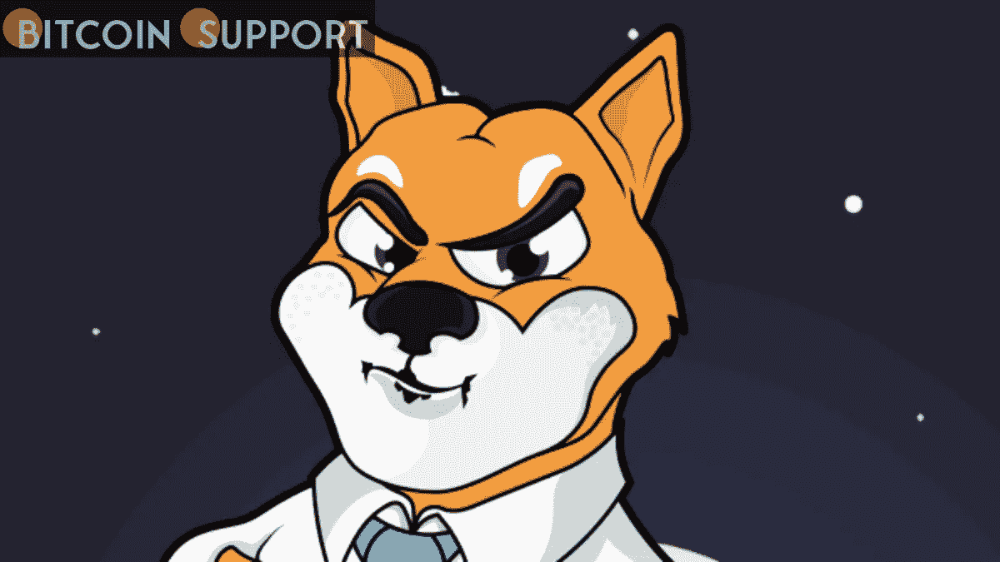
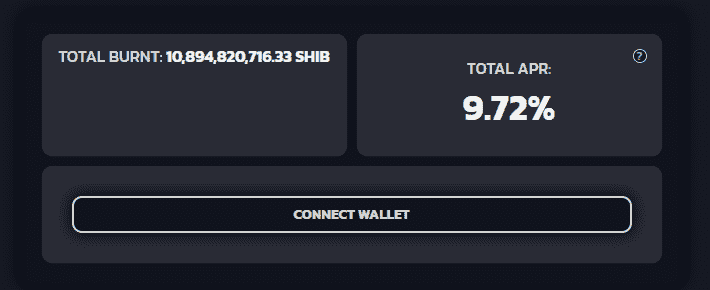

# 这里的情况越来越糟了:SHIB 公布了它燃烧的入口

> 原文：<https://medium.com/coinmonks/getting-shibby-with-it-shib-unveils-its-flaming-portal-c0027848cc2c?source=collection_archive---------58----------------------->

**Visit our website for full blog:-** [**https://bitcoinsupports.com/getting-shibby-with-it-shib-unveils-its-flaming-portal/**](https://bitcoinsupports.com/getting-shibby-with-it-shib-unveils-its-flaming-portal/)

柴犬的开发者建立了一个平台，可以燃烧比以往更多的 SHIB 代币，并对燃烧者的努力给予补偿。广受欢迎的 memecoin 项目 SHIB 柴犬(Shiba Inu)推出了一个 SHIB 烧钱门户，以减少代币供应，同时还允许用户获得被动福利。

根据柴犬团队的网站，该门户网站是专门为提高 SHIB 的稀缺性而设计的，并使其更加昂贵，“这是加密货币历史上最好的数字资产之一。”

该门户网站是柴犬和 RYOSHI 的愿景(Ryoshi)合作开发的一部分，这是一个基于以太坊的分散化金融(DeFi)倡议，旨在促进 SHIB 生态系统的建立。SHIB 燃烧者将从他们的工作中获得两个好处。首先，它们有助于减少模因币的发行量，理论上增加其稀缺性和价值。其次，他们在以太坊(ETH)钱包中获得 burntSHIB 代币，以可变的速度奖励持有者 RYOSHI。

**Visit our website for full blog:-** [**https://bitcoinsupports.com/getting-shibby-with-it-shib-unveils-its-flaming-portal/**](https://bitcoinsupports.com/getting-shibby-with-it-shib-unveils-its-flaming-portal/)

今天，该倡议宣布，在该门户网站推出后的头 24 小时内，在该平台上“将近 80 亿美元 SHIB 被烧毁”。

[https://twitter.com/Shibtoken/status/1518403481450680320](https://twitter.com/Shibtoken/status/1518403481450680320) T5 上市对 SHIB 的股价没有影响，据 CoinGecko 称，的股价在过去 24 小时内下跌了 3.3%，至本文写作时的 0.00002345 美元。

根据 SHIB 代币追踪机构 Burn Dashboard 的数据，到目前为止，已经销毁了 410 万亿枚 SHIB 代币，约占代币总供应量的 41%。此外，如果 SHIB 被投入闲置或未被使用的加密货币钱包，它可能会被烧。

最初，该倡议将 SHIB 全部供应量的一半分配给维塔利克·布特林。去年 5 月，他曾著名地将几乎所有的钱都付之一炬，并将剩下的钱捐给慈善机构。

**SHIBs 综述**

围绕着 SHIB 的兴奋情绪看起来越来越大，正如民调机构 Benzinga 在 4 月 23 日的一项研究中发现的那样，几乎两倍的受访者预测 SHIB 在比特币(BTC)达到 10 万美元之前会达到 0.001 美元。在 1000 名受访者中，有 64%的人更希望 SHIB 首先崛起。

此外，SHIB 一家开发商鼓励 SHIB 的比特币狂热者警惕那些试图模仿 Shiba Inu: deployer 2 钱包的犯罪分子。在 4 月 22 日的一篇博客文章中，Kaal Dhairya 解释说，钱包中加入了恶意代码，目的是隐藏谁给了部署者或从部署者那里接收了令牌。

Dhairya 指出，尽管个人应该意识到这个缺陷，但他们可能会对自己的资产安全有信心。他说:

**“骗子/聪明的营销人员利用编程欺骗数百万用户，偶尔，在获得代币许可后，额外的有害代码会耗尽你的钱包；我们一直看到这种情况，这让我们心碎，因为我们无法做任何事情来帮助他们。”**

**访问我们的网站获取完整的博客:**[**https://bit coin supports . com/get-shibby-with-it-shib-under-futures-fire-portal/**](https://bitcoinsupports.com/getting-shibby-with-it-shib-unveils-its-flaming-portal/)

**免责声明:以上均为作者观点，不应被视为投资建议。读者应该做自己的研究。**

> 加入 Coinmonks [电报频道](https://t.me/coincodecap)和 [Youtube 频道](https://www.youtube.com/c/coinmonks/videos)了解加密交易和投资

# 此外，请阅读

*   [Capital.com 审查](https://coincodecap.com/capital-com-review) | [港加密借贷平台](https://coincodecap.com/crypto-lending-hong-kong)
*   [如何在 Uniswap 上交换加密？](https://coincodecap.com/swap-crypto-on-uniswap) | [A-Ads 审核](https://coincodecap.com/a-ads-review)
*   [WazirX vs coin dcx vs bit bns](/coinmonks/wazirx-vs-coindcx-vs-bitbns-149f4f19a2f1)|[block fi vs coin loan vs Nexo](/coinmonks/blockfi-vs-coinloan-vs-nexo-cb624635230d)
*   [本地比特币审核](/coinmonks/localbitcoins-review-6cc001c6ed56) | [加密货币储蓄账户](https://coincodecap.com/cryptocurrency-savings-accounts)
*   [什么是保证金交易](https://coincodecap.com/margin-trading) | [美元成本平均法](https://coincodecap.com/dca)