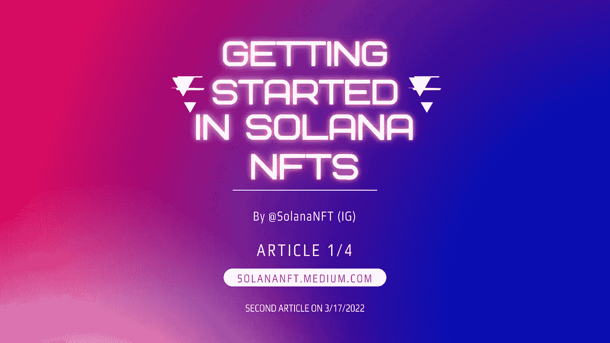

# Solana NFTs 入门

> 原文：<https://medium.com/coinmonks/getting-started-in-solana-nfts-c439f66c6aba?source=collection_archive---------17----------------------->

欢迎来到索拉纳！索拉纳是一个快速、安全的区块链，发展迅速，天然气费用接近 0 美元。这为销售艺术和高效用非功能性食物提供了一个无缝的环境。我们将带你走过一些我们希望在开始这段旅程时就知道的步骤——不要惊慌，我们在所有错误之后仍然在这里的事实意味着它是如此值得。

**研究**

每一笔好投资的基础。作为这个领域的新人，如果你想成功，你就要把你的每一秒空闲时间都用来学习。索拉纳生态系统是不断增长的，你会醒来发现前一天晚上不存在的东西。关键是要研究趋势，听取正确的人的意见，了解项目，支持强大的团队，并始终做自己的研究。这些因素中的每一个都扮演着重要的角色，并将影响你的投资策略。另一个有用的资源是像 [www.hellomoon.io](http://www.hellomoon.io) 这样的数据聚合器，在那里你可以找到大量关于索拉纳、不同的 NFT 项目甚至 SPL 代币的信息。

**研究趋势**

随着你在索拉纳·NFT 领域积累经验，你会发现在下一个趋势到来之前，某些趋势会被炒作一阵子。我们已经看到的趋势包括版税、育种、赌博、元宇宙和博彩。一个项目将是第一个做这件事的，几个会做得一样好或者更好，然后会有几十个甚至几百个项目做不到。这就是第三个因素出现的地方。

**了解项目**

加入不和谐服务器。关注 Twitter 页面。研究路线图。查看总供应和铸造常见问题。团队是否已经 doxxed(确定)？这个项目经过审查了吗？这些是你在考虑一个新项目时应该考虑的一些问题。为什么这个项目值得你花钱？你会得到一些回报吗，或者艺术就是这么伟大，值得投资吗？这些是你必须做出的决定——记住，除了你自己，没有人对你决定投资/不投资后发生的事情负责。

**支持强队**

在 Discord 服务器、ama 和 Twitter 空间上花些时间从来都不是一个坏主意。尝试找出构建团队所说的他们要构建的东西需要什么，以及这是否可能。尽你最大的能力来判断这些人是否是你想把钱给的人。强大的团队所做的事情包括快速而有效地进行决策，与社区和公众有效地沟通，信守承诺&按时(或提前)交付，以及友好而热情地行动。在某些情况下，建设一个 NFT 项目与建设一家公司非常相似——你会购买一家由缺乏上述品质的人领导的公司的股票吗？

向合适的人展示自己

有许多人在索拉纳·NFT 的推特上给出了可靠的建议。还有 100 倍多的骗子和“有影响力的人”利用他们的追随者作为退出流动性。关注你感兴趣的客户，忽略 FUD，但要留意危险信号和建议质量。记住每个人的情况都不一样，千万不要盲从任何人。拥有一个 1000 索尔的投资组合并购买一个 20 索尔的 NFT 与拥有一个 30 索尔的投资组合并购买一个 20 索尔的 NFT 是非常不同的。该领域的一些杰出人士包括:

@Rajgokal(索拉纳联合创始人)

@aeyakovenko(索拉纳联合创始人)

@Solana Legend(美国 FTX NFTs)

@ SolBigBrain(how rare . is 创始人)

@knox_trades(索拉纳 NFT Youtube 频道)

@Brantoshi(创造联系和财富)

@gaius1337(构建者)

@ JaakoNFT(alpha Dao 联合创始人)

@ 0x _ fxnction(德根)

@HODLSolana(必须有迷因)

在我们的下一篇文章中，我们将带你创建你自己的免费虚拟钱包，你可以在整个 Solana 生态系统中使用它。您可以使用您的幻影钱包购买和存储 NFT，SPL 代币，访问 defi 应用程序，等等！

> 加入 Coinmonks [电报频道](https://t.me/coincodecap)和 [Youtube 频道](https://www.youtube.com/c/coinmonks/videos)了解加密交易和投资

# 另外，阅读

*   [CoinLoan 评论](https://coincodecap.com/coinloan-review)|[Crypto.com 评论](/coinmonks/crypto-com-review-f143dca1f74c)
*   [如何在加拿大购买加密货币？](https://coincodecap.com/how-to-buy-cryptocurrency-in-canada)
*   [百无聊赖的猿游艇俱乐部(BAYC)审查](https://coincodecap.com/bored-ape-yacht-club-bayc-review)
*   [5 款最佳加密交易终端](https://coincodecap.com/crypto-trading-terminals) | [最佳 DeFi 应用](https://coincodecap.com/best-defi-apps)
*   [最佳网上赌场](https://coincodecap.com/best-online-casinos) | [币安评论](/coinmonks/binance-review-ee10d3bf3b6e) | [BitMEX 评论](https://coincodecap.com/bitmex-review)