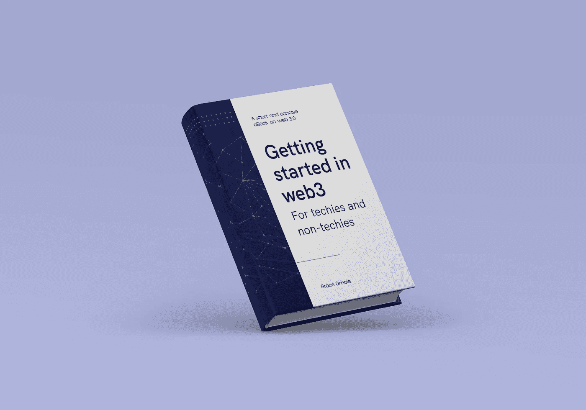
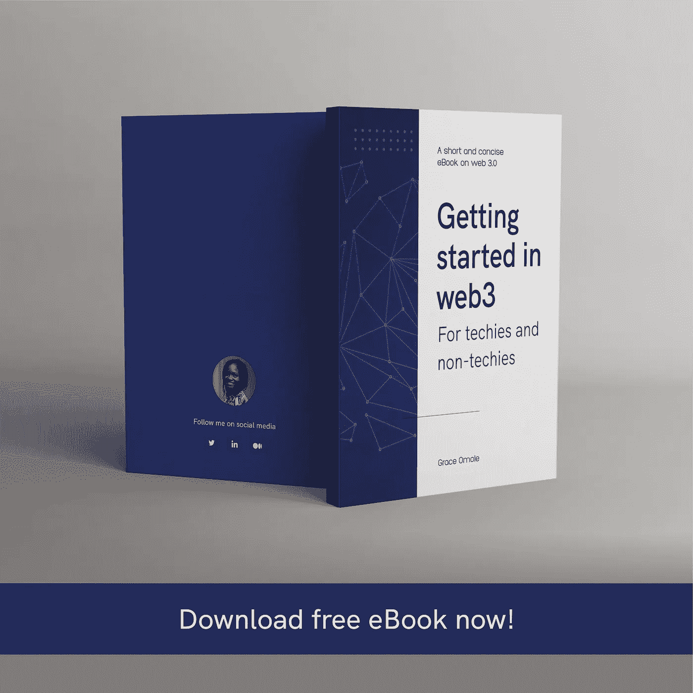

# Web 3.0 入门

> 原文：<https://medium.com/coinmonks/getting-started-in-web-3-0-2000385c2264?source=collection_archive---------27----------------------->

正如你已经知道的，网络是一个不断改进的新兴系统，并且总是因为新兴技术而变得更好。

我决定写一本关于“Web 3 入门”的免费电子书。这是一本关于 web 3 基础知识的简明扼要的书，是你入门所需要知道的。

NFTs，DAOs，区块链游戏，DeFi 的基本解释都在这本书里。

你可以通过这个链接获得免费电子书！

 [## 格雷丝 (女子名)

### Grace 电子邮件表单

bit.ly](https://bit.ly/web3Intro) 

请注意，你可以在 Web 2 中做的一切，你也可以在 web 3 中做。获取我的免费电子书以获得更多关于 web 3 的见解。

你可以把这个分享给任何你认为可能需要的人。

> *加入 Coinmonks* [*电报频道*](https://t.me/coincodecap) *和* [*Youtube 频道*](https://www.youtube.com/c/coinmonks/videos) *了解加密交易和投资*

# 另外，阅读

*   [有哪些交易信号？](https://coincodecap.com/trading-signal) | [Bitstamp vs 比特币基地](https://coincodecap.com/bitstamp-coinbase) | [买索拉纳](https://coincodecap.com/buy-solana)
*   [ProfitFarmers 点评](https://coincodecap.com/profitfarmers-review) | [如何使用 Cornix 交易机器人](https://coincodecap.com/cornix-trading-bot)
*   [十大最佳加密货币博客](https://coincodecap.com/best-cryptocurrency-blogs) | [YouHodler 评论](https://coincodecap.com/youhodler-review)
*   [my constant Review](https://coincodecap.com/myconstant-review)|[8 款最佳摇摆交易机器人](https://coincodecap.com/best-swing-trading-bots)
*   [MXC 交易所评论](/coinmonks/mxc-exchange-review-3af0ec1cba8c) | [Pionex vs 币安](https://coincodecap.com/pionex-vs-binance) | [Pionex 套利机器人](https://coincodecap.com/pionex-arbitrage-bot)
*   [我的密码交易经验](/coinmonks/my-experience-with-crypto-copy-trading-d6feb2ce3ac5) | [比特币基地评论](/coinmonks/coinbase-review-6ef4e0f56064)
*   [CoinFLEX 评论](https://coincodecap.com/coinflex-review) | [AEX 交易所评论](https://coincodecap.com/aex-exchange-review) | [UPbit 评论](https://coincodecap.com/upbit-review)