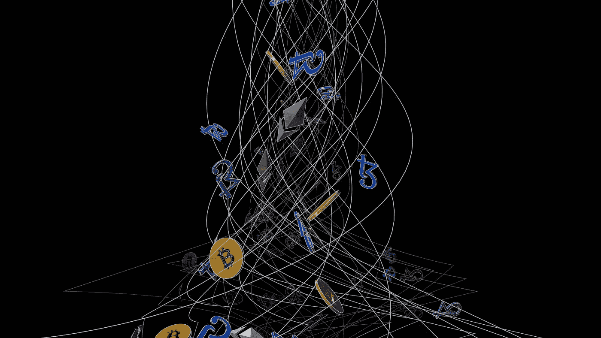

# Web3 入门

> 原文：<https://medium.com/coinmonks/getting-started-with-web3-3b62acee1eaf?source=collection_archive---------20----------------------->

Photo by [Shubham Dhage](https://unsplash.com/@theshubhamdhage?utm_source=medium&utm_medium=referral) on [Unsplash](https://unsplash.com?utm_source=medium&utm_medium=referral)

Web3 到底是什么？

简单地说，正如我们所知，Web3 是互联网的最新版本。在此版本中，用户可以完全控制他们的内容、数据和资产。

没有中间人，因为现在有大公司和政府控制和管理互联网上发生的一切。

在一些地方，像互联网的去中心化和民主化这样的短语可能被用来描述 Web3，这可能会令人困惑。暂且把放权想成是对自己负责，而不是被别人控制和监督。

## Web1 只给你一个读权限

当互联网在上世纪 80 年代首次推出时，Web1 诞生了。很少有人或组织创造材料，如新闻机构、搜索引擎和目录。这段时间互联网上的大部分流量都是只读的。他们寻找一篇文章，读完，然后合上；这大概是他们活动的范围。

作为 Web 1 示例的 Geocities 网站

## 在网上读和写 2

Web2 创建于 2000 年代，至今仍在使用。像我和你这样的用户现在可以在社交媒体上与我们的朋友分享我们对刚刚阅读的故事的评论。它允许任何人同时成为内容创造者和消费者，然而我们这些积累粉丝的人只能得到报酬。现在，媒体是在社交媒体平台上创建的，社交媒体平台可能会随后将个人数据出售给营销人员，以产生大笔资金。然而，由于公司收集了我们如此多的个人信息，隐私已经成为一个问题。

博客是 Web2 网站的一个例子。

**web 3——读、写、拥有**
Web3 解决了隐私和个人数据的问题，这已经成为一个问题。Web3 的参与者将完全控制他们的内容、数据和资产。它象征着一个民主化的互联网，一个由用户为了用户的利益而运行的互联网。现在，处于顶层的个人控制着一切；在 Web3 中，它们可能不存在。即使他们有，你也不需要他们，因为你建造的东西将是你的。

Web3 的一个例子:Pancakeswap

在此基础上，Web3 将利用区块链让用户完全拥有他们的资产、数据和几乎所有东西。

## 那么，区块链到底是什么？

区块链是一个公共记录数据库。它将数据组织成称为块的块。将这些部分连接起来就形成了一条连续的线。积木的集合。有一个区块链。每个区块都类似于一本书的一页。

它作为不可变的(固定的、不可更改的、不可动摇的)交易记录，不需要任何外部机构来确认数据的有效性和完整性，如银行、政府或大型组织。

正如我之前所说，区块链是一个公共的信息数据库，这意味着没有一个单一的组织或中央机构(如马克·扎克伯格)维护和控制数据库和邪恶的窃笑。

事实上，数百万互联网用户协助管理和维护这些记录。

简而言之，这些变化将导致一个开放的、不信任的、没有权限的网络。如果这对你来说听起来很奇怪，让我澄清一下。

**Open** :这将是一个开放源代码软件，由一个开放的、可访问的开发者社区开发，并在公众视野中实现。

它将是完全**无信任的**，允许成员在没有第三方干涉的情况下公开或私下交谈。

用户和供应商不需要管理机构的**许可**就可以参与。

知识学分:元学校

> 加入 Coinmonks [电报频道](https://t.me/coincodecap)和 [Youtube 频道](https://www.youtube.com/c/coinmonks/videos)了解加密交易和投资

# 另外，阅读

*   [如何在 Uniswap 上交换加密？](https://coincodecap.com/swap-crypto-on-uniswap) | [A-Ads 审查](https://coincodecap.com/a-ads-review)
*   [WazirX vs CoinDCX vs bit bns](/coinmonks/wazirx-vs-coindcx-vs-bitbns-149f4f19a2f1)|[block fi vs coin loan vs Nexo](/coinmonks/blockfi-vs-coinloan-vs-nexo-cb624635230d)
*   [本地比特币评论](/coinmonks/localbitcoins-review-6cc001c6ed56) | [加密货币储蓄账户](https://coincodecap.com/cryptocurrency-savings-accounts)
*   什么是融资融券交易
*   [支持卡审核](https://coincodecap.com/uphold-card-review) | [信任钱包 vs 元掩码](https://coincodecap.com/trust-wallet-vs-metamask)
*   [Exness 评测](https://coincodecap.com/exness-review)|[moon xbt Vs bit get Vs Bingbon](https://coincodecap.com/bingbon-vs-bitget-vs-moonxbt)