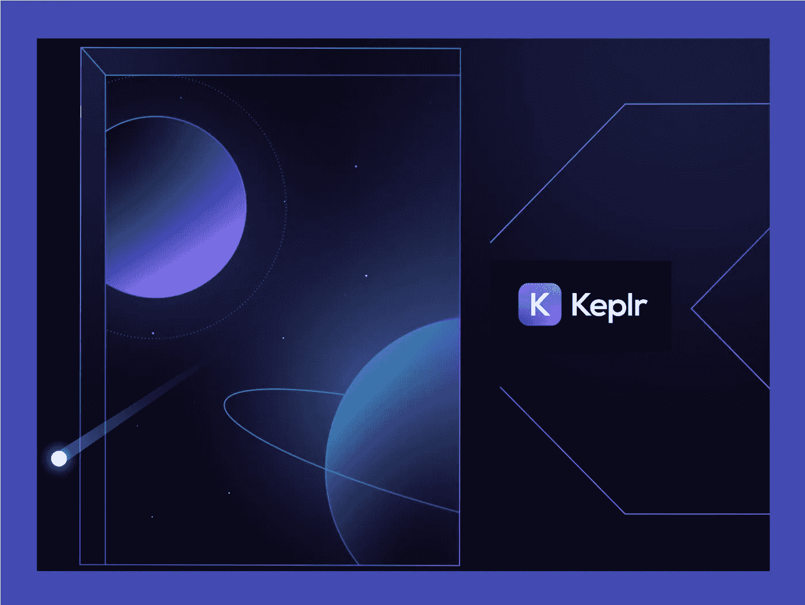
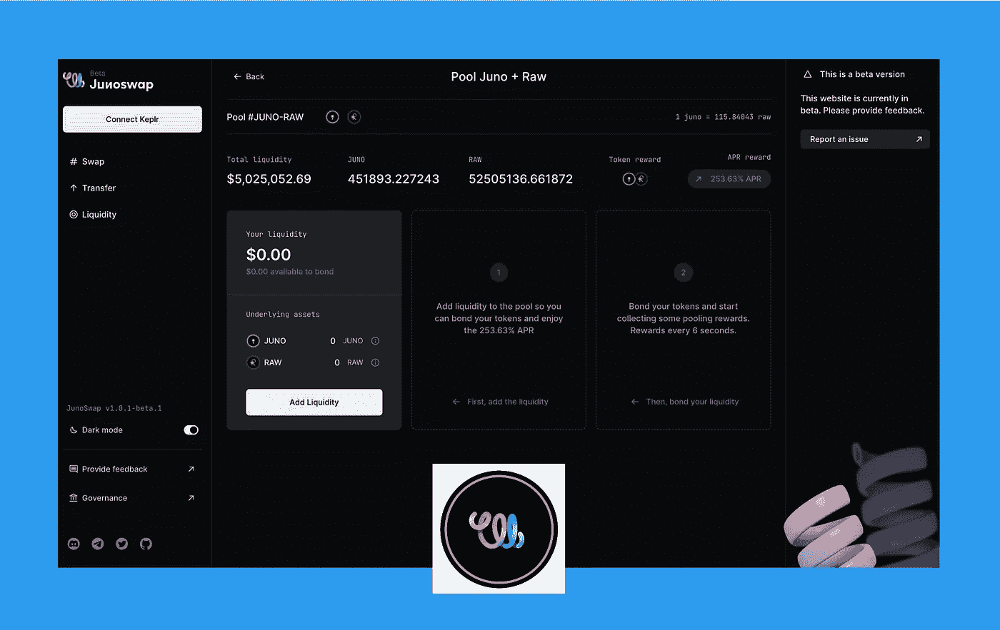
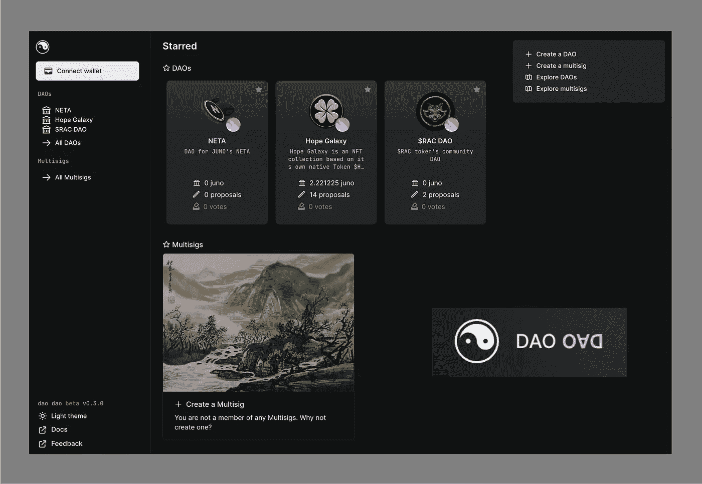
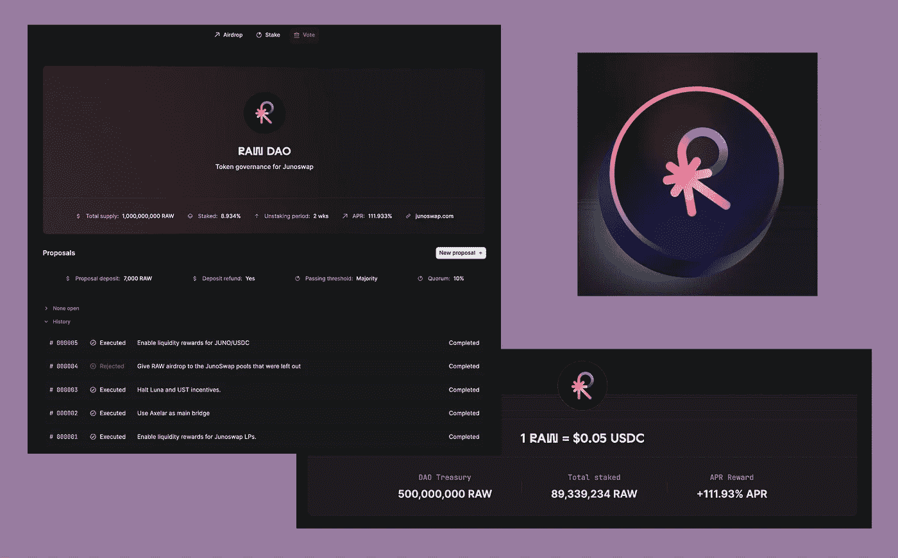
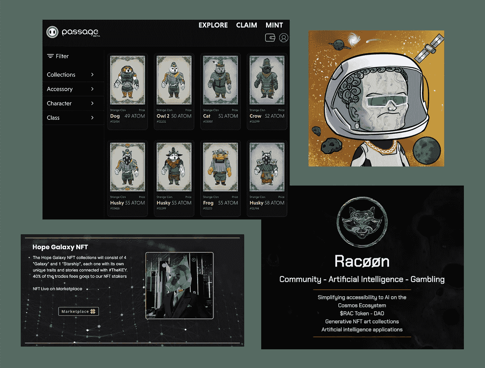
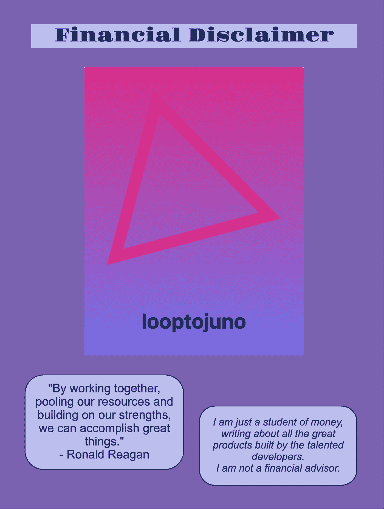

# 了解朱诺

> 原文：<https://medium.com/coinmonks/getting-to-know-juno-bcd8192d7d90?source=collection_archive---------17----------------------->

# 向 Loop 社区介绍 Juno 网络

对于环路社区中不熟悉 Juno 网络的人，我想简要介绍一下它所提供的功能。我希望它能对你有所帮助，让你快速了解新区块链。如果你想阅读区块链的概述，我在下面的资源部分留下了一些有用文章的链接。为了快速启动您自己的研究和探索，我在 Sources 部分提供了我讨论的所有内容的链接，以及更多有用的站点和工具的附加链接。

我分享 Loop 团队在最新的 AMA 中表达的兴奋，以及对官方声明的积极和令人鼓舞的回应。自去年 11 月以来，我一直在积极探索 Juno 网络，印象深刻！那些关注过我的旅程的人，知道我对 Loop 团队及其创新产品的感受。我认为 Loop 在 Juno 网络上推出其产品套件是一项令人难以置信的发展，我期待成为其中的一员。

本文的目的是强调入门所需的应用和工具，指出一些有用的比较，并讨论当 Loop 加入 Juno 网络时可能出现的一些协同效应和机会。

# 从 Keplr 钱包开始

要与 Juno 网络互动，您需要设置一个 Keplr 钱包。Keplr 钱包的惊人之处在于，它将对宇宙中的许多区块链有用。Keplr 会给你很多钱包地址，每个地址对应一个支持的区块链。从一个切换到另一个是一个简单的点和点击顶部菜单。

要下载桌面版 Google Chrome 扩展或移动版钱包，请从这里开始:

[https://www.keplr.app/](https://www.keplr.app/)

在 Keplr 中，您还可以管理您的赌注头寸，对治理提案进行投票，并从仪表板上了解您的持有情况。在源代码部分，我留下了一个链接，链接到一篇对开始使用 Keplr 很有帮助的文章。

【https://wallet.keplr.app/#/dashboard 号

直到几周前，在 Juno 上开始交易和与 dApss 互动还非常容易。你所做的只是向你在 Keplr 中的 Terra 钱包发送一些 UST，从 Juno 上的 DEX 中点击存款，然后你就开始运行了。不幸的是，这些资金轨道已经关闭，因为 IBC 与 Terra 的渠道被关闭，价值暴跌。

现在，你将不得不通过中央交易所登机；例如，您可以购买 ATOM，将它直接发送到您的 Keplr 钱包，并将其存入 JUNO，在那里您可以用它来交换 Juno。或者，你可以用菲亚特买下 USDC，通过 Axelar 将其转换并连接到 Juno。随着 Kado Money 将在 Juno 上推出，这一切很快就会变得非常简单，从而使升级变得快速而廉价。

需要 JUNO 支付交易费用；因此，得到一些代币应该是你的第一次购买。交易费用极低，仅为 JUNO 的零头。如果你的钱包里没有任何 JUNO，你可以利用渗透 AMM 的无掉期交易。Keplr 有三个级别的交易:低，平均，高。在潜移默化中，当你用低位期权交易时，你不会被收取费用。因此，您可以在 Osmosis 上从 ATOM 或 USDC 切换到 Juno，将它从 Osmosis 直接撤回到 JUNO 网络，并开始在区块链的 dApps 上使用它。

> 加入 Coinmonks [电报频道](https://t.me/coincodecap)和 [Youtube 频道](https://www.youtube.com/c/coinmonks/videos)了解加密交易和投资

# 与 JunoSwap 交易和耕种

JunoSwap 分散式交易所实现了区块链本地资产与宇宙中许多其他著名区块链的 IBC 资产之间的互换。目前，35 个代币可以互换。来自其他支持 IBC 的区块链的非 Juno 本机令牌可以直接存放在 JunoSwap 上。目前，有 13 个这样的令牌，预计还会添加更多。IBC 交易在后台处理，您无需在 Keplr 中手动处理交易。虽然路线有点长，过程有多个步骤，但您也可以通过 Axelar 的卫星 dApp 将您现有的 USDC 存放在 JunoSwap 上，从以太坊和其他区块链。

【https://junoswap.com/ 

JunoSwap 已经启动并运行了四个激励性流动性池(JUNO 与 ATOM、RAW、OSMO 和 NETA 配对)，奖励以 RAW(本机 DEX 令牌)支付。其中两个流动性池向我们提供双重激励:JUNO 和 RAW。一旦提案被提出并获得通过，其他流动性池的额外激励将通过治理投票产生。针对朱诺-USDC 池的激励措施刚刚获得批准(通过治理)，预计将很快启动。

Loop 和 JunoSwap 的 DEX 功能之间的协同作用已经成熟，可以加以利用。新资产和新配对显然是发展 dApp 间合作的好方法；但是，可以开发和推出新的 DeFi 产品，从所有锁定的 LP 代币和所有押单代币中提取附加值。

# 未来是道道

Juno 网络上最激动人心的 dApps 之一就是刀刀！您可以使用 dao Dao 创建和启动 Dao 或 multi-sig，并使用它来管理您的业务、组织、项目或分散社区的资金。提供了所有的工具来支持治理提议和投票，启动令牌，并开始对治理令牌进行标记。

[https://daodao.zone/dao/list](https://daodao.zone/dao/list)

搜索栏可用于快速找到您正在寻找的特定 dao，并且正在讨论开发其他功能，如对治理提案(等待投票)进行排序和分组。

作为一个例子，RAW Dao 已经成功地与治理提案和投票一起运作，以推出令牌和激励农业，以及对 RAW 令牌进行标记。

https://www.rawdao.zone/

还可能存在一个很好的机会，为循环作者社区利用 Dao Dao，并用它自己的(单独的)库、治理过程和激励的赌注系统来扩展它。

# NFTs 和游戏

第一批 NFT 收藏、符号化的非功能性游戏、游戏和赌博项目已经推出，还有几个项目正准备投入使用。这些早期项目包括:

https://market.passage3d.com/[段落](https://market.passage3d.com/)

大理石—[https://www.marbledao.finance/](https://www.marbledao.finance/)

https://www.hopegalaxy.io/[NFT 希望银河](https://www.hopegalaxy.io/)

浣熊—[https://www.racoon.supply/](https://www.racoon.supply/)

# (不)名词

Juno 网络上还有一个分散的名称服务，它不仅易于使用，而且还有许多很棒的名称可供选择。

[https://dens.sh/](https://dens.sh/)

# 强大的社区

我积极参与 dApps，参与治理投票，密切关注公告，收听播客，观看视频，熟悉 Juno 网络和 Loop Finance 的路线图。对我来说，一个突出的优点是两个团队都有参与各自用户社区的愿望。我们的重点一直是透明和诚实的沟通，以构建有用、有趣和易于使用的工具和应用程序为使命和不懈努力。

有许多可以利用的协同作用。Loop 的新 NFT 市场开辟了一个全新的世界，充满了收藏品、娱乐、艺术和游戏化资产。结合 Juno 网络上的快速处理、低廉的交易成本以及 Loop 整个产品套件中漂亮一致的用户界面，这对每个参与者来说都是一个令人兴奋的新机会。

Juno 和 Loop 从一开始就将与其他项目和团队建立合作伙伴关系作为优先事项。因此，存在的与 IBC 连接的可能性使得区块链跨越宇宙似乎是无限的。凭借 Juno 网络上提供的强大工具库，从 ease of Loop 的产品套件中访问所有这些资产将成为我们链间未来的一项重要功能！

Tot ziens — Opa。

# 资料来源、参考文献和进一步阅读

朱诺网络—[https://www.junonetwork.io/](https://www.junonetwork.io/)

https://junoscan.com/[的 JunoScan 区块探索者](https://junoscan.com/)

Mintscan 块浏览器—【https://www.mintscan.io/juno 

朱诺的数据和图表(来自 Bro n Bro)-[https://monitor.bronbro.io/d/juno-stats/juno-stats](https://monitor.bronbro.io/d/juno-stats/juno-stats)

统计数据和图表(来自 cosmos pug)——[https://cosmospug.com/charts/](https://cosmospug.com/charts/)

朱诺网络文档—[https://docs.junonetwork.io/juno/readme](https://docs.junonetwork.io/juno/readme)

JunoSwap 文档—[https://docs.junoswap.com/](https://docs.junoswap.com/)

吉赛尔的 Medium 文章《如何下注$JUNO 并使用 Keplr Wallet 申领奖励》——[https://Medium . com/stakin/How-to-Claim-jun % C3 % B8-stakedrop-Stake-with-Keplr-Wallet-21837341901 b](/stakin/how-to-claim-junø-stakedrop-stake-with-keplr-wallet-21837341901b)

诺拉波娃的循环文章《朱诺。巨人的诞生”——[https://www.loop.markets/juno-birth-of-a-juggernaut/](https://www.loop.markets/juno-birth-of-a-juggernaut/)

达米安的媒介文章《引论》。Juno”“[https://medium . com/simply-VC/Juno-network-an-introduction-BF 9499 c 83716](/simply-vc/juno-network-an-introduction-bf9499c83716)

Cooper 的 Loop 文章“Juno 网络上的(de)NS 简介”—[https://www . Loop . markets/intro ucing-de-NS-name-service-on-Juno-Network/](https://www.loop.markets/introucing-de-ns-name-service-on-juno-network/)

诺拉波娃的循环文章《神像的姐妹》——https://www.loop.markets/the-juggernauts-sisters/

