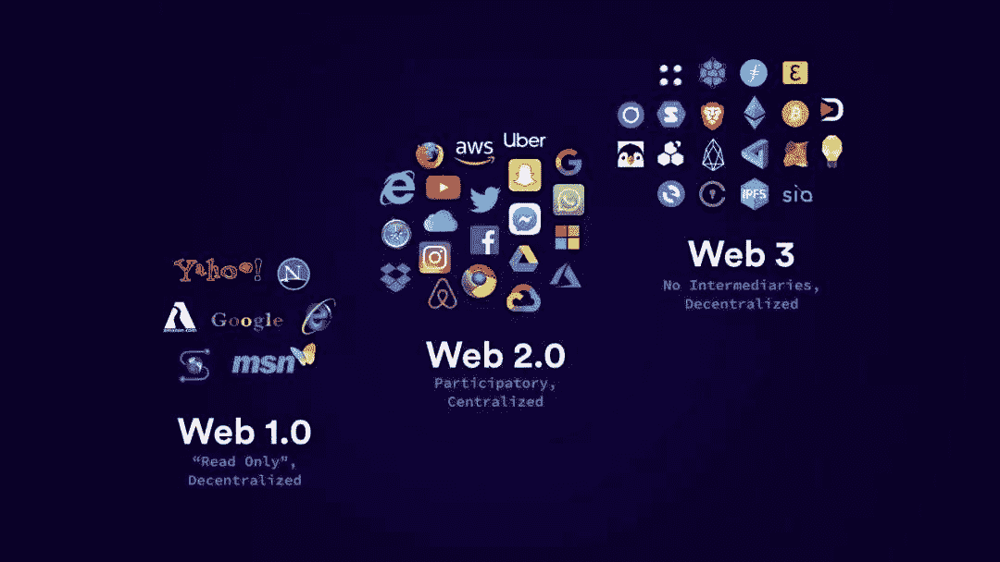

# GitHub 知识库学习 Web3 开发

> 原文：<https://medium.com/coinmonks/github-repositories-to-learn-web3-development-f456e33e25d8?source=collection_archive---------10----------------------->

1)Defi-开发者路线图
👉Defi Developer roadmap 是一本精心策划的 Web3.0 开发人员手册，其中包括一系列用于 DApps、开发资源和 lifehacks 的最佳工具。
🔗【https://github.com/OffcierCia/DeFi-Developer-Road-Map 号

2)全区块链固化课程
👉终极可靠性、区块链和智能合约—初学者到专家全程| Python 版
🔗[https://github . com/smartcontractkit/full-区块链-solidity-course-py](https://github.com/smartcontractkit/full-blockchain-solidity-course-py)

3)令人敬畏的坚固性
👉令人敬畏的 Solidity 资源、库、工具等的精选列表
🔗[https://github.com/bkrem/awesome-solidity](https://github.com/bkrem/awesome-solidity)

4)牛逼的区块链
👉一个令人敬畏的区块链集合——开放的分布式公共数据库，带加密哈希，包括 git-).区块链是新的郁金香🌷🌷🌷。分布式是新的集中式。
🔗[https://github.com/openblockchains/awesome-blockchains](https://github.com/openblockchains/awesome-blockchains)

5)区块链学习路径
👉区块链发展的建议学习路径
🔗[https://github.com/protofire/blockchain-learning-path](https://github.com/protofire/blockchain-learning-path)

6)用两个月时间学习区块链
👉这是 Siraj Raval 在 Youtube
上发布的“2 个月学会区块链”的代码🔗[https://github.com/llSourcell/Learn_Blockchain_in_2_months](https://github.com/llSourcell/Learn_Blockchain_in_2_months)

7)JS 中的区块链
👉建造你自己的区块链！
🔗[https://github.com/nambrot/blockchain-in-js](https://github.com/nambrot/blockchain-in-js)

感谢您的阅读，请在媒体上跟随我阅读这些内容丰富的博客。

> 加入 Coinmonks [电报频道](https://t.me/coincodecap)和 [Youtube 频道](https://www.youtube.com/c/coinmonks/videos)了解加密交易和投资

# 另外，阅读

*   [最佳期货交易信号](https://coincodecap.com/futures-trading-signals) | [流动性交易所评论](https://coincodecap.com/liquid-exchange-review)
*   [最佳加密交易信号电报](/coinmonks/best-crypto-signals-telegram-5785cdbc4b2b) | [MoonXBT 评论](/coinmonks/moonxbt-review-6e4ab26d037)
*   [OKEx 评论](/coinmonks/okex-review-6b369304110f) | [Coinswitch 俱吠罗评论](/coinmonks/coinswitch-kuber-review-1a8dc5c7a739) | [比特币基地收费](/coinmonks/coinbase-fees-831e77d4f2c5)
*   [AscendEX 审查](/coinmonks/ascendex-review-53e829cf75fa) | [OKEx 交易机器人](/coinmonks/okex-trading-bots-234920f61e60) | [OKEx 交易机器人](/coinmonks/okex-trading-bots-234920f61e60)
*   [火币交易机器人](https://coincodecap.com/huobi-trading-bot) | [如何购买 ADA](https://coincodecap.com/buy-ada-cardano) | [Geco。一篇评论](https://coincodecap.com/geco-one-review)