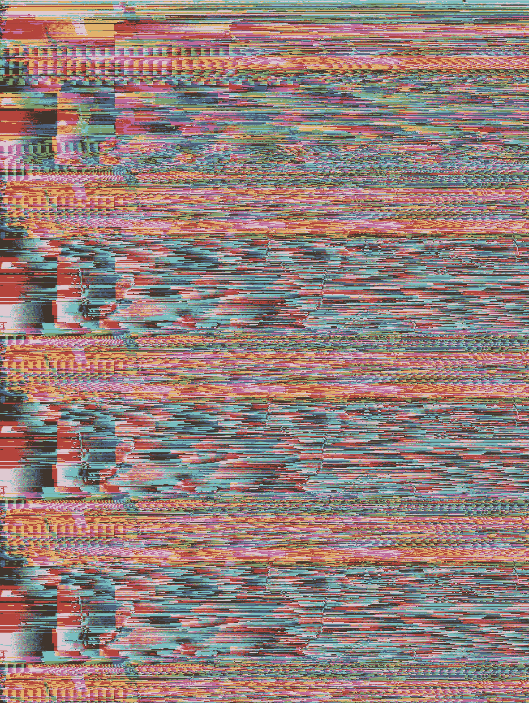

# 小故障不仅仅是技术故障(它们是美丽艺术的基础)

> 原文：<https://medium.com/coinmonks/glitches-are-not-just-technical-malfunctions-they-are-the-basis-of-beautiful-art-4a15fff2b98a?source=collection_archive---------69----------------------->

你有没有发现自己在寻找一个可以悬挂的地方，却意外地发现了一颗隐藏的宝石？

后来才发现你认识的每个人都去这个地方很多年了？

这就是格林奇艺术给我的感觉。在过去的几个月里，我花了很多时间看 NFT 的艺术品，听不同艺术家的故事。我注意到了一些常见的文体模式，最终我明白了——这里面有蹊跷。

故障艺术涉及故意制造故障或突发故障，产生意想不到的结果来创造艺术。

它不是很新。它已经持续了 20 多年，并可以追溯到 1978 年的一部名为[数字电视晚餐](https://www.youtube.com/watch?v=Ad9zdlaRvdM)的作品(有人会说它甚至可以追溯到更久)。这件作品是由 Raul Zaritsky，Jamie Fenton 和 Dick Ainsworth 使用 [Bally Astrocade](https://en.wikipedia.org/wiki/Bally_Astrocade) 游戏系统创作的(是的，在 70 年代，视频游戏控制台被用来创作艺术)。

Glitch art 是对通过颜色和声音技术的进步而创造的过度抛光的美学的蔑视。在 90 年代，这是对过度 PS 的杂志封面模特的拒绝，今天，这将是对过度过滤的 Instagram 帖子的同样态度。

[Glitch art piece](https://commons.wikimedia.org/wiki/File:Glitch_Art.jpg) by Rosa Menkman, [CC BY 2.0](https://creativecommons.org/licenses/by/2.0), via Wikimedia Commons

但是，这并不新鲜。我们总是对技术缺陷导致的失真声音和视觉的纹理和原始质量着迷。

格林奇更喜欢现场专辑的原始声音，而不是经过清理的录音室录音。

格林奇是 70 年代的主持人，他混合唱片并扩展节拍，从而诞生了嘻哈音乐。

毛刺是重金属电吉他的哀嚎不和谐。

假信号是在一次聚会中灯光闪烁时来自另一方的通信。

Glitch 不仅仅是一个故障，它打破了常规的舒适模式。这是另一个世界的启示。

当我想到 glitch 时，我会立即想到 Matrix。你知道尼欧在门口看到一只猫然后说“似曾相识”的那场戏吧

所有人都愣住了，他说他看到两只不同的猫走过门口。

他们告诉他似曾相识是黑客帝国中的一个*故障*。

关键是 glitch 不仅仅是一种亚文化，它也是主流。2009 年，坎耶·韦斯特为他和卡迪小子的歌曲[做了这个美丽的音乐视频。电台司令因其音乐中的毛刺效果而闻名，任何涉及黑客或技术的电影或电视节目经常在编辑中使用毛刺效果。](https://www.youtube.com/watch?v=wMH0e8kIZtE)

在故障艺术中，你会发现一些艺术家通过操纵输入产生意想不到的结果来故意制造故障。你还会发现艺术家在他们的艺术作品上添加了瑕疵美学。在这种情况下，毛刺不是实际的毛刺，而是根据常见的视频/音频毛刺模式而程式化的。

如果这件作品激起了你对毛刺艺术的兴趣，我将分享一些我在过去几个月里发现的艺术家。

第一组是我遇到的把他们的作品称为 NFT 的密码艺术家:

[XCOPY](https://xcopy.art/)

[杰克福特](https://twitter.com/JakNFT)

[杰克](https://www.jakethedegen.com/)

[wondermundo](https://wondermundo.com/)

[多姆巴拉](http://www.dombarra.art/)

下一组是传统艺术界的艺术家:

[罗莎·门克曼](https://rosa-menkman.blogspot.com/)

[JODI](https://www.artsy.net/artist/jodi)

丹尼尔·坦金

萨巴托·维斯康帝

克里斯·多兰

上面的列表只是我通过自己的数码漫游发现的一些艺术家。如果你有喜欢的艺术家，请在下面的评论区分享。

*原载于* [*本航次*](https://web3voyage.substack.com/p/no-15-bluechip-projects-and-best?s=w) [*迅*](https://web3voyage.substack.com/p/no-18-glitches-are-not-just-technical?s=w)**2022 年 4 月 22 日。**

*随着我对 Web3 的深入研究，讨论将涉及加密货币，我希望确保包含此免责声明。这不是财务建议，仅供参考。*

*作为免责声明，我没有金融方面的背景或专业知识。法学，或者经济学。本文探讨了新技术，如 NFTs 和加密货币，以及艺术家和创作者的潜在用途。这仅供参考。它不提供也不打算用作法律、投资、财务或其他建议。*

**在我的* [*类型共享社交博客*](https://typeshare.co/hassank/posts/glitches-are-not-just-technical-malfunctions-they-are-the-basis-of-beautiful-art--5rdh) 上阅读这篇文章和更多内容*

> **加入 Coinmonks* [*电报频道*](https://t.me/coincodecap) *和* [*Youtube 频道*](https://www.youtube.com/c/coinmonks/videos) *了解加密交易和投资**

# *另外，阅读*

*   *[3 商业评论](/coinmonks/3commas-review-an-excellent-crypto-trading-bot-2020-1313a58bec92) | [Pionex 评论](https://coincodecap.com/pionex-review-exchange-with-crypto-trading-bot) | [Coinrule 评论](/coinmonks/coinrule-review-2021-a-beginner-friendly-crypto-trading-bot-daf0504848ba)*
*   *[莱杰 vs n rave](/coinmonks/ledger-vs-ngrave-zero-7e40f0c1d694)|[莱杰 nano s vs x](/coinmonks/ledger-nano-s-vs-x-battery-hardware-price-storage-59a6663fe3b0) | [币安评论](/coinmonks/binance-review-ee10d3bf3b6e)*
*   *[Bybit Exchange 审查](/coinmonks/bybit-exchange-review-dbd570019b71) | [Bityard 审查](https://coincodecap.com/bityard-reivew) | [Jet-Bot 审查](https://coincodecap.com/jet-bot-review)*
*   *[3 commas vs crypto hopper](/coinmonks/3commas-vs-pionex-vs-cryptohopper-best-crypto-bot-6a98d2baa203)|[赚取加密利息](/coinmonks/earn-crypto-interest-b10b810fdda3)*
*   *最好的比特币[硬件钱包](/coinmonks/hardware-wallets-dfa1211730c6) | [BitBox02 回顾](/coinmonks/bitbox02-review-your-swiss-bitcoin-hardware-wallet-c36c88fff29)*