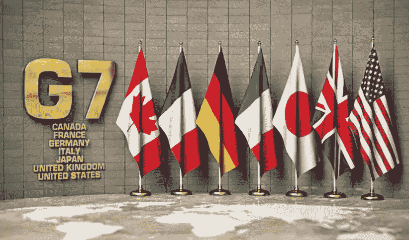

# 全球金融监管机构将在 G7 峰会上讨论加密货币

> 原文：<https://medium.com/coinmonks/global-financial-regulators-to-discuss-cryptocurrency-at-g7-summit-aa508a4ffeb1?source=collection_archive---------37----------------------->

G7 的央行行长和财政部长计划讨论加密货币的监管问题。

法国央行行长弗朗索瓦·维勒罗伊·德加洛(Franç ois Villeroy de Galo)表示，美国、加拿大、日本、德国、法国、意大利和英国的代表可能会在德国城市波恩和柯尼希斯温特举行的会议上，就加密货币的监管框架相关问题发表讲话。从周三开始。维勒罗伊表示，加密货币市场最近的波动可能与一些稳定的货币与美元脱钩以及主要代币价格下跌有关，这对全球监管机构来说是一个“警钟”。

> “欧洲用 MiCA 铺平了道路，”维勒罗伊在巴黎的新兴市场会议上表示，他指的是欧洲议会旨在塑造加密货币监管框架的立法。“或许[……]本周在德国举行的七国集团会议上，我们将与许多其他人一起讨论这些问题。”

法国央行行长在巴黎新兴市场论坛的演讲中补充道:

> “如果加密资产在不同管辖区之间没有以一致和适当的方式进行监管、监控和相互兼容，它们就有可能扰乱国际金融体系。”

据七国集团网站报道，财政部长和央行行长将于 5 月 18 日至 20 日在德国举行会议，讨论新冠肺炎疫情会议后七国集团成员国的复苏和金融稳定相关政策，“在数字化和气候中立的背景下塑造即将到来的转型进程”，以及国际货币基金组织的业务政策。该组织就 2021 年可能采用央行数字货币提出了建议，据报道，早在 2019 年就警告说，某些稳定货币可能威胁到全球金融体系。

鉴于加密货币在区域市场中日益重要的作用，维勒罗伊此前敦促欧盟官员制定一个监管框架，称他们只有“一两年”的时间采取行动。埃马纽埃尔·马克龙在法国大选中获胜前表示，他支持欧洲议会最近监管包括 MiCA 在内的加密货币的努力，并补充说任何规则都不应阻碍创新。

📰 ***订阅*** [***斐波那契***](/@unclefibonacci) ***保持最新***

> 加入 Coinmonks [电报频道](https://t.me/coincodecap)和 [Youtube 频道](https://www.youtube.com/c/coinmonks/videos)了解加密交易和投资

# 另外，阅读

*   [如何匿名购买比特币](https://coincodecap.com/buy-bitcoin-anonymously) | [比特币现金钱包](https://coincodecap.com/bitcoin-cash-wallets)
*   [币安 vs FTX](https://coincodecap.com/binance-vs-ftx) | [最佳(SOL)索拉纳钱包](https://coincodecap.com/solana-wallets)
*   [比诺莫评论](https://coincodecap.com/binomo-review) | [斯多葛派 vs 3Commas vs TradeSanta](https://coincodecap.com/stoic-vs-3commas-vs-tradesanta)
*   [Capital.com 评论](https://coincodecap.com/capital-com-review) | [香港的加密借贷平台](https://coincodecap.com/crypto-lending-hong-kong)
*   如何在 Uniswap 上交换加密？ | [A-Ads 评论](https://coincodecap.com/a-ads-review)
*   [WazirX vs CoinDCX vs bit bns](/coinmonks/wazirx-vs-coindcx-vs-bitbns-149f4f19a2f1)|[block fi vs coin loan vs Nexo](/coinmonks/blockfi-vs-coinloan-vs-nexo-cb624635230d)