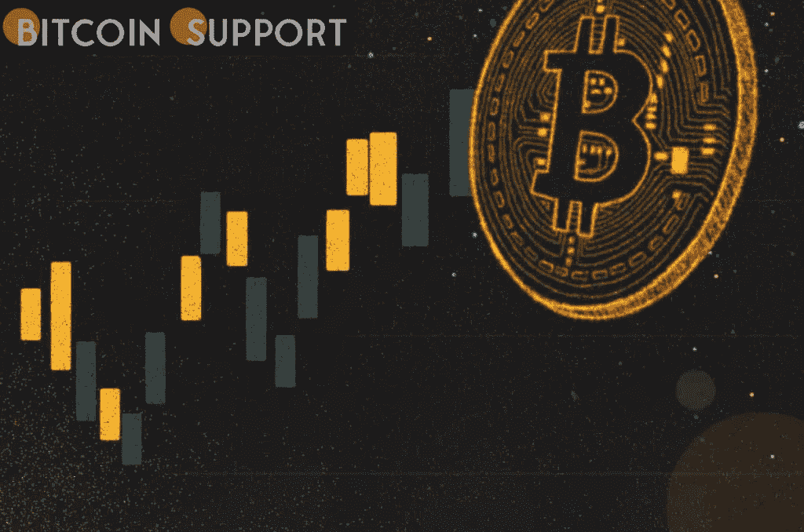
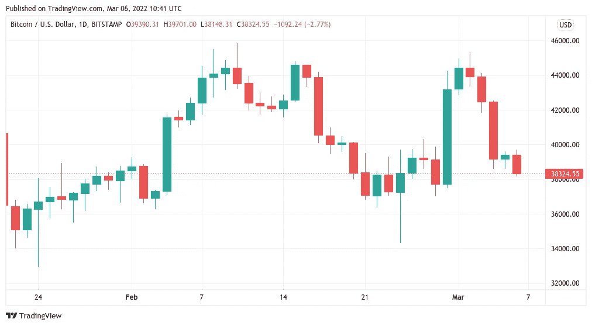
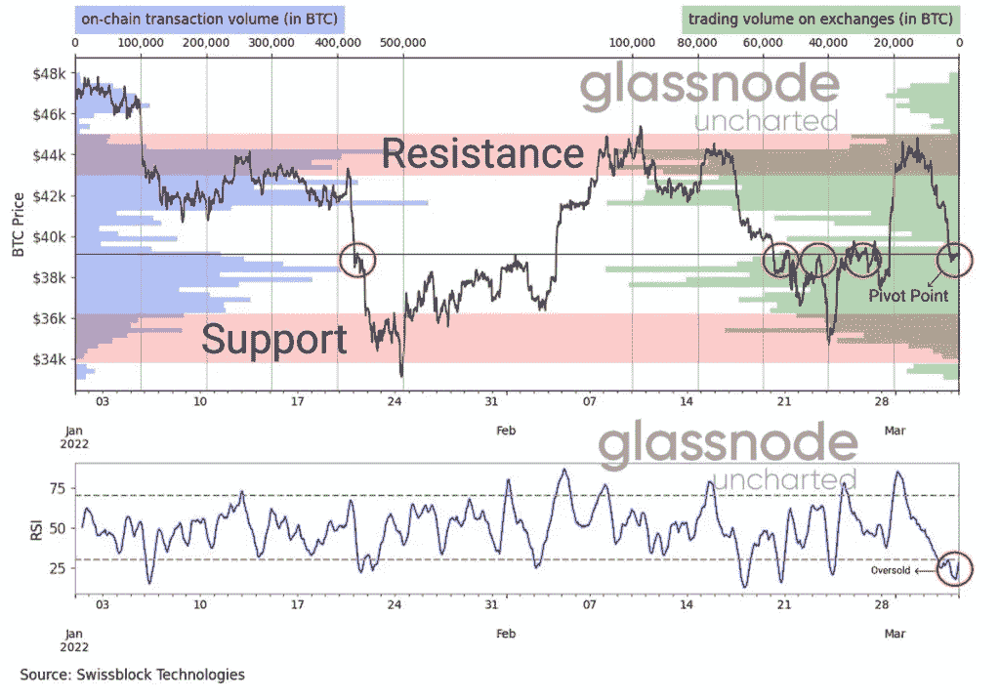

# 全球股市“看起来很贵”，分析师预测比特币将达到 36K

> 原文：<https://medium.com/coinmonks/global-stocks-look-costly-analysts-predict-bitcoin-will-hit-36k-e07a2183ac36?source=collection_archive---------56----------------------->

**Visit our website:-** [**https://bitcoinsupports.com/**](https://bitcoinsupports.com/)

随着“滞胀性冲击”已经开始，今年不排除全球股市崩盘的可能性。随着地缘政治担忧和随之而来的宏观经济困难成为焦点，比特币(BTC)在 3 月 6 日的周收盘时继续下跌。

**Visit our website:-** [**https://bitcoinsupports.com/**](https://bitcoinsupports.com/)

2022 年是否预示着“大萧条”的开始？根据 TradingView 的数据，BTC/美元周日触及近一周以来的最低水平，隔夜波动重新开始。在撰写本文时，该对货币正在测试 38000 美元的支撑位，三天的损失接近 12%。

尽管处于“盘后”交易氛围，但随着分析师对全球市场的情绪发生转变，最大的加密货币的趋势肯定是下行的。市场权威 Holger Zschaepitz 当天警告说:“随着大规模滞胀性冲击的逼近，本周全球股市市值损失了 2.9 万亿美元。”。

[https://twitter.com/Pentosh1/status/1500261833353089027](https://twitter.com/Pentosh1/status/1500261833353089027)

“经济学家降低了增长预期，提高了通胀预期。全球股票市场目前价值 110 万亿美元，相当于全球 GDP 的 130 %,在当前的环境关系下显得很昂贵。如果出现更严重的 TradFi 调整，一些人担心本已脆弱的加密市场可能会表现不佳——至少在最初是这样。

知名交易员和分析师 Pentoshi 甚至预言了 90 年前那场导致大萧条的全球崩溃的重演。

然而，几位老牌专家采取了截然不同的立场。彭博情报公司 3 月 4 日发布的最新加密市场前景研究对比特币和以太网(ETH)保持乐观。报告称:“尽管由于不可避免地回归 40 年来最高通胀，大多数资产将在 2022 年经历价值下降，但今年可能代表比特币的又一个里程碑。”“如果不减少风险资产来缓解部分价格压力，通胀措施很可能会继续保持强劲，这使得各国央行除了大幅加息之外别无选择。”

**“3.6 万美元的支持对 BTC 来说可能是很多了。由于短期内谨慎仍占主导地位，比特币的前景黯淡，大多数乐观指标都指向当前交易区间的延续。链上分析业务 Glassnode 的联合创始人扬·阿莱曼(Yann Allemann)和简·哈佩尔(Jan Happel)在宣布他们最新一期的“未知”时事通讯时指出，“比特币正处于一个临界点”。

“RSI 已经达到超卖水平，正在向上走。如果价格没有突破 40k 美元，我们将下跌支持。$34-$36k 的援助$43-$45k 的阻力。"**

**Visit our website:-** [**https://bitcoinsupports.com/**](https://bitcoinsupports.com/)

随附的图表展示了 BTC/美元在当前价格下的历史便宜程度，以及这种 RSI 低点和价格反转之间的关联。

**访问我们的网站:-**[**https://bitcoinsupports.com/**](https://bitcoinsupports.com/)

**免责声明:以上为作者观点，不应视为投资建议。读者应该自己做研究。**