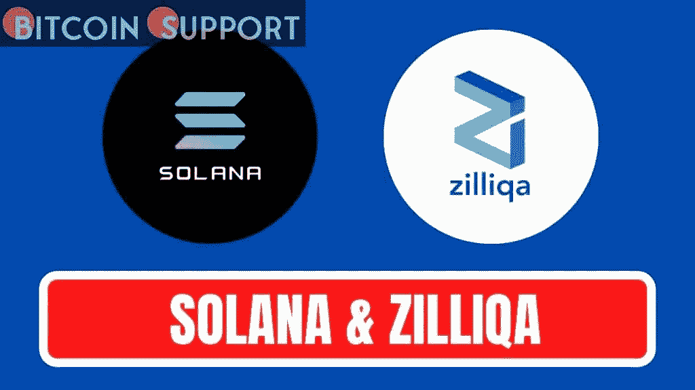
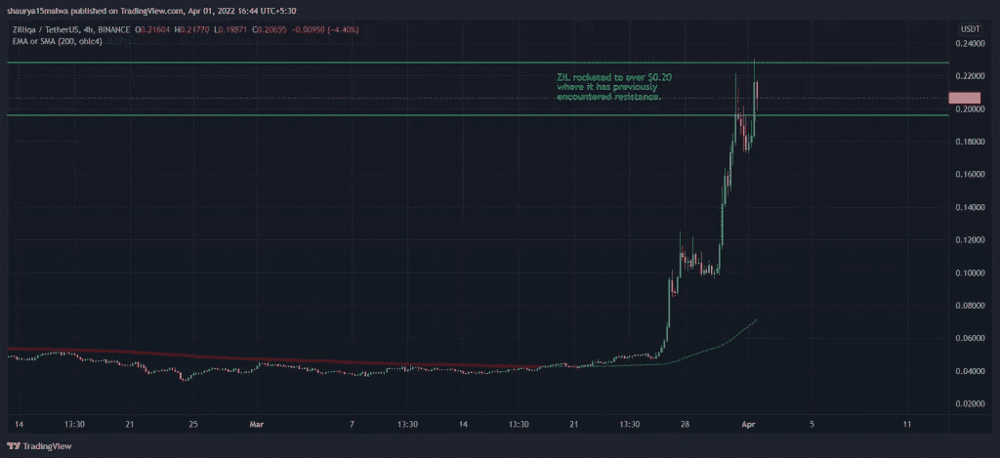

# 基于索拉纳的 GMT 代币上涨 54%，ZIL 预计有 1300 万美元的清算

> 原文：<https://medium.com/coinmonks/gmt-tokens-based-on-solana-increase-54-percent-zil-sees-13-million-in-liquidations-1de3a62c268d?source=collection_archive---------38----------------------->

**Visit our website:-** [**https://bitcoinsupports.com/**](https://bitcoinsupports.com/)

在这种加密货币下跌时，几笔大额加密货币期货合约清算了数百万美元。过去 24 小时内，加密货币市场下跌了 3.5%，原因是上周五亚洲时段比特币一度突破了 4.5 万美元附近的支撑位。
过去 24 小时内，卡尔达诺的 ADA 和雪崩公司的 AVAX 都下跌了 5%，波尔卡多的 dot、十八因努的 SHIB 和多吉肯的 DOGE 都下跌了 7%以上。索拉纳的 SOL 继续跑赢大盘，在周四强劲表现后，上周五基本持平；BNB 连锁店的 BNB 也适度跑赢大盘，下跌 3%。

过去 24 小时内，逾 4 亿美元的加密货币期货合约已经清算。清算是指交易所因交易员初始保证金的部分或全部损失而强制清算该交易员的杠杆加密交易头寸。

比特币期货亏损突破 1.2 亿美元，以太币期货亏损 6，300 万美元紧随其后。不过，上周五的大涨行情也让一些不太受欢迎的数字加密货币期货的跌幅超过了其他知名数字加密货币。Zilliqa 的 ZIL 代币期货亏损 1300 万美元，Stepn 的 GMT 代币亏损逾 1100 万美元。ZIL 是上周涨幅最大的股票，从 3 月 26 日的 315%上涨到周五的 0.23 美元，高于上周的 0.04 美元。

2021 年 5 月 ZIL 曾出现可比价格。价格趋势表明，ZIL 可能经历 0.19 美元至 0.22 美元之间的波动，但在 0.16 美元的水平上似乎存在一些支持。

**Visit our website:-** [**https://bitcoinsupports.com/**](https://bitcoinsupports.com/)

ZIL 的增长发生在 Metapolis 首次亮相之前，Metapolis 是一个元宇宙即服务(MaaS)平台，计划于周六在迈阿密举行 VIP 活动。它将使用户能够创建他们自己的虚拟世界，这在更广泛的行业中是一个日益增长的趋势。与此同时，成立三周的格林威治时间在过去 24 小时内上涨 52%，达到 3.11 美元的高点。GMT 是 STEPN 的治理令牌，通过其应用程序，用户可以访问游戏中的服务，如铸造虚拟鞋类，升级“宝石”，以及在治理选举中投票。

STEPN 建立在 Solana 的基础上，自称是第一批 Web 3.0 生活方式应用程序之一，在推出几周后就积累了超过 15 亿美元的市场估值。在其他地方，BAYC 的本地 ApeCoin (APE)代币下跌 8.3%，此前有报道称该公司自己的 Discord 频道遭到利用。该社区的成员通过一个恶意工具联系到一个新的不可替代的令牌(NFT)薄荷集合。然而，安全研究人员发现，这个链接是欺诈性的，因为点击它会让攻击者获得用户的私钥，并掏空他们的钱包。如上所述，几个 NFT 项目遇到了相同的欺诈邮件。

**访问我们的网站:-**[**https://bitcoinsupports.com/**](https://bitcoinsupports.com/)

**免责声明:以上为作者观点，不应视为投资建议。读者应该自己做研究。**

> 加入 Coinmonks [电报频道](https://t.me/coincodecap)和 [Youtube 频道](https://www.youtube.com/c/coinmonks/videos)了解加密交易和投资

# 另外，阅读

*   [我的密码交易经验](/coinmonks/my-experience-with-crypto-copy-trading-d6feb2ce3ac5) | [《比特币基地评论》](/coinmonks/coinbase-review-6ef4e0f56064)
*   [CoinFLEX 评论](https://coincodecap.com/coinflex-review) | [AEX 交易所评论](https://coincodecap.com/aex-exchange-review) | [UPbit 评论](https://coincodecap.com/upbit-review)
*   [AscendEx 保证金交易](https://coincodecap.com/ascendex-margin-trading) | [Bitfinex 赌注](https://coincodecap.com/bitfinex-staking) | [bitFlyer 审核](https://coincodecap.com/bitflyer-review)
*   [麻雀交换评论](https://coincodecap.com/sparrow-exchange-review) | [纳什交换评论](https://coincodecap.com/nash-exchange-review)
*   [拥护卡审核](https://coincodecap.com/uphold-card-review) | [信任钱包 vs MetaMask](https://coincodecap.com/trust-wallet-vs-metamask)
*   [Exness 评测](https://coincodecap.com/exness-review)|[moon xbt Vs bit get Vs Bingbon](https://coincodecap.com/bingbon-vs-bitget-vs-moonxbt)