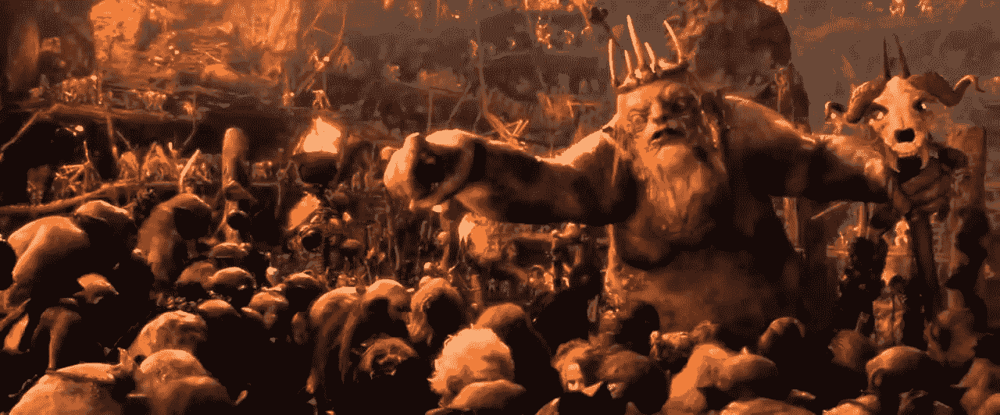
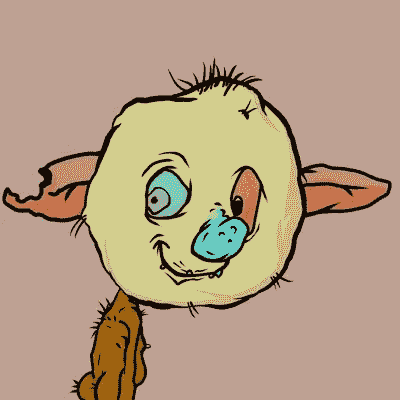
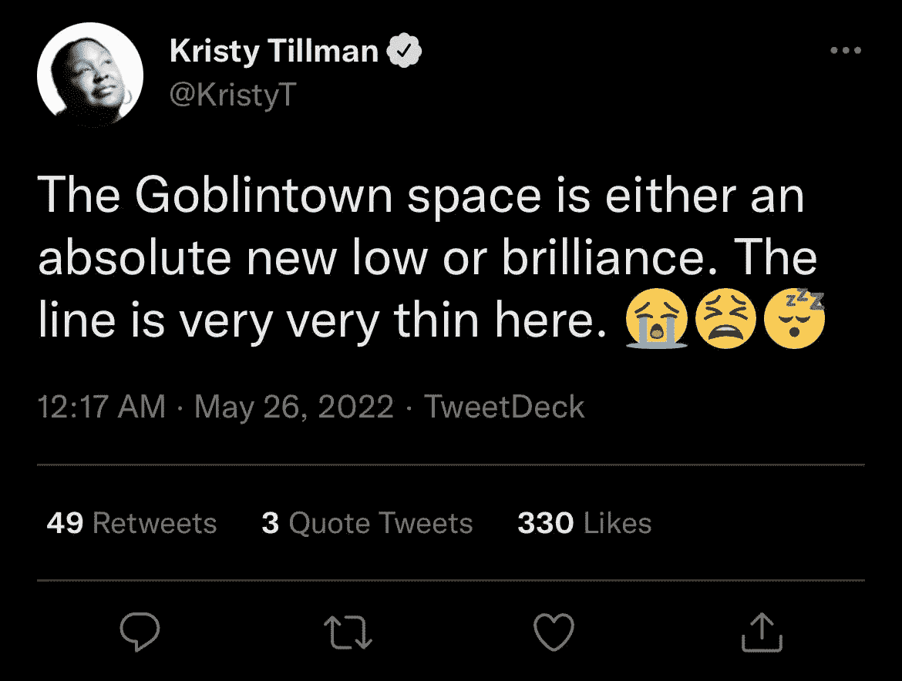
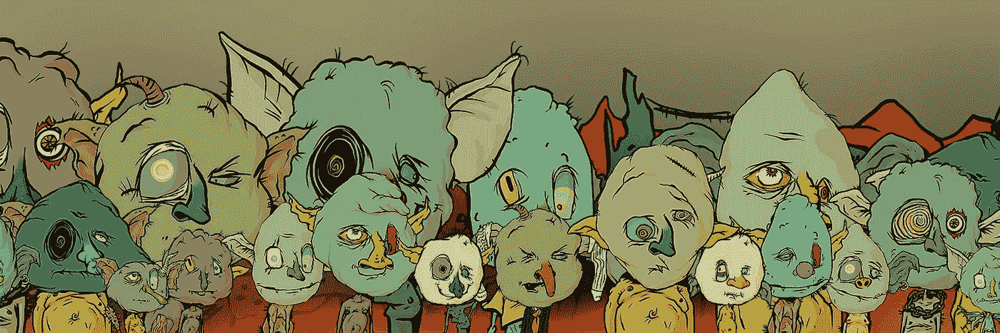

# Goblintown 和积极模因能量的力量

> 原文：<https://medium.com/coinmonks/goblintown-and-the-power-of-positive-meme-energy-7ad274fd7a8?source=collection_archive---------48----------------------->

2018 年 1 月，比特币价值暴跌约 65%。随后，几乎所有其他加密货币都紧随其后，被称为 ICO 大崩盘。在此期间，出现了一个流行的迷因，以《霍比特人:意外之旅》中的地精镇场景为特色。那时我还没有涉足 Web 3，然而，我想象地精王的签名行“下降，下降，下降到 Goblintown”真的引起了那些看着他们的投资组合下降到零的人的共鸣…有时当一切都分崩离析时，你所能做的只有 meme。

2022 年 5 月，algo 稳定硬币 Terra Luna 崩溃，一夜之间从加密市场抹去了近 400 亿美元，并导致许多其他加密货币跌至历史低点。当月晚些时候，10K·戈布林顿的 PFP 系列在 Opensea 上发布，标志着从 ICO 崩溃中回归传说中的 meme。

在我们分析 Goblintown 之前，最好先了解一下 2022 年 5 月 21 日项目启动时 NFT 市场的情况。ETH 上最后一个值得注意的发布是 Moonbirds，虽然该项目拥有非常令人尊敬的发言权，但由于 Okay Bears 的破纪录成功标志着 Solana 夏季的潜在开始，许多注意力已经转移到 Solana NFTs。将近一个月的时间里，ETH 上没有任何令人兴奋的东西出现——这感觉像是过了很长时间。随着 Terra-Luna 崩盘的开始，NFTs 背后的动力消失了，因为人们争先恐后地从投机性的 JPEGs 文件中脱身，进入了坚实的市场。

进入 Goblintown…一个以免费薄荷+气体形式推出的 PFP 项目。调查这个项目为为什么这是一个免费的造币厂提供了一个非常合理的解释。在戈布林敦镇网站的首页，你可以看到这个项目计划提供什么…“没有路线图，没有冲突，没有效用”…至少他们是诚实的。这是一个纯粹的迷因剧。

迷因项目并不新鲜，它们通常不会长期存在。在某个时候，迷因变老了，人们继续前进。令所有人惊讶的是，Goblintown meme 像野火一样流行起来，楼层飙升至月球……在撰写本文时为 6 ETH，交易量为 3 万 ETH。人们似乎对诚实、丑陋的艺术和一个充满活力的新社区措手不及。这个项目还有一个秘方:meme 积极的模因能量。PME 是一种难以捉摸的特质，很少有人能驾驭它，但当它被恰当地展现出来时，这种势头就会呈现出自己的生命力。这一点在 Goblintown twitter 空间中尤为明显，用户可以在这里扮演妖精，发出妖精般的声音。你没有去过格林镇，但是你听说过地精的声音……那就是 PME。

克里斯蒂·蒂尔曼写道:“戈布林敦的空间要么是绝对的新低，要么是辉煌。这条线非常非常细。”

戈布林敦无疑给这个严峻的时代带来了一些急需的轻松。很高兴看到人们又玩得开心了。然而，纯粹的德根戏剧正在起飞的事实可能是 NFT 空间情况有多糟糕的一个指标。众所周知的面具已经脱落。一方面，Goblintown 对它是什么和它提供什么是透明的。与此同时，该项目的病毒式成功可能是对组成 NFT 市场的人的评论。

我看到人们努力警告其他人去格林镇的危险。"这是一个不排外的团队，具备潜在竞争者的所有特征。"尽管有许多警告，该项目仍然保持着一个非常体面的底线。也许每个玩这个游戏的人都知道，这些项目没有一个提供足够的效用，值得标价，我们都是退化的傻瓜，等待更大的傻瓜成为我们的退出流动性。在幻想的世界里，我总是发现妖精是相当真诚的。

感谢您的阅读。

查看我的 Web 3 之旅:

[https://twitter.com/wasifmrahman](https://twitter.com/wasifmrahman)

在 LinkedIn 上关注我:

 [## Wasif Rahman -营销伙伴关系总监- Ex Populus | LinkedIn

### 查看 Wasif Rahman 在全球最大的职业社区 LinkedIn 上的个人资料。Wasif 有 4 个工作列在他们的…

www.linkedin.com](https://www.linkedin.com/in/wasif-rahman-91114a85/) 

我的 Web 3 淋浴想法:

 [## 瓦西夫·拉赫曼-中号

### 阅读瓦西夫·拉赫曼在媒介上的作品。Web 3 德根 Ex Populus 营销伙伴关系总监。每天…

medium.com](/@wasifmrahman) 

> 加入 Coinmonks [电报频道](https://t.me/coincodecap)和 [Youtube 频道](https://www.youtube.com/c/coinmonks/videos)了解加密交易和投资

# 另外，阅读

*   [美国最佳加密交易机器人](https://coincodecap.com/crypto-trading-bots-in-the-us) | [经常性回顾](https://coincodecap.com/changelly-review)
*   [在印度利用加密套利赚取被动收入](https://coincodecap.com/crypto-arbitrage-in-india)
*   [Godex.io 审核](/coinmonks/godex-io-review-7366086519fb) | [邀请审核](/coinmonks/invity-review-70f3030c0502) | [BitForex 审核](https://coincodecap.com/bitforex-review)
*   [5 款最佳免费加密货币制图工具](https://coincodecap.com/crypto-charting-tools)
*   [最佳比特币保证金交易](/coinmonks/bitcoin-margin-trading-exchange-bcbfcbf7b8e3) | [萝莉点评](/coinmonks/lolli-review-e6ddc7895ad8) | [比特币保证金交易](https://coincodecap.com/bityard-margin-trading)
*   创造并出售你的第一个 NFT | [密码交易机器人](https://coincodecap.com/best-crypto-trading-bots)