# $ GOG |的目标是成为最大的区块链手机游戏 RPG。

> 原文：<https://medium.com/coinmonks/gog-and-the-goal-of-becoming-the-biggest-blockchain-mobile-game-rpg-5814da227df1?source=collection_archive---------10----------------------->

# **简介**

守护者协会是一个移动多人游戏，幻想，[动作 RPG](https://www.techopedia.com/definition/27052/role-playing-game-rpg) ，玩家在其中建立自己的守护者梦之队，并在一个协会中竞争以赚取史诗奖励。

GOG 团队的愿景是打造一款最吸引人的**和最受欢迎的**和**角色扮演游戏**，在这里，数百万玩家可以借助 **NFTs** 将他们的热情转化为实际资产。

他们的**雄心勃勃的目标**始于 2020 年初，由于这四个主要领域是 GOG 团队在开发《守护者协会》时最想关注的，所以这个目标将会实现。

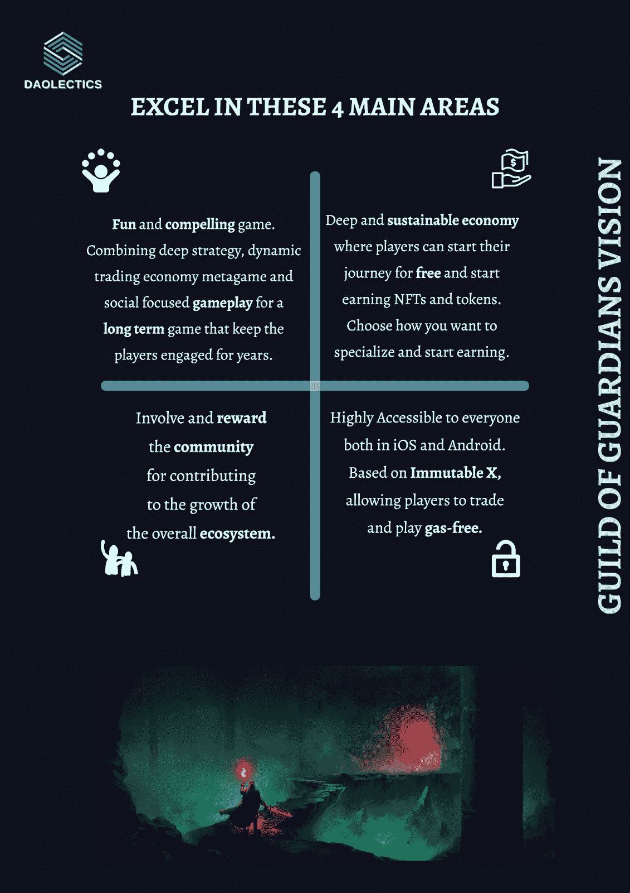

《守护者协会》将于 2022 年晚些时候面向 iOS 用户推出。

在这个游戏中，玩家将带着他们的英雄通过**挑战地下城**来收集资源和赚取经验。这些资源将被用来制造物品或召唤英雄，这些物品和英雄可以被兑换成真钱。

玩家将能够建立他们的英雄队伍，并与他们的公会合作，赢得排行榜和季节性奖品。如果你玩过暗黑破坏神或者流放之路，你可能会认识到这类游戏的风格。

守护者协会由 [Stepico Games](https://stepico.com/) 开发，由[不变](https://www.immutable.com/)发行。

Stepico 是一家移动游戏开发工作室，他们已经发布了多款游戏，下载量超过 500 万，而 Immutable 是区块链最大的风投资助的初创企业之一，也是《被解放的神》和《不变的 x》背后的团队

不可变 X 是一个第二层协议，事实上它将为核心技术提供动力，允许用户以几乎为零的汽油费和比以太坊高得多的 TPS(每秒交易)进行交易。

当谈到游戏基础设施时，这是一个关键点:想象一下你在一个游戏中有多少交易，你不能让用户为他们经历的每一笔交易支付汽油费，否则它会扼杀游戏本身的乐趣和经济性。

我们还关注同一细分市场中与移动区块链游戏相关的其他项目，因此我认为分享一些 GOG 相对于该领域其他活跃和发展中游戏的社交媒体指标是一个好主意。

对我们来说，社交媒体指标是一个了解实际项目走向的工具，以及由于游戏本身，它在完全发布和社区流入时可能达到的潜在影响。

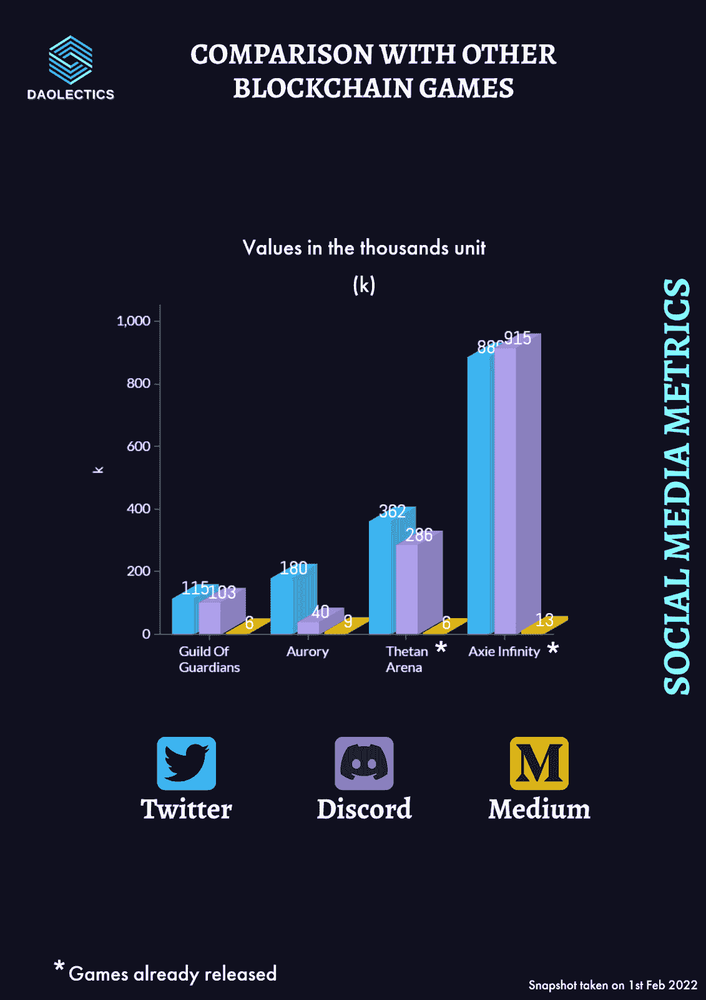

# **细分市场**

**2021 年全球视频游戏市场规模约为 1555 亿美元，占数字媒体市场的 52.9%。**到目前为止，视频游戏市场是数字媒体中最大的细分市场，到 2026 年平均每年增长 9.0%。我们看到所有地区都有类似的发展，**移动游戏仍然是增长最快的细分市场。**

2021 年，中国、美国和欧洲的视频游戏总收入为 1，036 亿美元，占全球视频游戏市场的 68.0%。

**全球视频游戏市场主要由移动游戏推动。**

这种发展的原因可以在向移动设备的普遍转移中找到。如今，智能手机和平板电脑的高性能支持计算密集型应用。游戏和一些现代移动设备甚至使用特殊的图形处理器单元(GPU)，其性能水平与固定电脑、笔记本电脑或 Xbox One 等游戏机类似。

此外，这种技术发展导致了从浏览器游戏到移动游戏的明显转变，对整个在线游戏市场产生了影响，因为“游戏本身”不再依赖于 PC 的处理能力。

由于《守护者协会》是一款手机游戏，我想将这个细分市场特别关注于手机游戏的增长和大多数应用程序的主要市场:**应用商店**和**谷歌 Play 商店**。

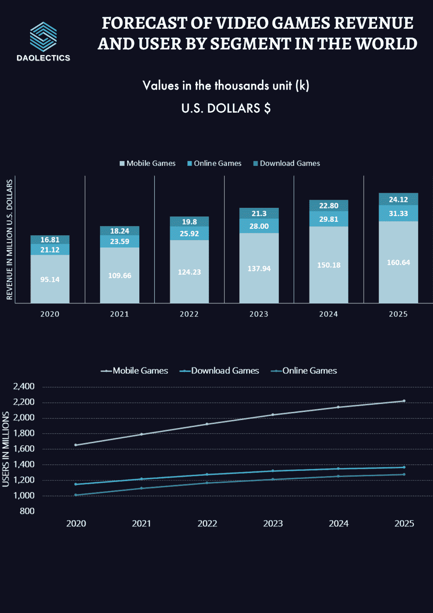

仅根据上述预测，很明显，移动游戏区块链的关注度很高，因为一个工作产品可以为加密世界和项目本身带来巨大的用户群。

如果上面的统计数据还不足以让你相信**手机游戏**的威力，让我们更深入地看看下面的分析，这些分析将最受欢迎的应用按可用商店进行了划分。

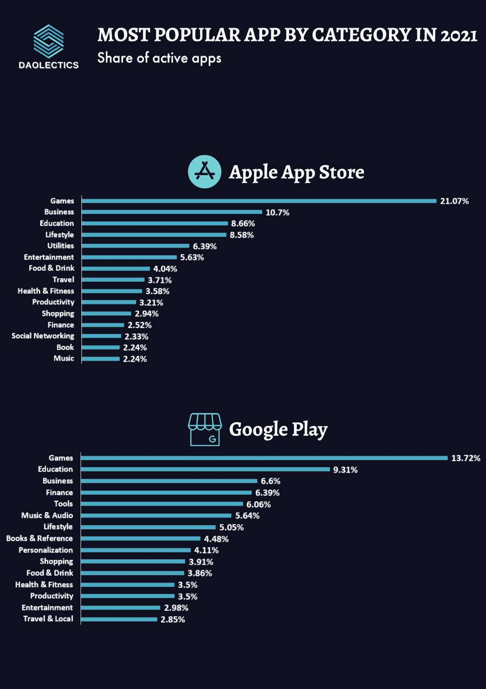

# **商业模式和收入策略**

所有区块链项目中最大的挑战之一是激励和经济。

守护者协会的目标是创造一个十亿美元的经济。

要做到这一点，它需要创造一个稳定而精确的**商业模式**和**增长战略**，这将使整个生态系统蓬勃发展。通过**“游戏即服务”**，GOG 团队确实为那些愿意在其核心游戏之上构建某些东西的企业打开了许多可能性:

*   NFT 交易市场；
*   借贷和“赞助”平台；
*   社区指南、时事通讯和分析；
*   电子竞技比赛和竞赛；
*   志同道合者的社交枢纽和聚会；
*   **元宇宙将**扩展到沙盒或分散土地、第三方开发的游戏等世界。

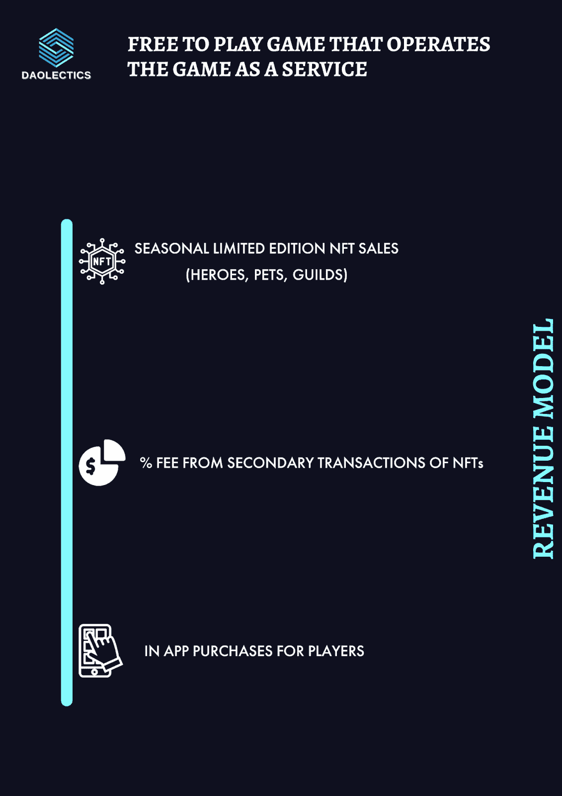

需要注意的一点是，团队明确表示不允许守护者协会中有任何**【支付 2 赢】机制**，这意味着你将无法从他们的商店购买物品。我认为在游戏中获得物品的唯一方式要么是在游戏市场中与其他玩家交易(作为 NFT)，要么是通过游戏本身来获得。

# **游戏**

> 《守护者协会》是一款移动 RPG 游戏，玩家可以带领英雄团队穿越充满挑战的地下城来收集资源。这些资源被用来制造稀有物品和升级英雄，这些物品和英雄可以被卖成真钱。

游戏设定在一个熟悉的，幻想的 RPG 世界，玩家可以扮演法师，战士，精灵，兽人等等！

只是提醒一下，最初不会有任何**“开放世界环境”**，尽管 GoG 团队声明他们可能会在发布后研究它。

**团队策略和技能一样重要，**团队组成和协同作用很重要，技能使用和躲避特定伤害的能力也很重要。

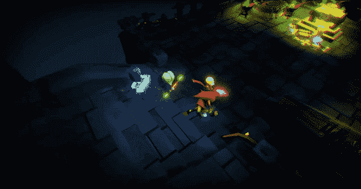

**派系、职业和元素协同都在战斗中发挥作用:**

举例来说，所有部落的队伍都可以增强他们的原始攻击，所有火元素的队伍都有更高的几率造成伤害。

传统 RPG 角色如坦克、治疗师、DPS 和支援在守护者协会中很有价值。玩家在仇恨管理、治疗输出和伤害输出方面的技能将在最具挑战性的内容中接受测试。

也有传言说有一个组合系统可以让熟练的玩家正确的躲避和选择攻击时间来获得更高的伤害值。

截至目前，游戏将有 PVE 模型，但随着用户群的增长，更多的游戏模式和功能将被添加。

当涉及到区块链游戏时，我们通常不发布路线图，因为开发不能遵循特定的路径，但我们最近从 GoG 团队获得了关于他们路线图的更新，所以我觉得发布它是可以的，因为它很有用。

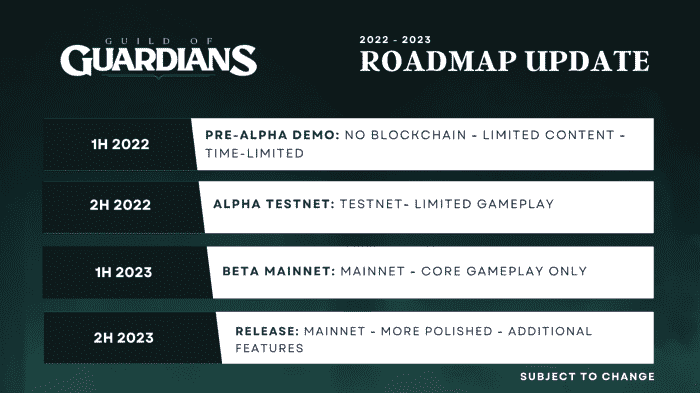

最后但并非最不重要的是，GOG 有一个**内部公会系统**，它是为那些喜欢多人游戏的玩家准备的(每个物品、能力等等都是同类中最好的，想象一下用最好的物品玩游戏)。

在守护者协会中创建 NFT 物品的唯一方法是通过公会:因为这个原因，公会将允许玩家分组并尝试游戏中最难和最有回报的内容，出售手工艺品等等。

制作材料将从地下城掉落，玩家可以贡献给他们的公会来制作区块链物品，这些物品将会自动被送到市场出售。利润将自动按照每位玩家的贡献比例进行分配。

如守护者协会白皮书所示，这是每个等级的协会可以拥有的成员列表:

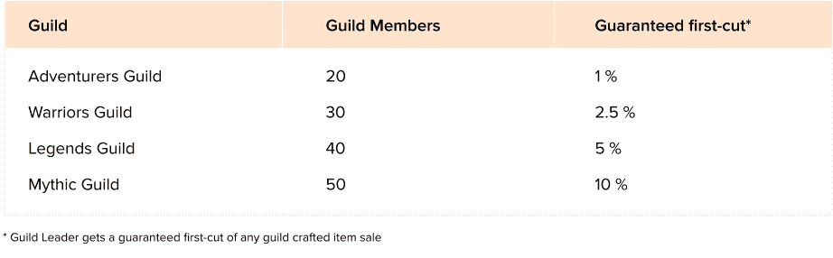

此外，只是给你一个感觉，有多少人实际上相信这个项目，这里是一个公会徽章的初始价格截图，如果你愿意，随时检查价格。

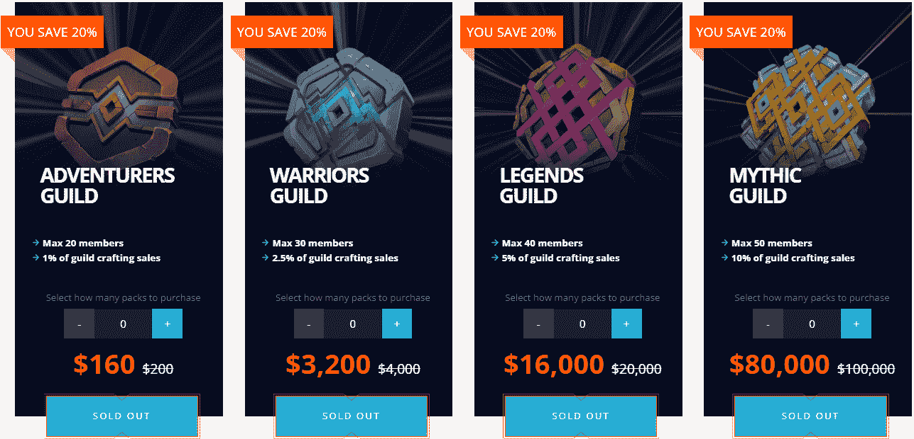

这里有一篇由 GoG 团队自己写的有趣的文章,它会让你对你可能有的公会问题有一个清晰的认识。

# **英雄(NFTs)**

目前有哪些类型的非功能性测试？大多数创始人销售英雄 NFT 只能通过二级市场出售，因为铸造已经发生，但这里是你目前可以购买的:

1.  英雄
2.  宠物(将在当前报告的后面讨论)
3.  能量助推器(这些也一样)
4.  行会

如果你是 **GOG 最初的 NFT 赠品**的幸运儿，恭喜你，守护者协会团队在项目的早期进行了一次疯狂的赠品，并空投(给那些合格的早期成员)了令人震惊的 20 万美元的 GOG NFTs 总价值；为了完成这一点，他们还为那些在 12 月 6 日拥有一个 NFT 的人提供了一个 GoG 头像。

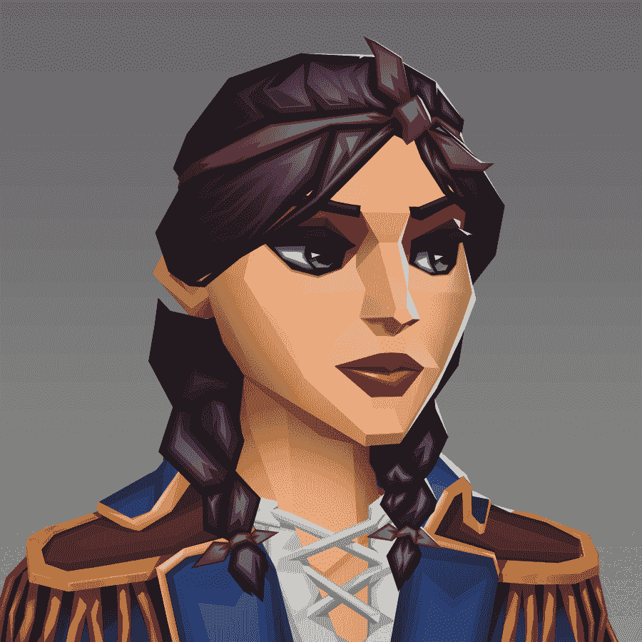

《守护者协会》中的英雄是从召唤中找到的，这可以通过购买召唤(购买和铸造 NFT)或玩游戏并获得召唤碎片来完成。

按照任何其他值得尊敬的 RPG 游戏模式，每个英雄都有自己的游戏风格，优势和弱点，这将决定你想要创建的团队类型尽可能平衡。英雄越稀有，他们的基础属性就越好。这以更多伤害、更多生命和更强大能力的形式显现。

你需要在地牢战役中提升你的英雄，以最大化他们各自的能力。即使是稀有英雄，当他们装备精良，等级提升时也会变得强大。

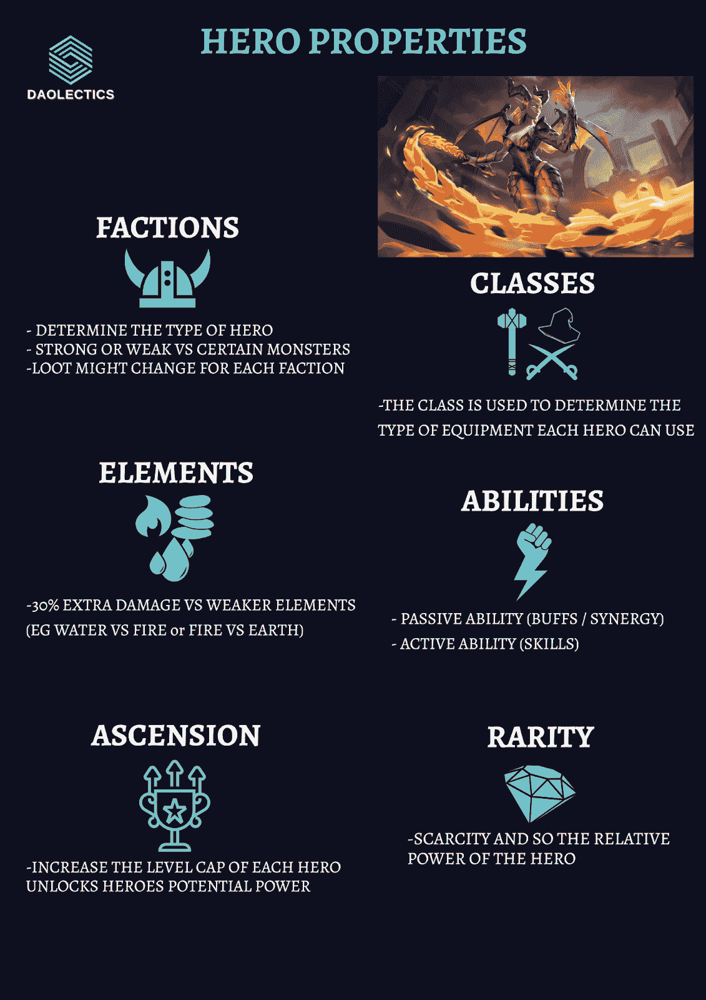

# **宠物、能量助推器和装备**

**宠物**是绑定到你的团队的生物，会给你带来各种好处:**把它看做一个你可以在地下城战斗中使用的伙伴**，这将会给你资源制造和增加物品掉落机会的奖励。

每个英雄的能量属性在进入地下城时会减少，守护者协会中的能量系统对英雄来说是一种**【疲劳】**。基本上，如果玩家在一天内进入太多的地下城，英雄将会受到惩罚，比如减少属性或者需要额外的能量来使用。

> **为什么会这样？**

**边玩边赚**的经济需要在许多不同的方面得到平衡:限制你在游戏中可以获得的“赚”的数量，是保持象征性价格的健康方式，并且不会被销售者的通货膨胀所淹没。不仅如此，它还可以受益于游戏中某些物品的稀缺性，从而减少你获得这些物品的机会。

这是一个在许多游戏中广泛使用的系统，**作为一个前魔兽世界玩家，**我知道当你等待整整一个星期才能重做你最喜欢的地下城并希望正确的下落到你手中时，你必须经历的痛苦和拥挤。但与此同时，这也是继续炒作的原因。一周又一周地打败老板，并希望你所期待的事情最终会发生..活着是多么美好的时光啊！

**能量助推器 NFT** 在这种情况下发挥作用。这将让你永久提升英雄的能量，并且:

1.  移除一个英雄在进入地下城时会遭受的疲劳增加率。
2.  允许玩家更多地使用他们喜欢的英雄。

> **设备**

我觉得对**装备**最好的解释直接来自守护者协会的白皮书，所以我凭什么去改变它？

守护者协会不会出售装备，因为我们希望守护者协会中的装备经济完全由玩家驱动并且公平。我们有数百件武器和盔甲可供玩家寻找、创造和交易。公会领袖将能够讨论和策划他们想要制造和关注的装备。每个人都有独特的 buffs，为他们装备的英雄提供属性加成。如果装备在一起的话，某些装备也可以提升你的英雄的能力。”

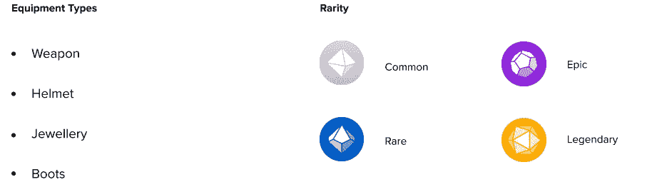

# **玩和赚经济**

P2E 或者“玩赚”这个词是不言自明的，但是你怎么能在守护者协会中做到呢？

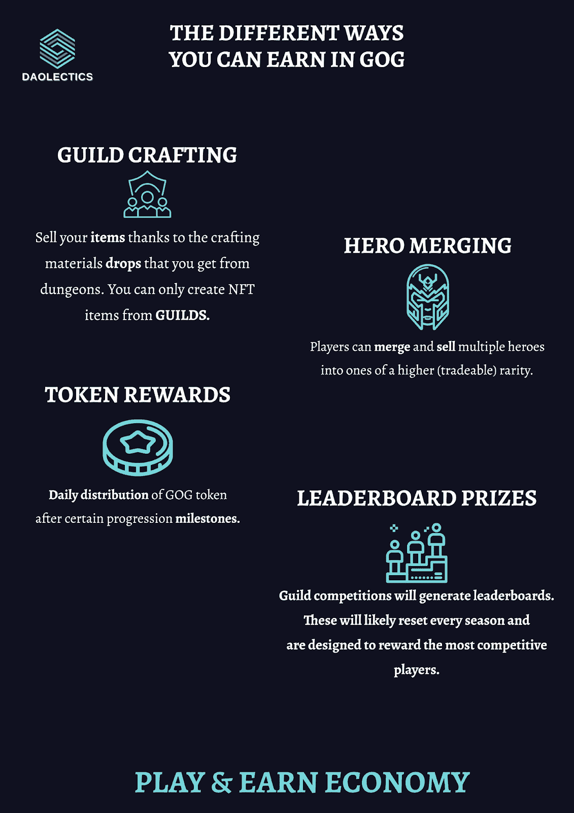

# **令牌**

名为**宝石** ( **$GOG** 代币)的游戏内货币是一个 **ERC-20** 代币，将作为守护者经济公会的燃料，它的**游戏和赚取**和**社区投票**功能。

该代币通过 coin list**被丢弃，超额 82 倍**，530 万美元被来自 100 个国家的 1 万多人购买。

对于那些购买了选项 1(每个代币 0.10 美元)或选项 2(每个代币 0.075 美元)的幸运儿来说，他们现在获得了丰厚的投资回报。考虑到 **$GOG** 的当前价格在 0.85 美元左右浮动，ATH 为 2.78 美元。

更多信息[点击这里](https://blog.coinlist.co/announcing-the-guild-of-guardians-token-sale-on-coinlist/)。

宝石将通过特定的游戏场景获得(我们假设像完成任务，击败某些老板，成就？)而且还可以交易，用于执行溢价行动，包括创建新的游戏内区块链资产(例如 NFT)。

该团队还计划**通过$GOG 奖励来奖励那些为游戏和社区**的发展做出贡献的人，这最终将增加玩家和游戏本身的整体体验。

宝石构成了**建立一个可持续的即玩即赚经济**的关键部分，并保护免受机器人攻击。铸造任何 NFT 都需要宝石，玩家奖励宝石的固定分配将防止不可持续的增长。

我强烈建议你阅读一下 GOG 白皮书，因为它很好地解释了他们打算如何以可持续的方式建设和运行他们的经济。

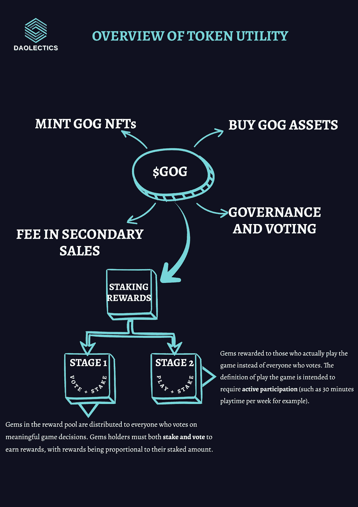

# **记号组学**

用于 **$GOG** 令牌的**总供应量**将为 **1，000，000，000** 分如下:

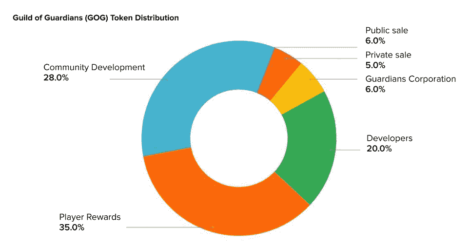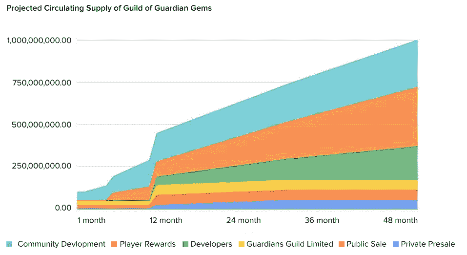

到今天为止，这是我见过的最公平、最突出、分布最广的加密游戏令牌组学之一:**超过总供应量的 60%，是的，60！！**注定属于那些会**参与游戏或者通过上述贡献帮助游戏成长的人**。

私人投资者拥有很小一部分供应 **(5%)** 这意味着你不太容易受到抛售风险和那些拥有大量代币的人的抛售压力。

开发者得到了 20%的分配，但是这些人会通过将玩家的想法转化为实际的东西来帮助游戏变得更好。

我们都知道开发者和社区是整个生态系统的一大部分，当然，奖励他们并给他们一份薪水，肯定是我会做的一件有价值的事情。

整体归属和加高策略清晰且平衡；这将使生态系统在健康和线性的道路上成长。引起我注意的是三个主要的区域，它们将会收到最多的代币，这些区域将会构建整个游戏。

# **合作伙伴和投资者**

**合作伙伴和投资者的范围是相关的**，而不是那些未被发现的。虽然我们知道业内一些令人惊叹的名字，如育碧、不可变、沙盒、比特币基地、Naavik 等等，但我们也发现了一个最知名的 **P2E 公会**，如 Yield Guild Games(活跃于投资方和合作方)；很容易从最近的 [YGG 财政部报告](/yield-guild-games/yield-guild-games-asset-treasury-report-september-2021-1de8b56fdd5e)(2021 年 9 月)中偷取一些数据，对《NFT 守护者协会》的投资在 300 万美元左右。

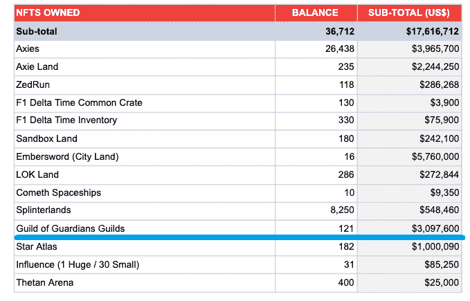

守护者协会也有不错的媒体报道，这有助于获得更广泛的曝光。

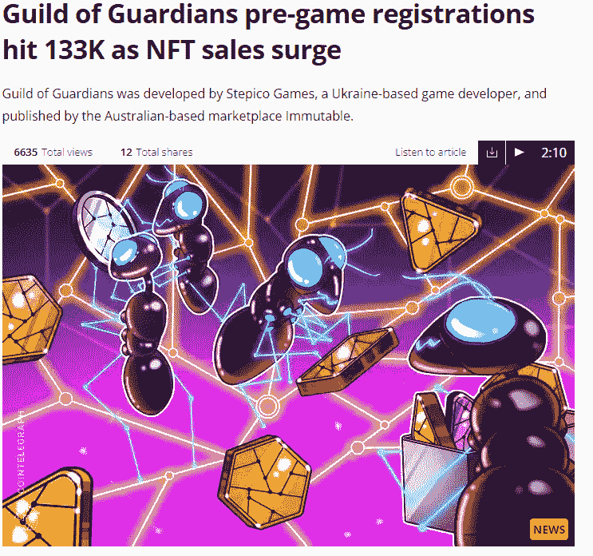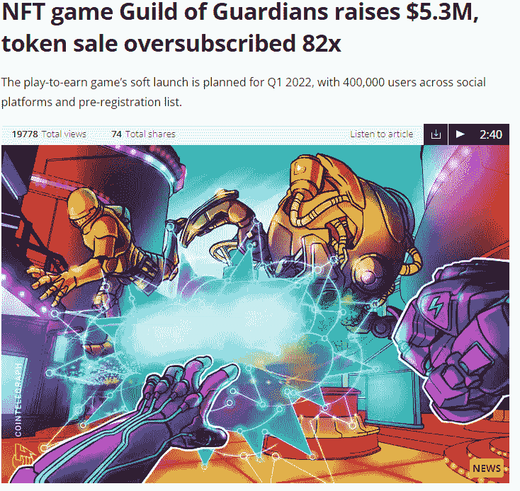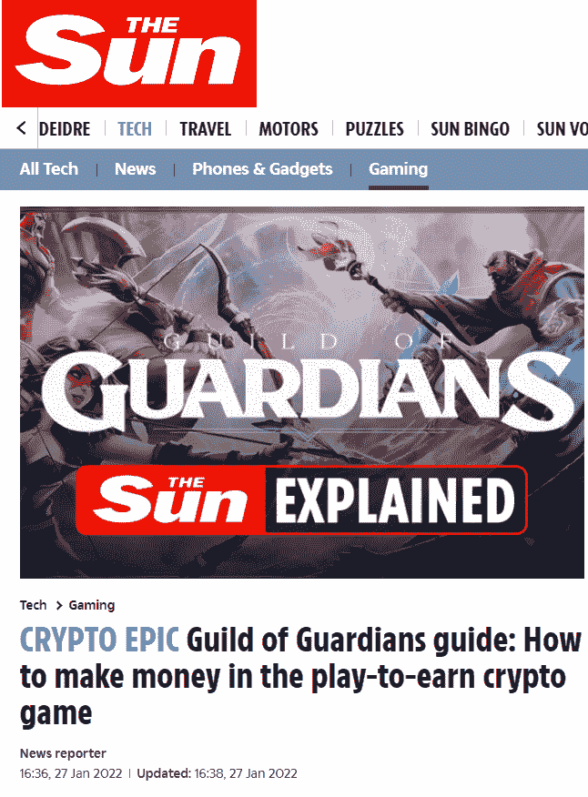

除了与 NRG 英雄的合作，专业游戏和娱乐公司**因其冠军队伍和游戏生活内容而闻名。为了这个目的，高格为这一场合抛下了一个英雄:**

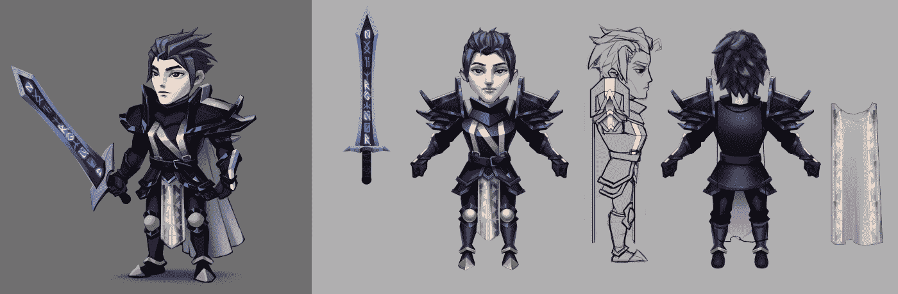

# **结论**

如果你到达这里，我们将很快结束，说我们有一个总体良好的感觉，通过整个分析。

他们抓了我还是抓了我？当他们明确表示愿意围绕社区开发他们的游戏时，这对我来说一直是每个游戏的关键点。正如我以前说过的，我自己也是一名游戏玩家，我知道社区在这个过程中扮演的关键角色，所以团队的主要支柱是设定正确的焦点。

我们会看到 2022 年对我们来说意味着什么，因为这是我们应该看到车队推出第一款产品的一年。

同时，看看近一年来已经取得的进展:

**这是 2021 年 3 月 4 日**

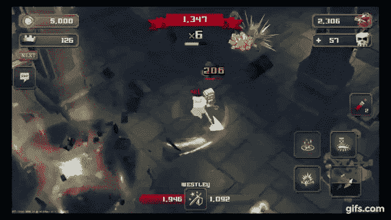

**这是 2022 年 2 月 9 日**

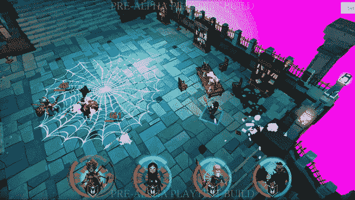

# **免责声明**

这不是任何情况下的财务建议，我研究的目标将永远是深入项目并从不同角度研究它，我确实包括基于我最近研究的类似项目的经验的个人意见。

我现在和将来都愿意接受讨论。

**在 Twitter 上关注我们:**

**@道辛**

在投资任何东西之前，请务必做好自己的研究。

> 加入 Coinmonks [电报频道](https://t.me/coincodecap)和 [Youtube 频道](https://www.youtube.com/c/coinmonks/videos)了解加密交易和投资

# 另外，阅读

*   [加拿大最佳加密交易机器人](https://coincodecap.com/5-best-crypto-trading-bots-in-canada) | [Bybit vs 币安](https://coincodecap.com/bybit-binance-moonxbt)
*   [阿联酋 5 大最佳加密交易所](https://coincodecap.com/best-crypto-exchanges-in-uae) | [SimpleSwap 评论](https://coincodecap.com/simpleswap-review)
*   [购买 Dogecoin 的 7 种最佳方式](https://coincodecap.com/ways-to-buy-dogecoin) | [ZebPay 评论](https://coincodecap.com/zebpay-review)
*   [最佳期货交易信号](https://coincodecap.com/futures-trading-signals) | [流动性交易所评论](https://coincodecap.com/liquid-exchange-review)
*   [火币的加密交易信号](https://coincodecap.com/huobi-crypto-trading-signals) | [Swapzone 审查](/coinmonks/swapzone-review-crypto-exchange-data-aggregator-e0ad78e55ed7)
*   最佳[密码交易机器人](https://coincodecap.com/best-crypto-trading-bots) | [购买索拉纳](https://coincodecap.com/buy-solana) | [矩阵导出评论](https://coincodecap.com/matrixport-review)