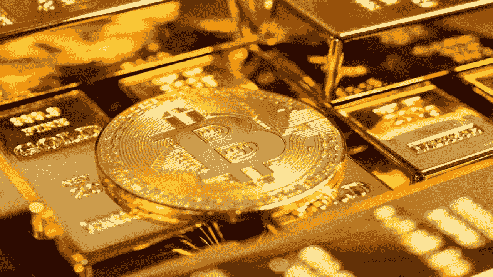

# 黄金支持的代币在熊市表现良好:报告

> 原文：<https://medium.com/coinmonks/gold-backed-tokens-performing-well-in-bear-market-report-f9e90b56435f?source=collection_archive---------59----------------------->

与黄金挂钩的代币比整个加密资产(加密货币)市场增长更快。尽管一些分析师质疑这种代币的可信度，但投资黄金是否是明智之举。

根据加密货币数据制造商 Coin Gecko 的数据，黄金挂钩的 stablecoin top Tether Gold (XAUT)的市值自 2021 年 1 月以来翻了两番，达到 4.213 亿美元。Pax Gold 是市值第二大的黄金挂钩稳定币，其市值增长了五倍，达到 3.783 亿美元。

根据数字资产研究公司 Arcane Research 的数据，加密资产的市值整体增长了 150%，而这两种令牌的市值增长了 360%。

“许多投资者正在投资高度波动的加密资产，与黄金挂钩的代币为这种波动提供了一些保护，”外汇经纪商 Oanda 表示。“随着今年黄金前景的改善，与黄金挂钩的代币可能会继续非常有吸引力，”爱德华·莫亚说。

传统金融市场的许多投资者将黄金视为对冲通胀的工具。正如许多加密投资者认为，随着法定货币购买力的下降，比特币(BTC)的价值可能会上升。

**黄金作为保值手段**

一些投资者认为，在地缘政治紧张时期，黄金可能是一种避险资产。因此，目前美国和俄罗斯在乌克兰问题上的紧张关系使黄金更具吸引力。1 月底，16 亿美元资金流入全球最大的黄金基金 SPDR 黄金股份有限公司，也是因为乌克兰局势紧张。

黄金价格在过去一个月上涨了 2.8%，而股票下跌，交易价格为每盎司 1894.71 美元。比特币同期上涨 0.6%。

分析师分析，最近的数据显示，40 年来最高水平的通胀可能正在推动黄金投资。经济和市场环境似乎支持了加密交易商对黄金挂钩代币日益增长的兴趣。

“与商品挂钩的代币正变得越来越受欢迎，”Arcane Research 月 9 日表示。“到目前为止，投资一直集中在与黄金相关的代币上，但其他大宗商品可能很快就会跟上，”他预测。

例如，俄罗斯的 Rickel 和钯金属巨头 Nornickel 于 2 月 4 日获得俄罗斯央行的许可，通过其子公司 Atomyze 发行与商品挂钩的代币。

分析师表示，市值的上升代表着流通中代币数量的增加，因为与黄金挂钩的代币与黄金的价值挂钩。

“这意味着与黄金挂钩的代币正在发行，”量子经济学投资顾问马体·格林斯潘解释说，“如果你愿意，就发行吧。”只是。“与黄金挂钩的代币目前总市值为 8 亿美元，但仍远低于比特币的 8330 亿美元。当然，与许多已经上涨多次的加密资产相比，过去几年黄金价格的波动也很弱。

格林斯潘指出:“与黄金挂钩的代币对投资者来说利润很少，因为它们的价格几乎没有变化。”。

**供需，“数字荒”**

对于黄金和与黄金挂钩的代币，随着价格上涨，金矿商可以开采更多黄金，增加供应量。相比之下，比特币的供应受到基础的区块链计划的监管。即使价格上涨，供应增加的速度也不会改变。

格林斯潘指出:“就数字资产的价值而言，数字短缺本身远比与金属和其他大宗商品捆绑在一起的额外好处更强大。”

加密资产服务平台 Blockchain.com 公司的 Garrick Hileman 解释说，与黄金挂钩的代币具有支付速度快、无最低购买额和流动性高等优点。

然而，兑现过程并非一帆风顺。海尔曼指出，有时需要几天或几周的时间。

还有对基础资产的担忧。格林斯潘说，投资者需要相信，与黄金挂钩的代币发行者确实在购买支持黄金。

根据 Arcane Research 的一份报告，一些项目试图创造非黄金商品挂钩的代币，如银和钯，但面临各种障碍。另一方面，也有一些与白银挂钩的代币被认定为欺诈性的。

与美元挂钩的稳定债券(如 Tether 的 USDT)的一个大问题是，它们是否真的有合适的储备来支持它们的代币。

根据 CoinGecko 的数据，USDT 与美元挂钩的稳定币市值为 786 亿美元。但发行人 Tether 继续对储备资产持怀疑态度。

“仅仅因为它是与黄金挂钩的代币，并不意味着你可以相信它实际上是由黄金支持的，”格林斯潘警告说。

> 加入 Coinmonks [电报频道](https://t.me/coincodecap)和 [Youtube 频道](https://www.youtube.com/c/coinmonks/videos)了解加密交易和投资

# 另外，阅读

*   [CoinDCX 评论](/coinmonks/coindcx-review-8444db3621a2) | [加密保证金交易交易所](https://coincodecap.com/crypto-margin-trading-exchanges)
*   [红狗赌场评论](https://coincodecap.com/red-dog-casino-review) | [Swyftx 评论](https://coincodecap.com/swyftx-review) | [造币厂评论](https://coincodecap.com/coingate-review)
*   [Bookmap 评论](https://coincodecap.com/bookmap-review-2021-best-trading-software) | [美国 5 大最佳加密交易所](https://coincodecap.com/crypto-exchange-usa)
*   [如何在 FTX 交易所交易期货](https://coincodecap.com/ftx-futures-trading) | [OKEx vs 币安](https://coincodecap.com/okex-vs-binance)
*   [CoinLoan 审查](https://coincodecap.com/coinloan-review) | [YouHodler 审查](/coinmonks/youhodler-4-easy-ways-to-make-money-98969b9689f2) | [BlockFi 审查](https://coincodecap.com/blockfi-review)
*   [XT.COM 评论](https://coincodecap.com/profittradingapp-for-binance)币安评论 |