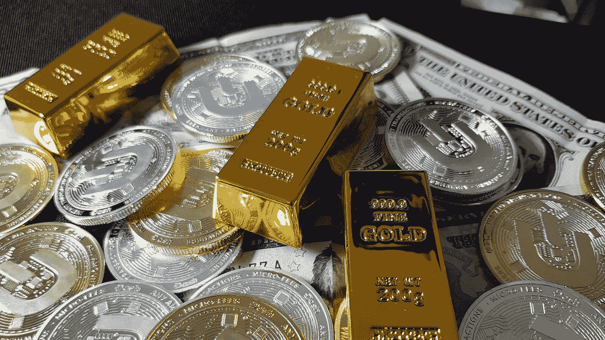

# 金钱不是你赚了什么，而是你没有失去什么。

> 原文：<https://medium.com/coinmonks/gold-money-and-its-not-what-you-make-it-is-what-you-don-t-lose-1c7063e091cc?source=collection_archive---------56----------------------->

source: [Dash Cryptocurrency](https://unsplash.com/@dashpay)

## 历史的安全阀

黄金和白银在历史上经受了时间的考验，是用来对冲任何金融影响的商品，许多人都有快速“赚”钱的欲望。在许多人快速致富的心态中，持有这种遗物作为安全手段的欲望并不流行…