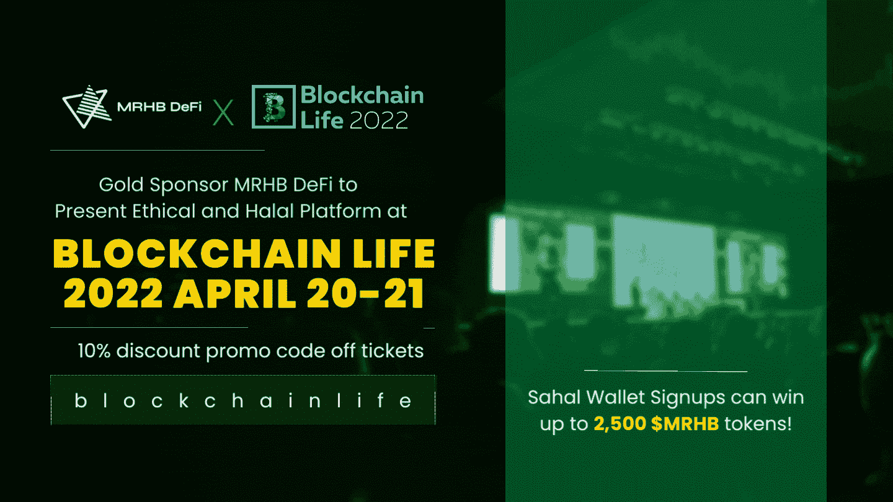
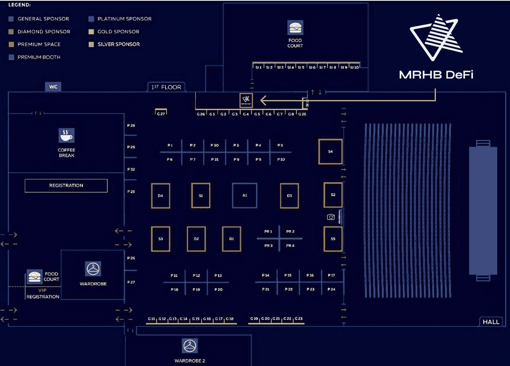

# 金牌赞助商 MRHB DeFi 将于 4 月 20 日至 21 日在区块链生活 2022 上展示道德和清真平台

> 原文：<https://medium.com/coinmonks/gold-sponsor-mrhb-defi-to-present-ethical-and-halal-platform-at-blockchain-life-2022-april-20-21-eda0bf18789b?source=collection_archive---------57----------------------->

*阿联酋迪拜，2022 年 4 月 18 日* **—** 关注道德的去中心化金融平台 [MRHB DeFi](https://mrhb.network/) 荣幸地宣布成为[区块链生活 2022 论坛](https://blockchain-life.com/europe/en/)的金牌赞助商。这是欧洲和独联体最大的区块链活动之一，第八届活动预计将有超过 5，000 名参与者，包括行业专业人士、风险资本家、政府官员、企业家和密码爱好者。

活动议程上的一些热门话题包括 DeFi 和元宇宙开发、高效采矿的特点、NFT 前景以及区块链在企业和政府中的实施。一个中心话题将是俄罗斯对加密货币的监管。论坛的主要发言人包括俄罗斯财政部金融政策司司长 Ivan Chebeskov、企业家、以太坊俄罗斯能力中心负责人、BlockGeeks 创始人 Vladislav Martynov 和 Forklog 创始人 Anatoly Kaplan。

MRHB DeFi 首席执行官 [Naquib Mohammed](https://www.linkedin.com/in/mohammednaquib/?originalSubdomain=au) 表示:“我们很高兴在区块链生活上展示世界上第一个道德和清真 DeFi 门户网站。**“我们的大量支持者来自世界的这一地区，我们很高兴见到他们并当面感谢他们分享我们的愿景，即在分散金融中增强基于道德信仰的社区的能力。”**

对于希望参加区块链生活活动的社区， **MRHB 很高兴提供 10%的门票折扣，并提供特殊的折扣代码:Blockchain Life。**4 月 20 日至 21 日，与会者可以在莫斯科音乐媒体巨蛋一楼的 G4 展位与 MRHB 团队会面，该团队将举办 MRHB 的 **Sahal Wallet 注册促销活动，参与者可以赢得高达 2，500 美元的 MRHB。**

**DeFi 对于有道德和信仰意识的群体**

MRHB 是一个平台，旨在支持超过 17 亿只关心道德财务决策的人，包括全球价值超过 3 万亿美元的伊斯兰金融部门，MRHB 雇佣了一个顾问委员会，确保他们生态系统的每个方面都是清真的。

穆斯林和非穆斯林都可以放心地自由参与，清真产品只与道德商业行为相关，如避免利息、高利贷和社会剥削，以及支持可持续发展、资产或公用事业支持融资、透明度和公平的风险回报分担。

伦理项目已经推出了它的 Sahal 钱包，这是一个自我保管的加密钱包，提供多链令牌支持。该钱包只接受清真令牌，并作为一个由其他七种清真 DeFi 产品组成的生态系统的门户。

除了 Sahal Wallet 之外，[SouqNFT market market](https://souq.mrhb.network/)也已经推出，以其严格的审查过程而闻名，确保用户永远不会偶然发现 NSFW 的内容。SouqNFT 上最近的一次主要后端升级使平台速度提高了近 80%,市场仍在改造中，将会看到更多的改进和功能推出。根据这家初创公司的路线图，即将加入 MRHB 生态系统的包括企业家启动平台和分散慈善事业(DePhi)，旨在为造福社区的社会倡议提供资金。MRHB 还将建立其他地方看到的标准 DeFi 产品，如分散化治理、产生被动回报的流动性收割机、加密融资和跨链 DEX 聚合器，但有一个关键区别:该平台上的产品不会收取任何形式的利息或高利贷。

于 2021 年 12 月推出的 [$MRHB](https://coinmarketcap.com/currencies/marhabadefi/) 令牌表现良好——即使在当前的熊市中也保持不变——并于 1 月份被纳斯达克命名为“[杀手加密](https://www.nasdaq.com/articles/7-killer-cryptos-to-buy-for-january)”，并于 3 月份再次被视为投资的“[有吸引力的加密](https://www.nasdaq.com/articles/4-attractive-cryptos-to-buy-as-bitcoin-slowly-rebounds)”，一个关键原因是其“独特性”和“一体化”halal 加密解决方案。

MRHB DeFi 的愿景得到了许多合作伙伴和投资者的支持，包括 [Polygon Technology](https://polygon.technology/) 、 [Sheesha Finance](https://www.sheeshafinance.io/) 、[澳大利亚海湾资本](https://www.ausgulf.com)、 [NewTribe Capital](https://www.newtribe.capital/) 、[区块链澳大利亚](https://blockchainaustralia.com.au/)、 [Mozaic](https://nwgp.com/#mosaic) 、 [Contango Digital Assets](https://www.contango.digital/) 、 [ZKSync](https://zksync.io/) 、 [Acreditus Partners](https://acreditus.com/) 、 [EMGS 集团](http://emgsconsulting.com/)

**关于 MRHB DeFi**

MRHB DeFi 是一个清真、分散的金融平台，通过遵循基于信仰的金融和商业原则，体现“道德和包容性 DeFi”的真正精神，所有被排斥的社区都可以从 DeFi 的全部赋权潜力中受益。

这个多元化的团队由研究人员、技术专家、有影响力的人士、伊斯兰金融科技专家、商业企业家和行业专业人士组成，他们聚集在一起，共同确保 MRHB DeFi 以一种将影响整个社会的方式盛行，从根本上弥合信仰意识社区和区块链世界之间的差距。

**MRHB DeFi 官方渠道**

网址: [https://mrhb.network](https://mrhb.network/)

推特:[https://twitter.com/marhabadefi](https://twitter.com/marhabadefi)

电报:[https://t.me/mdf_official](https://t.me/mdf_official)

电报通知:[https://t.me/marhabadefi_ANN](https://t.me/marhabadefi_ANN)

YouTube:[https://www.youtube.com/c/MarhabaDeFi](https://www.youtube.com/c/MarhabaDeFi)

中:[https://medium.com/@mrhbdefi](/@mrhbdefi)

领英:【https://www.linkedin.com/company/marhabadefi 

不和:【https://discord.com/invite/DubSjKmkBX】T4

https://www.facebook.com/MRHBDeFi:[脸书](https://www.facebook.com/MRHBDeFi)

电报(阿拉伯语):[https://t.me/mdf_arabic](https://t.me/mdf_arabic)

电报(俄语):[https://t.me/marhabadefi_russia](https://t.me/marhabadefi_russia)

电报(土耳其语):[https://t.me/MarhabaDefiTR](https://t.me/MarhabaDefiTR)

电报(波斯语):[https://t.me/mrhbdefi_persian](https://t.me/mrhbdefi_persian)

电报(乌尔都语/印地语):[https://t.me/MRHBDeFi_Urdu_Hindi](https://t.me/MRHBDeFi_Urdu_Hindi)

SouqNFT market place:[https://souq . mrhb . network](https://souq.mrhb.network)

> 加入 Coinmonks [电报频道](https://t.me/coincodecap)和 [Youtube 频道](https://www.youtube.com/c/coinmonks/videos)了解加密交易和投资

# 另外，阅读

*   [Bookmap 评论](https://coincodecap.com/bookmap-review-2021-best-trading-software) | [美国 5 大最佳加密交易所](https://coincodecap.com/crypto-exchange-usa)
*   最佳加密[硬件钱包](/coinmonks/hardware-wallets-dfa1211730c6) | [Bitbns 评论](/coinmonks/bitbns-review-38256a07e161)
*   [新加坡十大最佳加密交易所](https://coincodecap.com/crypto-exchange-in-singapore) | [购买 AXS](https://coincodecap.com/buy-axs-token)
*   [红狗赌场评论](https://coincodecap.com/red-dog-casino-review) | [Swyftx 评论](https://coincodecap.com/swyftx-review) | [CoinGate 评论](https://coincodecap.com/coingate-review)
*   [投资印度的最佳密码](https://coincodecap.com/best-crypto-to-invest-in-india-in-2021)|[WazirX P2P](https://coincodecap.com/wazirx-p2p)|[Hi Dollar Review](https://coincodecap.com/hi-dollar-review)