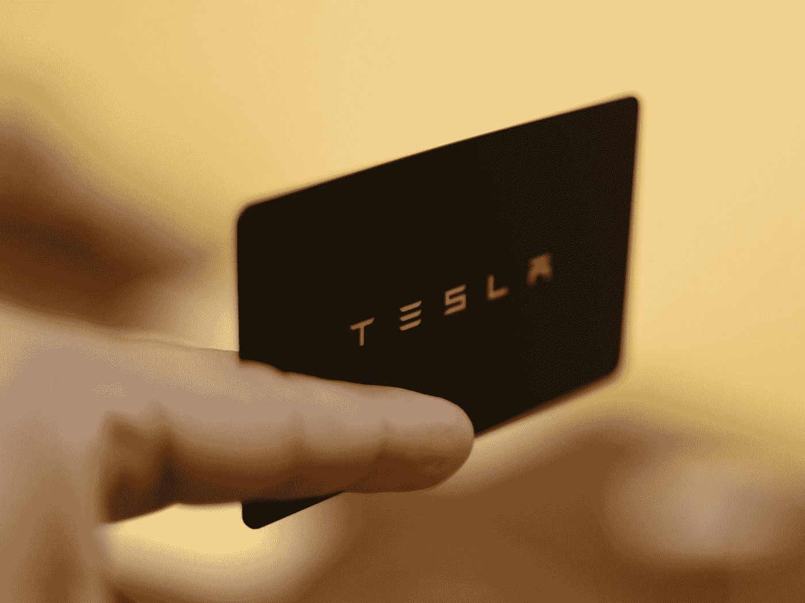
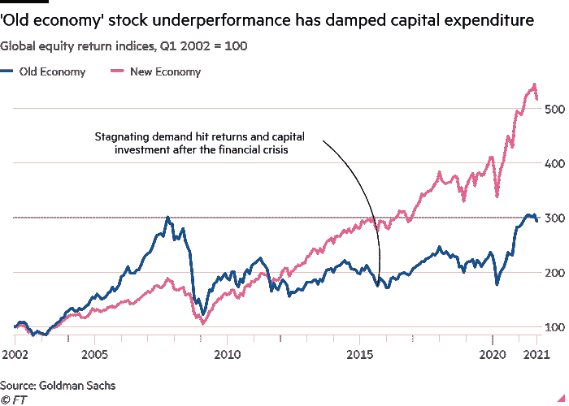

# 高盛——电池金属的牛市已经结束。

> 原文：<https://medium.com/coinmonks/goldman-sachs-bull-market-for-battery-metals-is-over-ab3a41e29d48?source=collection_archive---------24----------------------->

Photo by [Manny Becerra](https://unsplash.com/@mannyb?utm_source=medium&utm_medium=referral) on [Unsplash](https://unsplash.com?utm_source=medium&utm_medium=referral)

电池金属牛市结束了吗？高盛是这样认为的。

根据 [**石英**](https://qz.com/2172104/a-glut-of-cheap-lithium-could-bring-down-ev-prices-next-year/) ，高盛预测汽车制造商将在短期内从金属短缺中找到一些缓解，但随着 [**电池金属**](/@44jmonroe91/elon-musk-made-a-deal-with-mike-henry-for-critical-metals-4354077b8c4d) 的全球消费长期持续，这种需求可能会赶上供应，并导致金属价格在未来飙升。

这个故事关系到全球大宗商品和金属，具体来说就是 [**【电动汽车】**](/@44jmonroe91/elon-musk-made-a-deal-with-mike-henry-for-critical-metals-4354077b8c4d) 和新生的 [**能源转型**](/coinmonks/whats-driving-the-energy-transition-5633772810da) 的供需。

但了解这些金属的价格波动是理解全球大宗商品超级周期整体问题的关键。

最常见的电池金属是镍、钴和锂。

从地缘政治的角度来看，要想更多地了解金属和更广泛的全球经济的情况，只需看看正在发生的 [**中国的崛起和美国的制裁**](/@44jmonroe91/the-copper-and-nickel-dilemma-for-chinas-rise-and-usa-sanctions-27848b89954e) 就可以了。

尽管最重要的是，电池金属的当前形势与 2022 年 3 月****伦敦金属交易所(LME)发生的事情有关，当时镍价触及每吨 10 万美元——迫使 LME 关闭其大宗商品交易平台。****

****由于持续的俄乌冲突和中国上海的封锁，金属市场尚未从今年 LME 发生的事情中完全恢复****

****许多分析师都将所谓的 [**【旧经济的报复】**](https://www.ft.com/content/c7732d53-2e34-4fde-b5fb-6f45f114111f) 作为理解随着全球大宗商品价格全面大幅上涨的市场力量的一种方式。****

********

****Source: “The revenge of the old economy” Jeff Currie, Financial Times, 20 October 2021\. [https://www.ft.com/content/c7732d53-2e34-4fde-b5fb-6f45f114111f](https://www.ft.com/content/c7732d53-2e34-4fde-b5fb-6f45f114111f)****

****据《金融时报》的杰夫·柯里称，****

> ****“2000 年代和 70 年代有很多共同点，都是再分配政策的整体理念。"****

****Jeff Currie 通过这句话断言，全球经济目前正在经历自 20 世纪 70 年代以来的第三次全球大宗商品超级周期。****

****他认为，在 20 世纪 60 年代末和 70 年代初，全球经济经历了同样的投资不足主题，即“旧经济的报复”，这意味着旧经济中糟糕的资本投资导致新经济中更多的资本。****

****观看德米特里·科菲纳斯在《隐藏的力量》播客中对杰夫·柯里的完整采访。****

> ****加入 Coinmonks [电报频道](https://t.me/coincodecap)和 [Youtube 频道](https://www.youtube.com/c/coinmonks/videos)了解加密交易和投资****

# ****另外，阅读****

*   ****[比特币基地评论](/coinmonks/coinbase-review-6ef4e0f56064) | [德里比特评论](/coinmonks/deribit-review-options-fees-apis-and-testnet-2ca16c4bbdb2) | [FTX 评论](/coinmonks/ftx-crypto-exchange-review-53664ac1198f)****
*   ****[Coinmetro 评论](https://coincodecap.com/coinmetro-review) | [VirgoCX 评论](https://coincodecap.com/virgocx-review)****
*   ****[法国 4 大最佳加密副本交易平台](https://coincodecap.com/copy-trading-platforms-france)****
*   ****[从 WazirX 切换到 CoinDCX 的 5 个理由](https://coincodecap.com/reasons-to-switch-from-wazirx-to-coindcx)****
*   ****[联合国硬币评论](https://coincodecap.com/unocoin-review) | [最佳加密赌注硬币](https://coincodecap.com/best-crypto-staking-coins)****
*   ****如何使用 MetaMask Wallet 获得 KCC 地址？****