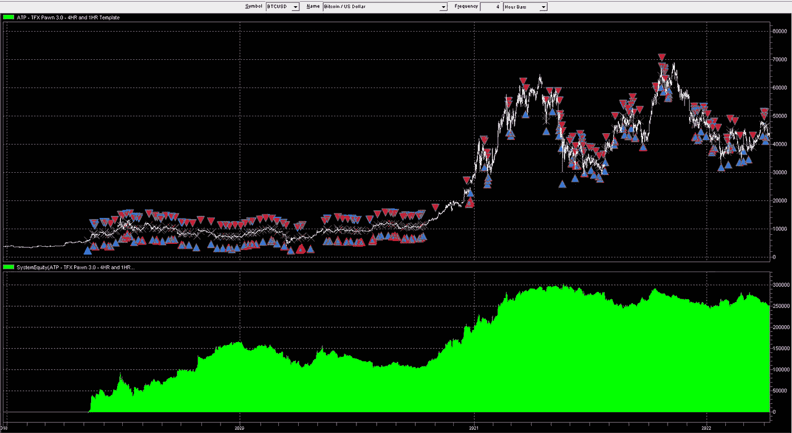
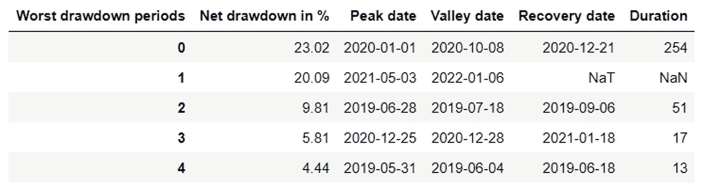
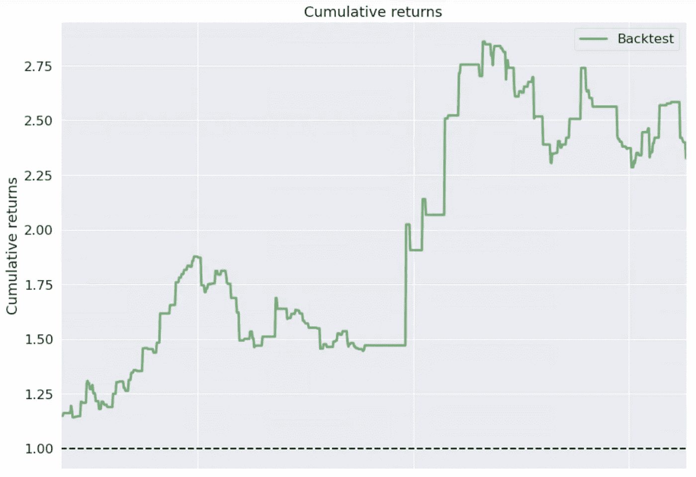
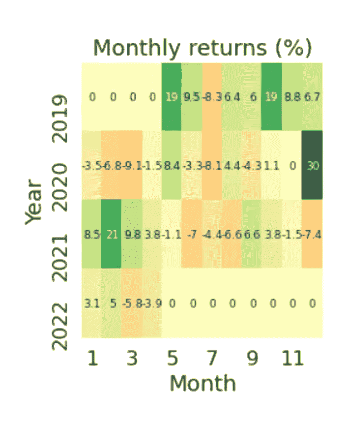
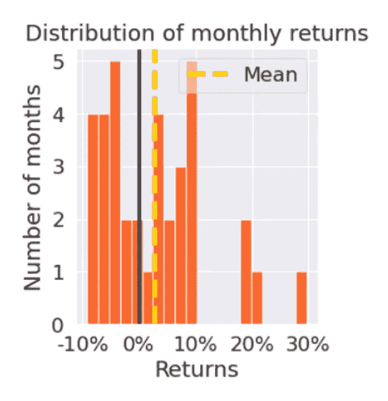
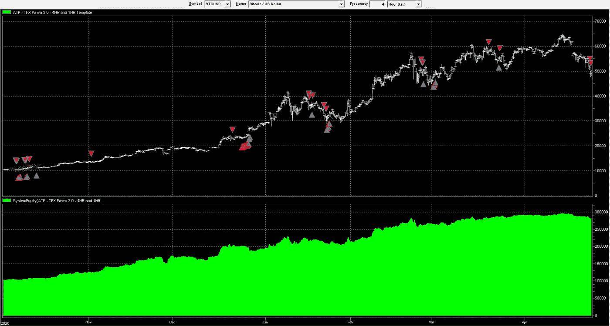

# GoldPesa 比特币(BTCg)——类固醇上的比特币！

> 原文：<https://medium.com/coinmonks/goldpesa-bitcoin-btcg-bitcoin-on-steroids-c3594fa9e667?source=collection_archive---------19----------------------->

The PAWN applied to a Bitcoin chart! — Equity Curve (Green)

当我们在 GoldPesa 之旅中勇往直前时，记住 GoldPesa 的使命是很重要的。我们的使命是创造一种可供全世界使用的先进货币形式，这种货币不仅为持有者提供了对冲通胀的手段，而且即使藏在床垫下也能增值。

*   如果你把菲亚特藏在床垫下，100 年后你只能买到今天能买到的面包的一小部分。
*   如果你把黄金藏在床垫下，100 年后你就能买到和今天一样多的面包。
*   如果你把金币藏在床垫下，100 年后你能买到的面包会比今天多得多。

当我们研究过去 2000 年发生的大型超级周期时，我们可以得出结论，人类将是人类，超级大国及其储备货币的兴衰并不是什么新鲜事。最终超过生产率的印钞是经常发生的事情，世界各地的经济体往往会根据文化和领导人的不同做出不同的反应。在这些巨大的权力转移中，战争和冲突似乎是不可避免的，因为当然，人类的自我从来不想如此轻易地放弃权力。在这种时期，持有黄金、大宗商品和其他避险资产往往是生存的关键。

在我们的生活所定义的小小的学习窗口中，看似混乱的事物中有一种秩序。了解我们在更大的周期中所处的位置，并通过预期我们生活中从未发生过的事情来仔细定位我们自己和我们的财务状况，这将区分“男人和男孩”以及“女人和女孩”。

用布里奇沃特的亿万富翁创始人雷伊·达里奥的话来说，“大循环会重演，唯一的区别是演员、他们的服装和技术。”

要注意的关键词是“技术”我们会立即想到比特币、其背后的技术，以及比特币将如何很好地改变数千年来我们看待货币的方式。

比特币背后的经济学及其真正的去中心化特征使其成为一种极其高级的黄金形式，许多人现在将其称为“黄金 2.0”。与黄金类似，比特币可能是一种强大的价值储存手段，但它本身不一定是最佳投资，因为它不会产生任何收入、收益率或股息。

# ***推出 GoldPesa 比特币(BTCg)***

*GoldPesa 创造了“GoldPesa Bitcoin”，也称为“BTCg”，旨在使用具有传统结构化产品特征的令牌组学来提高比特币的收益率。换句话说，GoldPesa 的目标是在不拖累比特币本身的情况下给比特币带来收益，同时使用我们专有的智能交易算法“典当”,为代币持有者创造价值。*

## ****BTCg 如何溢价交易？****

*无论何时 BTCg 被购买、出售或转让，GoldPesa 都会收取 1%的费用。*

*0.5%被杠杆化，分配给典当，GoldPesa 专有的高度智能的交易算法。*

*典当产生的利润用于回购和焚烧 BTCg 代币，通过推高价格来奖励代币持有者。*

## ****BTCg 与其他在比特币上承诺高收益的 DeFi 协议有何不同？****

*BTCg 与其他承诺比特币高收益的 DeFi 协议 ***非常*** 不同:*

1.  *与大多数 DeFi staking 协议不同，作为 wBTC 基础的 BTCg 令牌持有者在分散的智能合约中保持安全，并且在任何时候都不受阻碍。*
2.  *典当产生的利润用于回购和焚烧 BTCg，而不是给出一个简单的收益率。这种模式为令牌持有者创造了巨大的价值，因为 BTCg 的价格预计将远离比特币的现货价格，并以溢价交易。这反过来又造成了显著的波动性，从而产生指数级增长的费用和指数级增长的典当资本基础。产生巨大的滚雪球效应。*
3.  *大多数提供比特币收益的 DeFi 协议之所以能够这样做，是因为它们向借款者或交易者收取高额费用。这种模式需要一个不断需要增加新客户或更多资金的生态系统，以维持维持这种收益所需的费用。GoldPesa 正在利用一个大得多的资金池，并基于一种人工智能算法产生回报，这种算法比通过收取费用来创造收益要可持续得多。*

# ****卒****

*棋子是一种高度智能的交易算法，主要是为外汇市场开发的。在过去的 20 年里，我们的 quant 团队专注于将数字信号处理原理应用于市场，同时专注于高流动性外汇对的交易比率，为充满随机性的未来做准备。*

## *棋子不是只做多的加密策略！*

*如果每当一个所谓的“加密专家”告诉我他们的只做多加密交易策略在过去 3 年中做得有多好时，我给 GoldPesa token 持有者一枚镍币，你们都将变得富有！生存偏差是目前被严重误解的东西，我认为在如此巨大的泡沫中这是正常的。*

## ****将棋子应用于比特币****

*GoldPesa 比特币让我们离创造世界上有史以来最先进的货币形式又近了一步，但它的一个缺点是，目前在区块链上没有合适的外汇对交易方式。因此，在当前模式下，我们被迫从区块链中移除 1%费用中的 0.5%，并将其放入杠杆经纪账户，以便典当可以产生利润，这些利润随后用于从市场上回购和燃烧 BTCg 令牌。*

*从理论上讲，如果我们能够解决这个问题，BTCg 可以成为一种完全自主、分散的创收货币，GoldPesa 可以将其提供给世界，然后离开。*

*看起来这只是时间问题，但在我们等待的时候，我们认为我们应该从比特币开始将典当应用于主要的加密货币，看看效果如何。毕竟，棋子是建立在涉及周期研究的普遍理论上的，如果这样的周期确实存在，那么棋子在技术上应该有某种优势。*

*当应用于完全不相关的资产类别时，棋子的表现为其在学习和预测未来方面的实力提供了非常有力的验证。特别是，由于棋子指示器没有输入，因此不能优化任何参数，而不管其应用于何种资产类别。*

*将典当应用于比特币的副产品为 BTCg 持有者创造了一个有趣的对冲。*

*BTCg 的内在价值=比特币的现货价格+典当利润。*

*因此，如果比特币的现货价格下跌，但杠杆典当交易卖空了相同的名义价值，那么这将在崩盘时为 BTCg 持有者提供强有力的保护。*

# ****卒表现报告****

**

*Performance Summary of the PAWN trading BTC*

**

*Drawdown % and Duration*

**

*Cumulative Returns*

**

*Monthly % Returns*

**

*Distribution of Months Returns*

*注意:如果你仔细观察，你可以确认典当确实是一个多空策略，有能力捕捉一些最大的比特币趋势，同时在下跌和价格波动期间保护账户。*

**

*Actual Long/Short Trades (Red & Blue Arrows) along with Equity Curve in Below (Green)*

> *加入 Coinmonks [电报频道](https://t.me/coincodecap)和 [Youtube 频道](https://www.youtube.com/c/coinmonks/videos)了解加密交易和投资*

# *另外，阅读*

*   *[Bookmap 评论](https://coincodecap.com/bookmap-review-2021-best-trading-software) | [美国 5 大最佳加密交易所](https://coincodecap.com/crypto-exchange-usa)*
*   *最佳加密[硬件钱包](/coinmonks/hardware-wallets-dfa1211730c6) | [Bitbns 评论](/coinmonks/bitbns-review-38256a07e161)*
*   *[新加坡十大最佳加密交易所](https://coincodecap.com/crypto-exchange-in-singapore) | [购买 AXS](https://coincodecap.com/buy-axs-token)*
*   *[红狗赌场评论](https://coincodecap.com/red-dog-casino-review) | [Swyftx 评论](https://coincodecap.com/swyftx-review) | [造币厂评论](https://coincodecap.com/coingate-review)*
*   *[投资印度的最佳密码](https://coincodecap.com/best-crypto-to-invest-in-india-in-2021)|[WazirX P2P](https://coincodecap.com/wazirx-p2p)|[Hi Dollar Review](https://coincodecap.com/hi-dollar-review)*
*   *[加拿大最佳加密交易机器人](https://coincodecap.com/5-best-crypto-trading-bots-in-canada) | [库币评论](https://coincodecap.com/kucoin-review)*