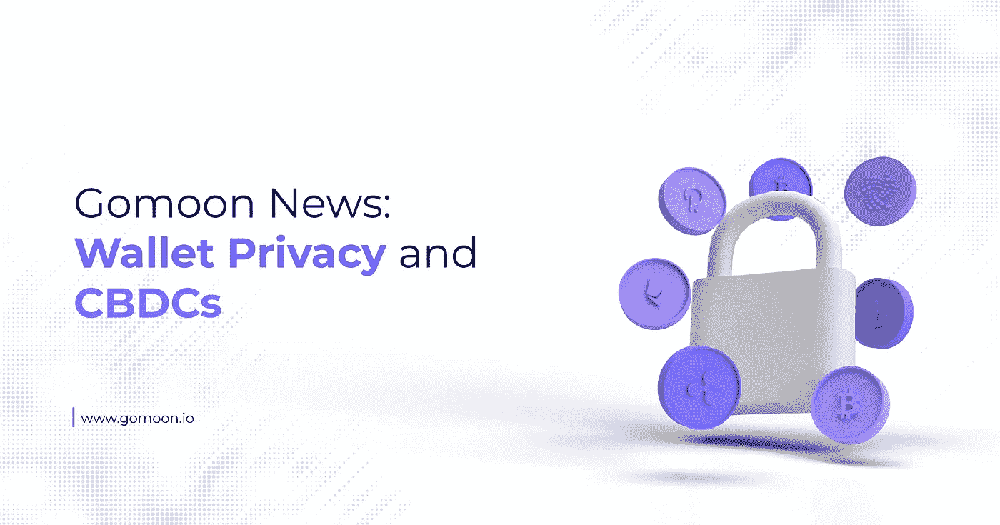

# Gomoon 新闻:钱包隐私和 CBDCs

> 原文：<https://medium.com/coinmonks/gomoon-news-wallet-privacy-and-cbdcs-ecee8ac29732?source=collection_archive---------73----------------------->

欧盟议会最近以 58 票对 52 票投票取消了某些加密货币交易的匿名性，这是其打击不可识别的加密使用的最新尝试。修改拟议的资金转移监管(TFR)法案的投票需要在本月晚些时候的第三次会议上通过投票予以确认，这将修改欧盟委员会的反洗钱(AML)规则，意味着任何向加密货币交易所发送资金或从加密货币交易所接收资金的私人非托管加密货币钱包的用户都必须在交易发生前证明他们的身份。这样的规则引发了过多的实际问题，更不用说打开一个隐私和安全问题的罐头了。

随着世界各国讨论中央银行数字货币(CBDCs)，欧盟对私人加密货币交易的态度告诉我们这些假定的现金替代品的设计是什么？

# 欧盟议会对 FATF 的旅游规定走得太远了

欧盟关于加密交易的严厉新提案的起源可以追溯到 2018 年，当时 20 国集团[宣布](https://fullycrypto.com/g20-agrees-cryptos-can-be-beneficial-to-the-global-economy)首次认真研究加密货币监管，法国财政部长 Bruno Le Maire 表示，该集团将“根据 FATF(金融行动特别工作组)的标准监管反洗钱和打击资助恐怖主义的加密资产，并将根据需要考虑其他应对措施。”

2019 年[FATF 发布了指导意见](https://static.coindesk.com/wp-content/uploads/2019/06/Embargo-Virtual-Asset-Guidance.pdf)，希望其所有成员国在加密货币方面遵循，其中包括扩大其旅行规则，以包括数字资产。这意味着加密货币交易所将不得不收集所有以加密货币交易超过美元/€/1000 的个人的个人数据，即使对方不是他们平台的用户。

这被认为是足够侵入性的，更不用说是一个巨大的隐私问题，一些国家，尤其是荷兰，几乎立即执行这项裁决。然而，旅行规则的修正案没有在欧盟内部得到广泛采纳，导致各国面临更大的压力，要求他们对私人加密货币交易采取措施。

上个月的投票实际上已经确定了旅行规则的修正案，但在投票前几天，提案中的最后一分钟变化进一步收紧了规则，不仅要强制收集上述细节，还要在客户可以从第三方发送或接收资金之前对其进行验证。这意味着，如果正式投票通过，任何处理加密货币的实体都必须验证与该平台互动的用户的身份，即使他们甚至可能不是客户。然后，他们必须将这些信息存档，并在被要求时移交给当局。

目前还不知道这一规则变化将如何在实际基础上发挥作用，但它将导致交易所被传统银行没有的需求淹没。还有一种担忧是，用属于这些个人的加密货币地址记录的姓名、地址和电话号码的库存将成为黑客的蜜罐，他们可以不费吹灰之力就锁定富人。

# 加强监管对发展中国家来说不是好兆头

就发展中国家而言，这种监管上的巨大转变令人担忧。CBDCs 是现有法定货币的数字版本，世界各国政府和中央银行正在讨论将其作为现金的潜在长期替代品。尽管美国和英国等一些国家仍处于 CBDC 研究的早期阶段，但中国等其他国家已经在进行公开的真实世界试验。

就像普通货币一样，中央银行跟单信用证将由每个国家的中央银行发行，中央银行将有能力将钱直接发放到个人的钱包中，这当然与个人在该国的身份和公民身份有关。实质上，这就是欧盟议会试图改变私人钱包规则的目的——确保区块链上的每个钱包都与一个真实的人的身份相关联。这也意味着，监管这些央行的政府将能够更加密切地关注 CBDC 持有者的行动。

根据这一理论，不难想象一个实物现金完全被 CBD 取代的世界，以及为什么政府会为此欢呼——不会有金融违规行为，因为世界上的每一分钱都会被计算在内，并始终与一个真实的人联系在一起。

这就是中国如此热衷于 CBDC 的原因，也是中国在 2016 年开始对其进行初步研究的原因。用数字元取代现金让执政者有机会观察到这个国家每个公民哪怕是最细微的消费水平。如果政府不喜欢某种类型的商品或服务，就像它对加密货币所做的那样，它可以禁止商店、连锁店甚至整个商业部门在数字区块链上与用户互动。

当然，这种控制水平在世界范围内是不可比拟的，但毫无疑问，某些政府正在推进这种系统的实施，其明确目的是确保其公民不会用自己的钱做国家不认可的事情。别忘了，如果政府给你钱，如果它怀疑你做了坏事，它也可以很容易地把钱拿走。

# 比特币=自由

所有这些都带来了比特币。比特币的美妙之处在于，只要它存在一个私人的、非托管的钱包里，就不会被轻易拿走——即使是欧盟。没人能阻止你把比特币花在任何你喜欢的东西上，只要是合法的。比特币比监管最宽松的 CBDC 更有利于保护个人隐私，事实上，比特币更像真正的数字现金，而不是央行最终将取代实物英镑、美元和欧元的实际数字现金系统。

任何希望加密货币行业达到其支持者所认为的接受程度的人都知道，监管至关重要。世界上只有 5%的人理解和使用加密货币，其潜力是有限的，而其他 95%的人直到安全地涉足数字资产的世界才会被说服，为此我们需要监管。

然而，正如我们在中国等国家看到的那样，监管可能演变成威权主义，这是一个非常现实的危险。欧盟关于匿名转账的新规定带来的风险与此不同，但有一种危险是，让实物现金更方便的努力最终会导致一个为用户提供更少隐私的系统。

有关比特币的更多信息，以及购买和持有比特币的安全、受监管的平台，请访问我们的[网站](https://www.gomoon.io/)，在我们上线之前了解最新进展。关于 Gomoon 平台的更新，注册我们的时事通讯，然后[在 Twitter 上关注我们](https://twitter.com/gomoon)。

> 加入 Coinmonks [电报频道](https://t.me/coincodecap)和 [Youtube 频道](https://www.youtube.com/c/coinmonks/videos)了解加密交易和投资

# 另外，阅读

*   [霍比审核](https://coincodecap.com/huobi-review) | [OKEx 保证金交易](https://coincodecap.com/okex-margin-trading) | [期货交易](https://coincodecap.com/futures-trading)
*   [电网交易机器人](https://coincodecap.com/grid-trading) | [Cryptohopper 审核](/coinmonks/cryptohopper-review-a388ff5bae88) | [Bexplus 审核](https://coincodecap.com/bexplus-review)
*   [7 个最佳零费用加密交易平台](https://coincodecap.com/zero-fee-crypto-exchanges)
*   [氹欞侊贸易评论](https://coincodecap.com/anny-trade-review) | [霍比融资融券交易](/coinmonks/huobi-margin-trading-b3b06cdc1519)
*   [分散交易所](https://coincodecap.com/what-are-decentralized-exchanges) | [比特 FIP](https://coincodecap.com/bitbns-fip) | [Pionex 审查](https://coincodecap.com/pionex-review-exchange-with-crypto-trading-bot)
*   [用信用卡购买密码的 10 个最佳地点](https://coincodecap.com/buy-crypto-with-credit-card)