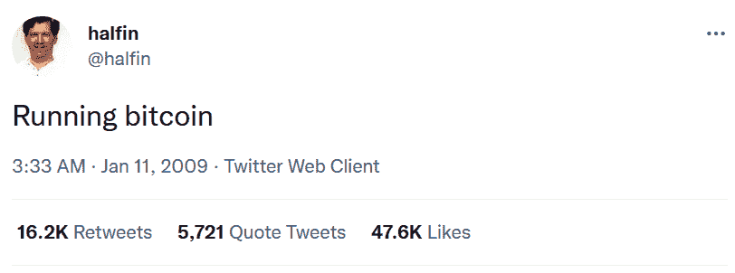
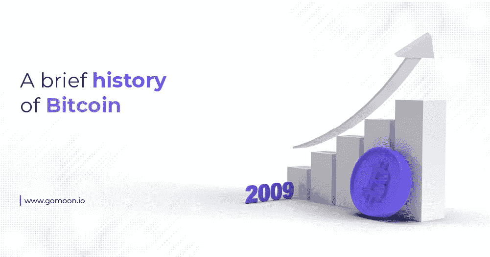

# Gomoon 的比特币简史

> 原文：<https://medium.com/coinmonks/gomoons-brief-history-of-bitcoin-b70cb948516b?source=collection_archive---------74----------------------->

世界上大多数人只是通过他们在媒体上读到、看到或听到的东西了解比特币，他们中的大多数人只是在 21 世纪 10 年代末比特币开始成为这些媒体的头条新闻后才开始意识到它。然而，比特币的历史，从 20 世纪 90 年代的起源到今天的金融巨兽，可以告诉我们许多关于它的属性、使用案例和潜力的信息。为了了解更多信息，让我们深入了解一下比特币的历史。

# 赛弗朋克和弗兰肯斯坦

比特币可以追溯到 20 世纪 90 年代初，当时三位才华横溢的计算机科学家埃里克·休斯(Eric Hughes)、蒂莫西·c·梅(Timothy C. May)和约翰·吉尔摩(John Gilmore)聚在一起讨论技术中的隐私问题。这个组织后来被称为“密码朋克”(cypherpunks)，是“密码”一词的缩写，指的是加密算法，也叫“赛博朋克”。

除了定期聚会，赛弗朋克们还开始使用一个名为 Metzdowd 的邮件列表来讨论数学、计算机科学、密码学、经济学和哲学。这个集体由黑客、爱好者和其他梦想家组成，他们热衷于开发互联网这一新兴技术，并将其推向极限。意识到有机会利用它来保护和增加基本人权、自由和隐私，赛博朋克运动随着互联网的普及而发展。

在他们之间，塞弗朋克在 20 世纪 80 年代末和 21 世纪初开发了一系列注重隐私的数字货币。一些例子包括大卫·乔姆的 DigiCash，戴伟的 B-money，道格拉斯·杰克逊和巴里·唐尼的 E-Gold，以及尼克·萨博的 Bit Gold。Adam Back 还开发了一个名为 HashCash 的电子邮件反垃圾邮件协议，该协议的一个版本在 Bitcon 的最终创建中发挥了重要作用。

这些货币背后的原理是相同的——创造一种不需要第三方来处理交易的货币形式，并允许汇款人和收款人至少保持假名。所有这些项目都失败了，通常是因为技术或法律原因，但它们并没有完全消亡。这些早期项目的各种元素被用于比特币的创造，并且今天仍然作为其协议的一部分存在。在许多方面，比特币是这些早期尝试的弗兰肯斯坦怪物，有一些关键的变化和补充。

# 中本聪出现了

2007 年，化名为中本聪的一个人或一群人开始将以前的数字现金工作的某些元素与最近开发的技术结合起来，创造出后来成为比特币的东西。2008 年 10 月 31 日，描述该系统及其工作原理的比特币白皮书被发布到 Metzdowd 列表中。特别是一个赛弗朋克，哈尔·芬尼，欣赏了这个项目的潜力，并帮助中本聪将代码准备就绪，最终可以投入使用。

2009 年 1 月 3 日，比特币区块链上线——此后从未下跌。八天后，芬尼用一条[象征性的推特](https://twitter.com/halfin/status/1110302988)纪念了这一事件:

随着比特币的运行，中本聪、芬尼和其他几个发现比特币的开发者开始编辑代码，完善协议。中本聪在 2010 年退出了比特币的开发，称开发人员为其“提供了良好的服务”,并表示他/他们希望转向其他项目。

据说，属于中本聪的比特币地址大约有 100 万个，其中充满了在该协议最初几周和几个月开采的比特币。然而，他们从来没有被触动过，事实上，自从 2010 年 12 月 12 日中本聪最后一次通信以来，没有人听到过他的任何消息。

# 比特币的早期用例

就在 Satoshi 准备退出的时候，比特币生态系统发生了一个重要的发展——2010 年 5 月 10 日，比特币交易员 Laszlo Hanyecz 在两个棒约翰披萨上花了 1 万个比特币，成为有史以来第一个用比特币买东西的人。这项交易现在每年都在比特币披萨日庆祝，每个周年纪念日通常都会提升这两个披萨的价值。10 周年纪念日见证了价值 9600 万美元的订单！

除了奇怪的披萨订单，比特币在现实世界中没有用例，直到美国自由主义者罗斯·乌布里希特利用其交易的假名性质，在一个名为“丝绸之路”的专门在线毒品市场上掩盖买家和卖家的身份。丝绸之路于 2011 年 2 月推出，进行了价值数亿美元的交易，直到 2013 年 10 月被联邦调查局关闭，当时比特币已经成为犯罪的代名词——直到今天，它仍然很难摆脱这个标签。

丝绸之路关闭时，比特币的价值已经达到 100 美元，许多人认为它的消亡将为加密货币敲响丧钟。他们大错特错了——在 2013 年塞浦路斯金融危机的帮助下，成千上万的塞浦路斯人购买比特币，以规避对他们银行账户的突然限制，到 2013 年底，比特币已经飙升至 1000 美元以上。

# Mt. Gox Hack 震惊了社区

2014 年 2 月，当总部位于东京的 Mt. Gox(当时世界上最大的比特币交易所)透露其遭到黑客攻击，75 万比特币被盗时，对比特币价格的任何乐观情绪都烟消云散了。这是有史以来第一次大规模攻击比特币生态系统，尽管找回了 10 万个比特币，但就被盗比特币的数量而言，这仍然是最大的一次。它的影响也是巨大的——直到 2022 年，东京地方法院才最终签署了一项针对受影响用户的报销计划。

比特币的价格花了两年时间才从这个时代的事件中恢复过来，但这并不意味着比特币没有增长——到 2015 年 2 月，它已被全球超过 10 万家零售商接受，包括微软、戴尔、维基百科、Twitch、绿色和平、Expedia 和 PayPal。

比特币价格反弹，并于 2017 年 12 月达到 20，000 美元，当时当局突然感兴趣，并参与了对不受监管部门的打击，此后这种打击的力度逐年加大。

比特币在 2017 年也经历了没人能预料到的事情。一群不同意增加比特币交易能力的协议升级计划的支持者进行了一次“分叉”，创建了基于相同代码的比特币分支，他们称之为比特币现金。这在当时是一个重大事件，尽管自那以来比特币已经翻了 100 多倍，但在受欢迎程度、价格或接受度方面，没有一个比比特币更近一步。

# 冠状病毒强化了比特币的原理

比特币在 2017 年价格爆炸后再次遭遇财富下滑，随着冠状病毒导致的市场内爆，比特币在 2020 年 3 月跌至 3750 美元，但这只是引发了又一次巨大的反弹。世界各国央行为应对冠状病毒的影响而大肆印钞，吓得私人和机构投资者都开始重新考虑他们之前对比特币的否定。许多人开始意识到，鉴于其 2100 万英镑的固定供应量和严格控制的发行利率，这比容易贬值的法定货币更有吸引力。

这一新的支持水平导致比特币在 2021 年 11 月达到 69，000 美元，这是由于萨尔瓦多成为世界上第一个将比特币作为法定货币的国家，尽管中国禁止所有加密货币相关活动。其他全球性问题，如 2022 年 2 月的加拿大卡车司机抗议和俄罗斯入侵乌克兰，只是帮助提高了人们对比特币去中心化性质的认识，几名长期批评者几乎在一夜之间改变了观点，因为他们看到了不由单一个人或实体管理的货币体系的好处。

# 比特币的光明未来

如今，比特币拥有比以往任何时候都多的机构支持者和投资者，特斯拉(Tesla)等公司持有价值数十亿美元的比特币，比特币作为一种数字黄金的声誉最终正在侵蚀犯罪用途的旧观念。

自 2008 年 10 月 31 日中本聪在 Metzdowd cypherpunk 邮件列表上点击“上传”以来，比特币已经走过了漫长的道路，随着更多国家讨论正式采用比特币，更多机构允许其客户交易比特币，以及区块链比以往任何时候都更加安全，未来确实非常光明。

更多关于比特币的信息，以及购买和持有比特币的安全、受监管的平台，请访问我们的[网站](https://www.gomoon.io/)。关于 Gomoon 平台的更新，注册我们的时事通讯，然后[在 Twitter 上关注我们](https://twitter.com/gomoon)。

> 加入 Coinmonks [电报频道](https://t.me/coincodecap)和 [Youtube 频道](https://www.youtube.com/c/coinmonks/videos)了解加密交易和投资

# 另外，阅读

*   [如何开始通过加密贷款赚取被动收入](https://coincodecap.com/passive-income-crypto-lending)
*   [BigONE 交易所评论](/coinmonks/bigone-exchange-review-64705d85a1d4) | [电网交易机器人](https://coincodecap.com/grid-trading)
*   [氹欞侊贸易评论](https://coincodecap.com/anny-trade-review) | [CoinSpot 评论](https://coincodecap.com/coinspot-review)
*   [新加坡十大最佳加密交易所](https://coincodecap.com/crypto-exchange-in-singapore) | [购买 AXS](https://coincodecap.com/buy-axs-token)
*   [投资印度的最佳加密软件](https://coincodecap.com/best-crypto-to-invest-in-india-in-2021) | [WazirX P2P](https://coincodecap.com/wazirx-p2p)