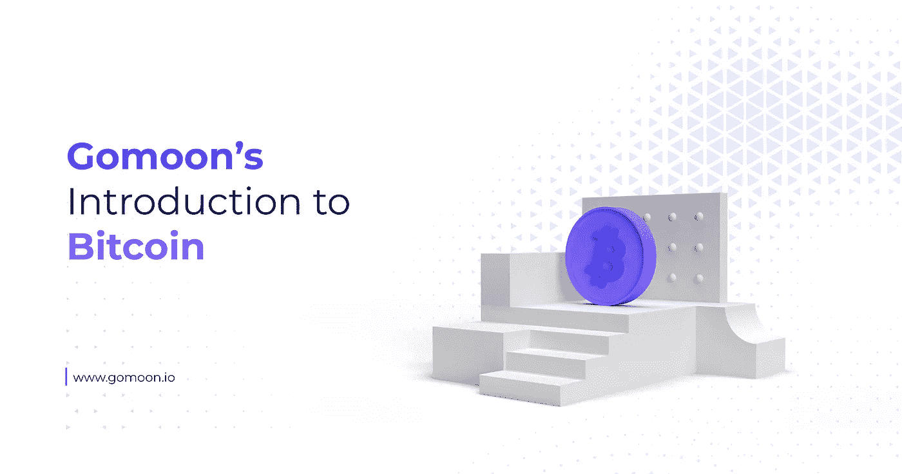

# Gomoon 对比特币的介绍

> 原文：<https://medium.com/coinmonks/gomoons-introduction-to-bitcoin-1b95e70dca42?source=collection_archive---------69----------------------->

比特币是世界上第一种也是最古老的加密货币。自 2008 年诞生以来，由于各种原因，比特币已经成为世界各地的头条新闻，但许多人不明白比特币到底是如何工作的，以及它为什么如此特殊。这篇文章将试图解释比特币是什么，为什么它如此具有革命性。

# 比特币的原理

比特币被设计成不受任何银行或政府控制的替代货币形式。它是在 2008 年全球金融危机之后推出的，以回应大银行的行动，这些银行的贪婪摧毁了世界经济，并使其陷入衰退。它的总供应量将被设定上限，以防止通胀，其释放将遵循严格的数学原理，以避免稀释，从而为一个全新的金融网络奠定基础，这个网络可能存在于传统手段之外。

比特币是一种纯粹的虚拟货币，这意味着它没有物理表现形式——你不能像从 ATM 机提取现金一样提取它。它生活在一种叫做区块链的东西上，这是一种通过其进行交易的网络，可以在交易所交易，放在特殊的钱包中，或者像普通货币一样兑换商品和服务。它只需要有人愿意接受比特币，你就可以用它做任何事情。

比特币意识形态的关键是去中心化的概念，这是它产生的基础。比特币不受政府或任何第三方的控制，这意味着你可以私下开展业务，没有银行监督并告诉你什么可以花什么不可以花，也没有银行向政府报告你的活动。

然而，这并不意味着比特币交易像许多人错误认为的那样是匿名的。所有比特币交易都以公开可见的分类账形式记录在区块链上，世界上任何人都可以检查，如果一个比特币地址(由 26-35 个字母数字组成的字符串)与你相关联，那么你的整个交易历史都可以被调查。正是因为这个原因，比特币被称为假名而不是匿名。

# 比特币是谁创造的？

比特币是由一个或几个不知名的人在 2008 年创造的，但这个人名叫中本聪。Satoshi 与一群被称为“密码朋克”的计算机程序员合作，其中一些人已经尝试了他们自己的电子现金形式，以创造比特币，最终在 2008 年 10 月 31 日发布了[比特币白皮书](https://www.ussc.gov/sites/default/files/pdf/training/annual-national-training-seminar/2018/Emerging_Tech_Bitcoin_Crypto.pdf)。

中本聪在 2010 年初放弃了对比特币开发的控制权，当时比特币刚刚推出一年多，自 2011 年 4 月 23 日向其继任者发送最后一封电子邮件以来，就再也没有消息了。有数百个属于中本聪的比特币地址，总共包含约 100 万枚比特币，但没有一枚比特币从这些原始地址转移过，这让一些人认为他/他们已经去世了。

多年来，有几个人自称是中本聪，也有一些认错人的情况，但没有人拿出足够令人信服的证据来支持他们的说法。

# 比特币可以做什么？

多年来，比特币是一种地下活动，犯罪分子通常利用它来躲避当局。然而，随着时间的推移，比特币得到了更广泛的采用(更不用说区块链分析公司让非法活动变得越来越难进行，也越来越难逃脱惩罚)，它已经开始被公认的网络和实体渠道接受。

Visa 和 Mastercard 加入数字资产行列的一个好处是，它们都与几家比特币交易所合作，允许你在接受 Visa 和 Mastercard 的任何地方使用比特币……这几乎是任何地方。

如果你不想花你的比特币，你可以一直把它放在钱包里，直到你想卖掉它，把钱存入你的银行账户，或者你可以把它作为礼物送给朋友或家人。简而言之，你可以用它做任何你用普通钱做的事情。

别忘了，一个比特币可以被分割成 1 亿个碎片(分别简称为‘satoshis’或‘sats’)，所以你不必购买、存储或使用整个比特币。

# 比特币是如何运作的？

这是一个可以很快变得非常技术性的话题，所以我们将坚持基础。正如我们已经解释过的，比特币交易存储在区块链上，这是一个公共账本，显示了比特币区块链的透明度。但是事务首先是如何到达那里的呢？

当你向某人发送一些比特币时，你实际上是向比特币区块链提交了一个订单，然后等待它被处理。每隔 10 分钟，来自世界各地的所有此类订单都被捆绑起来，送到“矿工”那里进行处理。作为交易的一部分，你要支付一笔费用，这笔费用作为矿工服务的报酬——你设置的金额越高，你的交易就越有可能被更快地处理。

矿工不像那些拿着鹤嘴锄、脸上沾满煤块的人。相反，他们是拥有数百台甚至数千台专业计算机的公司，这些计算机只有一个任务——相互竞争解决一个数学难题。每隔 10 分钟，这些计算机中的一台就会解决这个难题，并被授予处理交易的工作。获胜电脑的主人不仅收取交易费，还会获得一些新创造的比特币。这有助于矿工支付账单，也是新比特币进入系统的唯一途径。

一旦矿工处理了你的交易(根据网络的繁忙程度，这可能需要一个小时),就要由一个遍布世界各地的成千上万个节点的系统(由日常生活中的人们在各种形状和大小的计算机上运行)来验证交易并确认它是真实的。这种共识对于避免有人利用系统非常重要——如果其中一个节点报告错误，则交易不会得到验证。

这就是比特币能够运行一个完全去中心化但值得信赖的金融系统的原因。

# 比特币为什么这么特别？

比特币的核心资产是没有人控制它——它只是由志愿者运行和维护的代码，志愿者对其发行或交易没有控制权。比特币的数量从一开始就被限制在 2100 万，没有人可以增加这个数量或者突然增加更多。这与央行可以随心所欲地印钞票形成了鲜明对比，这导致了货币贬值。

简单地进入区块链盗取比特币也是不可能的，比特币区块链也不可能被“倒带”并撤销交易。世界上没有一台计算机强大到足以黑掉比特币区块链，即使尝试一下也要花费数百亿美元。

比特币是一个无国界的、自我可持续的、公开可见的金融生态系统，已经发展到价值一万亿美元。它证明，对于那些需要它的人来说，有一种传统金融系统的替代方案，随着时间的推移，它的用例不断扩展，变得更加明确。“比特币是自由”这句话在社区中非常流行并不是偶然的。

Gomoon.io 正在建立一个安全可信的平台，任何人都可以通过这个平台购买和存储比特币，无论他们的知识和经验水平如何。我们希望很快推出，所以从我们的主页上注册我们的时事通讯，以便在我们上线时得到通知！

> 加入 Coinmonks [电报频道](https://t.me/coincodecap)和 [Youtube 频道](https://www.youtube.com/c/coinmonks/videos)了解加密交易和投资

# 另外，阅读

*   [CoinDCX 评论](/coinmonks/coindcx-review-8444db3621a2) | [加密保证金交易交易所](https://coincodecap.com/crypto-margin-trading-exchanges)
*   [红狗赌场评论](https://coincodecap.com/red-dog-casino-review) | [Swyftx 评论](https://coincodecap.com/swyftx-review) | [CoinGate 评论](https://coincodecap.com/coingate-review)
*   [Bookmap 评论](https://coincodecap.com/bookmap-review-2021-best-trading-software) | [美国 5 大最佳加密交易所](https://coincodecap.com/crypto-exchange-usa)
*   [如何在 FTX 交易所交易期货](https://coincodecap.com/ftx-futures-trading) | [OKEx vs 币安](https://coincodecap.com/okex-vs-binance)
*   [CoinLoan 评论](https://coincodecap.com/coinloan-review) | [YouHodler 评论](/coinmonks/youhodler-4-easy-ways-to-make-money-98969b9689f2) | [BlockFi 评论](https://coincodecap.com/blockfi-review)
*   [XT.COM 评论](https://coincodecap.com/profittradingapp-for-binance)币安评论 |