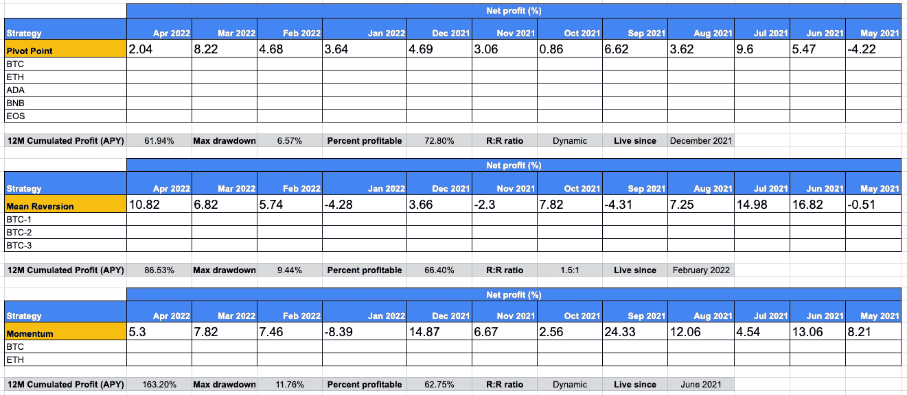

# 等待的人会得到好东西…

> 原文：<https://medium.com/coinmonks/good-things-come-to-those-who-wait-bea3592a81d?source=collection_archive---------29----------------------->

# 亲爱的克罗尼亚人:

在过去的几周里，我们很安静，但是非常忙于建立我们的平台。我们有意保持低调，而不是“宣布宣布宣布”…

然而，今天我可以给你们一个期待已久的更新:

⁃内部测试阶段已经开始，目前进展顺利。接下来的 4-5 天应该会持续。

⁃接下来，我们将开始测试阶段，最多有 5 个测试人员。测试者在整个测试过程中不需要订阅服务，通常会持续十天左右。

⁃在 beta 测试结束后，我们将正式推出该平台，并开始付费订阅。

花在构建平台上的时间也让我们能够使用人工智能，尤其是机器学习来加强我们的战略。这将使我们在主要策略上获得 5.96 的夏普比率，从而使权益曲线更加平滑(与基础资产相比，非常低的提取和不断增加的权益)。我们还增加了均值回归策略，该策略寻求仅在非常低的时间框架内(刷单)对高流动性对(如 BTC、瑞士联邦银行或 XRP)进行适时交易。

我们的每个策略(总共 3 个)都有不同的行为，并且已经在回溯测试之外证明了自己(每个策略都有 4 到 12 个月的实时交易)。

以下是过去 12 个月每种策略的月度回报概览。请注意，五月的当前月份都是绿色的！

如果你对即将到来的发布有任何疑问，不要犹豫。

安全交易！

亚历克斯

Kronos trading — monthly returns

> 加入 Coinmonks [电报频道](https://t.me/coincodecap)和 [Youtube 频道](https://www.youtube.com/c/coinmonks/videos)了解加密交易和投资

# 另外，阅读

*   [5 款最佳加密交易终端](https://coincodecap.com/crypto-trading-terminals) | [最佳 DeFi 应用](https://coincodecap.com/best-defi-apps)
*   [最佳网上赌场](https://coincodecap.com/best-online-casinos) | [币安评论](/coinmonks/binance-review-ee10d3bf3b6e) | [BitMEX 评论](https://coincodecap.com/bitmex-review)
*   [麻雀交换评论](https://coincodecap.com/sparrow-exchange-review) | [纳什交换评论](https://coincodecap.com/nash-exchange-review)
*   [美国最佳加密交易机器人](https://coincodecap.com/crypto-trading-bots-in-the-us) | [经常性回顾](https://coincodecap.com/changelly-review)
*   [在印度利用加密套利赚取被动收入](https://coincodecap.com/crypto-arbitrage-in-india)
*   [Godex.io 审核](/coinmonks/godex-io-review-7366086519fb) | [邀请审核](/coinmonks/invity-review-70f3030c0502) | [BitForex 审核](https://coincodecap.com/bitforex-review)