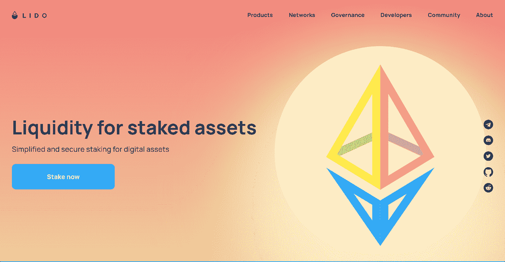
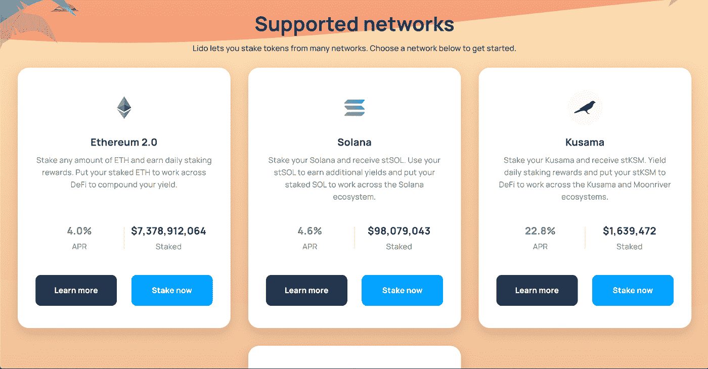
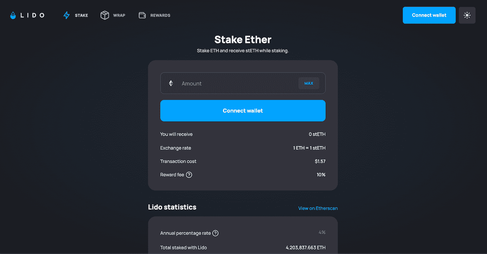
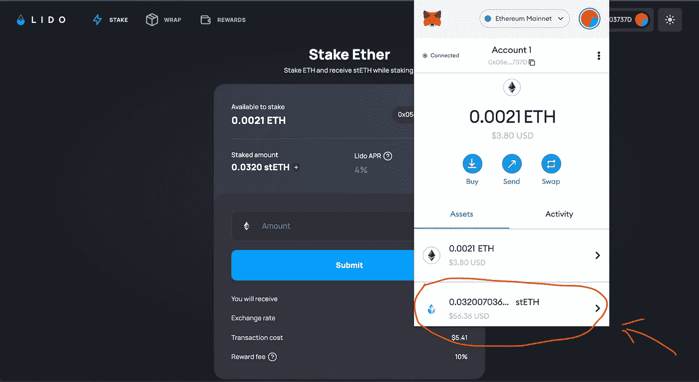

# 再见储蓄账户，欢迎流动赌注

> 原文：<https://medium.com/coinmonks/goodbye-savings-accounts-welcome-liquid-staking-1289bb587da4?source=collection_archive---------1----------------------->

## 如果你喜欢把现金无息存入储蓄账户，而你的银行却用你的钱填满他们的口袋，请举手。是啊，我不这么认为。

我最喜欢区块链科技加密公司的一点是，它能够让个人掌控自己的财务生活，成为自己的银行。许多人厌倦了银行不负责任地用自己的钱承担高风险，并将所有回报留给自己。然而，由于加密技术，银行控制我们金融生活的日子可能即将结束。

在没有银行的情况下，用你的加密资产做赌注是掌控你的财务生活的重要一步。Staking 允许你将你的资产集中到你选择的协议中，并与网络的其余部分分享这些资产的回报(而不是全部给银行)。然而，真正的加密精神，我们现在有机会把这一步更进一步。但首先，让我们先看看什么是赌注，为什么我们需要它。

# 为什么我们首先要下注？

通常为了保护网络，在许多不同的区块链上进行标桩。以太坊就是这种情况，因为它准备合并到一个[利益证明](https://www.investopedia.com/terms/p/proof-stake-pos.asp)系统(信标链)。一旦它被完全合并，staked ETH 将被要求保持系统安全。对于像你我这样的用户来说，赌注是获得被动加密的好方法，而且很容易。您将您的 ETH 存入赌注池，并因此获得持续的回报。但是有一个警告。以太坊可以说是世界上最高的实用令牌。你可以用你的 ETH 代币做很多很酷的事情，比如购买 NFT 代币，为二次基金做贡献，有偿借给别人，提供代币作为抵押品来借入另一项资产，等等。当你下注你的 ETH 时，它被锁定在一个智能合约中，你不能再使用或交易你的代币。

在大多数其他区块链的情况下，有桩资产的解锁期相对较短。例如，如果你把你的 SOL 代币押在 [Solana](https://solana.com/) 上，它们将被锁定在网络中，直到你选择取消。一旦您取消了您的 SOL，可能需要 2-4 天才能再次访问您的令牌。在以太坊的情况下，直到合并后的一段时间，你才能取消你的代币(并且你何时能够解锁你的代币仍然没有确定的日期)。这让许多人打消了赌上自己财富的念头，尽管这样做有回报的诱惑。另外，要在以太坊上直接下注 ETH，你需要[存入 32 ETH 并激活验证软件](https://ethereum.org/en/staking/)。我们大多数人都没有 32 ETH，也不想运行验证器节点。有很多服务([赌注池](https://academy.shrimpy.io/post/the-best-ethereum-2-0-staking-pools))为你下注，但一旦下注，你仍然不能使用或交易你的 ETH。有一种方法可以解决这个问题。

进入液态铆接。

# 什么是液态铆接？

流动赌注允许密码持有者在同一时间押上他们的资产，赚取赌注奖励，并在网络上使用这些资产。这是通过允许用户将他们的资产存入一个流动的赌注协议来实现的，该协议汇集令牌，以你的名义下注，并提供一个包装的流动性令牌作为回报。让我们看一个例子。

[Lido](https://lido.fi/) 是当今领先的流动性赌注协议，赌注资产总额达 75 亿美元。如果我把 1 ETH 存入利多，协议会以我的名义押上这个代币，在我写这篇文章的时候，我会获得 4%的年收益。一旦这样做了，作为回报，利多会在我的钱包里存 1 先令。stETH 令牌是一个包装好的令牌，它反映了 ETH 的价格。当我的 ETH 令牌被锁定在赌注合同中并获得奖励时，我可以将我的 ETH 转移到 DeFi 生态系统中，并继续参与其他协议。通过这种机制，我可以从我的资产中获得收益，同时还可以参与其他 DeFi 协议，这些协议可能会为我带来更多收益。我可以鱼与熊掌兼得。

# 包装好的代币？stETH？这都是什么？

这些都是公平的问题。包裹代币通常是代表来自另一个区块链的加密货币的代币。它们通常用于在不兼容的区块链之间桥接令牌，以提高跨链兼容性。包装的代币可以随时以 1:1 的比例兑换它们所代表的代币。例如，如果你拥有 BTC，并且你想加入以太坊生态系统，而不把你的 BTC 换成以太坊，你可以在区块链以太坊把你的 BTC 包装成一个 ERC-20 代币。现在你可以在以太坊上使用你的[包裹的 BTC](https://decrypt.co/resources/what-is-wbtc-explained-bitcoin-ethereum-defi) (wBTC)而不必卖掉它。当你想要回你原来的 BTC 时，你可以用它来换你包好的 BTC，它会被烧掉。

至于丽都上的 stETH，这种代币包装的目的不是为了在区块链之间搭桥，而是作为一种工具，为不想锁定代币的用户提供流动性。它基本上是告诉人们，一旦合并完成，你拥有一个可兑换为 ETH 的代币。这就是令牌的价值所在(总是等于 ETH 值)。因为锁定在赌注中的 ETH 不在总供给中流通，所以 stETH 不会导致任何膨胀的供给问题。一旦你能够解锁你的押物，你可以用押物赎回押物，押物会被烧毁。当您在市场上使用您的 stETH 时，它将累积赌注奖励，您将看到您的余额每天都在增加。由于 stETH 的机制，您的奖励将被添加到您的帐户，没有任何交易费用。你可以在这里阅读更多关于 stETH 的[文章](https://blog.lido.fi/steth-the-mechanics-of-steth/)。

# 如何使用利多下注

让我们来看看你如何开始在利多投资你的资产。这是一个简单的过程，尽管第一次可能会有点令人生畏。在开始下注之前，有几个先决条件和风险需要注意:

1.  如果你是令牌和以太坊网络的长期持有者并对其未来的成功充满信心，我只建议你入股 ETH。
2.  所有的木桩都被锁住了，直到另行通知。你只能在合并到信标链后的某个时间解锁你的 staked ETH。
3.  当你使用像丽都这样的服务时，你相信他们是生态系统中的一个好演员。如果协议行为不当并受到惩罚，你的赌注资产将招致惩罚。
4.  [你需要一个兼容的钱包](/@callumcarlstrom/setting-up-your-first-crypto-wallet-61c4a904db03)来连接丽都。我推荐 MetaMask 或者 Ledger。

好吧，我们开始吧。

**第一步:进入** [**Lido.fi**](https://lido.fi/) **点击“立即下注”**

**第二步:选择您的资产**

我打算把我的 ETH 押在 4%的年利率上。点击“现在就押”。这将在地址'[*stake . lido . fi*](https://stake.lido.fi/)*'*下打开一个新窗口。确保地址与我在这里列出的完全一致。试图冒充丽都的诈骗网站相当常见，用户界面看起来难以区分。如果你不确定，就使用我提供的链接。

**第三步:连接您的钱包，选择下注金额**

一旦你连接了你的钱包，选择了你想要下注的金额，记得看看交易成本。这些是以太坊上的油费，会根据网络拥塞情况而有所不同。如果交易成本太高，以后再来检查。这些一直在变。

“奖励费”是丽都对你提供服务的奖励收取的百分比费用。请注意，这不是根据您的赌注金额收取的，而是根据您获得的奖励收取的。

准备好后，点击“提交”。如果您正在使用 MetaMask，您将看到一个交易确认屏幕，确认金额+汽油费。一旦您批准了交易，就大功告成了。

**第四步:检查你的钱包看有没有 stETH**

记得检查你的钱包，寻找你的身份(你包裹的代表你身份的标志)。如果它没有出现在你的钱包里，你可能需要[将其作为自定义令牌](https://consensys.net/blog/metamask/how-to-add-your-custom-tokens-in-metamask/)导入。然后你应该会看到你钱包里的硬币。

仅此而已。多亏了一种名为 stETH balance rebases 的东西，你将能够看到你的奖励每天都在你的钱包中积累。如果你想了解更多关于 stETH 的机制和液体打桩的工作原理，这里有一篇深入的文章。

Lido 使您能够将您的 stETH 带到 DeFi 生态系统中的其他平台。例如，你可以用你的 stETH 作为抵押，在 Aave 上向戴或贷款，并在整个生态系统中使用它来增加你的收益，使之超过目前的以太坊赌注回报。请记住，当你开始添加更多的层到你的 DeFi 活动中，它会变得越来越复杂，你可能会增加你这样做的风险。小心行事。

# 摘要

流动性赌注是众多金融创新之一，由加密和区块链实现，使用起来相对简单。但是对于我们中的许多人来说，一开始会感到不舒服。这些都是我们不习惯的全新金融工具，持怀疑态度是正常的。我建议先用很少的钱来探索这些服务，这样你就可以习惯这个过程，并更多地了解它们是如何工作的。由于传统银行在近几十年来创新缓慢，未来几年对我们许多人来说可能有点不堪重负。每天都有新的 DeFi 和 Web3 应用推出，如果你不熟悉的话，可能很难理解。我强烈建议你每个月开始探索几个新工具，开始熟悉金融的未来，一步一个脚印。

> 交易新手？试试[加密交易机器人](/coinmonks/crypto-trading-bot-c2ffce8acb2a)或者[复制交易](/coinmonks/top-10-crypto-copy-trading-platforms-for-beginners-d0c37c7d698c)