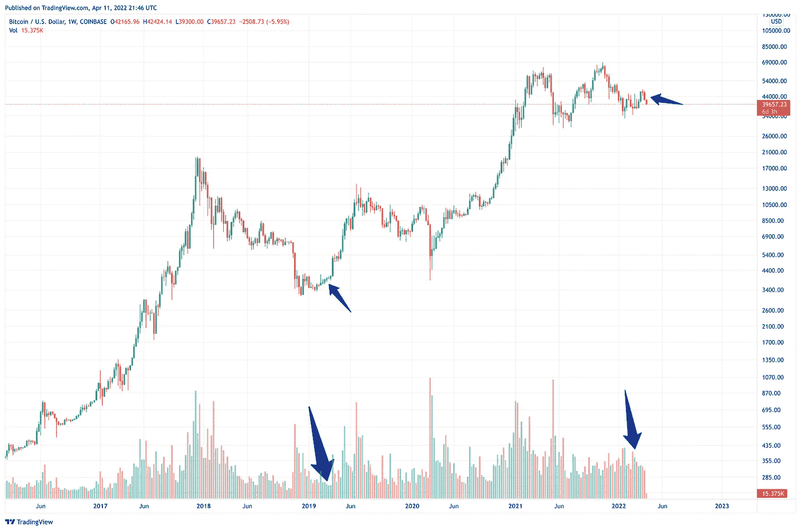
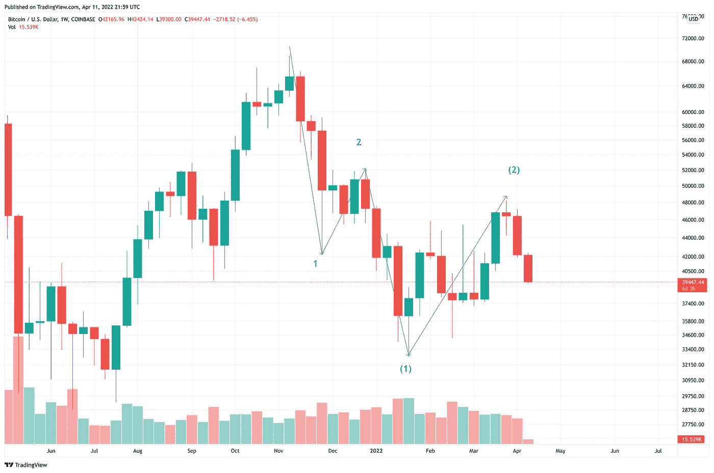
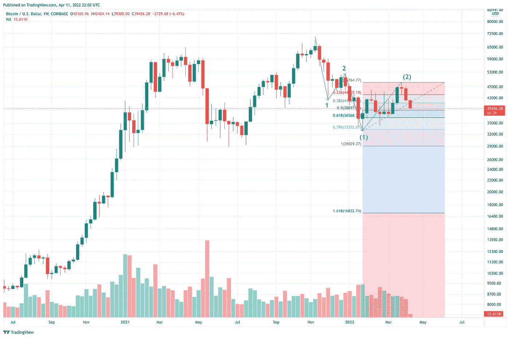
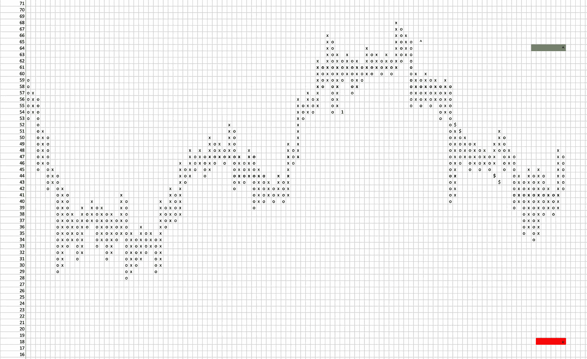

# 弄错了细节@蹩脚的交易者笔记#10

> 原文：<https://medium.com/coinmonks/got-the-details-wrong-crappy-trader-notes-10-e9847ae48772?source=collection_archive---------66----------------------->

犯错是交易者生活的一部分。我承认我错了。嗯，不是完全错误，但有一些细节完全颠倒了。多读书，这样你就能从我的错误中吸取教训。

# 为什么你最近这么安静？

好吧，有人在 DM 上问我为什么不更新我的宏观交易观点。

首先，我错了，当你错的时候，我会很伤心。此外，它需要时间来恢复，冷静下来，并重新获得一个干净，不带感情色彩的价格行动。

我的读者确实记得，在上一期的《蹩脚交易者笔记》中，我[预测会出现一种三角形模式](/coinmonks/the-scent-of-the-bottom-crappy-trader-notes-9-a810316a2eaf)，但结果证明我**错了**。那不是三角形。

说实话，我真的对 3 月/4 月的交易量和价格走势感到惊讶，所以我不能从中得出任何更多或更少的明确结论。

所以我做了每个交易者在不清楚发生了什么，失去了控制感和理解感时都会做的事情——我站在场外观察。

# 你看跌的宏观观点变了吗？

不，没有。

我的宏观工作假设，即自 2021 年 4 月以来，我们正在经历一场激烈的 wave-3 上涨(从 2020 年 3 月的 3k BTCUSD 水平升至 2021 年 4 月的 64k BTCUSD 水平)后的自然调整仍然成立。我们正在修正中，可能还需要几周时间才能完成。

我的另一个有效假设是，我们正在接近修正的真正底部，这个假设仍然成立。

# 这是怎么回事？

先说一些观察。

O 观察# 1——我们仍在经历高价格波动。我们每周以+65，000 的 BTC 单位买入/卖出多头价格棒线。这是一个迹象，表明真正的底部尚未找到。我预计波动性下降是我们在修正结束前进入最后跳板并向上移动的标志。看到几周内约 40-50，000 的每周 BTC 单位以非常狭窄的价格波动买卖，可能是供应真正枯竭的迹象，我们可能会期待一个长期的上涨。

观察# 2——看起来修正的 C 波正在以一种非常有趣的方式出现。虽然我注意到我的交易伙伴有很多有趣的波数，但我更喜欢尽可能简单的波数。所以我坚持这样的解读，我们现在处于最后一波——c 的延伸波——3。

下面是前面提到的计数:

如果这个计数成立，那么我们可以使用斐波纳契来计算潜在的下跌

这给了我们最初的 29k BTCUSD 价格水平，但它也表明，当 29-32k 的巨大双顶结构被严重打破时，甚至可能达到 16k BTC 美元水平。

O 观察# 3——我使用一个三点点&数字图表来显示 BTC 美元的价格走势。使用这种技术，我们可以从当前 2022 年 1 月底形成的巨大交易区间中得到 18k BTC 美元水平或 64k BTC 美元水平。

# 摘要

我的忠实读者会记得，在多种底部情景中，我将所谓的[扩展平坦情景作为最有可能的](/coinmonks/bottom-is-in-scenarios-crappy-trader-notes-8-9fc2dc4cf017)。由于上面解释的原因，我仍然认为这种情况的可能性最大，所以我预计几周后会低于 30k。

不幸的是，我**降低了**我正在考虑的更多“看涨”底部情景的可能性([如前几期杂志](/coinmonks/bottom-is-in-scenarios-crappy-trader-notes-8-9fc2dc4cf017)中描述的“持平”)。

我甚至敢说，最血腥、最看跌的[“双顶”情景](/coinmonks/bottom-is-in-scenarios-crappy-trader-notes-8-9fc2dc4cf017)可能会发生。如果这确实是事实，我们可能会经历一些极端的灯芯触及 20k 以下的水平，在下跌的顶点。

因此，一如既往地保持安全和流动性。

巨大的买入机会就在眼前。

# 更多阅读

如果你想知道我是如何得出当前预测的，我推荐你阅读博客的前几章。因此，你可以理解我的推理，看看我的话有多真实。

*   2022 年 3 月初失败的三角诊断— [底部的气味@蹩脚交易者笔记#9](/coinmonks/the-scent-of-the-bottom-crappy-trader-notes-9-a810316a2eaf)
*   2022 年 2 月下旬阐述最可能的底部情景— [底部在情景中@蹩脚交易者笔记#8](https://yentenobserver.medium.com/bottom-is-in-scenarios-crappy-trader-notes-8-9fc2dc4cf017)
*   2022 年 2 月反弹被揭穿— [下一站 30k BTCUSD @蹩脚交易者笔记#7](https://yentenobserver.medium.com/next-station-30k-btcusd-crappy-trader-notes-7-204ea6d157cc)
*   2022 年 1 月熊市情景解释— [BTCUSD 熊市在控制中@蹩脚交易者笔记#6](https://yentenobserver.medium.com/btcusd-bears-are-in-control-crappy-trader-notes-6-50507d28179a)
*   2021 年 12 月下旬 C 波情景的有力证实—[BTC C 波放大@蹩脚交易者笔记#5](https://yentenobserver.medium.com/btc-wave-c-zoom-in-crappy-trader-notes-5-2cd5ccfc6a8a)
*   2021 年 12 月初可能下跌的预警—[BTC C 波风暴来了？@ CrappyTrader 笔记#4](https://yentenobserver.medium.com/wave-c-storm-is-coming-crappytrader-notes-4-d71eee69f4ff)
*   2021 年 11 月下旬对可能的熊市前景的悲观展望— [我们是否处于 C 浪之中？@ CrappyTrader 笔记#3](https://yentenobserver.medium.com/are-we-in-a-c-wave-crappytrader-notes-3-2eecee27ca45?source=your_stories_page----------------------------------------)
*   2021 年 11 月 11 日价格走势有两种选择——[BTC 突破还是牛市陷阱？@ CrappyTrader 笔记#2](https://yentenobserver.medium.com/a-btc-breakout-or-bull-trap-crappytrader-notes-2-f49c476a4c0)

# 你觉得我的工作有价值吗？

如果是，那么您可以通过以下方式支持我的努力:

*   在推特上关注我
*   跟随我的媒体档案

> 加入 Coinmonks [电报频道](https://t.me/coincodecap)和 [Youtube 频道](https://www.youtube.com/c/coinmonks/videos)了解加密交易和投资

# 另外，阅读

*   [Bookmap 评论](https://coincodecap.com/bookmap-review-2021-best-trading-software) | [美国 5 大最佳加密交易所](https://coincodecap.com/crypto-exchange-usa)
*   最佳加密[硬件钱包](/coinmonks/hardware-wallets-dfa1211730c6) | [Bitbns 评论](/coinmonks/bitbns-review-38256a07e161)
*   [新加坡十大最佳加密交易所](https://coincodecap.com/crypto-exchange-in-singapore) | [购买 AXS](https://coincodecap.com/buy-axs-token)
*   [红狗赌场评论](https://coincodecap.com/red-dog-casino-review) | [Swyftx 评论](https://coincodecap.com/swyftx-review) | [CoinGate 评论](https://coincodecap.com/coingate-review)
*   [投资印度的最佳密码](https://coincodecap.com/best-crypto-to-invest-in-india-in-2021)|[WazirX P2P](https://coincodecap.com/wazirx-p2p)|[Hi Dollar Review](https://coincodecap.com/hi-dollar-review)