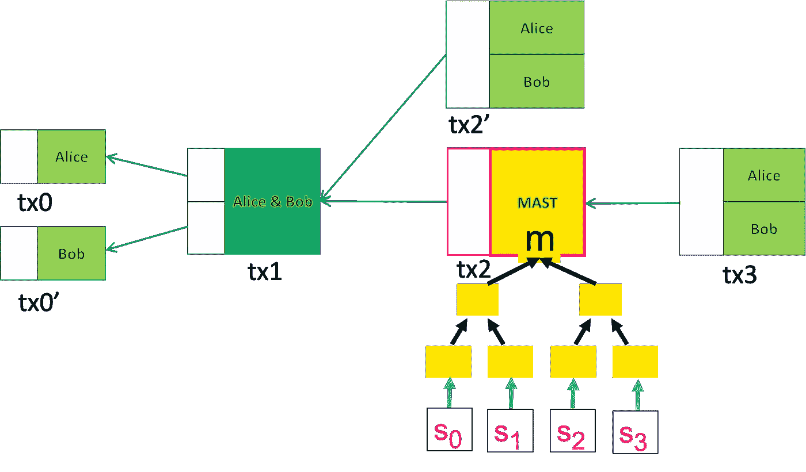
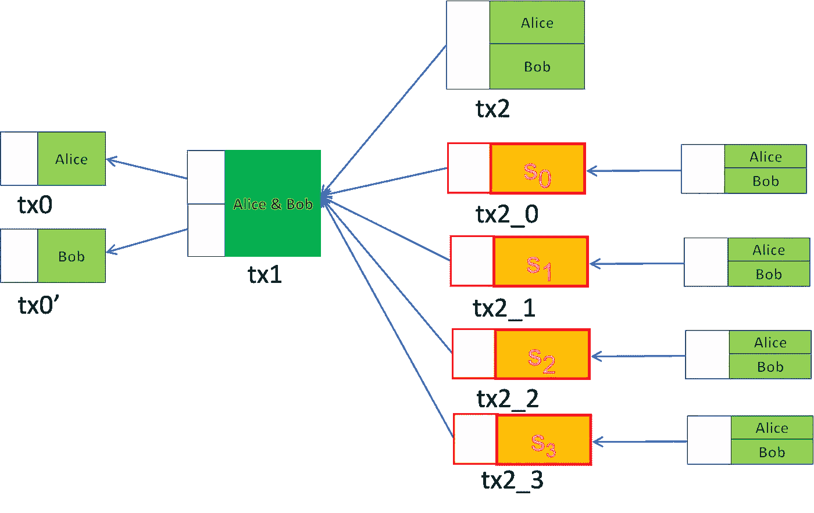

# 如今比特币上的 Graftroot

> 原文：<https://medium.com/coinmonks/graftroot-on-bitcoin-today-a50a4226ba5?source=collection_archive---------16----------------------->

## 不需要叉子

我们已经演示了如何使用[无契约契约](https://xiaohuiliu.medium.com/contractless-contract-cb9b60e9bb91)在原始比特币上[实现主根](https://xiaohuiliu.medium.com/taproot-on-bitcoin-d52fce9201e4)。我们展示了它的后续提议， [Graftroot](https://lists.linuxfoundation.org/pipermail/bitcoin-dev/2018-February/015700.html) ，可以以类似的方式实现。

Source: [Bitcoin Magazine](https://bitcoinmagazine.com/technical/graftroot-how-delegating-signatures-allows-near-infinite-spending-variations)

# BTC 的格拉夫鲁特

与 Taproot 类似，有两种方式来使用由多方创建的聚合公钥 ***P*** 中锁定的资金:

1.  **合作案例**:又名默认密钥支出路径

所有各方同意并签署在常规支付交易中释放资金，与在 Taproot 中相同。

2.**不合作案例**:又名替代脚本支出路径

如果任何一方未能签署，另一个脚本选择运行解锁基金。在 Taproot 中，脚本是一个 [Merklized 替代脚本树](https://xiaohuiliu.medium.com/merkelized-abstract-syntax-tree-6a49b2008435) (MAST)中的叶节点。通过链接 ***P*** 中的桅杆**m的根，并通过 Merkle proof 验证该脚本确实是桅杆的一片叶子，从而获得授权。然而，在 Graftroot 中，被称为代理脚本的替代脚本仅由共同签署脚本本身的各方授权。** 这与我们之前介绍过的[密钥委托](/coinmonks/delegation-in-bitcoin-ac7afcab991e)类似，只不过是通过签名委托一个脚本，而不是公钥。

## 与主根相比

在设置期间，各方共同签署所有可能的代理脚本。在消费时，某一方可能不愿意或无法签字。在这种情况下，Graftroot 比 Taproot 有几个显著的优势:

1.  它在 ***O(1)*** 而不是 ***O(log n)*** 缩放，其中 ***n*** 是备选脚本的总数，每个脚本代表一种花费方式。无论 ***n*** 都需要一个单独的签名。而在直根，消费时需要一张大小***【O(log n)***的 Merkle 凭证。
2.  在 Graftroot 中，在设置和花费之间的任何时间，可以在事后委托新的替代脚本。这在 Taproot 中是不可能的，因为 MAST root 是提交的，并且在设置后不能修改。

# 原始比特币中的 Graftroot

事实证明，Graftroot 可以在比特币上实现，无需对原始协议进行任何更改。

下图显示了 Alice 和 Bob 之间的比特币上的[主根。有四个可供选择的支出脚本( *S₀、【S₁】、*和 *S₃* ，它们位于根为 ***m*** 的桅杆的叶节点上。](https://xiaohuiliu.medium.com/taproot-on-bitcoin-d52fce9201e4)

Figure 1: **Taproot** with 4 Alternative Spending Scripts

不是在单个事务 *tx2* 中提交 MAST 中的四个脚本，而是每个脚本都可以成为一个单独的事务。在运行[Nakamoto 签名协议](https://xiaohuiliu.medium.com/contractless-contract-cb9b60e9bb91)后，所有交易(即 *tx2_0、tx2_1、tx2_2 和 tx2_3* )由双方签署并保持离线。双方通过共同签署包含脚本的事务来委托脚本。例如，两个签名 *tx2_0* 使 *S₀* 成为代理人。

在不合作的情况下，可以广播包含所选脚本的这四个事务之一。最多只能兑换其中一个，因为他们都是从 tx1 中的同一个 UTXO 消费的。

Figure 2: **Graftroot** with 4 Alternative Spending Scripts

比较图 1 和图 2，很明显，从另一个脚本，比如说 tx2_0 中的 *S₀，*花费更少，没有它的 Merkle 证明*的开销。*

只要双方同意，可以委托更多的脚本。例如，一个新的脚本 *S₄* 可以通过双方签署包含它的 *tx2_4* 来添加为代理。

# 摘要

与 BTC 不同，比特币上的 Graftroot 不需要任何共识性的改变，因此今天它可以用来改善隐私和效率。例如，可以使用现有的操作码 OP_CHECKSIG 来检查用于委托的签名，而 BTC 需要新的操作码，如 [OP_CHECKSIGFROMSTACK](https://elementsproject.org/features/opcodes) ，因为签名的消息是脚本本身，而不是事务数据。

> 加入 Coinmonks [电报频道](https://t.me/coincodecap)和 [Youtube 频道](https://www.youtube.com/c/coinmonks/videos)了解加密交易和投资

# 另外，阅读

*   [Bookmap 评论](https://coincodecap.com/bookmap-review-2021-best-trading-software) | [美国 5 大最佳加密交易所](https://coincodecap.com/crypto-exchange-usa)
*   最佳加密[硬件钱包](/coinmonks/hardware-wallets-dfa1211730c6) | [Bitbns 评论](/coinmonks/bitbns-review-38256a07e161)
*   [新加坡十大最佳加密交易所](https://coincodecap.com/crypto-exchange-in-singapore) | [收购 AXS](https://coincodecap.com/buy-axs-token)
*   [红狗赌场评论](https://coincodecap.com/red-dog-casino-review) | [Swyftx 评论](https://coincodecap.com/swyftx-review) | [CoinGate 评论](https://coincodecap.com/coingate-review)
*   [投资印度的最佳加密软件](https://coincodecap.com/best-crypto-to-invest-in-india-in-2021)|[WazirX P2P](https://coincodecap.com/wazirx-p2p)|[Hi Dollar Review](https://coincodecap.com/hi-dollar-review)