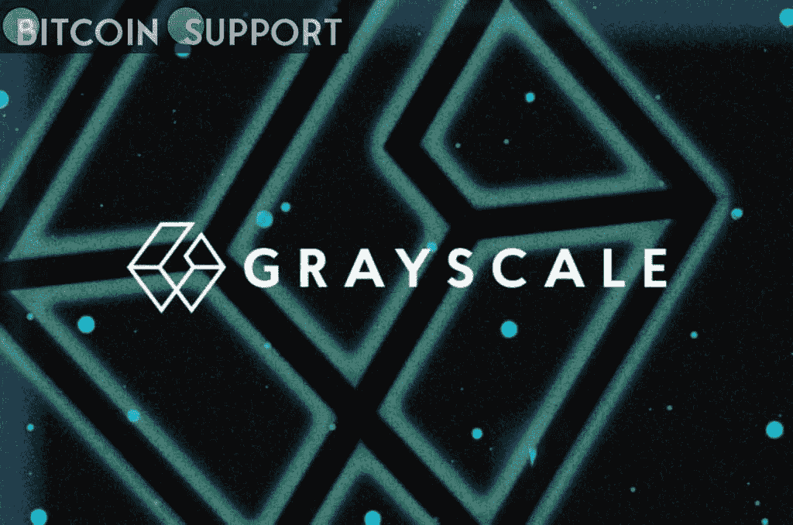

# 灰度投资要求投资者帮助说服证交会批准比特币现货 ETF

> 原文：<https://medium.com/coinmonks/grayscale-investments-is-asking-investors-to-help-persuade-the-sec-to-approve-a-bitcoin-spot-etf-81d46bd56a0b?source=collection_archive---------55----------------------->

[https://bitcoinsupports.com/](https://bitcoinsupports.com/)

全球最大的数字资产管理公司灰度投资发起了一场运动，劝说证券交易委员会(SEC)批准其比特币现货 ETF 应用。灰度希望将其 257 亿美元的比特币信托(GBTC)转化为比特币现货 ETF。

**资产管理公司力推比特币现货交易所交易基金获批**

灰度投资公司周二宣布启动一项活动，旨在“教育和鼓励美国投资者提交评论”，内容涉及证交会将灰度比特币信托(OTCQX: GBTC)转换为现货比特币交易所交易基金的申请。GBTC 管理着 257 亿美元的资产，是该公司最大的投资产品。

纽约证券交易所(NYSE Arca)于 10 月 19 日提交了申请。如果获得批准，该交易所将上市并交易新的比特币 ETF 的股票。12 月 15 日，证交会延长了考虑灰度申请的时间期限。2 月 4 日，委员会要求公众对申请进行反馈。

迄今为止，证交会只批准了比特币期货交易所交易基金。证券交易委员会继续拒绝比特币现货交易所交易基金的申请。

“美国投资者应该在如何获得比特币风险敞口方面有所选择，”灰度级首席执行官迈克尔·索南施因(Michael Sonnenshein)表示，他强调，“很明显，我们已经到了采用数字资产的临界点。”

“维持监管现状似乎是一个安全的选择，但对普通投资者和我们的国家来说，跟不上变化是风险更大的途径，”他继续说道。

灰阶推出了专门的活动页面，旨在教育和激励美国投资者采取行动，说服证交会批准其将 GBTC 转换为现货比特币交易所交易基金的申请。

首席执行官继续说道，“已经提交的数百条支持 GBTC 转换为交易所交易基金的评论表明，这个问题对投资者来说极其重要。”

**访问我们的网站:**[**https://bitcoinsupports.com/**](https://bitcoinsupports.com/)

**免责声明:这些都是作者的意见，不应该被视为投资建议。读者应该做自己的研究。**

> 加入 Coinmonks [电报频道](https://t.me/coincodecap)和 [Youtube 频道](https://www.youtube.com/c/coinmonks/videos)了解密码交易和投资

# 此外，请阅读

*   [德国最佳加密交易所](https://coincodecap.com/crypto-exchanges-in-germany) | [Arbitrum:第二层解决方案](https://coincodecap.com/arbitrum)
*   [币安交易机器人](/coinmonks/binance-trading-bots-d0d57bb62c4c) | [OKEx 评论](/coinmonks/okex-review-6b369304110f) | [阿塔尼评论](https://coincodecap.com/atani-review)
*   [最佳加密交易信号电报](/coinmonks/best-crypto-signals-telegram-5785cdbc4b2b) | [MoonXBT 评论](/coinmonks/moonxbt-review-6e4ab26d037)
*   [如何在 Bitbns 上购买柴犬(SHIB)币？](https://coincodecap.com/buy-shiba-bitbns) | [购买弗洛基](https://coincodecap.com/buy-floki-inu-token)
*   [CoinFLEX 评论](https://coincodecap.com/coinflex-review) | [AEX 交易所评论](https://coincodecap.com/aex-exchange-review) | [UPbit 评论](https://coincodecap.com/upbit-review)
*   [十大最佳加密货币博客](https://coincodecap.com/best-cryptocurrency-blogs) | [YouHodler 评论](https://coincodecap.com/youhodler-review)
*   [AscendEx 保证金交易](https://coincodecap.com/ascendex-margin-trading) | [Bitfinex 赌注](https://coincodecap.com/bitfinex-staking)