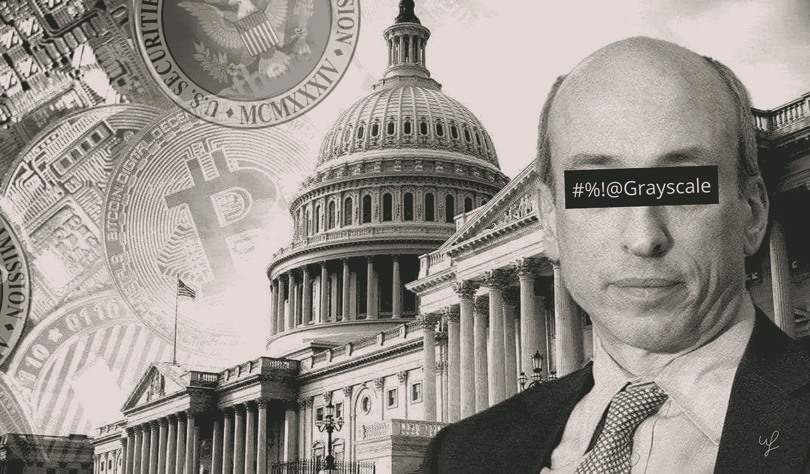
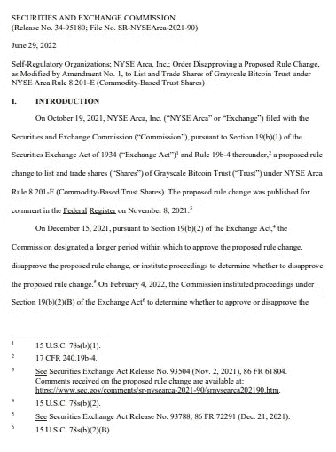
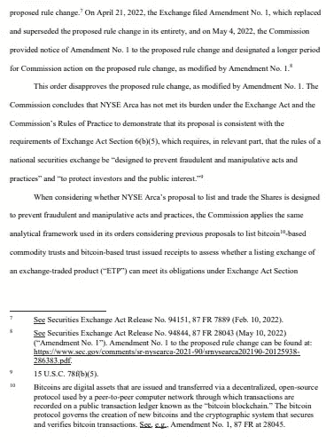

# 格雷起诉了证券交易委员会

> 原文：<https://medium.com/coinmonks/grayscale-sued-the-sec-a2a428d1d6d8?source=collection_archive---------18----------------------->

## 在监管机构拒绝将一家 GBTC 信托公司转换为一家 T4 比特币交易所交易基金的申请后，gray Investments 对美国证券和 T2 交易委员会(SEC) 提起诉讼。

This preview will be included in the NFT collection called “[Uncle Fibonacci News](https://opensea.io/collection/uncle-fibonacci-news)”

监管机构认为这一判决不符合“防止欺诈和操纵行为[……]以及保护投资者和公众利益”的要求。

*[**read the document in full**](https://www.sec.gov/rules/sro/nysearca/2022/34-95180.pdf)

该公司此前指出，美国证券交易委员会愿意批准基于期货的比特币交易所交易基金，同时拒绝基于现货的订单，这可能违反了行政程序法。

> “1940 年《投资公司法》下的比特币期货 etp 和不需要此类注册的现货比特币 etp 在所有相关方面都彼此相似。然而，根据日期为 2021 年 11 月 12 日的拒绝(VanEck 的申请)令，委员会对它们有不同的解释，”信中说。

该公司当时表示，如果 SEC 没有发现期货市场存在市场操纵，那么可以得出结论，现货市场也在足够程度上满足了这一标准。

> “我们深感失望，并强烈反对 SEC 继续禁止现货比特币交易所交易基金进入美国市场的决定，”格雷在 SEC 决定后的新闻稿中表示。

该公司首席执行官迈克尔·索南谢恩(Michael Sonnenschein)承诺，“利用公司的所有资源保护投资者的利益，公平监管第一种加密货币的投资工具。”

> 交易新手？尝试[加密交易机器人](/coinmonks/crypto-trading-bot-c2ffce8acb2a)或[复制交易](/coinmonks/top-10-crypto-copy-trading-platforms-for-beginners-d0c37c7d698c)

公司负责人第一次允许这样的机会是在 2022 年 3 月。

gray 强调，在 SEC 审查期间，GBTC 向 ETF 的转换得到了 11，400 条评论中 99.9%的人的支持。

SEC 尚未批准任何推出现货比特币交易所交易基金的申请。

gray Investments 于 2021 年 10 月 19 日提交了一份将数字黄金信托转换为现货比特币 ETF 的申请。

12 月 17 日，SEC 推迟了对灰度投资应用的决定。今年 2 月，欧盟委员会再次迈出了这一步。

早些时候，GBTC 折扣超过 34%。

📰 ***订阅*** [***斐波那契***](/@unclefibonacci) ***我来保持最新***

☕️eth:0x40a 8443813 e 8 fa 4a 9 f 88 f 18 b 77442 aa 4ed 91 fd4c

☕️BTC:1kkekcmdrghajztfxjoq 5 otg bv 1 mgucwdj

> 加入 Coinmonks [电报频道](https://t.me/coincodecap)和 [Youtube 频道](https://www.youtube.com/c/coinmonks/videos)了解加密交易和投资

# 另外，阅读

*   [十大最佳加密货币博客](https://coincodecap.com/best-cryptocurrency-blogs) | [YouHodler 评论](https://coincodecap.com/youhodler-review)
*   [MyConstant Review](https://coincodecap.com/myconstant-review) | [8 款最佳摇摆交易机器人](https://coincodecap.com/best-swing-trading-bots)
*   [MXC 交易所评论](/coinmonks/mxc-exchange-review-3af0ec1cba8c) | [Pionex vs 币安](https://coincodecap.com/pionex-vs-binance) | [Pionex 套利机器人](https://coincodecap.com/pionex-arbitrage-bot)
*   [我的密码交易经验](/coinmonks/my-experience-with-crypto-copy-trading-d6feb2ce3ac5) | [《比特币基地评论》](/coinmonks/coinbase-review-6ef4e0f56064)
*   [CoinFLEX 评论](https://coincodecap.com/coinflex-review) | [AEX 交易所评论](https://coincodecap.com/aex-exchange-review) | [UPbit 评论](https://coincodecap.com/upbit-review)