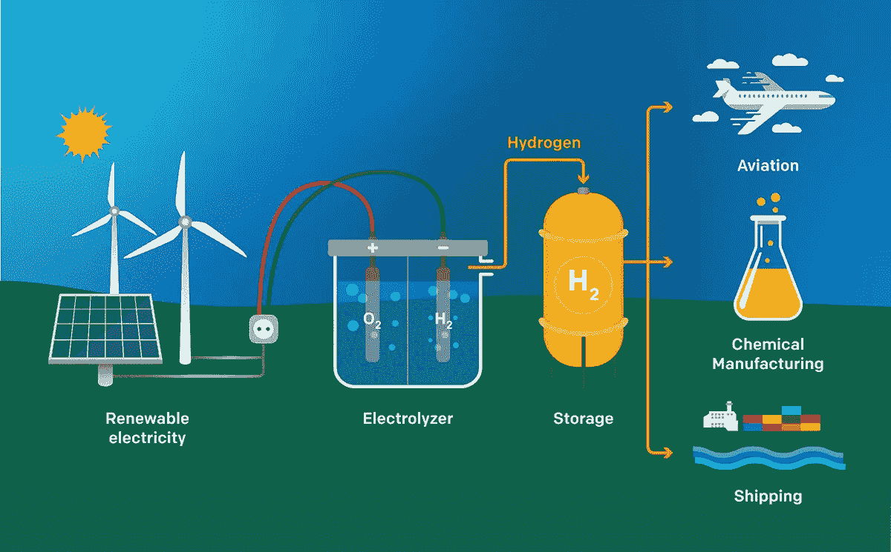

# 绿色氢:未来的燃料？

> 原文：<https://medium.com/coinmonks/green-hydrogen-the-fuel-of-the-future-cc7e3f18e179?source=collection_archive---------16----------------------->

绿色氢是可持续能源领域的一个热门话题。一些专家认为，它可能是未来的燃料，彻底改变运输和能源生产。那么什么是绿色氢，为什么它如此有前途？在这篇博文中，我们将探讨这些问题以及更多！

绿色氢是通过一种叫做电解的过程产生的。这是当电流被用来将水分子分解成氢和氧。氢气可以用作燃料，而氧气则被释放到大气中。

与其他可持续能源相比，绿色氢有几个关键优势。首先，它燃烧时不产生排放物。这使得它成为交通运输的一个有吸引力的选择，因为绿色氢动力汽车将实现零排放。第二，绿色氢易于储存和运输。它也可以用于现有的基础设施，如天然气管道。

在绿色氢普及之前，仍有一些挑战需要克服。一个挑战是成本:绿色氢生产目前比传统的能源生产方法成本更高。然而，随着绿色氢技术的改进，预计成本会降低。另一个挑战是基础设施:绿色氢生产需要大量电力，现有电网可能无法满足需求。

尽管面临这些挑战，绿色氢作为一种可持续能源显示出巨大的前景。如果我们能够克服前进道路上的障碍，绿色氢将有助于为清洁和繁荣的未来提供动力。

你对绿色氢有什么看法？你认为它有可能彻底改变交通和能源生产吗？

请在评论中告诉我们！

感谢阅读！

 [## Hydrogencoin -基于 Solana 区块链的 DeFi 基金

### Hydrogencoin.io 是全球首个绿色氢的 DeFi 基金

氢币. io](http://hydrogencoin.io/) 

> *加入 Coinmonks* [*电报频道*](https://t.me/coincodecap) *和* [*Youtube 频道*](https://www.youtube.com/c/coinmonks/videos) *了解加密交易和投资*

# 另外，阅读

*   [有哪些交易信号？](https://coincodecap.com/trading-signal) | [Bitstamp vs 比特币基地](https://coincodecap.com/bitstamp-coinbase) | [买索拉纳](https://coincodecap.com/buy-solana)
*   [ProfitFarmers 回顾](https://coincodecap.com/profitfarmers-review) | [如何使用 Cornix 交易机器人](https://coincodecap.com/cornix-trading-bot)
*   [西班牙 5 大最佳文案交易平台](https://coincodecap.com/copy-trading-spain)
*   [Pionex 双投](https://coincodecap.com/pionex-dual-investment) | [AdvCash 审核](https://coincodecap.com/advcash-review) | [支持审核](https://coincodecap.com/uphold-review)
*   [面向开发者的 8 个最佳加密货币 API](https://coincodecap.com/best-cryptocurrency-apis)
*   [十大最佳加密货币博客](https://coincodecap.com/best-cryptocurrency-blogs) | [YouHodler 评论](https://coincodecap.com/youhodler-review)