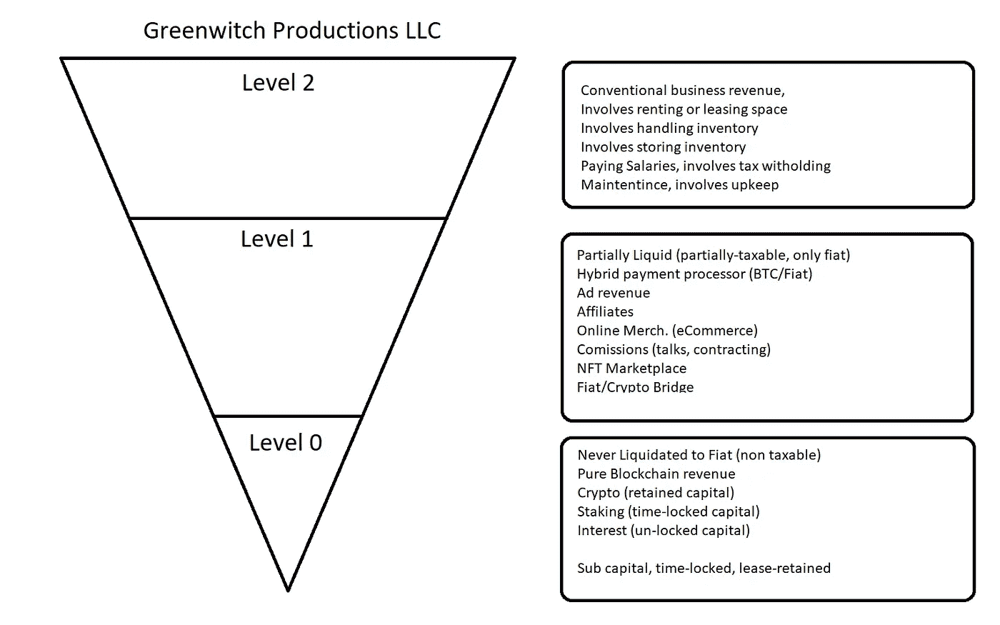

# 格林威奇道到人类世界经济学

> 原文：<https://medium.com/coinmonks/greenwitchdao-to-human-world-economics-fb1d1da5b12c?source=collection_archive---------18----------------------->

~dwulf

Greenwitch DAO, Revenue Model

创业可能会令人生畏。基于加密货币的价值建立业务尤其令人生畏。

Greenwitch DAO 是在考虑经济治理的情况下建立的，能够通过 API 调用直接在第 1 层和第 2 层 Blockchain direct 上工作，创建 DAO 到 DAO Blockchain transfers“拥有”DAO 本身。

不同的层次决定了人与世界相互作用的强度，包括更多旧世界(过时的)经济收入模型。例如，2 级收入需要租赁经营空间、购买批发小配件、储存批发小配件、支付工资和薪水，因此，税收从工资中扣除并维持 eShop。

而第一级收入途径是在加密领域，但仍然连接着菲亚特世界，混合支付处理器显示出偏好使用区块链来完成交易，而不是废弃的银行系统。

第 0 级和第 2 级，运营 Bot-2-Bot，保留注入加密资本，为新企业或人类世界 LLC 提供种子。0 级和 Sub 是事实上的“无国籍”，没有主权联盟，没有公民身份，也没有停止交易。

简单来说，0 级是来自 ADA、ATOM、DOT 和 ETH 的最佳赌注回报和利息收入(针对我的投资组合)

Sub 是全面的区块链项目，分别由 DAO、Polkadot for Astar 和 Acala 以及 Cosmos Sifchain 资助。

道是用 weening 从旧世界经济中“内置”出来的，0 级的目标是把所有的价值输入到 Greenwitch 道中。与人类世界经济的实际脱钩主要发生在第 1 级，在这一级，支付收入的途径可以在处理器级别，在一年的过程中，同一批支付处理器被迫向 IRS 披露任何总计 600 美元交易的 KYC。

BTC 和照明付款是可以绕过任何 600 美元(价值)交易审计的选项，当然可以在地址已知和价值充分说明的情况下进行审计。但它不会自动报告给国税局的强制法令。

加入搅拌机，买，卖，买 Monero，并把它放在一个新的账本上，你的隐私得到了很好的保护。

当然，第二级是标准的，但对于持续产生资本来说，效率完全低下，费用会使许多现实世界的商业冒险在经济上不可行(漫画店、百视达等)。).投资仅用于协调房地产投资和租赁空间。

2 级税收严重饱和，需要更多的参与和活动部分来促进和实现资本产出结果。由于空间是租用的，所以要支付工资，并从工资中扣除税款。第二级是最不想要的，当然从来没有考虑过的盈利边缘项目，像漫画店和大片音像店。

然而，某些 2 级常规项目是可赎回的，如果他们证明了一个共同的良好的公用事业，兽医诊所，药房，和其他常规业务类型。

毫无疑问，法人实体或有限责任公司将在支持二级项目创收时发挥作用。在区块链平台能够完全发挥作用并提供人们通常使用的更轻松的交易之前，似乎没有办法绕过 TaxIDs 来维持与旧的过时银行系统的连接。

## 结论

0 级和 Sub 是完全解耦的最终结果，它是私有的，从不 KYC，这一级别的交易具有最小的气体成本(副链支付其中的大部分)，直接与本机 API 和 XCMP 一起工作允许无缝和高效的交易。

一级是真正实现解耦的地方，支付处理器面向区块链的终结，而不是中央银行 SWIFT。

级别 2 是 DAO 获得不动产和租赁空间的一种方式，以便 DAO 拥有现实世界的后勤运营基地。

当然，这只是创收，DAO 的其余部分将结合智能交易和情绪分析，以合作有效的价值寻求交易利润。

> 加入 Coinmonks [电报频道](https://t.me/coincodecap)和 [Youtube 频道](https://www.youtube.com/c/coinmonks/videos)了解加密交易和投资

## 也阅读

 [## 杠杆代币[多头代币]终极指南

### 杠杆化令牌是具有杠杆化风险敞口的 ERC20 令牌，不考虑保证金、要求、管理…

medium.com](/coinmonks/leveraged-token-3f5257808b22)  [## 最佳加密交易所| 2022 年十大加密货币交易所| CoinCodeCap

### 哪一个是最好的加密交换？在本文中，我们将根据多种加密货币列出 10 大加密货币交易所

coincodecap.com](https://coincodecap.com/crypto-exchange)  [## 2022 年最佳加密交换平台| CoinCodeCap

### 随着时间的推移，我们大多数人将转向 dex 以获得更好的安全性和隐私。因此。在这里，我们将讨论…

coincodecap.com](https://coincodecap.com/best-swap-platforms)  [## 10 大最佳在线赌场|赢得并赢取免费 BTC 2022 | CoinCodeCap

### 接收、支付和赚取加密货币| |有各种各样的最佳在线赌场可供选择，有可能…

coincodecap.com](https://coincodecap.com/best-online-casinos)  [## 2021 年最佳加密借贷平台| 6 大比特币借贷平台

### 获得比特币和其他加密货币的最佳贷款利率

medium.com](/coinmonks/top-5-crypto-lending-platforms-in-2020-that-you-need-to-know-a1b675cec3fa)