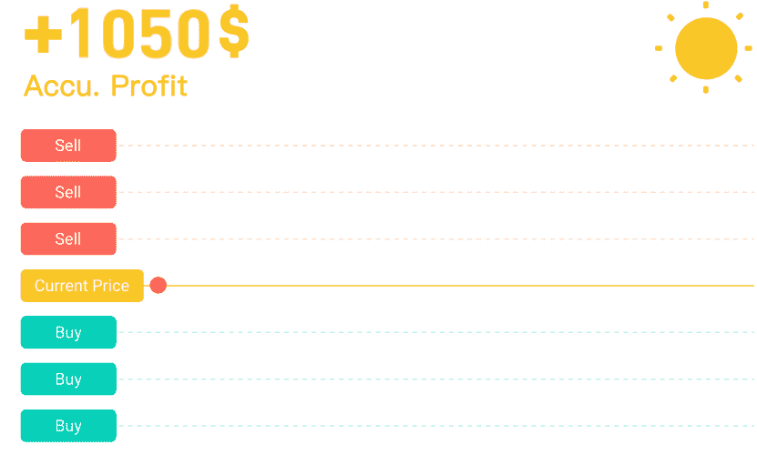
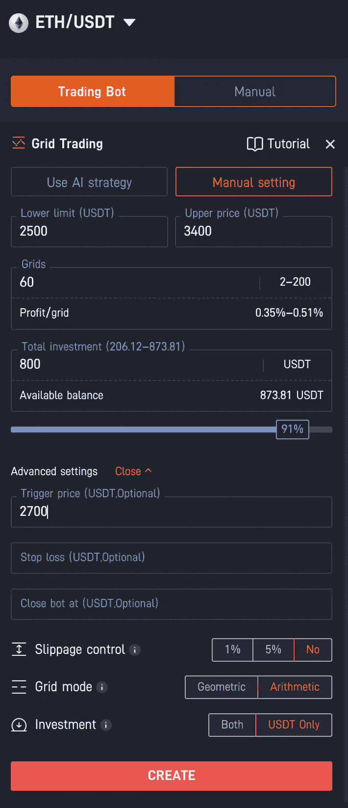
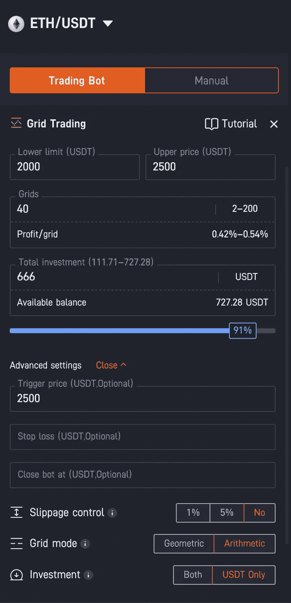
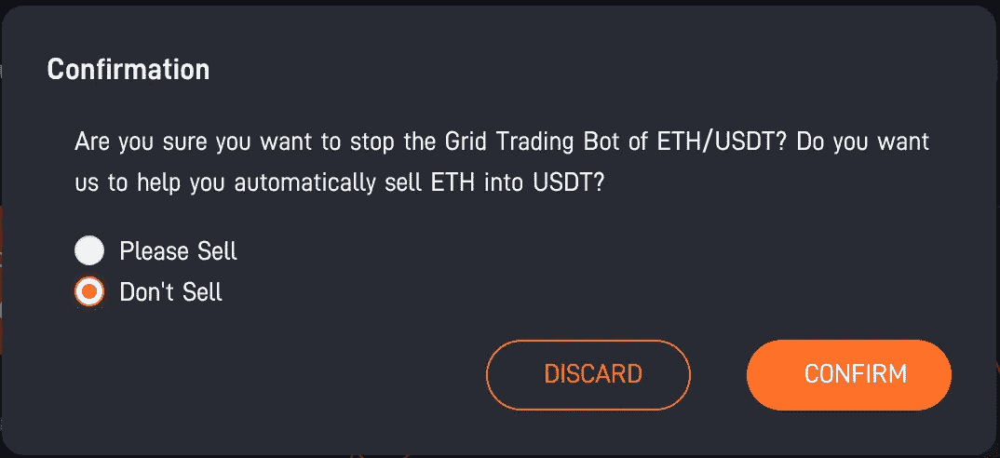

# 网格交易策略:如何获得更便宜的密码

> 原文：<https://medium.com/coinmonks/grid-trading-strategy-how-to-get-cheaper-crypto-14208d7771d6?source=collection_archive---------5----------------------->

> 我不是金融专家。只是分享一下我的投资策略，经验或者工具。还有，我怎么和加密货币相处。
> 
> 这是我的第一篇英文帖子。如果你喜欢用繁体中文阅读，试着看一看 https://vocus.cc/user/@mexx 的作品

[**电网交易机器人**](https://coincodecap.com/grid-trading) **自动帮我们在特定价格范围内低买高卖**。市场越颠簸，我们能赚的利润就越多。

Photo by [Everyday basics](https://unsplash.com/@zanardi?utm_source=medium&utm_medium=referral) on [Unsplash](https://unsplash.com?utm_source=medium&utm_medium=referral)

这个机器人会在预先设定的时间间隔将价格滑动到许多行。一旦市价下行触及下线，就买入几个现货，一旦市价上行触及上线，就卖出几个现货。

每一对买卖都赚取利润。当机器人 24/7 全天候进行配对交易时，它会为我们赚取很多利润。

让我们在下面的 **Pionex** 上看看网格交易机器人的动态流程。

Grid trading bot (from Pionex official site)

# 😎为什么不自己交易呢

为什么我们需要网格交易？凭我们的经验和技能交易怎么样？一旦我们决定买入或卖出的时机，我们会有复杂的情绪。想象这些情况。

当价格上涨时，我们可能会想:
*再多留一点时间，否则一旦价格继续上涨就可惜了*。

当价格下跌时，我们可能会想:
*它可能会继续下跌，让我们等待更多的时间，在最低价时买入现货*。

当价格飙升但反弹时，我们可能会认为:
*在牛市中它应该停止下跌，我不会卖掉我的现货来获利，而是等待它再次上涨*

看到了吗？你有没有这样想过或者这样做过？如果是的话，你是一个正常人，我也是！😆如果你从来没有这样过，你确实是一个机器人，一台机器！**🤖**

**大多数人通常害怕在熊市买现货，不愿在牛市卖现货。他们几乎想买最便宜的，卖最贵的。网格交易机器人不会贪婪、野心勃勃、愤怒、犹豫或放松，它只是遵循预先定义的规则和算法，不带任何情绪地严格买卖。它克服了任何不合理的操作或错误。这样就大大降低了交易的风险。**

# 🛠电网交易 bot 设置

下面我们来看看 Pionex 的网格交易机器人的例子。电网交易的基本参数是**总投资、下限价格、上限价格和电网**。

作为设置的结果，机器人将在**触发价格** 2700 时自动唤醒。然后在**算法**网格模式下从**下限** 2500 到**上限** 3400 切割 60 条网格线。每个网格间隔约为(3400–2500)/(60–1)= 15.25

每当 bot 低买高卖完成一次配对交易，大约需要 0.35% ~ 0.51%的利润。

**价格和网格由您的策略决定。不存在完美的参数**。如果你希望 bot 交易的价格范围尽可能的宽，你可以设置 2000 到 6000。对于 ETH 来说，这是一个很大的范围。那么 bot 在牛市或者熊市的大部分时间都可以运行。但是资金利用率会很低。我想在另一篇文章中进一步阐述这个观点。

# 💰获得更便宜的加密货币

让我们继续进入今天的主题，如何获得更便宜的密码？为什么这与网格交易有关？

我们知道电网交易 bot 的特点，**一旦市场价格下跌，bot 购买少量的点，所以如果市场价格继续下跌，bot 将继续购买越来越多的便宜点，以平均降低单位成本**。

请看下面这个棘手的机器人。触发价格 2500 等于上限价格。这是什么意思？

Buy cheaper crypto by grid trading

根据 ETH crypto 的历史数据，2500 是低价，2000 ~ 2200 几乎是最低价，我认为 ETH 永远不会跌到 2000 以下。

所以我希望机器人继续购买 2000 ~ 2500 之间的位置。我不指望机器人在 2500 的价格上获利。这是我的目的！

你可以通过你的经验和分析创建类似的机器人，这取决于你。

# 🚫不要卖密码！

可以通过 Pionex app 看到交易机器人的**盈亏平衡价格**。这是 bot 持有的 ETH 密码的平均单位成本。假设 ETH 处于熊市，价格持续下跌。经过几天或几周的交易，盈亏平衡价格下降到 2200，你就满意了。你可以关闭机器人，但不要卖密码！

当你关闭了这个机器人，你将会得到很多 2200 的廉价 ETH！但是如果你卖掉它，你将失去 USDT 的大量资金！

今天就到这里吧！如果你想尝试 Pionex 的网格交易机器人，欢迎用我的推荐码“ **iH9ALSby** ”或[邀请链接](https://www.pionex.com/en-US/sign/ref/iH9ALSby)加入。一旦您注册并通过 KYC 二级，将有**1288 美元的试玩基金**供您玩**双人投资**。