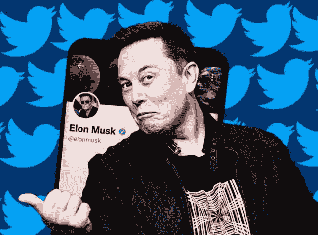

# 猜猜银行家们从埃隆收购 Twitter 中赚了多少钱？

> 原文：<https://medium.com/coinmonks/guess-how-much-the-bankers-made-from-elon-buying-twitter-c9e1bfd2f58b?source=collection_archive---------49----------------------->

Elon is literally Twitter’s most powerful user!

听说过这个睿智的比喻吗，当乐观主义者和悲观主义者争论杯子是半满还是半空时，真正的赢家是真正喝下这杯该死的酒的人？

没有吗？

当然不是，因为那是我想出来的。

当世界其他地方还在为埃隆“我已经直接走到了尽头”的巨大收购 Twitter 的举动感到震惊时，决定这是一个好还是坏的举动，决定谁会得到或失去。

Twitter 交易的真正赢家是 M&A 的银行家们，他们负责让交易顺利进行。

看看这个。

“Twitter Inc .的投资银行家预计将获得 8500 万至 1.3 亿美元的发薪日。

根据数据提供商 Dealogic 的数据，这可能是高盛集团(Goldman Sachs Group Inc .)、摩根大通(JPMorgan Chase & Co .)和艾伦公司(Allen & Co .)为这家社交媒体公司周一向埃隆马斯克(Elon Musk)440 亿美元的出售提供咨询的金额。"

像这样的日子，我希望我是一个银行家。

1.3 亿美元来跨越所有的法律障碍，确保所有的文件都正确填写，进行适当的尽职调查，确保在此过程中没有违反法律或规则。

你不得不承认，这无疑是华尔街有史以来速度最快的交易之一。

从购买少数股权，拒绝董事会席位，召集整个 Twitter 社区，在这个过程中惹恼一些人，到正式收购 Twitter。

整个交易不到一个月就敲定了。

银行家们一定为此加班加点。

他们几乎整个周末通宵工作来完成文书工作。

嘿，别抱怨，为了 1.3 亿美元，我会生吞一只青蛙。

对于银行家来说，这可能是一个自豪的时刻，可以说“是的，我在 2022 年完成了 Twitter-Elon 的交易”。

这将是荣誉的象征。

似乎埃隆不是唯一一个从收购 Twitter 中获利的人。

Seriously, between the time I wrote this to the time i posted (which was around a week, Elon’s twitter followers jumped from 89M to 94.8M!

另一方面，现在有 9000 万粉丝，你认为到 2022 年底，Elon 会有多少粉丝？

-

现在有 9000 万 Twitter 粉丝，到 2022 年底，埃隆会有多少粉丝？

-

#初创公司#商业# startupx #增长#成功#社交媒体#文化#创业#战略# elonmusk # gigafactory #电动汽车# elon #特斯拉# twitter #银行家

> 加入 Coinmonks [电报频道](https://t.me/coincodecap)和 [Youtube 频道](https://www.youtube.com/c/coinmonks/videos)了解加密交易和投资

# 另外，阅读

*   [印度最佳 P2P 加密交易所](https://coincodecap.com/p2p-crypto-exchanges-in-india) | [柴犬钱包](https://coincodecap.com/baby-shiba-inu-wallets)
*   [八大加密附属计划](https://coincodecap.com/crypto-affiliate-programs) | [eToro vs 比特币基地](https://coincodecap.com/etoro-vs-coinbase)
*   [最佳以太坊钱包](https://coincodecap.com/best-ethereum-wallets) | [电报上的加密货币机器人](https://coincodecap.com/telegram-crypto-bots)
*   [交易杠杆代币的最佳交易所](https://coincodecap.com/leveraged-token-exchanges) | [购买 Floki](https://coincodecap.com/buy-floki-inu-token)
*   [3 commas vs . Pionex vs . crypto hopper](https://coincodecap.com/3commas-vs-pionex-vs-cryptohopper)|[Bingbon Review](https://coincodecap.com/bingbon-review)
*   [加密复制交易平台](/coinmonks/top-10-crypto-copy-trading-platforms-for-beginners-d0c37c7d698c) | [如何在 WazirX 上购买比特币](/coinmonks/buy-bitcoin-on-wazirx-2d12b7989af1)